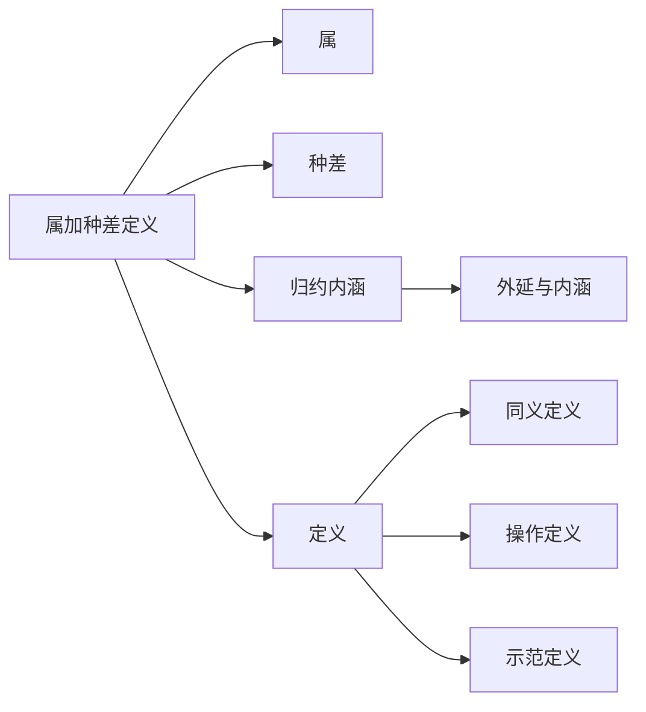

# 属加种差定义

> [!abstract] 概述
> 属加种差定义是逻辑学中最经典、最系统的内涵定义方法——先找出被定义项所属的较大的类（属），再找出将它与同属其他种区分开来的特有性质（种差）。==被定义项 = 具有种差的属==。

## 定义

> [!def] 属（Genus）
> 被分为子类的类。属是一个相对术语——同一个类在一种划分中是属，在另一种划分中可以是种。

> [!def] 种（Species）
> 属的子类。种也是一个相对术语——同一个类在一种划分中是种，在另一种划分中可以是属。

> [!def] 种差（Differentia）
> 将一个种与属的其他所有种区分开来的性质。种差是被定义种所独有的特征。

## 核心方法：两步法

> [!tip] 属加种差定义的两步法
> **第一步**：找出一个**属**——即一个包含被定义种的较大类
> **第二步**：找出**种差**——即将被定义种与属的其他种区分开来的性质
>
> **标准形式**：被定义项 = 具有种差的属

## 核心性质

| 性质 | 陈述 | 条件 |
|:-----|:-----|:-----|
| 相对性 | 属和种是相对术语 | 取决于划分的层级 |
| 内涵方法 | 基于归约内涵进行定义 | 使用普遍接受的公共标准 |
| 区分功能 | 种差必须能区分同属的所有种 | 不能遗漏其他种 |

## 经典示例

> [!example] "六边形"的定义
> - **被定义项**：六边形
> - **属**：多边形（包含三角形、四边形、五边形、六边形等的较大类）
> - **种差**：具有六条边（将六边形与三角形、四边形、五边形等区分开来的性质）
> - **完整定义**：六边形 = ==具有六条边的多边形==

> [!example] "人"的定义
> - **被定义项**：人
> - **属**：动物（包含人、猫、狗、鸟等的较大类）
> - **种差**：有理性的（将人与其他动物区分开来的性质）
> - **完整定义**：人 = ==有理性的动物==

## 属和种的相对性

> [!info] 属和种不是绝对的
> 同一个类在不同的划分中可以既是属又是种：
> - "多边形"相对于"六边形"是**属**
> - "多边形"相对于"几何图形"是**种**
> - "动物"相对于"人"是**属**
> - "动物"相对于"生物"是**种**

## 两种局限性

> [!warning] 局限性一：不可再分析的简单属性
> 有些属性过于基本，无法再分解为"属+种差"。例如：
> - 颜色（"红色"是什么属？什么种差？）
> - 味道（"甜"是什么属？什么种差？）
>
> 这些简单感官属性无法通过属加种差方法来定义，通常需要通过示范定义或实指定义来引入。

> [!warning] 局限性二："大全"性质
> 有些性质过于宽泛，没有更大的属可以包含它们。例如：
> - "存在"（存在不属于任何更大的类）
> - "本体"（本体是最高的范畴）
> - "实在"（实在无法被归入更高的类）
>
> 亚里士多德称之为"范畴"（categories）——它们是最高的属，没有更高的属可以用来定义它们。

## 五条经典规则

> [!def] 属加种差定义的五条规则
> 一条好的属加种差定义必须满足以下五条规则：

| # | 规则 | 说明 | 违反示例 |
|:--|:-----|:-----|:---------|
| 1 | 揭示种的本质属性 | 必须揭示被定义项的==归约内涵==（普遍接受的公共标准） | 将"人"定义为"能笑的动物"（非本质属性） |
| 2 | 禁止循环 | 被定义项==不得出现==在定义项中 | 将"真"定义为"与真理相符的" |
| 3 | 不过宽也不过窄 | 定义项的外延与被定义项的外延==恰好相同== | 将"人"定义为"无毛的两足动物"（过宽，拔毛的鸡也符合） |
| 4 | 避免歧义、晦涩或比喻 | 定义项必须使用==清晰、明确、字面==的语言 | 将"信仰"定义为"心中的玫瑰"（比喻） |
| 5 | 优先使用肯定定义 | 尽量用肯定形式描述种差，==避免否定定义== | 将"健康"定义为"没有疾病"（否定定义，不如"身体机能正常运转"） |

> [!tip] 规则5的补充说明
> 优先使用肯定定义是因为否定定义只告诉我们"不是什么"，而不告诉我们"是什么"。但在某些情况下否定定义是合理的——例如"孤儿"定义为"失去父母的孩子"，因为"失去父母"就是该词项的核心含义。

## 与其他概念的关系

- **[[外延与内涵]]**：属加种差定义是内涵定义方法的一种，直接操作词项的归约内涵
- **[[命题]]**：命题中词项的清晰定义是避免歧义的前提
- **[[论证]]**：论证中词项含义的一致性依赖于良好的定义

## 学术来源

> [!quote] Aristotle, *Posterior Analytics*, Book II, Chapter 10
> 亚里士多德最早系统阐述了属加种差定义方法，认为定义就是"通过属和种差来揭示事物的本质"。

> [!quote] Robinson (1950), *Definition*
> 罗宾逊对定义理论进行了全面的现代分析，区分了定义的不同功能和类型，并讨论了属加种差定义的局限性。

## 应用

1. **直言命题与三段论**（第5-6章）：在直言逻辑中，词项的清晰定义是构建有效三段论的基础——如果中词的含义（内涵）发生变化，三段论就会犯"四词谬误"
2. **定义的评估**（第3章）：五条经典规则是评估一个定义是否恰当的标准

## 参见

- [[3.6 属加种差定义]] — 详细讨论
- [[外延与内涵]] — 内涵的三种含义及反变关系
- [[3.5 定义的结构：外延与内涵]] — 外延与内涵的详细讨论
