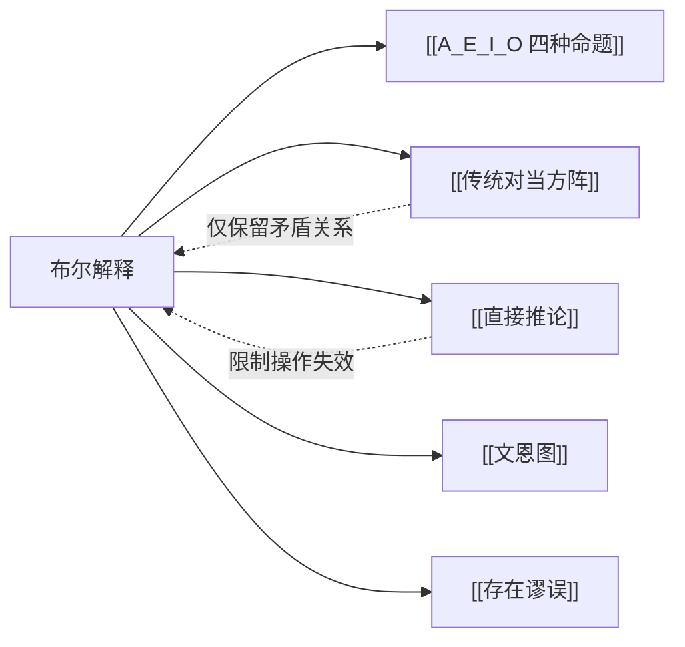

# 布尔解释

> [!abstract] 概述
> 布尔解释是现代逻辑的标准立场——全称命题（A、E）==没有存在含义==，即断言"所有 S 是 P"并不蕴含 S 类中有元素存在。这一立场从根本上重塑了传统对当方阵和直接推论的有效性。

## 定义

> [!def] 布尔解释（Boolean Interpretation）
> 布尔解释是现代逻辑对直言命题的标准解读方式，其核心主张是：==全称命题没有存在含义==。"所有 S 是 P"（A）被理解为一个条件句——"如果存在 S 这样的东西，那么它是 P"，而非断言 S 中确实有元素存在。

## 核心理念

传统（亚里士多德）解释认为，"所有 S 是 P"不仅断言了 S 与 P 之间的包含关系，还==隐含地断言== S 类非空。布尔解释则将全称命题纯粹理解为条件性的概括：

$$\text{A：所有 S 是 P} \equiv \text{如果有事物是 S，那么该事物是 P}$$

这意味着当 S 为==空类==（没有任何 S 存在）时，"所有 S 是 P"仍然可以为真——因为条件句的前件为假，整个条件句空虚地（vacuously）为真。

> [!example] 空类的全称命题
> - "所有独角兽都是紫色的"——在布尔解释下为真（因为不存在独角兽，条件句空虚为真）
> - "所有独角兽都不是紫色的"——在布尔解释下同样为真
> - 两者同时为真，这正是亚里士多德解释所不允许的

## 布尔解释九要点

| 编号 | 要点 | 说明 |
|:-----|:-----|:-----|
| 1 | I 和 O 仍有存在含义 | "有些 S 是 P"断言==至少存在一个== S 且它是 P |
| 2 | 矛盾关系保持 | A ↔ O、E ↔ I 的矛盾关系==完整保留== |
| 3 | 全称命题无存在含义 | A 和 E 在 S 为空时也可为真，不承诺 S 的存在 |
| 4 | 断言存在需两个命题 | 要断言 S 存在且具有某性质，需同时使用全称命题和特称命题 |
| 5 | A 和 E 可同真 | 当 S 为空时，A 和 E 同时为真，==反对关系失效== |
| 6 | I 和 O 可同假 | 当 S 为空时，I 和 O 同时为假，==下反对关系失效== |
| 7 | 差等关系不普遍有效 | A 真不再保证 I 真（A 可空虚为真而 I 为假），==差等关系失效== |
| 8 | 部分直接推论保留 | E/I 换位有效、A/O 换质位有效、所有换质有效；限制换位和限制换质位==无效== |
| 9 | 传统方阵仅保留对角线 | [[传统对当方阵]] 中仅对角线上的==矛盾关系==仍然成立 |

### 要点详解

#### 要点 4：断言存在需两个命题

在布尔解释下，要完整断言"S 存在且所有 S 都是 P"，必须同时使用两个命题：

> [!example] 完整的存在断言
> 要断言"猫存在且所有猫都是动物"，需要：
> - A：所有猫都是动物（说明性质，但不保证猫存在）
> - I：有些猫是动物（保证猫存在）
>
> 仅靠 A 无法断言猫的存在——"所有独角兽都是紫色的"也为真，但独角兽并不存在。

#### 要点 5-7：传统方阵的缩减

> [!warning] 方阵缩减的后果
> - **反对关系失效**：A 和 E 可同真（当 S 为空时）
> - **下反对关系失效**：I 和 O 可同假（当 S 为空时）
> - **差等关系失效**：A 真不能推出 I 真（A 可空虚为真，I 此时为假）
>
> 这意味着在布尔解释下，[[传统对当方阵]] 从一个信息丰富的推理工具缩减为==仅保留矛盾关系==的简单结构。

#### 要点 8：直接推论的调整

| 操作 | 布尔解释下 | 原因 |
|:-----|:-----------|:-----|
| E 换位（E→E） | ✅ 有效 | 不依赖存在含义 |
| I 换位（I→I） | ✅ 有效 | 不依赖存在含义 |
| A 换质位（A→A） | ✅ 有效 | 不依赖存在含义 |
| O 换质位（O→O） | ✅ 有效 | 不依赖存在含义 |
| 所有换质 | ✅ 有效 | 仅改变质和谓项补类，不涉及存在承诺 |
| A 限制换位（A→I） | ❌ 无效 | 依赖差等关系，而差等关系在布尔解释下不成立 |
| E 限制换质位（E→O） | ❌ 无效 | 依赖差等关系，而差等关系在布尔解释下不成立 |

## 核心性质

| 性质 | 陈述 |
|:-----|:-----|
| 核心主张 | 全称命题==没有存在含义== |
| 历史地位 | 现代符号逻辑的标准解释，取代了亚里士多德解释 |
| 对方阵的影响 | 传统方阵仅保留==矛盾关系==，其余三种关系失效 |
| 对推论的影响 | 限制换位和限制换质位==不再有效== |
| 与文恩图一致 | [[文恩图]] 的画法天然对应布尔解释 |

## 与亚里士多德解释的根本分歧

| 比较维度 | 亚里士多德解释 | 布尔解释 |
|:---------|:---------------|:---------|
| 全称命题的存在含义 | ==有==（隐含断言 S 非空） | ==无==（不承诺 S 的存在） |
| A 和 E 能否同真 | 不能（反对关系） | ==能==（当 S 为空时） |
| I 和 O 能否同假 | 不能（下反对关系） | ==能==（当 S 为空时） |
| 差等关系 | 有效 | ==不普遍有效== |
| 适用前提 | 假设主项类非空 | ==无需任何存在假设== |
| 空类处理 | 不予考虑（认为无意义） | 正式处理，全称命题空虚为真 |

> [!info] 根本分歧的本质
> 亚里士多德解释和布尔解释的根本分歧在于：==全称命题究竟是否承诺主项的存在==。亚里士多德认为"所有 S 是 P"意味着确实有 S 存在且它们都是 P；布尔则认为"所有 S 是 P"只是一个条件性的概括，即使 S 根本不存在，该命题也不为假。这一分歧产生了 cascading effect（级联效应），导致传统方阵中大部分关系和部分直接推论在布尔解释下失效。

## 与其他概念的关系

- **[[A_E_I_O 四种命题]]**：布尔解释重新定义了全称命题（A、E）的语义
- **[[传统对当方阵]]**：在布尔解释下缩减为仅保留矛盾关系
- **[[直接推论]]**：限制换位和限制换质位在布尔解释下无效
- **[[存在谬误]]**：在布尔解释下，从全称命题推出特称命题就犯了存在谬误
- **[[文恩图]]**：文恩图的画法天然对应布尔解释——全称命题的阴影区域表示"该区域为空"，而非"该区域有元素"

## 补充

> [!info] 布尔的历史贡献
> 乔治·布尔（George Boole, 1815-1864）在其 1854 年的著作 *An Investigation of the Laws of Thought*（《思维规律的研究》）中，将逻辑学代数化，提出了以他名字命名的解释。布尔的工作不仅解决了传统逻辑中关于空类的模糊处理问题，还为后来的符号逻辑和集合论奠定了基础。布尔解释如今已成为现代逻辑学教材中的标准立场。

> [!tip] 如何判断一个推理是否依赖亚里士多德假设？
> 检查推理过程中是否出现了以下模式：
> 1. 从 A 真推出 I 真（依赖差等关系）
> 2. 从 E 真推出 O 真（依赖差等关系）
> 3. 从 A 进行限制换位得到 I
> 4. 从 E 进行限制换质位得到 O
> 5. 利用反对关系或下反对关系进行推理
>
> 如果出现了上述任何一种模式，该推理就==依赖亚里士多德的存在假设==，在布尔解释下不普遍有效。

## 应用

1. **现代逻辑推理**：作为符号逻辑中处理全称命题的标准语义
2. **论证有效性检验**：识别论证中是否隐含了不当的存在假设（即 [[存在谬误]]）
3. **文恩图方法**：布尔解释是文恩图检验三段论有效性的理论基础
4. **集合论与数学**：布尔解释与集合论中对空集的处理方式一致

### 第10章：布尔解释在谓词逻辑中的体现

第10章从谓词逻辑的符号化角度验证了布尔解释的正确性：

- **A命题用蕴涵**：$(x)(Sx \supset Px)$ 是条件句，当 $Sx$ 为假时空虚为真，==不承诺 S 存在==
- **I命题用合取**：$(\exists x)(Sx \cdot Px)$ 断言存在，==承诺 S 存在==
- **空类验证**：对于空类（如"人首马身的怪物"），A为真而I为假，直接证明了全称命题无 [[存在含义]]
- **量词否定等价式**：$\sim(x)\phi x \equiv (\exists x)\sim\phi x$ 等价式进一步揭示了全称与存在之间的逻辑关系

参见 [[量词]]、[[存在含义]]。

## 参见

- [[A_E_I_O 四种命题]] — 布尔解释重新定义的命题类型
- [[传统对当方阵]] — 在布尔解释下缩减的方阵
- [[直接推论]] — 布尔解释下部分操作失效
- [[存在谬误]] — 从全称命题不当推出特称命题的谬误
- [[文恩图]] — 与布尔解释一致的图示方法
