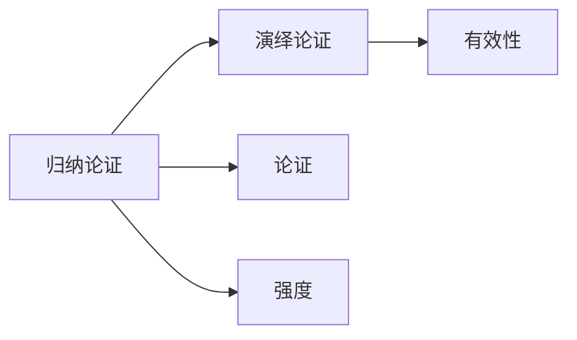

# 归纳论证

> [!abstract] 概述
> 归纳论证是前提为结论提供==概率性支持==的论证，结论可能为真但不必然为真。归纳论证不追求"必然推出"，而是根据已知证据对结论的或然程度做出评估。

## 定义

> [!def] 归纳论证（Inductive Argument）
> 归纳论证是断言其前提为结论提供==或然性支持==的论证。它断言前提为真使得结论==可能为真==（但并非必然为真）。归纳论证的评估标准是==强度==（strength）而非有效性。

**核心特征：** 结论的==信息内容超越了前提==——归纳论证从已观察的案例推广到未观察的案例，从部分推到整体，从特殊推到一般。

## 核心性质

| 性质 | 说明 |
|:-----|:-----|
| 评估标准是强度而非有效性 | 归纳论证用"强/弱"评估，不用"有效/无效" |
| 结论具有概率性 | 前提为真时，结论可能为真但不必然为真 |
| 允许例外存在 | 强归纳论证的结论仍可能为假 |
| 可被新证据削弱 | 增加新的前提可能强化或弱化原有论证 |
| 结论信息超出前提 | 归纳是从已知向未知的扩展，结论包含前提中不包含的新信息 |

## 与演绎论证的区别

| 维度 | 演绎论证 | 归纳论证 |
|:-----|:---------|:---------|
| 断言 | 前提**必然**支持结论 | 前提**或然**支持结论 |
| 评估标准 | 有效 / 无效 | 强 / 弱 |
| 附加信息 | 不受影响 | 可强化或弱化 |
| 结论 | 必然得出 | 永远不能完全确定 |
| 信息方向 | 结论隐含在前提中 | 结论超越前提 |

## 与其他概念的关系

- **[[演绎论证]]**：与归纳构成推理的两大基本类型，演绎追求必然性，归纳追求或然性
- **[[论证]]**：归纳论证是论证的一个子类
- **[[有效性]]**：有效性是演绎论证的专属标准，不适用于归纳论证

## 补充

> [!info] 休谟问题（The Problem of Induction）
> **来源：** David Hume, *An Enquiry Concerning Human Understanding* (1748)
>
> 休谟提出了归纳问题的经典挑战：我们凭什么认为过去观察到的规律在未来也会成立？归纳推理本身无法被演绎地证明（因为归纳结论本就不是必然的），也无法被归纳地证明（因为那将陷入循环论证）。休谟指出，我们对归纳的信赖实际上源于心理习惯——反复观察到事件 A 伴随事件 B 后，心灵便形成了 A 导致 B 的预期，但这并非理性推导的结果。
>
> 这一问题至今仍是科学哲学的核心议题。Peirce 后来的实用主义进路试图通过"可错论"（fallibilism）回应休谟：归纳虽然不能提供确定性，但它是我们在不确定世界中理性行动的最佳工具。

### 第11章：归纳论证的概率特征

第11章深入探讨了归纳论证的本质特征：

- **概率性**：归纳论证的结论具有概率性，前提真只使结论==可能为真==而非必然为真
- **类比论证作为核心形式**：类比论证是归纳推理中最基本、最常用的形式
- **六大评价标准**：实体数量、实例多样性、相似方面数、==相关性==（因果联系）、差异性、结论适度性
- **归纳强度**：归纳论证用"强/弱"评价，强的归纳论证前提为真时结论很可能为真

参见 [[类比推理]]、[[因果联系]]、[[归纳逻辑]]。

### 第12章：因果推理作为归纳论证的核心形式

第12章展示了归纳论证在因果分析中的系统应用：

- 因果推理是归纳论证最重要的应用领域之一
- ==密尔五法==通过系统化的排除程序提升了归纳论证的强度
- 简单枚举归纳法是最基本的归纳论证形式，但密尔方法提供了更可靠的替代方案
- 所有因果归纳论证都依赖==自然齐一性==假设

参见 [[密尔五法]]、[[必要条件与充分条件]]、[[自然齐一性]]。

### 第13章：科学确证的归纳性质

第13章展示了归纳论证在科学确证中的核心地位：

- 从有限的检验实例推广到普遍命题是==归纳论证==的典型形式
- 科学假说的确证本质上是归纳性的：支持性证据再强也不能提供确定性
- 假说-演绎法中的确证环节是归纳性的

参见 [[科学说明]]、[[假说-演绎法]]。

### 第14章：归纳论证强度的概率量化

第14章展示了概率如何量化归纳论证的强度：

- 归纳论证的强度可以用==概率==来度量：归纳强度越高，结论为真的概率越大
- ==期望值==为归纳结论在决策情境中的应用提供了量化评估工具
- ==条件概率==允许在新证据出现时更新归纳结论的概率

参见 [[概率]]、[[期望值]]、[[条件概率]]。

## 参见

- [[1.5 演绎论证与归纳论证]] — 演绎与归纳的详细对比
- [[演绎论证]] — 与归纳相对的推理类型
- [[演绎论证-vs-归纳论证]] — 两种推理类型的系统对比
- [[论证]] — 归纳论证所属的上位概念
