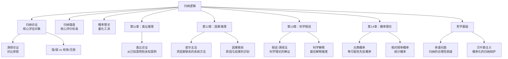

# 归纳逻辑

> [!abstract] 概述
> ==归纳逻辑==（inductive logic）是研究从特殊到一般、从已观察到未观察的推理的逻辑学分支。与演绎逻辑追求结论的必然性不同，归纳逻辑的结论具有==概率性==而非确定性——前提为真只使结论==可能为真==，但并不保证结论必然为真。归纳逻辑的核心问题是：如何合理地评估归纳论证的强度，以及归纳推理本身的合理性基础是什么。

## 定义

> [!def] 归纳逻辑（Inductive Logic）
> ==归纳逻辑==是研究==归纳推理==的评估方法和合理性基础的逻辑学分支。归纳推理是从已知的、已观察的案例出发，推导出关于未观察案例或普遍规律的结论的推理过程。

### 强归纳论证与弱归纳论证

> [!def] 归纳强度（Inductive Strength）
> 一个归纳论证是==强的==（strong），当且仅当如果其所有前提都为真，那么其结论为真是==很可能的==（highly probable）。一个归纳论证是==弱的==（weak），当且仅当即使其所有前提都为真，其结论为真==并不很可能==。

> [!tip] 强度的程度性
> 与演绎论证的"有效/无效"二值评价不同，归纳论证的强度是一个==连续的程度概念==。我们可以说一个归纳论证"非常强"、"比较强"、"较弱"等。归纳逻辑的核心任务之一就是为这种强度评估提供精确的方法和标准。

### 归纳概率

> [!def] 归纳概率（Inductive Probability）
> ==归纳概率==是前提为真时结论为真的概率，记为：
> $$P(C \mid P_1 \cdot P_2 \cdot \ldots \cdot P_n) = r$$
>
> 其中 $C$ 是结论，$P_1, P_2, \ldots, P_n$ 是前提，$r$ 是概率值（$0 < r \leq 1$）。

- 当 $r = 1$ 时，前提对结论提供完全支持——这是==演绎有效==的极限情形
- 当 $0.5 < r < 1$ 时，前提对结论提供==较强的归纳支持==
- 当 $r \leq 0.5$ 时，前提对结论的归纳支持==很弱或不存在==

> [!info] 归纳概率与演绎的关系
> 这一概率框架揭示了演绎与归纳之间的==连续性关系==：演绎可以被视为归纳的极限情形（当支持度达到 100% 时）。但在实践层面，Copi 强调两者的==根本区别==——演绎论证和归纳论证的评价标准和使用场景截然不同。

## 核心性质

| 性质 | 说明 |
|:-----|:-----|
| ==结论超出前提信息== | 归纳论证的结论断定了前提中尚未包含的新内容，是"扩展性"（ampliative）推理 |
| ==不适用有效/无效== | "有效"和"无效"只适用于演绎论证，归纳论证用"强/弱"评价 |
| ==概率性== | 前提为真只使结论可能为真，不保证必然为真 |
| ==可修正性== | 新增的前提可以强化或弱化原有归纳论证的强度 |
| ==可错性== | 即使是最强的归纳论证，其结论仍然可能为假 |
| ==经验依赖== | 归纳推理的结论涉及"实际的事情"（matters of fact），依赖经验证据 |

> [!warning] 常见误区
> - 说一个归纳论证"无效"是==范畴错误==——就像说一首诗"不合法"一样，用错了评价框架
> - 归纳论证之所以"不确定"，不是因为我们掌握的信息不够充分，而是因为==归纳推理的本质就是扩展性的==——结论超越了前提的蕴涵范围
> - 添加更多前提==不能==将一个真正的归纳论证变成演绎论证

## 关系网络

## 章节扩展

### 第11章：类比推理

类比论证是归纳推理的一种核心形式，其基本结构为：

> 已知对象 $a$ 具有属性 $P_1, P_2, \ldots, P_n$ 和 $Q$；
> 对象 $b$ 具有属性 $P_1, P_2, \ldots, P_n$；
> 因此，对象 $b$ 大概也具有属性 $Q$。

类比论证的强度取决于多个因素：
- 被比较的==相似性数量==
- 相似性的==相关性==
- 被比较对象之间的==差异性==
- 结论的==审慎性==（modesty）

第11章还介绍了==通过逻辑类推进行的反驳==——构造同形式但结论不可接受的论证来反驳原论证。参见 [[类比推理]]。

### 第12章：因果推理（密尔五法）

第12章研究从经验观察中识别因果联系的方法，核心是==密尔五法==（Mill's Methods）：

| 方法 | 基本原理 | 形式化 |
|:-----|:---------|:-------|
| ==求同法==（Agreement） | 如果被研究现象在不同场合中都出现，而这些场合只有一个共同条件，则该条件可能是原因 | $\text{ABC} \to x, \text{ADE} \to x \Rightarrow A \to x$ |
| ==求异法==（Difference） | 如果被研究现象在一个场合出现、在另一个场合不出现，而两个场合只有一个条件不同，则该条件可能是原因 | $\text{ABC} \to x, \text{BC} \to \sim x \Rightarrow A \to x$ |
| ==求同求异并用法==（Joint Method） | 求同法与求异法的联合使用 | 综合上述两种模式 |
| ==剩余法==（Residues） | 如果已知若干条件引起了结果的一部分，则剩余的结果可能由剩余的条件引起 | $A+B \to a+b, A \to a \Rightarrow B \to b$ |
| ==共变法==（Concomitant Variation） | 如果一个现象的变化总是伴随另一个现象的变化，则两者之间可能存在因果联系 | $A \uparrow \Rightarrow x \uparrow$ |

> [!tip] 密尔五法的逻辑地位
> 密尔五法本质上是==归纳方法==而非演绎方法——它们帮助我们从经验观察中识别可能的因果联系，但不能提供演绎确定性。即使严格应用密尔五法，得出的因果结论仍然可能为假（可能存在未被观察到的混淆变量）。参见 [[因果联系]]。

### 第13章：科学假说与假说-演绎法

第13章将归纳逻辑扩展到科学方法论领域，核心概念包括：

- **科学假说**（scientific hypothesis）：对自然现象的试探性解释，需要通过经验证据来检验
- **假说-演绎法**（hypothetico-deductive method）：从假说中演绎出可检验的预测，然后通过观察实验来验证或否证这些预测
- **确证**（confirmation）：经验证据对假说的支持程度
- **否证**（falsification）：经验证据与假说预测的矛盾

> [!info] 假说-演绎法的归纳特征
> 假说-演绎法虽然包含演绎步骤（从假说演绎出预测），但整体上是一种==归纳方法==——观察证据对假说的支持是或然的，而非必然的。即使所有预测都被证实，假说仍然可能为假（可能有其他假说同样能解释这些证据）。这就是科学哲学中著名的"==理论欠确定=="（underdetermination of theory by data）问题。

### 第14章：概率理论

第14章为归纳逻辑提供==量化工具==，系统讨论概率的多种解释：

| 概率解释 | 核心思想 | 适用领域 |
|:---------|:---------|:---------|
| **古典概率**（Classical） | 等可能事件的概率 = 有利结果数 / 总结果数 | 掷骰子、抽牌等对称情境 |
| **相对频率概率**（Relative Frequency） | 事件概率 = 长期频率的极限 | 统计学、保险精算 |
| **主观概率**（Subjective） | 概率反映个人对事件发生的确信程度 | 贝叶斯推理、决策论 |
| **逻辑概率**（Logical / Inductive） | 概率度量前提对结论的==逻辑支持度== | 归纳逻辑的形式化 |

> [!tip] 概率与归纳强度的关系
> 概率理论为归纳论证的强度评估提供了==精确的量化框架==。一个归纳论证越强，其归纳概率 $P(C \mid E)$ 越接近 1。贝叶斯定理 $P(H \mid E) = \frac{P(E \mid H) \cdot P(H)}{P(E)}$ 是当代归纳逻辑的核心工具，它将先验概率 $P(H)$ 与证据似然性 $P(E \mid H)$ 结合，计算后验概率 $P(H \mid E)$，从而量化证据对假说的支持程度。

## 补充

> [!info] 归纳逻辑的历史发展
> **来源：** Copi, I.M., Cohen, C., McMahon, K. *Introduction to Logic*, 15th ed.
>
> 归纳逻辑的发展经历了以下重要阶段：
> 1. **亚里士多德**：在《后分析篇》中讨论了从特殊到一般的推理（epagoge），但未系统化
> 2. **弗兰西斯·培根**（Francis Bacon, 1620）：在《新工具》中提出归纳法作为科学发现的方法，反对亚里士多德的演绎主义
> 3. **密尔**（John Stuart Mill, 1843）：在《逻辑体系》中系统化了求因果联系的五种方法
> 4. **休谟**（David Hume, 1748）：提出归纳问题，质疑归纳推理的合理性基础
> 5. **凯恩斯**（John Maynard Keynes, 1921）：在《论概率》中提出逻辑概率理论
> 6. **卡尔纳普**（Rudolf Carnap, 1950）：在《概率的逻辑基础》中试图建立归纳逻辑的公理系统
> 7. **当代贝叶斯主义**：以主观概率和贝叶斯定理为核心，成为当代归纳逻辑的主流方法

## 应用

归纳逻辑在以下领域有广泛的应用：

- **科学研究**：从实验数据中归纳出普遍规律，通过假说-演绎法检验科学理论
- **统计推断**：从样本数据推断总体特征，假设检验、置信区间等统计方法的基础
- **医学诊断**：根据症状和检查结果推断疾病的可能性
- **法律推理**：根据证据评估案件事实的概率，如"排除合理怀疑"标准
- **人工智能**：机器学习本质上是一种归纳推理——从训练数据中归纳出泛化模型
- **日常决策**：根据过往经验预测未来事件，如天气预报、投资决策等

### 第12章：密尔五法——归纳逻辑的核心方法

第12章将归纳逻辑从理论推向实践：

- ==密尔五法==是归纳逻辑最系统化的方法工具，从简单枚举法升级为因果分析
- 简单枚举法依赖重复观察，密尔方法通过==排除法==主动检验因果假说
- 归纳技术的局限：依赖在先假说确定相关事态、观察不完全、不能提供确定性证明
- ==自然齐一性==是所有归纳推理的哲学前提

参见 [[密尔五法]]、[[必要条件与充分条件]]、[[自然齐一性]]。

### 第13章：科学探究中的归纳逻辑

第13章展示了归纳逻辑在科学方法论中的核心地位：

- ==假说-演绎法==是归纳与演绎的结合：从假说演绎出预测（演绎），从检验结果确证假说（归纳）
- 假说的形成和确证本质上是归纳性的，不能达到演绎的确定性
- ==可证伪性==揭示了归纳逻辑的根本局限：不能彻底证实但可彻底证伪

参见 [[科学说明]]、[[假说-演绎法]]、[[可证伪性]]。

### 第14章：概率——归纳逻辑的定量评价工具

第14章为归纳逻辑提供了定量评价基础：

- ==概率==是归纳逻辑的核心评价性概念（皮尔斯："概率理论就是定量地研究逻辑的科学"）
- 概率演算（乘法定理、加法定理）为归纳推理提供了精确的计算工具
- ==条件概率==和==期望值==扩展了归纳逻辑的应用范围

参见 [[逻辑学/concepts/概率]]、[[逻辑学/concepts/期望值]]、[[逻辑学/concepts/条件概率]]。

## 参见

- [[归纳论证]] — 归纳论证的基本概念和评价标准
- [[演绎论证]] — 与归纳相对的推理类型
- [[演绎论证-vs-归纳论证]] — 两种推理类型的系统对比
- [[类比推理]] — 归纳推理的核心形式之一
- [[因果联系]] — 因果推理和密尔五法
- [[休谟问题]] — 归纳推理合理性的哲学挑战
- [[有效性]] — 演绎论证的专属评价标准（与归纳强度对比）
- [[11.1 归纳与演绎再探]] — 归纳与演绎的系统性回顾
