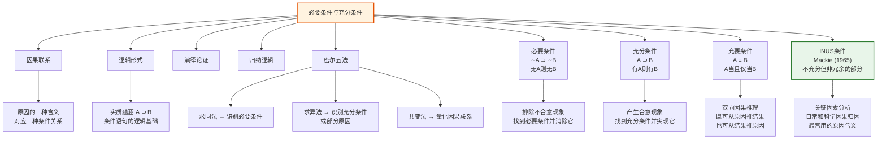

# 必要条件与充分条件

> [!abstract] 概述
> ==必要条件==（necessary condition）与==充分条件==（sufficient condition）是因果分析和逻辑推理的基础概念，用于精确刻画原因与结果之间的逻辑关系。必要条件界定"没有它就不行"的底线——缺乏必要条件，事件必定不发生；充分条件界定"有了就行"的保障——具备充分条件，事件必定发生。两者在因果推理中扮演不同角色：排除不合意现象时关注必要条件，产生合意现象时关注充分条件。John Mackie 在此基础上提出了==INUS条件==的概念，精确刻画了日常和科学因果归因中最常用的"原因"含义——即既非必要也非充分、但在特定因果组合中起关键作用的因素。

## 定义

> [!def] 必要条件（Necessary Condition）
> 条件 $A$ 是事件 $B$ 的==必要条件==，当且仅当==缺乏 $A$ 则 $B$ 不发生==。用符号表示：
> $$\sim A \supset \sim B$$
>
> 等价地，$A$ 是 $B$ 的必要条件意味着：如果 $B$ 发生了，那么 $A$ 必定已经出现，即 $B \supset A$（有果必有因）。
>
> **经典例子：** 有氧气是燃烧的必要条件。没有氧气就不可能燃烧（$\sim O \supset \sim F$），但燃烧发生了则必定有氧气（$F \supset O$）。然而，有氧气不保证燃烧发生——氧气不是燃烧的充分条件。

> [!def] 充分条件（Sufficient Condition）
> 条件 $A$ 是事件 $B$ 的==充分条件==，当且仅当==有 $A$ 则 $B$ 必发生==。用符号表示：
> $$A \supset B$$
>
> 即只要 $A$ 出现，$B$ 就必定出现（有因必有果）。
>
> **经典例子：** 达到燃点（在有氧气和可燃物的情况下）是燃烧的充分条件。达到燃点则燃烧必定发生（$I \supset F$），但燃烧不一定由达到燃点引起——充分条件不排除其他原因的存在。

> [!def] 充要条件（Necessary and Sufficient Condition）
> 条件 $A$ 是事件 $B$ 的==充要条件==（necessary and sufficient condition），当且仅当 $A$ 既是 $B$ 的必要条件，又是 $B$ 的充分条件。用符号表示：
> $$A \equiv B$$
>
> 即 $A$ 与 $B$ 相互蕴涵：$A \supset B$ 且 $B \supset A$。充要条件意味着 $A$ 和 $B$ 在逻辑上等价——有 $A$ 当且仅当有 $B$。
>
> **经典例子：** 在标准大气压下，水被加热到100°C是水沸腾的充要条件——达到100°C则水沸腾（充分性），水沸腾则温度必为100°C（必要性）。

> [!def] INUS条件（Insufficient but Non-redundant part of an Unnecessary but Sufficient condition）
> ==INUS条件==是哲学家 John Mackie (1965) 提出的因果分析概念，精确刻画了日常和科学因果归因中最常用的"原因"含义。一个 INUS 条件是：
> - **不充分的**（Insufficient）：单独出现不足以产生结果
> - **非冗余的**（Non-redundant）：在导致该结果的充分条件组合中不可替代
> - **不必要条件的一部分**（part of an Unnecessary but Sufficient condition）：属于某个充分条件组合，但该组合本身不是结果的必要条件（结果可由其他组合产生）
>
> **经典例子——短路与房屋火灾：**
> - 短路本身不足以引起火灾（还需易燃材料、氧气等）→ 不充分
> - 在导致这场火灾的充分条件组合中，短路不可替代（没有短路就不会有这场火灾）→ 非冗余
> - 短路不是火灾的必要条件（火灾可由纵火、漏电等其他原因引起）→ 不必要
> - 但短路是某个充分条件组合的一部分（短路 + 易燃材料 + 氧气 → 火灾）→ 充分条件的一部分
>
> 用符号表示：设充分条件组合为 $A \cdot X$（其中 $X$ 代表其他必要条件的联合），则 $A$ 是 INUS 条件意味着：
> $$A \cdot X \supset B \quad \text{且} \quad A \not\supset B \quad \text{且} \quad B \not\supset A$$

> [!warning] 必要条件与充分条件的可相互定义性
> | 等价关系 | 说明 |
> |:---------|:-----|
> | $A$ 是 $B$ 的充分条件 $\equiv$ $\sim A$ 是 $\sim B$ 的必要条件 | 有 $A$ 则有 $B$ $\equiv$ 无 $A$ 则无 $B$ |
> | $A$ 是 $B$ 的必要条件 $\equiv$ $\sim A$ 是 $\sim B$ 的充分条件 | 无 $A$ 则无 $B$ $\equiv$ 有 $A$ 则有 $B$ |
>
> 这意味着：==理解了必要条件就自动理解了充分条件，反之亦然==。例如，"有氧气是燃烧的必要条件"等价于"没有氧气是不燃烧的充分条件"。

## 核心性质

| 性质 | 说明 | 公式/示例 |
|:-----|:-----|:----------|
| ==不对称性== | 必要条件和充分条件描述因果关系的两个不同方向，两者一般不对称——$A$ 是 $B$ 的必要条件，不意味着 $A$ 是 $B$ 的充分条件 | 氧气是燃烧的必要条件但非充分条件；达到燃点是燃烧的充分条件但非必要条件 |
| ==传递性== | 条件关系具有传递性：若 $A$ 是 $B$ 的充分条件，$B$ 是 $C$ 的充分条件，则 $A$ 是 $C$ 的充分条件（必要条件同理） | $A \supset B$ 且 $B \supset C$ $\Rightarrow$ $A \supset C$ |
| ==组合性== | 一个事件的所有必要条件的联合构成该事件的充分条件；一个充分条件包含该事件的所有必要条件 | $N_1 \cdot N_2 \cdot \ldots \cdot N_k \supset E$，其中 $N_i$ 是 $E$ 的全部必要条件 |
| ==独立性== | 必要条件和充分条件是两个独立的概念——一个条件可以只是必要条件、只是充分条件、两者兼具（充要条件），或两者皆非（INUS条件） | 吸烟是肺癌的 INUS 条件——既非必要也非充分，但在因果组合中起关键作用 |

> [!tip] 四种条件关系对比
> | 条件类型 | 有 $A$ 时 $B$？ | 无 $A$ 时 $B$？ | 逻辑形式 | 典型例子 |
> |:---------|:---------------|:---------------|:---------|:---------|
> | ==必要条件== | 不确定 | 必定不发生 | $\sim A \supset \sim B$（或 $B \supset A$） | 氧气之于燃烧 |
> | ==充分条件== | 必定发生 | 不确定 | $A \supset B$ | 达到燃点之于燃烧 |
> | ==充要条件== | 必定发生 | 必定不发生 | $A \equiv B$ | 100°C（标准大气压）之于水沸腾 |
> | ==INUS条件== | 不确定 | 不确定 | $A \cdot X \supset B$，$A$ 非冗余 | 短路之于这场火灾 |

## 关系网络

- **[[因果联系]]**：必要条件和充分条件是分析因果联系的逻辑工具——每个因果断定都隐含着某种条件关系
- **[[逻辑形式]]**：条件关系通过实质蕴涵 $A \supset B$ 来形式化刻画，是命题逻辑的核心连接词
- **[[演绎论证]]**：充分条件关系是演绎推理的逻辑基础——肯定前件式（$A \supset B, A \therefore B$）直接利用充分条件
- **[[归纳逻辑]]**：因果推理中的条件分析是归纳逻辑的核心内容——密尔五法系统化地识别必要条件和充分条件
- **[[密尔五法]]**：求同法识别必要条件，求异法识别充分条件或部分原因，共变法量化因果联系

## 第12章：原因的三种含义与条件分析

### 原因的三种含义对应三种条件关系

Copi 在第12章第1节中系统辨析了"原因"一词的三种含义，每种含义对应不同的条件关系：

| 原因的含义 | 对应的条件关系 | 实践目标 | 推理方向 | 经典例子 |
|:-----------|:---------------|:---------|:---------|:---------|
| ==必要条件==意义上的原因 | $B \supset A$（$A$ 是 $B$ 的必要条件） | 排除不合意现象 | 从结果推原因 | 细菌是疾病的原因——消灭细菌即可治愈疾病 |
| ==充分条件==意义上的原因 | $A \supset B$（$A$ 是 $B$ 的充分条件） | 产生合意现象 | 从原因推结果 | 热处理过程是合金强度增高的原因——复制该过程即可复制结果 |
| ==关键因素==（INUS条件）意义上的原因 | $A \cdot X \supset B$，$A$ 非冗余 | 解释事件发生 | 分析因果组合 | 吸烟导致肺癌——吸烟在肺癌的因果组合中频繁发挥作用 |

> [!tip] 因果推理的方向性与条件关系
> Copi 明确指出因果推理的方向性取决于"原因"一词的含义：
> - **从结果推原因**：仅在==必要条件==含义上合法——如果 $E$ 发生了，那么它的某个必要条件 $N$ 必定已经出现
> - **从原因推结果**：仅在==充分条件==含义上合法——如果充分条件 $S$ 出现了，那么事件 $E$ 必定发生
> - **双向推理**：需要==充要条件==——原因既是充分条件，又是所有必要条件的联合

### 密尔五法中的条件分析

密尔五法本质上是系统化地识别必要条件和充分条件的归纳方法：

| 密尔方法 | 识别的条件类型 | 逻辑原理 |
|:---------|:---------------|:---------|
| ==求同法== | 必要条件 | 现象发生的所有实例中唯一共同的因素，是现象的必要条件 |
| ==求异法== | 充分条件或部分原因 | 现象发生与不发生时唯一的差异因素，是现象的充分条件或充分条件中不可缺少的部分 |
| ==求同求异并用法== | 必要条件 + 充分条件 | 联合运用求同法和求异法，同时识别必要条件和充分条件 |
| ==剩余法== | 部分原因 | 从已知原因的效果中减去已知部分，剩余效果归因于剩余原因 |
| ==共变法== | 因果联系的量化 | 现象间的定量共变关系为因果联系提供概率证据 |

> [!info] INUS条件与密尔五法的关联
> 密尔五法（尤其是求异法）的结论经常是"某因素是原因中不可缺少的一部分"——这恰好对应 INUS 条件中的"非冗余部分"。例如，在基因剔除实验中，研究者发现 MIP-1$\alpha$ 基因是炎症的"一个不可缺少的部分"，而非唯一原因。这说明密尔五法在大多数情况下识别的是 INUS 条件，而非纯粹的充分条件或必要条件。

## 补充

> [!info] 条件关系的概率论推广
> **来源：** Suppes, P. (1970). *A Probabilistic Theory of Causality*.
>
> 在概率论框架下，必要条件和充分条件可以被推广为概率化的概念：
>
> - **概率化必要条件**：$A$ 是 $B$ 的概率化必要条件，当 $P(B \mid \sim A) = 0$（没有 $A$ 时 $B$ 的概率为零）
> - **概率化充分条件**：$A$ 是 $B$ 的概率化充分条件，当 $P(B \mid A) = 1$（有 $A$ 时 $B$ 的概率为一）
> - **概率化 INUS 条件**：$A$ 是 $B$ 的 INUS 条件，当 $P(B \mid A) > P(B)$（$A$ 提高了 $B$ 的概率），但 $0 < P(B \mid A) < 1$ 且 $0 < P(B \mid \sim A) < 1$
>
> 这一推广使得条件关系分析可以处理现实世界中绝大多数因果场景——现实中很少存在绝对的必要条件或充分条件，但概率化的条件关系无处不在。

> [!info] 充分条件的"最小化"问题
> 在实际应用中，充分条件通常包含多个必要条件的联合。一个重要的问题是：我们能否找到一个"最小充分条件"——即去掉其中任何一个成分就不再是充分条件的那个最精简的组合？
>
> 这一问题在科学实验设计中尤为重要：受控实验的目标就是通过控制变量，逐步排除非必要因素，最终找到产生结果的最小充分条件组合。密尔求异法正是这一思想的系统化实现。

## 参见

- [[因果联系]] — 必要条件和充分条件是分析因果联系的逻辑工具
- [[逻辑形式]] — 条件关系通过实质蕴涵 $A \supset B$ 形式化
- [[演绎论证]] — 充分条件关系是肯定前件式等演绎规则的基础
- [[归纳逻辑]] — 因果推理中的条件分析是归纳逻辑的核心内容
- [[密尔五法]] — 系统化识别必要条件和充分条件的五种归纳方法
- [[休谟问题]] — 因果关系能否被理性证明的哲学挑战
- [[12.1 原因与结果]] — 原因的三种含义与条件关系的详细分析
- [[12.4 因果分析的方法]] — 密尔五法中条件关系的具体应用
