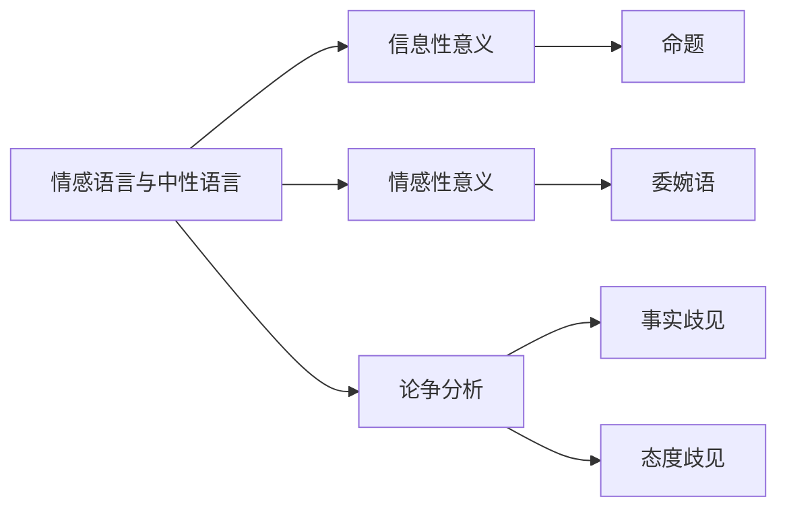

# 情感语言与中性语言

> [!abstract] 概述
> 语词不仅传达==信息性意义==（可判定真假的命题内容），还可能携带==情感性意义==（引发态度和情感反应）。逻辑学追求尽可能使用中性语言，以避免情感成分干扰对命题真假的理性判断。

## 定义

> [!def] 信息性意义与情感性意义
> - **信息性意义**（informative meaning）：语词所传达的命题内容，可判定真假
> - **情感性意义**（emotive meaning）：语词所引发的态度和情感反应，无真假值

## 核心区分

| 维度 | 信息性意义 | 情感性意义 |
|:-----|:-----------|:-----------|
| 内容 | 命题内容（事实） | 态度和情感反应 |
| 真假值 | 可判定真假 | 无真假值 |
| 逻辑学关注 | ==是== | 否（干扰因素） |
| 示例 | "终止妊娠" | "谋杀婴儿" |

> [!warning] 关键要点
> 同一事实可以用不同情感色彩的语词来表达。逻辑学关注的是==命题的信息性意义==（真值和推理关系），情感性意义会干扰理性判断。在需要理性分析的场合，应将情感语言"翻译"为中性语言。

## 委婉语

> [!def] 委婉语（Euphemism）
> 用温和、抽象的词汇替代直接、冷峻的表达，以降低事实的情感冲击力。

| 委婉语 | 所指事实 | 效果 |
|:-------|:---------|:-----|
| "附带损害" (collateral damage) | 平民伤亡 | 淡化严重性 |
| "人员优化" | 裁员/解雇 | 掩盖负面性质 |
| "友好火力" (friendly fire) | 误击己方 | 弱化责任归属 |

> [!tip] 委婉语的双刃剑
> 委婉语可以减少不必要的冒犯（如社交场合），但也可能==掩盖事实真相==，阻碍理性讨论。分析论证时应将委婉语还原为中性表述。

## 论争的三种歧见类型

| 类型 | 信念层面 | 态度层面 | 解决途径 | 示例 |
|:-----|:---------|:---------|:---------|:-----|
| 纯粹事实歧见 | 有分歧 | 一致 | 调查、收集证据 | 死刑是否有效威慑犯罪？ |
| 纯粹态度歧见 | 一致 | 有分歧 | 价值讨论、道德推理 | 国家处死罪犯是否正确？ |
| 混合歧见 | 有分歧 | 有分歧 | 先解决事实，再讨论态度 | 两者兼有 |

> [!info] 解决论争的第一步
> ==明确论争的真正问题所在==——是事实之争还是态度之争。事实歧见通过调查和证据推进，态度歧见通过价值讨论推进，混合歧见需分步处理。

## 与其他概念的关系

- **[[语言的功能]]**：语言的多重功能是理解情感意义的基础——表达性功能产生情感性意义
- **[[命题]]**：信息性意义的核心载体，逻辑学关注其真假值
- **[[论证]]**：情感语言可能干扰论证的理性分析

## 理论背景

> [!info] Stevenson 的描述性/评价性意义区分
> **来源：** Stevenson, C.L. (1944). *Ethics and Language*
>
> 史蒂文森区分了语词的描述性意义（客观特征，对应信息性意义）和评价性意义（引发态度，对应情感性意义），指出伦理语词的主要功能是==表达态度和引发态度变化==，而非描述事实。

> [!info] Lakoff 的框架理论
> **来源：** Lakoff, G. (2004). *Don't Think of an Elephant!*
>
> 莱考夫提出"==标签即框架=="——选择什么标签描述立场本身就是修辞策略。如"pro-life"将争论框架化为"生命 vs 反生命"，"pro-choice"则框架化为"自由选择 vs 强制"。一旦接受某个框架，后续推理就会在该框架内进行。

## 应用

1. **第4章**：谬误识别——情感操控是常见谬误手段，需识别并剥离情感外衣
2. **第7章**：日常论证分析——将情感语言还原为中性表述以准确评估论证

## 参见

- [[3.2 情感语言、中性语言与论争]] — 详细讨论与习题
- [[语言的功能]] — 语言的多重功能分类
- [[命题]] — 信息性意义的核心载体
- [[论证]] — 情感语言对论证分析的干扰
