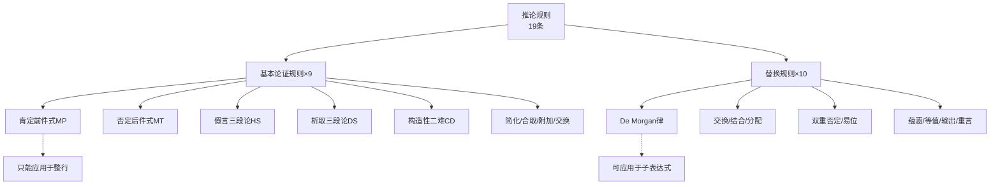

# 推论规则

> [!abstract] 概述
> **推论规则**（Rules of Inference）是在形式证明中允许从已有陈述推出新陈述的规则。第9章建立的命题逻辑自然演绎系统包含==19条推论规则==，分为两大类：**9条基本论证规则**（只能应用于整行陈述）和**10条替换规则**（可应用于子表达式）。推论规则是自然演绎系统的核心工具，它们的完备性保证了任何有效的真值函项论证都可以通过这些规则得到证明。

## 定义

> [!def] 推论规则
> **推论规则**是一个有效的论证形式或逻辑等价式，它在形式证明中授权从某些已建立的陈述推出新的陈述。推论规则分为两类：
> - **基本论证规则**：有效的论证形式，只能应用于证明中的==整行陈述==
> - **替换规则**：逻辑等价式，可以应用于陈述的==整行或子表达式==

## 核心性质

| 性质 | 基本论证规则（1-9） | 替换规则（10-19） |
|:-----|:-------------------|:------------------|
| 逻辑性质 | 有效论证形式 | 逻辑等价式（重言双条件） |
| 应用范围 | ==只能应用于整行== | 可应用于==整行或子表达式== |
| 推理方向 | 单向（前提→结论） | ==双向==（等价替换） |
| 典型用途 | 从已知行推出新行 | 变换已有行的形式 |
| 数量 | 9条 | 10条 |

## 十九条规则完整列表

### 基本论证规则（1-9）

| 编号 | 名称 | 缩写 | 形式 | 直觉 |
|:----:|:-----|:----:|:-----|:-----|
| 1 | 肯定前件式 | M.P. | $p \supset q,\; p,\; \therefore q$ | 肯定前件→肯定后件 |
| 2 | 否定后件式 | M.T. | $p \supset q,\; \sim q,\; \therefore \sim p$ | 否定后件→否定前件 |
| 3 | 假言三段论 | H.S. | $p \supset q,\; q \supset r,\; \therefore p \supset r$ | 蕴涵的传递性 |
| 4 | 析取三段论 | D.S. | $p \lor q,\; \sim p,\; \therefore q$ | 否定一支→肯定另一支 |
| 5 | 构造性二难式 | C.D. | $(p \supset q) \cdot (r \supset s),\; p \lor r,\; \therefore q \lor s$ | 两条路都通 |
| 6 | 简化律 | Simp. | $p \cdot q,\; \therefore p$ | 从合取中取出合取支 |
| 7 | 合取律 | Conj. | $p,\; q,\; \therefore p \cdot q$ | 合取两个真陈述 |
| 8 | 附加律 | Add. | $p,\; \therefore p \lor q$ | 附加一个析取支 |
| 9 | 交换律 | Com. | $p \cdot q,\; \therefore q \cdot p$ | 交换合取/析取支顺序 |

### 替换规则（10-19）

| 编号 | 名称 | 缩写 | 形式 |
|:----:|:-----|:----:|:-----|
| 10 | De Morgan律 | De M. | $\sim(p \lor q) \equiv \sim p \cdot \sim q$；$\sim(p \cdot q) \equiv \sim p \lor \sim q$ |
| 11 | 交换律 | Com. | $p \cdot q \equiv q \cdot p$；$p \lor q \equiv q \lor p$ |
| 12 | 结合律 | Assoc. | $p \cdot (q \cdot r) \equiv (p \cdot q) \cdot r$；$p \lor (q \lor r) \equiv (p \lor q) \lor r$ |
| 13 | 分配律 | Dist. | $p \cdot (q \lor r) \equiv (p \cdot q) \lor (p \cdot r)$；$p \lor (q \cdot r) \equiv (p \lor q) \cdot (p \lor r)$ |
| 14 | 双重否定律 | D.N. | $p \equiv \sim\sim p$ |
| 15 | 易位律 | Trans. | $p \supset q \equiv \sim q \supset \sim p$ |
| 16 | 实质蕴涵律 | Impl. | $p \supset q \equiv \sim p \lor q$ |
| 17 | 实质等值律 | Equiv. | $p \equiv q \equiv (p \supset q) \cdot (q \supset p)$ |
| 18 | 输出律 | Exp. | $(p \cdot q) \supset r \equiv p \supset (q \supset r)$ |
| 19 | 重言律 | Taut. | $p \equiv p \lor p$；$p \equiv p \cdot p$ |

## 关系网络

## 跨章节应用

### 第7章：日常语言中的论证
假言三段论（HS）、析取三段论（DS）、构造性二难（CD）在第7章以自然语言形式出现。第9章将它们精确化为符号化的推论规则。

### 第8章：命题逻辑Ⅰ
第8章通过真值表验证了MP、MT、HS、DS等论证形式的有效性，并建立了逻辑等价关系（De Morgan、双重否定、蕴涵等价等），为第9章的替换规则提供了理论基础。

### 第9章：命题逻辑Ⅱ（核心章节）
第9章系统建立了19条推论规则，并引入条件证明（CP）和间接证明（IP）作为高级证明技术。

### 第10章：四条量化规则

第10章在原有19条推论规则基础上，新增了4条量化规则，使自然演绎系统扩展为==23条规则==：

| 规则名 | 缩写 | 类型 | 功能 |
|:-------|:-----|:-----|:-----|
| 全称实例化 | UI | 推论规则 | 从 $(x)\phi x$ 推出 $\phi v$（v为任意个体符号） |
| 全称泛化 | UG | 推论规则 | 从 $\phi y$ 推出 $(x)\phi x$（y为任意个体变元） |
| 存在实例化 | EI | 推论规则 | 从 $(\exists x)\phi x$ 推出 $\phi v$（v为此前未出现的个体常元） |
| 存在泛化 | EG | 推论规则 | 从 $\phi v$ 推出 $(\exists x)\phi x$ |

> [!warning] 使用限制
> - **EI 限制**：实例化时必须使用此前未在证明中出现过的个体常元，否则可能导致无效推理
> - **UG 限制**：不能对常元进行泛化（只能对自由变元泛化），且该变元不能出现在任何未消除的前提下

量化规则与19条基本规则配合使用，构成了谓词逻辑的完整证明系统。参见 [[量词]]。

## 参见

- [[自然演绎]] — 推论规则所属的形式证明系统
- [[有效性]] — 推论规则保证论证的有效性
- [[逻辑等价]] — 替换规则的理论基础
- [[假言三段论]] — HS规则的详细概念页
- [[析取三段论]] — DS规则的详细概念页
- [[条件证明]] — CP高级证明技术
- [[间接证明]] — IP/RAA高级证明技术
