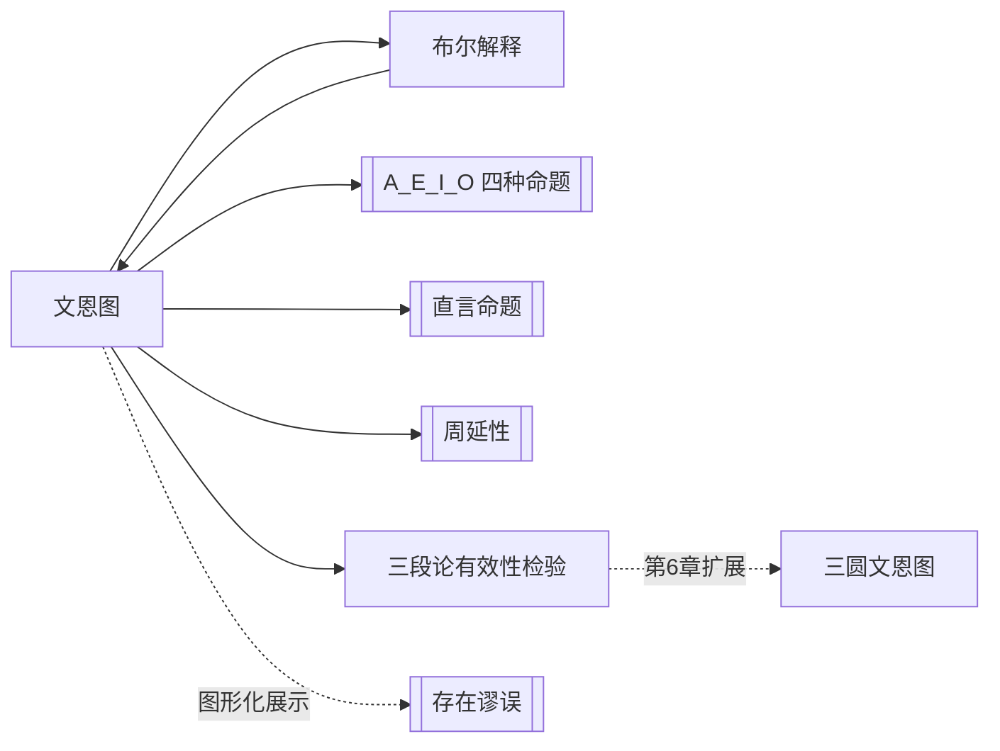

# 文恩图

> [!abstract] 概述
> 用==交叉的圆==表示类之间关系的图示方法，通过阴影（空）和 x 标记（不空）精确表示四种直言命题，是布尔解释的图形化表示工具。

## 定义

> [!def] 文恩图（Venn Diagram）
> 一种用交叉的圆来表示类之间关系的图形工具，由英国逻辑学家==约翰·文恩==（John Venn, 1834–1923）于1881年在《符号逻辑》（*Symbolic Logic*）中系统发明。每个圆代表一个类（词项的外延），==阴影==表示该区域为空（$=0$），==x 标记==表示该区域不空（$\neq 0$）。

## 基本结构

两个交叉的圆（代表S类和P类）将整个论域划分为==四个区域==：

```
              S̄P̄
        ┌───────────────┐
        │   ┌─────┐     │
  SP̄   │   │     │     │  S̄P
（左月牙）│───│  SP │─────│（右月牙）
        │   │     │     │
        │   └─────┘     │
        └───────────────┘
              （中间透镜）
```

| 区域 | 符号 | 含义 |
|:-----|:-----|:-----|
| ==左月牙== | $SP̄$ | 是S但不是P的事物 |
| ==中间透镜== | $SP$ | 既是S又是P的事物 |
| ==右月牙== | $\bar{S}P$ | 不是S但是P的事物 |
| ==外部区域== | $\bar{S}\bar{P}$ | 既不是S也不是P的事物 |

## 标记法

| 标记 | 符号 | 含义 |
|:-----|:-----|:-----|
| ==阴影== | $= 0$ | 该区域为空，不存在任何元素 |
| ==x== | $\neq 0$ | 该区域不空，至少存在一个元素 |

> [!warning] 互斥性
> 同一个区域==不能同时==画阴影和标x——阴影表示"为空"，x表示"不空"，两者互斥。未标记的区域则表示"不确定"——可能有也可能没有元素。

## 四种命题的文恩图

### A命题："所有S是P" → $S\bar{P} = 0$ → 左月牙画阴影

```
        ┌───────────────┐
        │   ┌─────┐     │
  ///// │   │     │     │
  ///// │───│  SP │─────│
        │   │     │     │
        │   └─────┘     │
        └───────────────┘
```

> 左月牙（$SP̄$）画阴影，表示"是S但不是P的区域为空"——即所有S都是P。==不标x==，因此不断言S存在。

### E命题："没有S是P" → $SP = 0$ → 中间透镜画阴影

```
        ┌───────────────┐
        │   ┌─────┐     │
        │   │/////│     │
        │───│/////│─────│
        │   │/////│     │
        │   └─────┘     │
        └───────────────┘
```

> 中间透镜（$SP$）画阴影，表示"既是S又是P的区域为空"——即S和P没有共同元素。==不标x==，因此不断言S或P存在。

### I命题："有S是P" → $SP \neq 0$ → 中间透镜标x

```
        ┌───────────────┐
        │   ┌─────┐     │
        │   │  ×  │     │
        │───│     │─────│
        │   │     │     │
        │   └─────┘     │
        └───────────────┘
```

> 中间透镜（$SP$）标x，表示"至少存在一个既是S又是P的东西"。==有存在含义==。

### O命题："有S不是P" → $S\bar{P} \neq 0$ → 左月牙标x

```
        ┌───────────────┐
        │   ┌─────┐     │
    ×   │   │     │     │
        │───│  SP │─────│
        │   │     │     │
        │   └─────┘     │
        └───────────────┘
```

> 左月牙（$SP̄$）标x，表示"至少存在一个是S但不是P的东西"。==有存在含义==。

## 核心性质

| 性质 | 陈述 |
|:-----|:-----|
| 发明者 | John Venn (1881), *Symbolic Logic* |
| 基本元素 | 交叉的圆、阴影（$=0$）、x标记（$\neq 0$） |
| 与布尔解释的关系 | 文恩图是==布尔解释的图形化表示== |
| 全称命题的图示 | 只画阴影，不标x → 无存在含义 |
| 特称命题的图示 | 只标x，不画阴影 → 有存在含义 |
| 优势 | 可组合多个命题的信息，适合检验推理有效性 |

> [!tip] 文恩图如何体现布尔解释
> 文恩图与布尔解释的对应关系是其最核心的特征：
> - 全称命题（A、E）==只画阴影==，表示"排除"某些区域，但不断言任何区域有元素 → ==无存在含义==
> - 特称命题（I、O）==只标x==，表示"断言"某些区域有元素 → ==有存在含义==
>
> 正是因为全称命题在文恩图中只排除、不断言存在，所以从全称命题的图无法"读出"特称命题的结论——这图形化地展示了[[存在谬误]]为何发生。

## 与其他概念的关系



## 补充

> [!info] 文恩图 vs 欧拉图
> 初学者常混淆文恩图（Venn diagram）与欧拉图（Euler diagram）：
> - **欧拉图**：用圆的包含、排斥、交叉关系来表示==具体的类关系==（如S包含于P、S与P不相交等）。每个图只表示一种特定的关系，无法组合多个命题。
> - **文恩图**：用阴影和x标记来表示==命题==，每个区域可以独立地被标记为空或不空。同一个图可以组合多个命题的信息。
>
> 文恩图更适合逻辑推理，因为它可以同时表示多个命题（如在三段论中同时表示两个前提），从而检验结论是否被前提所蕴含。

> [!info] 第6章扩展：三圆文恩图
> 在第6章中，文恩图将扩展为==三个交叉圆==的形式，用于检验直言三段论的有效性。三个圆分别代表三段论中的三个词项（小项S、大项P、中项M），形成八个区域。检验方法是将两个前提分别画在图上，然后检查结论所要求的信息是否已经在图中表示出来。文恩图方法完全基于布尔解释，自动处理了空类问题，是检验三段论有效性最可靠的方法之一。

## 应用

- **直言命题的图示**：用文恩图直观地表示A、E、I、O四种命题的含义。
- **直接推论的验证**：通过文恩图验证换位、换质、换质位等直接推论在布尔解释下是否有效。
- **三段论有效性检验**（第6章）：用三圆文恩图检验直言三段论的有效性，自动识别存在谬误。
- **集合论教学**：文恩图在数学教育中广泛用于直观展示集合运算（交集、并集、补集）。

## 三圆文恩图（第6章扩展）

> [!info] 从两圆到三圆
> 第6章将两圆文恩图扩展为三圆文恩图，用于检验直言三段论的有效性。三个圆分别标记为 $S$（小项）、$P$（大项）、$M$（中项），形成 $2^3 = 8$ 个区域。

> [!tip] 三圆文恩图检验四步法
> 1. 标记三圆为 $S$、$P$、$M$
> 2. 图示两个前提（==先全称后特称==）
> 3. 若 $x$ 位置不确定，放在两个可能区域的==交界线==上
> 4. 检查结论是否已被前提图示包含

> [!example] 有效三段论示例
> AAA-1（Barbara）：图示"所有M是P"和"所有S是M"后，结论"所有S是P"已被包含在图中→有效。

> [!warning] 无效三段论示例
> AAA-2：图示"所有P是M"和"所有S是M"后，$S\bar{P}M$ 区域无阴影，结论未被包含→无效（中项不周延）。

参见：[[直言三段论]] [[三段论的式与格]] [[三段论规则]]

## 参见

- [[A_E_I_O 四种命题]] —— 文恩图直接表示的对象
- [[布尔解释]] —— 文恩图是布尔解释的图形化体现
- [[直言命题]] —— 文恩图所图示的命题类型
- [[周延性]] —— 周延性概念与文恩图中阴影区域的对应关系
- [[存在谬误]] —— 文恩图可直观展示存在谬误为何发生
