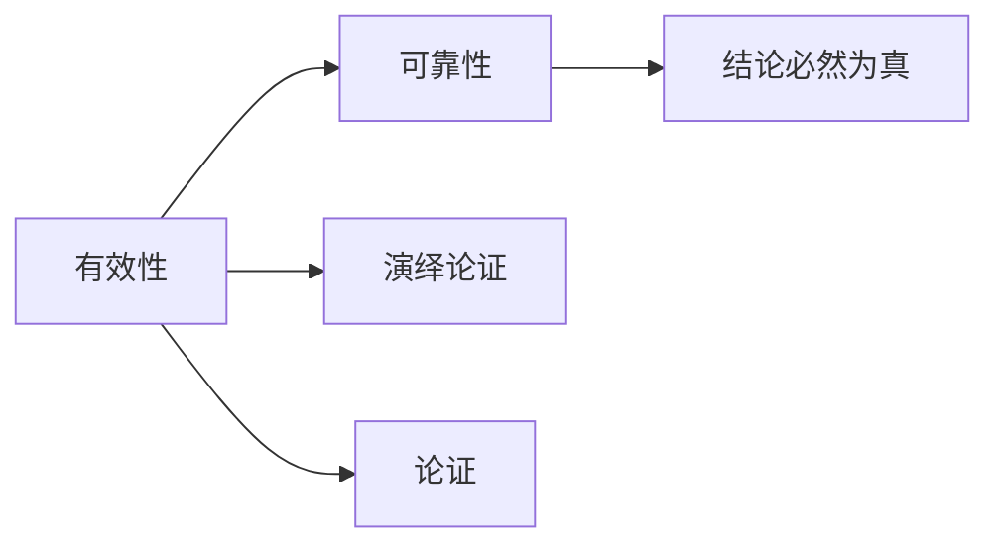

# 有效性

> [!abstract] 概述
> 有效性是演绎论证的核心评估标准——一个有效的演绎论证不可能前提为真而结论为假。有效性是论证的==形式属性==，与命题的真假属于不同范畴。

## 定义

> [!def] 有效性（Validity）
> 一个演绎论证是==有效的==，当且仅当它==不可能==前提为真而结论为假。

> [!tip] 有效性的不可能性条件
> 有效论证的唯一不可能组合：==真前提 + 假结论==。如果论证有效，那么当前提全为真时，结论不可能为假。

## 核心性质

| 性质 | 说明 |
|:-----|:-----|
| 仅适用于演绎论证 | 归纳论证用"强/弱"评估，不用"有效/无效" |
| 是形式属性 | 有效性取决于前提与结论之间的逻辑关系，不取决于内容 |
| 与真实性独立 | 有效论证的结论可以为假（当有假前提时） |
| 全有或全无 | 论证要么有效要么无效，不存在"部分有效" |

## 七种真值组合

| 类型 | 前提 | 结论 | 可能？ |
|:-----|:-----|:-----|:-------|
| Ⅰ. 有效 | 真 | 真 | ✅ |
| Ⅱ. 有效 | 假 | 假 | ✅ |
| Ⅲ. 无效 | 真 | 真 | ✅ |
| Ⅳ. 无效 | 真 | 假 | ✅（==无效的唯一标志==） |
| Ⅴ. 有效 | 假 | 真 | ✅ |
| Ⅵ. 无效 | 假 | 真 | ✅ |
| Ⅶ. 无效 | 假 | 假 | ✅ |

## 常见误区

> [!warning] 误区1：有效论证的结论一定为真
> ❌ 有效 = 结论为真
> ✅ 有效只保证"如果前提为真，结论不可能为假"。前提本身可能为假。

> [!warning] 误区2：结论为假说明论证无效
> ❌ 结论假 → 论证无效
> ✅ 结论假有两种可能：论证无效，或论证有效但前提有假。

> [!warning] 误区3：结论为真说明论证有效
> ❌ 结论真 → 论证有效
> ✅ 真结论可能由假前提"碰巧"推出，也可能由无效推理"碰巧"得出。

## 与其他概念的关系

- **[[可靠性]]**：有效 + 所有前提为真 = 可靠。只有可靠论证才能==建立==结论的真实性
- **[[演绎论证]]**：有效性是演绎论证的专属评估标准
- **[[论证]]**：有效性是评估论证质量的核心维度

## 补充

> [!info] Tarski 的形式化定义
> **来源：** Tarski, A. (1936). "On the Concept of Logical Consequence"
>
> 塔斯基将有效性精确化为：句子 B 是句子集 A 的逻辑后承，当且仅当 A 的每一个模型都是 B 的模型。这捕捉了"不可能前提真而结论假"的直觉——如果不存在任何一个使 A 为真而使 B 为假的可能世界，B 就是 A 的逻辑后承。

## 命题逻辑中的有效性（第8章扩展）

> [!def] 有效性的精确形式化定义
> 一个论证是==有效的==，当且仅当==不可能==出现所有前提为真而结论为假的情况。
> 等价表述：论证的特征形式在真值表中不存在"前提全T结论F"的行。

> [!info] 重言式判据
> 一个论证是有效的，==当且仅当==其对应的条件陈述 $(\text{前提}_1 \cdot \text{前提}_2 \cdot \ldots) \supset \text{结论}$ 是==重言式==。这一判据将有效性问题转化为[[真值表]]的机械检验。

> [!info] 三大思想法则
> 三大思想法则是经典逻辑的基本假设，都是[[重言式与矛盾式|重言式]]：
> - 同一原理：$p \supset p$
> - 不矛盾原理：$\sim(p \cdot \sim p)$
> - 排中原理：$p \lor \sim p$
>
> 现代视角：它们不是"思想的绝对法则"，而是经典逻辑系统的==基本假设==。直觉主义逻辑拒斥排中律，量子逻辑拒斥分配律。

### 第9章：形式证明方法

第9章引入了==自然演绎==（Natural Deduction）作为有效性判定的第二种方法。与真值表的穷举性语义方法不同，自然演绎是构造性的语法方法——通过逐步运用推论规则从前提出发演绎出结论。

- **形式证明**：一个论证是有效的，当且仅当可以构造一个从前提推出结论的有效推论序列（参见[[自然演绎]]）
- **19条推论规则**：9条基本论证规则 + 10条替换规则构成完备系统（参见[[推论规则]]）
- **条件证明CP**：当结论是条件陈述时，CP可以大幅缩短证明（参见[[条件证明]]）
- **间接证明IP**：通过假设结论否定并推导矛盾来证明结论（参见[[间接证明]]）
- **不相容性**：如果前提不相容，任何结论都可以有效推出（参见[[不相容性]]）

> [!tip] 两种方法的互补
> 真值表方法适合==判定无效性==（直接找到反例），形式证明方法适合==构造有效性证明==（展示推理过程）。完备性定理保证两者在判定能力上完全等价（参见[[形式证明-vs-真值表]]）。

参见：[[真值函项性]] [[真值表]] [[重言式与矛盾式]] [[逻辑学/concepts/逻辑等价]] [[假言三段论]]

### 第10章：量化有效性证明

第10章将有效性概念扩展到谓词逻辑领域：

- **量化有效性**：一个谓词逻辑论证是有效的，当且仅当不可能出现所有前提为真而结论为假的情况
- **证明方法**：使用量化规则（UI/UG/EI/EG）配合19条基本规则构建形式证明
- **无效性判定**：通过==解释方法==（构造一个使所有前提为真而结论为假的模型）来证明论证无效
- **与命题逻辑的关系**：谓词逻辑的有效性是命题逻辑有效性的推广——当论证中不含量词时，两种方法等价

> [!tip] 关键区别
> 命题逻辑中可以用真值表机械地判定任何论证的有效性；但谓词逻辑中==不存在一般的机械判定程序==（丘奇-图灵不可判定性），需要依赖形式证明和解释方法。参见 [[量词]]。

### 第11章：有效性概念的适用范围

第11章明确了有效性概念的适用边界：

- **有效性仅适用于演绎论证**：归纳论证不能用"有效/无效"评价
- **归纳论证的评价术语**：归纳论证用"强/弱"（或"有力/无力"）评价
- **类比论证的概率性**：类比论证作为归纳推理形式，其结论只有概率性，不涉及有效性概念
- **逻辑类推反驳**：通过构造同形式但结论不可接受的论证来检验演绎论证的有效性

参见 [[类比推理]]、[[归纳逻辑]]。

## 参见

- [[1.6 有效性与真实性]] — 七种真值组合的详细分析
- [[演绎论证]] — 有效性适用的论证类型
- [[可靠性]] — 有效性 + 前提全真
- [[有效性-vs-可靠性]] — 两个概念的对比
