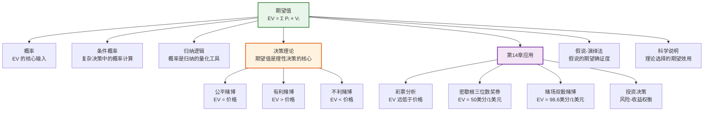

# 期望值

> [!abstract] 概述
> ==期望值==（expected value, EV）是决策理论的核心概念，量化了不确定结果的==平均预期收益==。它将每个可能结果的价值（value）与其发生的[[逻辑学/concepts/概率]]（probability）相结合，通过加权求和计算出"如果重复多次，平均每次可以期望获得的收益"。期望值的数学定义为：
>
> $$EV = \sum_{i=1}^{n} P_i \times V_i$$
>
> 其中 $P_i$ 是第 $i$ 个结果发生的概率，$V_i$ 是第 $i$ 个结果的价值。期望值是第14章概率理论的重要应用，它将概率从抽象的数学概念转化为指导实际决策的实用工具。

## 定义

> [!def] 期望值（Expected Value）
> ==期望值==是一个随机变量在大量重复试验中的==长期平均值==，计算公式为：
>
> $$EV = \sum_{i=1}^{n} P_i \times V_i$$
>
> 其中：
> - $P_i$ 是第 $i$ 个结果发生的==概率==（probability），满足 $\sum_{i=1}^{n} P_i = 1$
> - $V_i$ 是第 $i$ 个结果的==价值==（value/payoff），可正可负
> - $n$ 是所有可能结果的总数

### 公平赌博、有利赌博与不利赌博

> [!def] 赌博的分类（基于期望值）
> 期望值是判断一个赌博（或任何不确定决策）是否"公平"的标准：
>
> - ==公平赌博==（fair game）：$EV = \text{参与价格}$。参与者的期望收益恰好等于参与成本，长期来看不赚不赔
> - ==有利赌博==（favorable game）：$EV > \text{参与价格}$。参与者的期望收益大于参与成本，长期来看有正收益
> - ==不利赌博==（unfavorable game）：$EV < \text{参与价格}$。参与者的期望收益小于参与成本，长期来看有亏损

**示例：** 掷一枚公平硬币，正面赢 $2，反面赢 $0，参与费 $1。
$$EV = \frac{1}{2} \times 2 + \frac{1}{2} \times 0 = 1$$
$EV = 1 = \text{参与价格}$，这是一个==公平赌博==。

如果参与费降为 $0.8$，则 $EV = 1 > 0.8$，变为==有利赌博==。
如果参与费升为 $1.2$，则 $EV = 1 < 1.2$，变为==不利赌博==。

> [!tip] 期望值的直觉理解
> 期望值回答的问题是："如果我重复这个赌博很多很多次，平均每次我能期望得到多少？"它不是对单次结果的预测——单次结果可能远高于或远低于期望值——而是对==长期平均趋势==的刻画。

## 核心性质

| 性质 | 说明 |
|:-----|:-----|
| ==线性性== | 期望值具有线性性质：$E(aX + bY) = aE(X) + bE(Y)$，其中 $a, b$ 是常数 |
| ==期望值不保证单次结果== | 期望值是长期平均值，单次结果可以与期望值相差很大——期望值为正不代表每次都赢 |
| ==大数定律保证长期趋近== | 随着重复次数增加，实际平均收益会趋近期望值（大数定律，Law of Large Numbers） |
| ==期望值可以为负== | 当可能损失的价值很大时，期望值可以为负，表示长期来看平均每次亏损 |
| ==独立性假设== | 标准期望值计算假设各次试验是独立的，如果试验之间存在依赖关系，需要更复杂的模型 |

> [!warning] 常见误区
> - =="期望值高所以值得参与"是错误的==：期望值只反映长期平均趋势，对于只参与一次的决策，还需要考虑风险承受能力（参见圣彼得堡悖论）
> - =="我之前输了所以下次该赢了"是赌徒谬误==：如果各次试验独立，过去的输赢不影响未来的概率，期望值不会因为之前的"坏运气"而改变
> - =="期望值为正就一定赚钱"是误解==：期望值为正只保证长期趋势为正，短期内完全可能持续亏损——这就是为什么即使期望值为正的赌博也可能让人破产（风险问题）

## 关系网络

- **[[逻辑学/concepts/概率]]**：期望值的计算以概率为核心输入——没有概率就无法计算期望值
- **[[逻辑学/concepts/条件概率]]**：在复杂决策场景中，需要使用条件概率来计算各结果的概率
- **[[归纳逻辑]]**：期望值是归纳逻辑在决策领域的应用——归纳推理为概率估计提供基础，概率为期望值计算提供输入
- **[[演绎论证]]**：期望值的数学推导（如线性性证明）依赖演绎推理
- **[[假说-演绎法]]**：在科学决策中，不同假说的期望确证度可以用于选择最优假说
- **[[科学说明]]**：期望值框架可以用于评估竞争性科学理论的期望解释力

## 章节扩展

### 第14章：期望值与实际决策分析

第14章将概率理论应用于实际决策场景，通过期望值分析揭示了日常赌博和投资中的数学真相。

#### 彩票分析：期望值远低于价格

> [!example] 彩票的期望值分析
> 以典型的彩票为例，假设一张彩票售价 $1$ 美元，头奖为 $500$ 万美元，中奖概率约为 $\frac{1}{1000万}$：
>
> $$EV = \frac{1}{10,000,000} \times 5,000,000 + \frac{9,999,999}{10,000,000} \times 0 = 0.50 \text{ 美元}$$
>
> $EV = 0.50 < 1.00 = \text{价格}$，这是一个典型的==不利赌博==。彩票的期望值通常只有售价的 $40\%-60\%$，意味着长期来看，每投入 $1$ 美元只能期望收回约 $0.50$ 美元。

> [!warning] 为什么人们仍然购买彩票？
> 从期望值的角度看，购买彩票是不理性的。但行为经济学指出，人们购买彩票的原因包括：
> - **小概率事件的心理放大**：人们对极小概率的巨大收益存在认知偏差，会高估中奖概率
> - **娱乐价值**：购买彩票的"希望感"本身具有心理价值，不完全是经济决策
> - **风险偏好**：对于小额支出，人们更愿意承担高风险换取极小概率的巨大收益

#### 密歇根州三位数奖券

> [!example] 密歇根州三位数奖券分析
> 密歇根州的三位数奖券（daily 3）是一种典型的数字彩票：
> - 玩家选择一个三位数（000-999），共 1000 种可能
> - 中奖奖金为 $500$ 美元，彩票价格为 $1$ 美元
>
> $$EV = \frac{1}{1000} \times 500 + \frac{999}{1000} \times 0 = 0.50 \text{ 美元}$$
>
> $EV = 0.50 < 1.00 = \text{价格}$，期望值仅为售价的一半。这意味着：
> - 每投入 $1$ 美元，长期平均只能收回 $0.50$ 美元
> - 差额 $0.50$ 美元是彩票发行方的利润（==庄家优势==）
> - 如果每天买一张，一年投入 $365$ 美元，期望收回约 $182.50$ 美元，净亏损约 $182.50$ 美元

#### 赌场双骰赌博（Craps）

> [!example] 赌场双骰赌博分析
> 双骰赌博（craps）是赌场中最受欢迎的骰子游戏之一：
> - 玩家下注 $1$ 美元
> - 根据骰子点数的组合，玩家有不同的赢面和赔率
> - 综合所有可能的输赢结果：
>
> $$EV \approx 0.986 \text{ 美元}$$
>
> $EV = 0.986 < 1.00 = \text{下注额}$，期望值略低于下注额。这意味着：
> - 每下注 $1$ 美元，长期平均只能收回约 $0.986$ 美元
> - 赌场的==庄家优势==（house edge）约为 $1.4\%$
> - 虽然庄家优势很小，但在大量重复博弈中，赌场几乎必然盈利——这正是大数定律的威力

> [!tip] 大数定律与赌场盈利
> 赌场的商业模式完全建立在==大数定律==之上：
> - 单个赌客可能赢也可能输，短期结果不确定
> - 但当成千上万的赌客进行数百万次博弈时，实际平均收益会趋近期望值
> - 由于所有游戏的期望值都略低于下注额（$EV < \text{价格}$），赌场在长期中几乎必然盈利
> - 赌场不需要作弊——数学本身就保证了盈利

#### 投资决策中的期望值

> [!example] 投资决策的期望值分析
> 期望值框架同样适用于投资决策。假设有两个投资选项：
>
> | 选项 | 结果 | 概率 | 价值 |
> |:-----|:-----|:-----|:-----|
> | A | 成功 | 0.6 | +$1000 |
> | A | 失败 | 0.4 | -$200 |
> | B | 成功 | 0.3 | +$2000 |
> | B | 失败 | 0.7 | -$100 |
>
> $$EV_A = 0.6 \times 1000 + 0.4 \times (-200) = 600 - 80 = 520$$
> $$EV_B = 0.3 \times 2000 + 0.7 \times (-100) = 600 - 70 = 530$$
>
> 选项 B 的期望值（$530$）略高于选项 A（$520$），但选项 B 的风险也更大（成功概率更低）。实际决策中，除了期望值，还需要考虑==风险偏好==和==效用函数==——这就是 von Neumann 和 Morgenstern 在《博弈论与经济行为》（*Theory of Games and Economic Behavior*, 1944）中发展的==期望效用理论==（expected utility theory）的核心议题。

## 应用

期望值在以下领域有广泛的应用：

- **赌博与博彩**：计算各类赌博游戏的期望值，判断庄家优势，做出理性决策
- **保险业**：保险公司通过计算索赔的期望值来设定保费——保费 > 期望索赔额 + 运营成本 = 保险公司利润
- **投资与金融**：投资组合的期望收益计算、风险-收益权衡分析、期权定价
- **日常决策**：比较不同选择的期望收益，如选择走哪条路线上班（考虑迟到概率和时间成本）
- **项目管理**：评估项目不同方案的期望成本和期望收益
- **医学决策**：比较不同治疗方案的期望效果（考虑治愈率、副作用概率等）
- **公共政策**：评估政策方案的期望社会效益和期望成本

> [!info] 期望值的局限性
> 期望值虽然是决策的重要工具，但它有明显的局限性：
> 1. **忽略风险分布**：两个期望值相同的选项可能有截然不同的风险特征（如确定得到 $100$ vs 50% 概率得到 $200$）
> 2. **假设线性价值**：期望值假设价值是线性的，但实际上人们对待收益和损失的态度是不对称的（损失厌恶）
> 3. **难以量化所有价值**：有些价值（如健康、幸福、生命）难以用数值精确度量
> 4. **小样本偏差**：当决策只能进行少数几次时，大数定律无法保证实际结果趋近期望值
>
> 这些局限性催生了==期望效用理论==（expected utility theory）和==前景理论==（prospect theory）等更精细的决策模型。

## 参见

- [[逻辑学/concepts/概率]] — 期望值计算的核心输入，概率理论是期望值的基础
- [[逻辑学/concepts/条件概率]] — 复杂决策中计算各结果概率的工具
- [[归纳逻辑]] — 概率是归纳逻辑的量化工具，期望值是概率在决策中的应用
- [[演绎论证]] — 期望值的数学性质（如线性性）通过演绎推理证明
- [[假说-演绎法]] — 期望值框架可用于评估竞争假说的期望确证度
- [[科学说明]] — 期望值可用于比较竞争性科学理论的期望解释力
