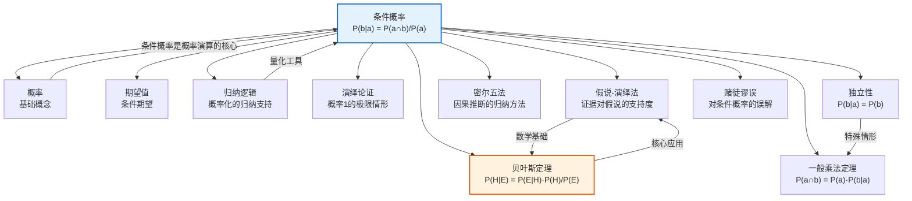

# 条件概率

> [!abstract] 概述
> ==条件概率==（conditional probability）是在已知一个事件发生的条件下，另一个事件发生的概率，是==概率演算==的核心概念。条件概率揭示了事件之间的概率依赖关系：当我们获得新的信息（某事件已经发生），我们对另一事件发生概率的估计应当相应更新。这一概念不仅是概率论的基础构件，更是==贝叶斯推理==、统计推断和科学假说检验的数学基石。条件概率的本质在于：概率不是事件的固有属性，而是==相对于已知信息==的函数——随着证据的积累，概率可以也应该被不断修正。

## 定义

> [!def] 条件概率（Conditional Probability）
> ==条件概率==是在已知事件 $a$ 发生的前提下，事件 $b$ 发生的概率，记作 $P(b \mid a)$，读作"在 $a$ 给定的条件下 $b$ 的概率"。
>
> **数学定义：**
> $$P(b \mid a) = \frac{P(a \cap b)}{P(a)}$$
>
> 其中：
> - $P(a \cap b)$ 是事件 $a$ 和事件 $b$ ==同时发生==的概率（联合概率）
> - $P(a)$ 是事件 $a$ 发生的概率（==边缘概率==）
> - 要求 $P(a) > 0$（条件事件必须有可能发生）

> [!tip] 条件概率的直觉理解
> 条件概率可以理解为==缩小样本空间==后的概率。当我们知道事件 $a$ 已经发生，我们实际上将所有可能的样本点限制在 $a$ 发生的范围内，然后在这个缩小的样本空间中计算 $b$ 发生的比例。
>
> 例如：从一副标准52张扑克牌中，已知抽到的是一张红色牌（$a$），求这张牌是红心A（$b$）的概率。样本空间从52张缩小到26张红色牌，其中红心A只有1张，因此 $P(\text{红心A} \mid \text{红色牌}) = 1/26$。

### 一般乘法定理

> [!def] 一般乘法定理（General Multiplication Theorem）
> 两个事件同时发生的概率等于其中一个事件的概率乘以在第一个事件发生的条件下另一个事件的条件概率：
> $$P(a \cap b) = P(a) \times P(b \mid a)$$
>
> 等价地：
> $$P(a \cap b) = P(b) \times P(a \mid b)$$
>
> **推广到多个事件：**
> $$P(a_1 \cap a_2 \cap \cdots \cap a_n) = P(a_1) \times P(a_2 \mid a_1) \times P(a_3 \mid a_1 \cap a_2) \times \cdots \times P(a_n \mid a_1 \cap \cdots \cap a_{n-1})$$

> [!info] 乘法定理的意义
> 一般乘法定理是计算==复合事件概率==的基本工具。它告诉我们：要计算多个事件同时发生的概率，可以逐步引入条件——先算第一个事件的概率，再算已知第一个事件发生后第二个事件的条件概率，以此类推。这一逐步"缩小样本空间"的思想，正是条件概率的核心力量。

### 独立性

> [!def] 统计独立性（Statistical Independence）
> 事件 $a$ 和事件 $b$ 是==统计独立==的，当且仅当：
> $$P(b \mid a) = P(b)$$
>
> 即：事件 $a$ 的发生==不影响==事件 $b$ 发生的概率。等价定义包括：
> - $P(a \mid b) = P(a)$
> - $P(a \cap b) = P(a) \times P(b)$
>
> **独立性意味着：** 知道 $a$ 发生与否，对预测 $b$ 是否发生==没有任何帮助==。两个事件之间不存在概率依赖关系。

> [!warning] 独立性不等于互斥
> 一个常见的严重混淆是将"独立"等同于"互斥"（mutually exclusive）。事实上：
> - 如果 $a$ 和 $b$ ==互斥==（不能同时发生），则 $P(a \cap b) = 0$，此时 $P(b \mid a) = 0 \neq P(b)$（除非 $P(b) = 0$），所以互斥事件==几乎总是不独立的==
> - 如果 $a$ 和 $b$ ==独立==，则 $P(a \cap b) = P(a) \times P(b) > 0$（只要两者概率都大于0），所以独立事件==可以同时发生==
> - 互斥意味着一个事件的发生==提供了关于另一个事件的完全信息==（另一个一定不发生），这恰恰是==最强的依赖关系==，而非独立

## 核心性质

| 性质 | 说明 |
|:-----|:-----|
| ==非对称性== | $P(b \mid a)$ 一般不等于 $P(a \mid b)$。知道"一个人是美国人"条件下"他是参议员"的概率，远不等于知道"一个人是参议员"条件下"他是美国人"的概率。混淆条件概率的方向是==常见的推理错误== |
| ==缩减样本空间== | 条件概率的本质是将样本空间限制在条件事件发生的范围内，在缩小的空间中重新计算概率 |
| ==独立性条件== | 当 $P(b \mid a) = P(b)$ 时，$a$ 和 $b$ 统计独立。独立性是对称的：$a$ 独立于 $b$ 当且仅当 $b$ 独立于 $a$ |
| ==贝叶斯定理的基础== | 条件概率公式直接导出贝叶斯定理 $P(H \mid E) = \frac{P(E \mid H) \cdot P(H)}{P(E)}$，是贝叶斯推理的数学基础 |
| ==概率的动态性== | 条件概率揭示了概率是==相对于已知信息==的——随着新证据的获取，概率应当被更新，这体现了概率的主观性和信息依赖性 |
| ==与因果推理的关系== | 条件概率 $\neq$ 因果关系。$P(b \mid a)$ 描述的是概率依赖，而非因果方向。因果推断需要额外的假设和方法（如密尔五法、随机对照试验） |

> [!warning] 常见误区
> 1. **混淆条件方向**：$P(\text{疾病} \mid \text{阳性}) \neq P(\text{阳性} \mid \text{疾病})$。前者是临床关心的（阳性时有多大可能真有病），后者是检测灵敏度的定义。==基础率谬误==（base rate fallacy）正是源于这种混淆
> 2. **混淆独立与互斥**：如上所述，互斥事件几乎总是不独立的
> 3. **混淆相关与因果**：条件概率只描述概率依赖关系，不蕴含因果方向

## 关系网络

- **[[逻辑学/concepts/概率]]**：条件概率是[[逻辑学/concepts/概率]]演算体系中的核心概念，建立在概率的基本公理之上。概率的公理体系（Kolmogorov 公理）将条件概率定义为联合概率与边缘概率的比值
- **[[逻辑学/concepts/期望值]]**：条件概率自然地引出==条件期望==（conditional expectation）的概念——在已知某些信息的条件下，随机变量的期望值如何变化
- **[[归纳逻辑]]**：条件概率为[[归纳逻辑]]提供了精确的量化框架。归纳强度可以表示为条件概率 $P(\text{结论} \mid \text{前提})$，贝叶斯定理则是归纳推理的核心计算工具
- **[[演绎论证]]**：当条件概率 $P(C \mid P_1 \cdot P_2 \cdot \ldots \cdot P_n) = 1$ 时，归纳论证达到了演绎论证的确定性极限。演绎可以被视为条件概率等于1的特殊情形
- **[[假说-演绎法]]**：条件概率是量化证据对假说支持程度的数学基础。$P(H \mid E)$ 表示在获得证据 $E$ 后假说 $H$ 的概率，这正是假说-演绎法中"确证"概念的精确化
- **[[密尔五法]]**：密尔五法是因果推断的归纳方法，而条件概率和贝叶斯定理为因果推断提供了概率论的替代框架。两者从不同角度处理"从观察中学习"的问题

## 章节扩展

### 第14章：概率演算中的条件概率

第14章将条件概率置于概率演算的完整框架中，展示了它在实际推理中的核心作用。

#### 抽牌不放回问题

> [!example] 连续抽牌的条件概率计算
> 从一副标准52张扑克牌中不放回地连续抽三张牌，求三张都是红心的概率。
>
> **逐步分析：**
> - 第一次抽到红心的概率：$P(\text{红心}_1) = \frac{13}{52} = \frac{1}{4}$
> - 已知第一次是红心，第二次也是红心的条件概率：$P(\text{红心}_2 \mid \text{红心}_1) = \frac{12}{51} = \frac{4}{17}$（剩下51张牌中有12张红心）
> - 已知前两次都是红心，第三次也是红心的条件概率：$P(\text{红心}_3 \mid \text{红心}_1 \cap \text{红心}_2) = \frac{11}{50}$（剩下50张牌中有11张红心）
>
> **应用一般乘法定理：**
> $$P(\text{三张红心}) = \frac{1}{4} \times \frac{4}{17} \times \frac{11}{50} = \frac{44}{3400} = \frac{11}{850} \approx 0.0129$$
>
> 即三张都是红心的概率约为1.29%。

> [!tip] 放回与不放回的本质区别
> - **放回抽样**：每次抽样条件相同，各次抽样之间==统计独立==，$P(b \mid a) = P(b)$
> - **不放回抽样**：每次抽样改变了样本空间的构成，各次抽样之间==统计不独立==，必须使用条件概率计算
> - 这一区别是条件概率非对称性和独立性概念的经典体现

#### 骨髓移植实例

> [!example] 医学中的条件概率推理
> 在骨髓移植的匹配过程中，条件概率扮演关键角色。假设：
> - 某种疾病的发病率 $P(\text{疾病}) = 0.001$
> - 检测方法的灵敏度 $P(\text{阳性} \mid \text{疾病}) = 0.99$
> - 检测方法的假阳性率 $P(\text{阳性} \mid \text{无疾病}) = 0.05$
>
> 一个人检测为阳性，他真正患病的概率是多少？
>
> $$P(\text{疾病} \mid \text{阳性}) = \frac{P(\text{阳性} \mid \text{疾病}) \times P(\text{疾病})}{P(\text{阳性})}$$
>
> 其中全概率：
> $$P(\text{阳性}) = P(\text{阳性} \mid \text{疾病}) \times P(\text{疾病}) + P(\text{阳性} \mid \text{无疾病}) \times P(\text{无疾病})$$
> $$= 0.99 \times 0.001 + 0.05 \times 0.999 = 0.00099 + 0.04995 = 0.05094$$
>
> 因此：
> $$P(\text{疾病} \mid \text{阳性}) = \frac{0.00099}{0.05094} \approx 0.0194$$
>
> 即检测为阳性时，真正患病的概率仅约==1.94%==——远低于直觉预期。这就是著名的==基础率谬误==，它揭示了条件概率方向的重要性。

## 补充

> [!info] 贝叶斯定理（Bayes' Theorem）
> **来源：** Bayes, T. (1763). *An Essay towards solving a Problem in the Doctrine of Chances*.
>
> ==贝叶斯定理==是条件概率最重要的推论，由英国牧师托马斯·贝叶斯（Thomas Bayes）提出：
>
> $$P(H \mid E) = \frac{P(E \mid H) \times P(H)}{P(E)}$$
>
> 其中：
> - $P(H \mid E)$ 是==后验概率==（posterior probability）：在获得证据 $E$ 后假说 $H$ 的概率
> - $P(E \mid H)$ 是==似然度==（likelihood）：如果假说 $H$ 为真，观察到证据 $E$ 的概率
> - $P(H)$ 是==先验概率==（prior probability）：在获得证据 $E$ 之前假说 $H$ 的概率
> - $P(E)$ 是==边缘概率==（marginal probability）：证据 $E$ 的总概率（对所有可能的假说求和）
>
> **使用全概率公式展开分母：**
> $$P(H \mid E) = \frac{P(E \mid H) \times P(H)}{P(E \mid H) \times P(H) + P(E \mid \neg H) \times P(\neg H)}$$
>
> 贝叶斯定理的深刻含义在于：它提供了一个==理性信念更新的数学规则==——当我们获得新证据时，应当如何从先验概率更新到后验概率。

> [!info] 贝叶斯更新（Bayesian Updating）
> 贝叶斯定理可以迭代应用，实现==序列化的信念更新==：
>
> $$P(H \mid E_1, E_2) = \frac{P(E_2 \mid H, E_1) \times P(H \mid E_1)}{P(E_2 \mid E_1)}$$
>
> 即：将第一次更新后的后验概率 $P(H \mid E_1)$ 作为新的先验概率，结合新证据 $E_2$ 再次更新。这一过程可以无限继续：
>
> $$\text{先验} \xrightarrow{+E_1} \text{后验}_1 \xrightarrow{+E_2} \text{后验}_2 \xrightarrow{+E_3} \cdots$$
>
> **贝叶斯更新的核心性质：**
> - 随着一致证据的积累，后验概率会==收敛==到真值（在理想条件下）
> - 先验概率的影响会随着证据增多而==逐渐减弱==
> - 如果证据强烈支持某个假说，即使先验概率很低，后验概率也可以变得很高
>
> 贝叶斯更新是当代==贝叶斯认识论==（Bayesian epistemology）的核心，为科学假说的确证、证据评估和理性决策提供了统一的数学框架。参见 [[归纳逻辑]]。

> [!info] 条件概率与因果推断
> **来源：** Pearl, J. (2009). *Causality: Models, Reasoning, and Inference*.
>
> 条件概率描述的是==概率依赖关系==，而非==因果关系==。这一区分至关重要：
>
> - $P(b \mid a)$ 可以很高，但 $a$ 不一定是 $b$ 的原因（可能是共同因、反向因果或纯粹巧合）
> - ==因果推断==需要额外的结构假设，如时序性（原因先于结果）、无混杂性（没有未被控制的混淆变量）等
> - 朱迪亚·珀尔（Judea Pearl）的==因果图模型==（causal graphical models）和==do-演算==（do-calculus）提供了从条件概率中识别因果关系的数学工具
>
> 在[[密尔五法]]的语境中，密尔方法试图通过系统的实验设计（如求异法的受控实验）来==消除混淆==，从而从条件概率关系中识别出真正的因果联系。

## 应用

条件概率在以下领域有广泛的应用：

- **医学诊断**：根据检测结果推断患病的概率（如上述骨髓移植实例），贝叶斯定理是诊断推理的核心工具
- **法律推理**：根据DNA证据、目击证词等评估被告有罪的概率，需要区分 $P(\text{证据} \mid \text{无罪})$ 和 $P(\text{无罪} \mid \text{证据})$
- **机器学习**：朴素贝叶斯分类器、隐马尔可夫模型、贝叶斯网络等算法的核心都是条件概率计算
- **金融风控**：在已知客户特征的条件下评估违约概率，信用评分模型的基础
- **自然语言处理**：语言模型中的 $P(\text{下一个词} \mid \text{前面的词})$ 是条件概率的经典应用
- **科学假说检验**：贝叶斯定理量化证据对假说的支持程度，是假说-演绎法的数学精确化

## 参见

- [[逻辑学/concepts/概率]] — 条件概率的基础概念，概率的定义与公理体系
- [[逻辑学/concepts/期望值]] — 条件期望的概念，条件概率在随机变量上的推广
- [[归纳逻辑]] — 条件概率为归纳推理提供量化框架，归纳强度可表示为条件概率
- [[演绎论证]] — 条件概率等于1时达到演绎的确定性极限
- [[假说-演绎法]] — 贝叶斯定理为假说-演绎法中的"确证"概念提供精确化
- [[密尔五法]] — 因果推断的归纳方法，与条件概率框架互补
- [[赌徒谬误]] — 对条件概率和独立性的常见误解
- [[休谟问题]] — 归纳推理合理性的哲学挑战，贝叶斯主义是主要回应方案之一
