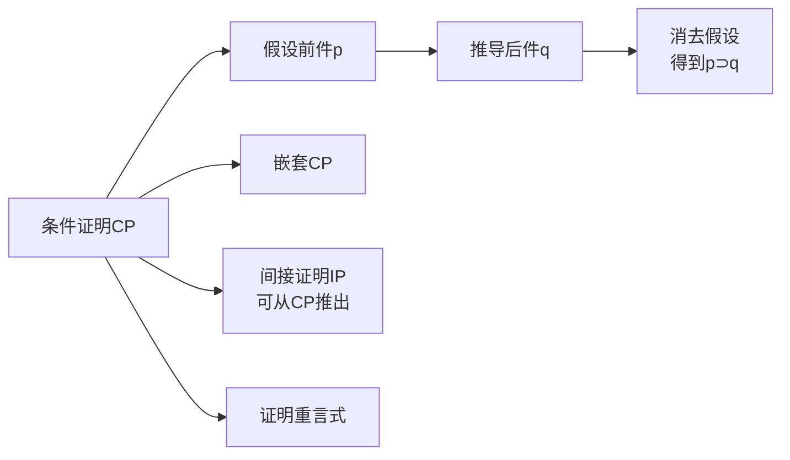

# 条件证明

> [!abstract] 概述
> **条件证明**（Conditional Proof, 简称CP）是一种强大的形式证明技术：要证明条件陈述 $p \supset q$，可以==假设前件 $p$，推导后件 $q$，然后消去假设==得到 $p \supset q$。CP不是一条简单的推论规则，而是一种==技术性方法==。它可以大幅缩短许多证明的长度，并且支持嵌套使用。CP的理论基础是演绎定理：论证 $P \therefore A \supset C$ 是有效的，当且仅当论证 $P, A \therefore C$ 是有效的。

## 定义

> [!def] 条件证明（CP）
> **条件证明**的规则：如果从假设的陈述 $p$（以及已有前提）以有穷步骤推断出陈述 $q$，那么就可以得到条件陈述 $p \supset q$。CP通过假设-推导-消去三个步骤完成。

## 核心性质

| 性质 | 描述 |
|:-----|:-----|
| **假设机制** | 引入结论条件陈述的前件作为临时假设 |
| **辖域限制** | 假设辖域内推导的陈述不能在辖域外使用 |
| **嵌套支持** | CP可以在另一个CP内部嵌套使用（双重/多重条件证明） |
| **证明重言式** | 在无前提前提下用CP可以证明条件式重言式 |
| **非条件结论** | 通过等价变换（如 $A \supset F \equiv \sim A \lor F$），CP也可用于非条件结论 |

## 关系网络

## 跨章节应用

### 第8章：命题逻辑Ⅰ
第8章建立了"论证有效 ⟺ 条件陈述为重言式"的对应关系（8.9节），这为CP的辩护提供了理论基础：CP实际上就是利用这一对应关系，将"证明论证有效"转化为"证明条件陈述为重言式"。

### 第9章：命题逻辑Ⅱ（核心章节）
- **9.11节**：系统介绍CP规则，包括辩护、步骤、嵌套CP、非条件结论应用、证明重言式
- CP可以将20行的证明缩短为10行
- 嵌套CP用于证明形如 $A \supset (B \supset D)$ 的多重条件陈述

### 第10章：谓词逻辑（预期）
第10章将CP扩展到谓词逻辑，用于处理涉及量词的条件证明（如全称泛化条件证明）。

## 参见

- [[自然演绎]] — CP所属的形式证明系统
- [[间接证明]] — IP/RAA，可从CP推导的证明技术
- [[推论规则]] — 19条基本推论规则
- [[有效性]] — CP用于证明论证的有效性
- [[实质蕴涵]] — CP证明的是实质蕴涵陈述
- [[重言式与矛盾式]] — CP可用于证明重言式
- [[条件证明-vs-间接证明]] — CP与IP的对比分析
