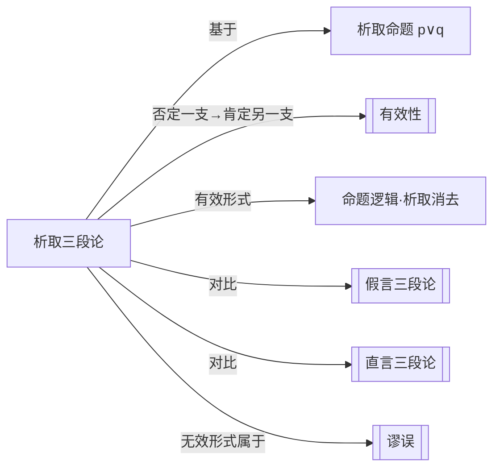

# 析取三段论

> [!abstract] 概述
> 析取三段论是基于析取命题（$p \lor q$）的有效推理形式：否定其中一支，则可推出另一支为真。

## 定义

> [!def] 析取三段论（Disjunctive Syllogism）
> 一种基于==析取命题==（disjunctive proposition）的演绎推理。析取命题断言至少有一个支命题为真，形式为 $p \lor q$。析取三段论的核心机制是：==否定一支，则肯定另一支==。

## 核心性质

| 性质 | 陈述 |
| --- | --- |
| 基本形式 | $p \lor q, \neg p, \therefore q$（否定一支 $\to$ 肯定另一支） |
| 有效形式 | 否定析取中的一支，推出另一支为真——这是==有效==的推理 |
| 无效形式 | 肯定析取中的一支，推出另一支为假——这是==无效==的推理 |
| 有效性根源 | 析取命题 $p \lor q$ 的含义是"至少一支为真"，因此当一支被否定时，另一支必须为真 |

### 有效形式

$$p \lor q$$
$$\neg p$$
$$\therefore q$$

> [!example] 有效推理示例
> - 前提1：这本书是中文的或英文的。（$p \lor q$）
> - 前提2：这本书不是中文的。（$\neg p$）
> - 结论：这本书是英文的。（$\therefore q$）

### 无效形式：肯定一支否定另一支

$$p \lor q$$
$$p$$
$$\therefore \neg q$$

> [!warning] 为什么无效？
> 在==相容析取==（inclusive disjunction）中，$p$ 和 $q$ 可以同时为真。因此，已知 $p$ 为真，并不能推出 $q$ 为假——$q$ 完全可能也为真。

> [!example] 无效推理示例
> - 前提1：张三会弹钢琴或会拉小提琴。（$p \lor q$）
> - 前提2：张三会弹钢琴。（$p$）
> - 结论：张三不会拉小提琴。（$\therefore \neg q$）——==无效==，因为张三可能两样都会。

## 相容析取与不相容析取

日常语言中的"或"存在歧义，需要区分两种析取：

| 类型 | 含义 | 符号 | 否定一支能否推出另一支？ |
| --- | --- | --- | --- |
| ==相容析取==（inclusive） | 至少一支为真（可同真） | $\lor$ | ==能== |
| 不相容析取（exclusive） | 恰好一支为真（不可同真） | $\underline{\lor}$ | 能；肯定一支也能否定另一支 |

> [!info] 日常语言中的"或"
> 在日常语言中，"或"通常是==相容==的。例如"你可以喝茶或咖啡"，通常并不排除两者都喝的可能。但在某些语境中（如菜单上"套餐A或套餐B"），"或"可能取不相容含义。判断时需要依赖==语境==而非语法形式。

> [!tip] 析取三段论的有效性仅依赖于相容析取
> 析取三段论的有效性并不依赖于析取是否为不相容的。即使在相容析取中，否定一支也足以保证另一支为真。因此，析取三段论是最"安全"的析取推理形式。

## 与其他概念的关系



## 与第8章命题逻辑的关系

析取三段论是==命题逻辑==中==析取消去规则==（Disjunctive Elimination, $\lor E$）的自然语言表达。在命题逻辑的形式系统中，析取三段论可以表示为：

$$\frac{p \lor q \quad \neg p}{q}$$

这一规则在第8章中将作为命题逻辑自然演绎系统的基本推理规则之一出现，与[[假言三段论]]中的分离式（Modus Ponens）和否定后件式（Modus Tollens）并列为核心推理规则。

## 应用

- **日常论证**：在排除法推理中广泛应用。例如，已知嫌疑人在A地或B地，且不在A地，则必然在B地。
- **数学证明**：分情形讨论（case analysis）中，先列出所有可能的情形（析取），再逐一排除不可能的情形，最终确定唯一成立的情形。
- **法律推理**：在排除合理怀疑的论证中，检察官通过排除所有其他可能性来确立被告有罪的结论。

## 命题逻辑形式化（第8章扩展）

> [!info] 符号化与真值表验证
> 第8章将析取三段论用符号逻辑精确表述：
> - ==析取三段论(Disjunctive Syllogism)==：$p \lor q,\; \sim p,\; \therefore q$
>
> 用[[真值表]]验证：当p∨q=T且～p=T（即p=F,q=T）时，结论q=T。不存在前提全T结论F的行→有效。
>
> 注意：肯定一支→否定另一支（$p \lor q,\; p,\; \therefore \sim q$）是==无效的==，因为相容析取允许两支同真。

### 第9章：作为推论规则DS

第9章将析取三段论正式纳入自然演绎系统，作为第4条基本推论规则==析取三段论（D.S.）==。

- **规则形式**：$p \lor q,\; \sim p,\; \therefore q$
- **缩写**：D.S.（Disjunctive Syllogism）
- **应用**：只能应用于==整行==陈述，不能应用于子表达式
- **与爆炸原理的关系**：DS是爆炸原理证明中的关键步骤——从不相容前提推出任意结论时，需要通过附加律和DS来完成

> [!example] 形式证明示例
> ```
> 1. A ∨ E        前提
> 2. ～A          7, 4, M.T.
> 3. E            1, 2, D.S.
> ```
> 第3行通过DS从第1行和第2行推出结论E（参见[[推论规则]]、[[自然演绎]]）。

## 参见

- [[假言三段论]]：基于条件命题的三段论
- [[直言三段论]]：基于直言命题的三段论
- [[有效性]]：演绎论证的核心评估标准
- [[谬误]]：推理中的典型错误模式
