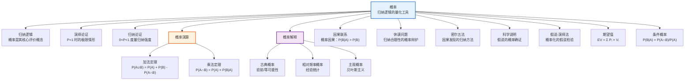

# 概率

> [!abstract] 概述
> ==概率==（probability）是归纳逻辑的核心评价性概念，为归纳论证的强度提供了==量化度量==。皮尔斯（C.S. Peirce）曾指出："概率理论就是定量地研究逻辑的科学。"与演绎论证追求结论的必然性（确定性）不同，归纳论证的结论只具有概然性（probability），而概率正是刻画这种概然性的精确工具。在逻辑学的框架中，概率连接了[[演绎论证]]与[[归纳论证]]——当概率达到 1 时，归纳强度达到演绎确定性的极限；当概率介于 0 与 1 之间时，它度量了归纳论证的==支持程度==。概率理论是第14章的核心主题，也是整个归纳逻辑体系的量化基础。

## 定义

> [!def] 概率（Probability）
> ==概率==是一个介于 0 和 1 之间的数值，用于度量某个事件发生的可能性或某个命题为真的程度。概率为 0 表示事件不可能发生（或命题必然为假），概率为 1 表示事件必然发生（或命题必然为真），概率介于 0 和 1 之间表示事件可能发生但不确定。

### 验前解释（古典理论）

> [!def] 古典概率（Classical / A Priori Probability）
> ==古典概率==（又称验前概率、先验概率）基于==等可能性==假设，将概率定义为：
>
> $$P(A) = \frac{\text{事件 } A \text{ 的有利结果数}}{\text{等可能结果总数}}$$
>
> **适用条件：** 所有基本结果必须是==互斥的==（mutually exclusive）且==等可能的==（equally probable）。

**示例：** 掷一枚公平的骰子，出现偶数的概率为：
$$P(\text{偶数}) = \frac{3}{6} = \frac{1}{2}$$
因为偶数结果（2, 4, 6）有 3 个，总结果数（1, 2, 3, 4, 5, 6）有 6 个，且每个结果等可能。

> [!warning] 古典概率的局限
> 古典概率的==等可能性假设==本身无法通过古典概率来证明——它依赖于对称性或无差别原则（principle of indifference），而这在某些情况下会导致悖论（如贝特朗悖论）。当"等可能"假设不成立时（如骰子不均匀），古典概率就不再适用。

### 相对频率解释

> [!def] 相对频率概率（Relative Frequency Probability）
> ==相对频率概率==基于==经验统计==，将概率定义为事件在长期重复试验中出现的频率极限：
>
> $$P(A) = \frac{\text{具有属性 } A \text{ 的成员数}}{\text{参照类成员总数}} = \lim_{n \to \infty} \frac{n_A}{n}$$
>
> 其中 $n_A$ 是事件 $A$ 发生的次数，$n$ 是试验总次数。

**示例：** 某城市过去 10 年中记录了 3650 天的天气数据，其中 1095 天下雨，则该城市某天下雨的相对频率概率为：
$$P(\text{下雨}) = \frac{1095}{3650} = 0.3$$

> [!info] 两种解释的对比
> | 维度 | 古典概率 | 相对频率概率 |
> |:-----|:---------|:-------------|
> | **基础** | 等可能性假设（先验的） | 经验数据（后验的） |
> | **计算方式** | 有利结果 / 总结果 | 频率统计 |
> | **适用范围** | 对称情境（骰子、扑克等） | 统计情境（气象、医学等） |
> | **代表人物** | 拉普拉斯、帕斯卡、费马 | 冯·米塞斯、赖兴巴赫 |
> | **局限** | 等可能假设难以证明 | 需要大量数据，无法处理单次事件 |

### 概率公理（Kolmogorov 公理体系）

> [!def] 概率公理（Kolmogorov Axioms, 1933）
> Andrey Kolmogorov 在《概率论基础论》（*Grundbegriffe der Wahrscheinlichkeitsrechnung*, 1933）中建立了概率的公理体系，为概率论提供了严格的数学基础。三条公理如下：
>
> 1. **非负性公理**：对于任何事件 $A$，$0 \leq P(A) \leq 1$
> 2. **规范性公理**：$P(\Omega) = 1$，其中 $\Omega$ 是==必然事件==（样本空间）
> 3. **可加性公理**：对于==互斥==（mutually exclusive）事件 $A$ 和 $B$：
>    $$P(A \cup B) = P(A) + P(B)$$
>    推广到可数多个互斥事件：$P\left(\bigcup_{i=1}^{\infty} A_i\right) = \sum_{i=1}^{\infty} P(A_i)$

> [!tip] 公理体系的地位
> Kolmogorov 公理体系是概率论的==数学基础==，但它本身不回答"概率是什么"的哲学问题——古典解释、频率解释和主观解释都可以在这套公理体系下运作。公理体系规定了概率必须满足的形式约束，但不同解释对这些约束给出了不同的哲学解读。

## 核心性质

| 性质 | 说明 |
|:-----|:-----|
| ==概率相对于证据== | 概率不是事件本身的固有属性，而是==相对于给定证据==的——同一事件在不同证据下可以有不同的概率值 |
| ==概率在 0 到 1 之间== | 由非负性公理和规范性公理保证：$0 \leq P(A) \leq 1$ |
| ==演绎确定性 vs 归纳概然性== | 演绎论证中结论的概率为 1（$P = 1$，确定性），归纳论证中结论的概率介于 0 和 1 之间（$0 < P < 1$，概然性） |
| ==验前理论 vs 相对频率理论== | 古典理论基于先验的等可能性假设，适用于对称情境；频率理论基于后验的经验统计，适用于统计情境 |
| ==互补事件== | 事件 $A$ 不发生的概率为 $P(\neg A) = 1 - P(A)$ |
| ==概率的单调性== | 若 $A \subseteq B$（$A$ 蕴涵 $B$），则 $P(A) \leq P(B)$ |

> [!warning] 常见误区
> - ==概率不是事件的固有属性==：说"明天下雨的概率是 30%"是相对于当前气象数据的，如果获得新的数据（如卫星云图），这个概率值会改变
> - ==概率为 0 不等于不可能==：在连续概率空间中，概率为 0 的事件仍有可能发生（如指针恰好指向某个精确点）
> - ==高概率不等于确定性==：即使 $P(A) = 0.999$，事件 $A$ 仍然可能不发生——这正是归纳论证与演绎论证的根本区别

## 关系网络

- **[[归纳逻辑]]**：概率是归纳逻辑的==核心评价工具==，为归纳论证的强度提供量化度量
- **[[演绎论证]]**：演绎论证中，前提为真时结论的概率为 1——演绎是概率的极限情形
- **[[归纳论证]]**：归纳论证中，前提为真时结论的概率介于 0 和 1 之间，概率越高论证越强
- **[[因果联系]]**：概率因果定义：$P(B|A) > P(B)$ 时 $A$ 是 $B$ 的原因
- **[[休谟问题]]**：概率理论（尤其是贝叶斯主义）为归纳合理性提供了可能的辩护路径
- **[[密尔五法]]**：密尔五法通过受控比较发现因果联系，其结论具有概率性而非确定性
- **[[科学说明]]**：科学假说的确证程度可以用概率来度量
- **[[假说-演绎法]]**：假说-演绎法中，证据对假说的支持度可以用贝叶斯概率计算
- **[[逻辑学/concepts/期望值]]**：期望值是概率与价值的乘积之和，是决策理论的核心概念
- **[[逻辑学/concepts/条件概率]]**：条件概率 $P(B|A)$ 是概率演算的核心工具，也是贝叶斯定理的基础

## 章节扩展

### 第14章：概率理论

第14章系统阐述了概率理论，为整个归纳逻辑体系提供量化基础。

#### 概率的两种解释

第14章详细讨论了概率的两种主要解释：

1. **验前解释（古典理论）**：基于等可能性假设，适用于具有对称性的情境（如掷骰子、抽牌）。概率等于有利结果数除以等可能结果总数。

2. **相对频率解释**：基于经验统计，适用于可以通过重复观察获得数据的情境。概率等于事件发生的次数除以观察总次数（在观察次数趋于无穷时的极限）。

> [!info] 两种解释的互补性
> 两种解释并非互相排斥，而是==互补的==。古典理论适用于理论分析（如计算公平赌博的概率），频率理论适用于经验研究（如计算疾病发病率）。在实际应用中，我们经常需要结合两种解释：先用古典理论建立理论模型，再用频率数据来检验和校准模型。

#### 概率演算基本定理

> [!def] 概率演算（Probability Calculus）
> ==概率演算==是基于 Kolmogorov 公理体系推导出的概率计算规则，核心包括==加法定理==和==乘法定理==。

**加法定理（General Addition Rule）：**

对于任意两个事件 $A$ 和 $B$（不要求互斥）：
$$P(A \cup B) = P(A) + P(B) - P(A \cap B)$$

- 当 $A$ 和 $B$ ==互斥==时，$P(A \cap B) = 0$，公式简化为 $P(A \cup B) = P(A) + P(B)$
- 推广到一般情形：$P(A \cup B)$ 不能超过 1，因此当 $P(A) + P(B) > 1$ 时，必须减去重叠部分 $P(A \cap B)$

**示例：** 从一副标准扑克牌中随机抽取一张，抽到红心或国王的概率为：
$$P(\text{红心} \cup \text{国王}) = P(\text{红心}) + P(\text{国王}) - P(\text{红心且国王}) = \frac{13}{52} + \frac{4}{52} - \frac{1}{52} = \frac{16}{52} = \frac{4}{13}$$

**乘法定理（General Multiplication Rule）：**

对于任意两个事件 $A$ 和 $B$：
$$P(A \cap B) = P(A) \times P(B \mid A)$$

其中 $P(B \mid A)$ 是==条件概率==——在事件 $A$ 发生的条件下事件 $B$ 发生的概率。

- 当 $A$ 和 $B$ ==独立==时，$P(B \mid A) = P(B)$，公式简化为 $P(A \cap B) = P(A) \times P(B)$

**示例：** 连续掷两次骰子，两次都出现 6 的概率为（假设两次掷骰子独立）：
$$P(\text{两个6}) = P(\text{第一个6}) \times P(\text{第二个6}) = \frac{1}{6} \times \frac{1}{6} = \frac{1}{36}$$

> [!tip] 加法定理与乘法定理的关系
> 加法定理处理的是"==或=="关系（$A$ 或 $B$ 至少一个发生），乘法定理处理的是"==且=="关系（$A$ 和 $B$ 同时发生）。两者共同构成了概率演算的基础，可以组合使用来计算复杂事件的概率。参见 [[逻辑学/concepts/条件概率]]。

## 补充

> [!info] 主观概率与贝叶斯主义
> **来源：** de Finetti (1937), Savage (1954), Jeffrey (1965)
>
> 除了古典解释和频率解释外，还有一种重要的概率解释——==主观概率==（subjective probability），又称==认知概率==（epistemic probability）或==信念度==（degree of belief）。
>
> - **核心思想**：概率反映的是==个人在给定证据下对某个命题的确信程度==，而非事件本身的客观属性
> - **贝叶斯定理**是主观主义学派的核心工具：
>   $$P(H \mid E) = \frac{P(E \mid H) \cdot P(H)}{P(E)}$$
>   其中 $P(H)$ 是先验概率（prior probability），$P(H \mid E)$ 是后验概率（posterior probability），$P(E \mid H)$ 是似然性（likelihood）
> - **贝叶斯更新**：当获得新证据 $E$ 时，通过贝叶斯定理将先验概率 $P(H)$ 更新为后验概率 $P(H \mid E)$，实现==信念的理性修正==
>
> 贝叶斯主义在当代归纳逻辑和科学哲学中占据主导地位，它为[[假说-演绎法]]中的假说确证问题提供了精确的量化框架。

> [!info] 概率解释的统一趋势
> **来源：** Copi, *Introduction to Logic*, Ch.14
>
> 虽然古典解释、频率解释和主观解释在哲学上存在分歧，但在实际应用中，三种解释往往==相互补充==而非相互排斥：
>
> 1. **古典概率**适用于理论建模和对称情境中的先验计算
> 2. **频率概率**适用于经验数据的统计分析和预测
> 3. **主观概率**适用于单次事件的判断和决策（如"明天是否下雨"）
>
> Kolmogorov 公理体系为三种解释提供了==统一的数学框架==——无论采用哪种解释，概率计算都必须遵循同一套公理和定理。这种"数学统一、哲学多元"的局面是当代概率哲学的基本特征。

## 应用

概率理论在以下领域有广泛的应用：

- **科学研究**：统计推断、假设检验、置信区间——量化实验数据对科学假说的支持程度
- **因果推理**：通过概率因果定义 $P(B|A) > P(B)$ 来识别因果联系，为[[密尔五法]]提供数学基础
- **决策理论**：结合概率与价值计算==期望值==，指导理性决策。参见 [[逻辑学/concepts/期望值]]
- **风险评估**：保险精算、金融风险管理、工程安全评估
- **人工智能**：概率图模型、贝叶斯网络、机器学习中的概率分类
- **法律推理**：评估证据的概率力度，如"排除合理怀疑"标准的概率解读
- **医学诊断**：根据症状和检查结果计算疾病的后验概率（贝叶斯诊断）

## 参见

- [[归纳逻辑]] — 概率是归纳逻辑的核心评价工具
- [[归纳论证]] — 概率度量归纳论证的强度
- [[演绎论证]] — 演绎确定性是概率为 1 的极限情形
- [[因果联系]] — 概率因果：$P(B|A) > P(B)$
- [[休谟问题]] — 归纳合理性的哲学挑战与概率辩护
- [[密尔五法]] — 因果发现的归纳方法，其结论具有概率性
- [[科学说明]] — 科学假说的概率确证
- [[假说-演绎法]] — 概率化的假说检验方法
- [[逻辑学/concepts/期望值]] — 概率与价值的乘积之和，决策理论的核心概念
- [[逻辑学/concepts/条件概率]] — $P(B|A)$，概率演算和贝叶斯定理的基础
