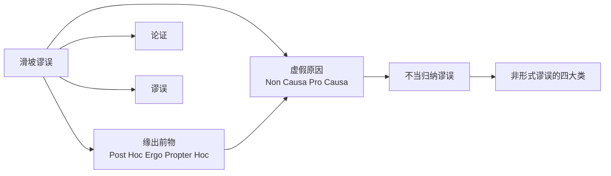

# 滑坡谬误

> [!abstract] 概述
> 滑坡谬误是==虚假原因==（Non Causa Pro Causa）的子类型，声称某一步骤将不可避免地引发灾难性连锁反应，但实际上==每一步因果联系的必然性并未得到充分论证==。

## 定义

> [!def] 滑坡谬误（Slippery Slope）
> 滑坡谬误是虚假原因的一种特殊形式。论证者声称某一步骤（通常是一个较小的变化）将不可避免地引发一系列连锁反应，最终导致灾难性后果，但实际上这一连锁反应的==必然性并未得到充分论证==。

**核心错误：** 滑坡论证假设每一步变化都会不可避免地导致下一步变化，但实际上每一步之间可能存在"断裂点"——社会、制度或个人可以在某个环节做出不同的选择，从而阻止连锁反应的继续。

**核心形式：**
```
如果允许 A，就会导致 B；
B 会导致 C；
C 会导致 D；
……
最终导致灾难 Z。
所以，不能允许 A。
```

## 核心性质

| 性质 | 说明 |
|:-----|:-----|
| 所属类别 | 不当归纳谬误（D3 虚假原因的子类型） |
| 错误本质 | 未经论证就断言连锁反应的必然性 |
| 与缘出前物的关系 | 缘出前物是单步因果错误，滑坡谬误是多步连锁因果错误 |
| 合理情形 | 先例确实影响后续决策时，滑坡论证有时有价值 |

## 与其他概念的关系



- **[[非形式谬误的四大类|虚假原因]]**（Non Causa Pro Causa）：滑坡谬误是虚假原因的子类型。虚假原因的另一个子类型是==缘出前物==（Post Hoc Ergo Propter Hoc）——仅仅因为事件 B 发生在事件 A 之后，就认为 A 是 B 的原因
- **[[非形式谬误的四大类|缘出前物]]**：滑坡谬误可以看作缘出前物的"多步扩展版"——缘出前物是单步因果错误（A 之后发生 B，所以 A 导致 B），滑坡谬误是多步连锁因果错误（A → B → C → ... → 灾难）
- **[[非形式谬误的四大类|不当归纳谬误]]**：滑坡谬误属于不当归纳谬误（D3），前提（"第一步会导致后续连锁反应"）对结论的支持过于薄弱

## 补充

> [!info] 休谟因果关系分析与滑坡谬误
> **来源：** Hume, D. (1748). *An Enquiry Concerning Human Understanding*, Section IV-VII
>
> 休谟对因果关系的经典分析是理解滑坡谬误的哲学基础。休谟提出：==我们从未直接"观察"到因果关系==，我们观察到的只是事件的**恒常连接**（constant conjunction）——事件 A 总是伴随事件 B 出现。
>
> 休谟的分析揭示了滑坡谬误的深层根源：
>
> 1. **我们无法仅凭观察区分"真正的因果"和"偶然的前后相继"**：滑坡论证中的每一步因果联系可能只是论证者的直觉联想，而非真正的因果机制
> 2. **因果推理的本质是心理习惯**：我们的大脑天生倾向于在前后相继的事件之间建立因果联系，即使这种联系并不存在。滑坡谬误==利用了这一心理倾向==，将一系列可能完全无关的事件串联成一条"必然"的因果链
>
> 休谟的分析提醒我们：==建立因果关系需要超越纯粹的时间连续性，需要考察因果机制、控制变量、排除替代解释==——这正是滑坡论证所缺乏的。

> [!warning] 关键区分：合理的先例论证 vs 不合理的滑坡
> 并非所有滑坡论证都是谬误。区分合理与不合理的关键在于：
>
> - **合理的先例论证**：论证者能够为连锁反应中的==每一步==提供充分的因果证据支持。例如，"如果我们允许政府未经授权监控公民通信，政府就可能扩大监控范围，最终可能导致全面的社会监控"——这个滑坡论证有历史案例支持（如20世纪的极权政权），因此不一定是谬误
> - **不合理的滑坡论证**：论证者==仅凭想象==断言连锁反应的必然性，没有为每一步提供因果证据。例如，"如果我们允许学校教授性教育，学生就会对性变得随便；学生变得随便，就会导致更多的青少年怀孕；青少年怀孕增多，就会导致社会道德沦丧"——每一步之间的因果联系都未得到论证
>
> ==滑坡论证的谬误不在于"预测连锁反应"本身，而在于未经论证就断言连锁反应的必然性==。

> [!tip] 识别滑坡谬误的技巧
> 遇到滑坡论证时，逐一追问连锁反应中的==每一个环节==：
> 1. 从 A 到 B 真的有必然的因果联系吗？有什么证据？
> 2. 从 B 到 C 呢？是否存在"断裂点"——在某个环节可以做出不同选择？
> 3. 最终的灾难性后果 Z 真的不可避免吗？
>
> 如果任何一个环节的因果联系缺乏证据支持，整个滑坡论证就不可靠。

## 应用

1. **政策辩论**：在公共政策讨论中，滑坡论证极为常见。识别滑坡谬误有助于区分合理的政策担忧和不合理的恐惧炒作
2. **法律先例分析**：法律领域中的先例论证与滑坡论证密切相关——先例确实会影响后续判决，但需要区分合理的先例推理和不合理的滑坡
3. **日常批判性思维**：当有人以"如果做了X，就会导致Y，最终引发灾难"来反对某项提议时，逐一检查因果链中每个环节的证据支持

## 参见

- [[4.4 不当归纳谬误]] — 滑坡谬误的详细章节笔记
- [[非形式谬误的四大类]] — 谬误分类体系总览
- [[论证]] — 论证的结构与评估
- [[谬误]] — 谬误的基本概念
