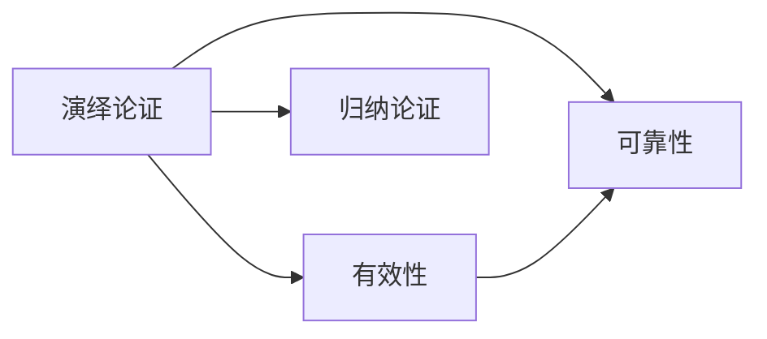

# 演绎论证

> [!abstract] 概述
> 演绎论证断言其前提==必然地==支持结论——如果前提为真，结论不可能为假。演绎逻辑的任务就是区分有效演绎论证和无效演绎论证。

## 定义

> [!def] 演绎论证（Deductive Argument）
> 任一演绎论证均断言其前提决定性地支持结论；它断言如果其前提都是真的，其结论一定是真的。

**核心特征：** 结论被==必然地==包含在前提之中——论证只是将前提中隐含的信息显性化。

## 核心性质

| 性质 | 演绎论证 | 归纳论证 |
|:-----|:---------|:---------|
| 断言 | 前提**必然**支持结论 | 前提**或然**支持结论 |
| 评估标准 | 有效 / 无效 | 强 / 弱 |
| 附加信息 | ==不受影响== | 可强化或弱化 |
| 结论 | 必然得出 | 永远不能完全确定 |
| 适用范围 | 数学、逻辑、法律 | 科学、日常推理 |

## 附加信息不影响——关键特征

演绎论证一旦有效，无论增加什么附加前提，都不会改变其有效性：

```
前提1：凡人终有一死
前提2：苏格拉底是人
附加前提：苏格拉底长得很丑  ← 不影响任何东西
结论：苏格拉底终有一死  ← 仍然必然推出
```

这是演绎论证与归纳论证最本质的区别。

## 与其他概念的关系



- **[[有效性]]**：演绎论证的专属评估标准
- **[[可靠性]]**：有效 + 前提全真
- **[[归纳论证]]**：与演绎构成推理的两大类型

## 应用

1. **数学证明**：从公理出发，演绎推出定理
2. **法律推理**：从法律条文和事实出发推出判决
3. **计算机科学**：程序验证、类型系统

### 第11章：演绎与归纳的根本区别

第11章从归纳逻辑的视角重新审视了演绎论证的本质：

- **确定性 vs 概率性**：演绎论证的结论是==确定的==（前提真→结论必真），而归纳论证的结论只有==概率性==
- **评价术语不同**：演绎论证用"有效/无效"评价，归纳论证用"强/弱"评价
- **信息流向不同**：演绎论证的结论不超出前提信息，归纳论证的结论==超出==前提信息
- **两类论证不可混淆**：不能用"有效/无效"评价归纳论证，也不能用"强/弱"评价演绎论证

参见 [[类比推理]]、[[归纳逻辑]]。

### 第12章：演绎推理在因果分析中的角色

第12章从因果推理视角补充了演绎论证的定位：

- 密尔五法中的==剩余法==本质上使用了演绎推理（$ABC \to abc, A \to a, B \to b \therefore C \to c$）
- 必要条件和充分条件的分析依赖演绎逻辑（$\sim A \supset \sim B$ 是演绎有效式）
- 因果推理整体上是归纳性的，但其中嵌套了演绎步骤

参见 [[密尔五法]]、[[必要条件与充分条件]]。

### 第13章：间接检验中的演绎推理

第13章揭示了演绎推理在科学检验中的关键角色：

- ==间接检验==从假说演绎出可直接检验的命题：$H \wedge A \vdash O$
- 假说-演绎法的演绎环节保证了逻辑严密性
- 如果演绎出的命题为假，原假说很可能为假（否定后件式）

参见 [[科学说明]]、[[假说-演绎法]]。

### 第14章：演绎确定性与归纳概然性

第14章从概率视角明确了演绎论证与归纳论证的根本区别：

- 演绎论证具有==确定性==（有效论证中前提为真则结论必真，概率=1）
- 归纳论证具有==概然性==（即使前提为真，结论也只是可能为真，0<P<1）
- 概率演算为归纳强度提供了量化度量

参见 [[逻辑学/concepts/概率]]、[[逻辑学/concepts/条件概率]]。

## 参见

- [[1.5 演绎论证与归纳论证]] — 演绎与归纳的详细对比
- [[有效性]] — 演绎论证的评估标准
- [[演绎论证-vs-归纳论证]] — 两种推理类型的对比
- [[可靠性]] — 有效演绎论证的终极质量标准
