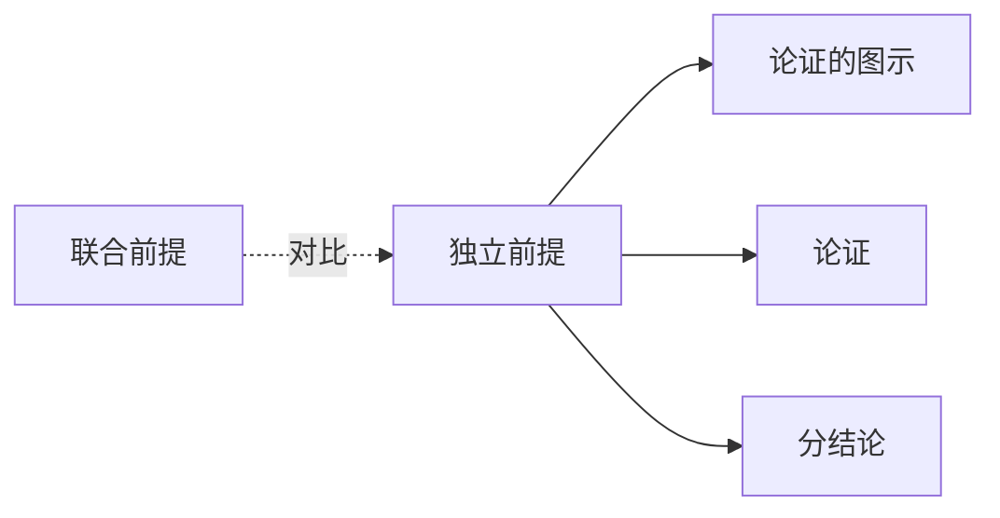

# 独立前提

> [!abstract] 概述
> 独立前提是指每个前提独立地为结论提供支持的论证结构——去掉任何一个前提，其余前提仍然能够支持结论，论证的支持力不会因此丧失。

## 定义

> [!def] 独立前提（Independent Premises）
> 在一个论证中，如果多个前提各自独立地为结论提供支持，去掉其中任何一个不影响其余前提对结论的支持力，则这些前提称为==独立前提==。

## 判断标准：去掉测试

> [!tip] 去掉测试（The Drop Test）
> 判断前提是否为独立前提的核心方法是"去掉测试"：
>
> **去掉前提 P 后，其余前提是否仍然支持结论？**
> - 如果==仍然支持== → P 是独立前提
> - 如果==不再支持==（或支持力严重削弱） → P 是联合前提的一部分

### 去掉测试示例

**论证：**
> (1) 这家餐厅的菜品很美味。
> (2) 这家餐厅的价格很实惠。
> (3) 这家餐厅的服务很周到。
> ∴ 这家餐厅值得一去。

**去掉测试：**
- 去掉 (1)：(2) + (3) 仍然支持结论 → (1) 是独立前提
- 去掉 (2)：(1) + (3) 仍然支持结论 → (2) 是独立前提
- 去掉 (3)：(1) + (2) 仍然支持结论 → (3) 是独立前提

结论：(1)(2)(3) 均为独立前提。

## 图示方式

独立前提在图示中表现为多条箭头分别从各前提指向结论，==不使用括号==归组：

```
(1) ──────┐
          ├──→ (4)
(2) ──────┤
          │
(3) ──────┘
```

## 独立前提 vs 联合前提

| 维度 | 独立前提 | 联合前提 |
|:-----|:-----|:-----|
| **定义** | 每个前提独立地为结论提供支持 | 多个前提必须共同作用才能支持结论 |
| **判断标准** | 去掉测试：去掉一个后其余仍支持结论 | 去掉测试：去掉一个后其余不再支持结论 |
| **图示方式** | 多条箭头分别指向结论（无括号） | 括号归组，一条箭头指向结论 |
| **去掉一个的后果** | 其余前提的支持力不受影响 | 整个论证的支持力丧失或严重削弱 |
| **论证类型** | 收敛论证（convergent argument） | 串联论证（linked argument） |

## 与其他概念的关系



- **[[论证的图示]]**：图示法是区分独立前提与联合前提的主要工具，通过箭头和括号的差异直观展示
- **[[论证]]**：独立前提是论证结构的一种基本类型
- **[[分结论]]**：分结论可以拥有自己的独立前提，形成复杂的推理网络

## 补充

> [!info] Walton 对收敛论证的系统论述
> **来源：** Walton, D. (2006). *Fundamentals of Critical Argumentation*
>
> Walton 对收敛论证（即由独立前提构成的论证）进行了系统论述，指出：
> 1. 收敛论证的每个前提都提供独立的推理路径通向结论
> 2. 在评估收敛论证时，应当分别评估每条推理路径的强度
> 3. 即使某条路径较弱，其他路径仍然可以支持结论
> 4. 收敛论证具有"冗余性"优势——多条独立路径增强了论证的整体稳健性

## 参见

- [[2.2 论证的图示]] — 图示方法中独立前提的表示
- [[论证]] — 独立前提所属的论证结构
- [[分结论]] — 可以拥有独立前提的中间命题
- [[独立前提-vs-联合前提]] — 两种前提类型的详细对比
