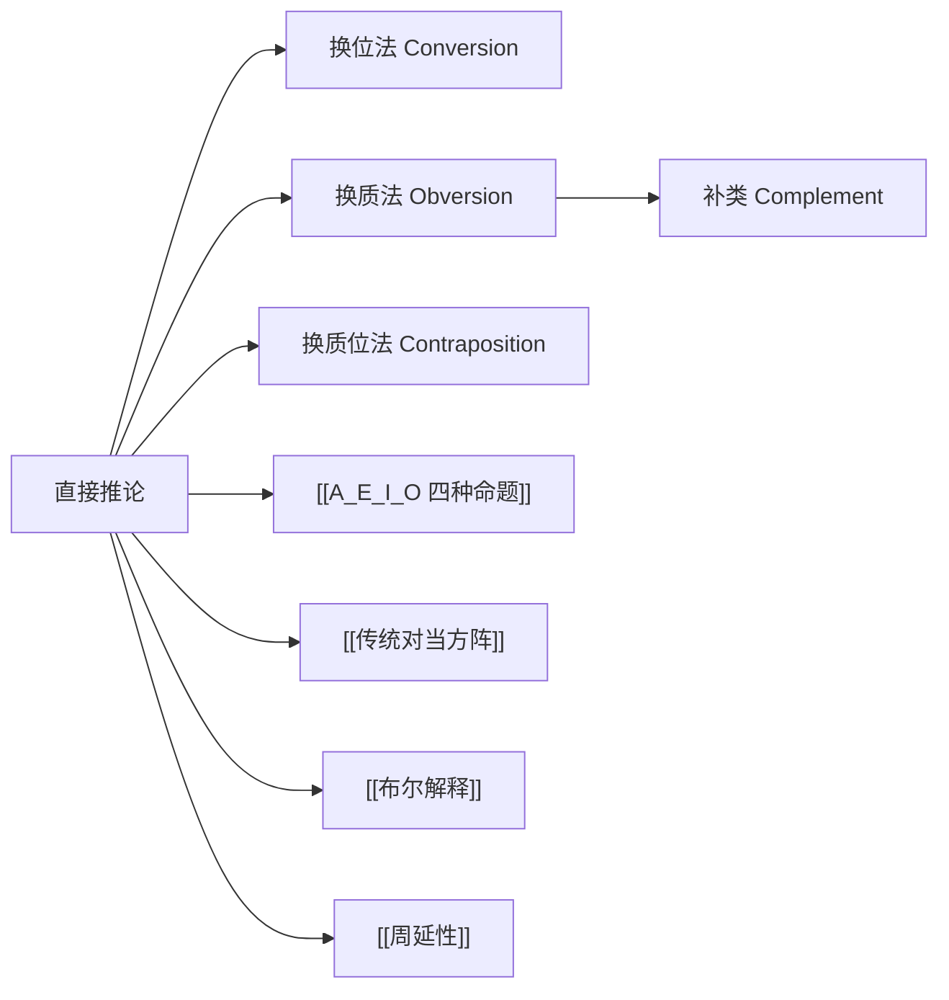

# 直接推论

> [!abstract] 概述
> 直接推论是不借助任何额外前提，仅从==一个==直言命题出发直接得出结论的推理方法，主要包括换位法、换质法和换质位法三种操作。

## 定义

> [!def] 直接推论（Immediate Inference）
> 直接推论是指不借助其他前提，直接从==一个前提==得出结论的推理过程。其结论的真值完全由前提的真值决定，无需引入任何额外信息。

## 补类

> [!def] 补类（Complement）
> 一个类的补类是指==不属于==该类的所有事物所构成的集合。若给定类为 S，则其补类记为 $\bar{S}$（读作"非 S"），包含宇宙中一切不是 S 的元素。

> [!example] 补类示例
> - S = "学生" → $\bar{S}$ = "非学生"（包括教师、工人、树木、石头……一切不是学生的东西）
> - S = "偶数" → $\bar{S}$ = "非偶数"（即奇数及其他非整数对象）

补类是换质法和换质位法的核心操作工具。

## 三种方法

### 1. 换位法（Conversion）

**操作：** 交换主项 S 和谓项 P 的位置，命题的质（肯定/否定）保持不变。

| 原命题 | 换位结果 | 有效性 |
|:-------|:---------|:-------|
| A：所有 S 是 P | I：有些 P 是 S | ==限制换位==（传统逻辑） |
| E：所有 S 不是 P | E：所有 P 不是 S | ✅ 有效（==等价==） |
| I：有些 S 是 P | I：有些 P 是 S | ✅ 有效（==等价==） |
| O：有些 S 不是 P | — | ❌ ==不能换位== |

> [!warning] 为什么 O 不能换位？
> "有些 S 不是 P"说的是 S 中有部分在 P 之外，但这==并不==意味着 P 中有部分在 S 之外。
>
> 例："有些动物不是狗"（真）→ "有些狗不是动物"（假）。换位后真值改变，因此 O 命题不能换位。

> [!warning] A 的限制换位
> "所有 S 是 P"（A）不能简单换位为"所有 P 是 S"（A），因为 S 和 P 的外延可能不同。
>
> 例："所有猫都是动物"（真）→ "所有动物都是猫"（假）。
>
> 在传统逻辑中，A 只能==限制换位==为"有些 P 是 S"（I），这一步依赖差等关系。

### 2. 换质法（Obversion）

**操作：** 改变命题的质（肯定↔否定），同时将谓项替换为其补类 $\bar{P}$。

| 原命题 | 换质结果 | 有效性 |
|:-------|:---------|:-------|
| A：所有 S 是 P | E：所有 S 不是 $\bar{P}$ | ✅ 有效（==等价==） |
| E：所有 S 不是 P | A：所有 S 是 $\bar{P}$ | ✅ 有效（==等价==） |
| I：有些 S 是 P | O：有些 S 不是 $\bar{P}$ | ✅ 有效（==等价==） |
| O：有些 S 不是 P | I：有些 S 是 $\bar{P}$ | ✅ 有效（==等价==） |

> [!tip] 换质法的要点
> - ==四种命题全部可以换质，且换质前后逻辑等价==
> - 换质法是最安全的直接推论——它不涉及主谓项外延关系的改变，仅改变表述方式
> - 换质两次即还原：对换质结果再换质，得到原命题

> [!example] 换质法示例
> - A："所有学生都是勤奋的" → E："所有学生都不是不勤奋的"
> - O："有些学生没通过考试" → I："有些学生是没通过考试的人"

### 3. 换质位法（Contraposition）

**操作：** 先换质再换位——将主项替换为谓项的补类 $\bar{P}$，将谓项替换为主项的补类 $\bar{S}$。

| 原命题 | 换质位结果 | 有效性 |
|:-------|:-----------|:-------|
| A：所有 S 是 P | A：所有 $\bar{P}$ 是 $\bar{S}$ | ✅ 有效（==等价==） |
| E：所有 S 不是 P | O：有些 $\bar{P}$ 不是 $\bar{S}$ | ==限制换质位==（传统逻辑） |
| I：有些 S 是 P | — | ❌ ==不能换质位== |
| O：有些 S 不是 P | O：有些 $\bar{P}$ 不是 $\bar{S}$ | ✅ 有效（==等价==） |

> [!warning] 为什么 I 不能换质位？
> "有些 S 是 P"（I）→ 换质得"有些 S 不是 $\bar{P}$"（O）→ O 不能换位。因此 I 命题不能完成换质位操作。

> [!warning] E 的限制换质位
> "所有 S 不是 P"（E）→ 换质得"所有 S 是 $\bar{P}$"（A）→ 限制换位得"有些 $\bar{P}$ 是 S"（I）→ 再换质得"有些 $\bar{P}$ 不是 $\bar{S}$"（O）。
>
> E 的换质位结果是 O 命题，而非 E 命题，因此称为==限制换质位==。

## 核心性质

| 性质 | 陈述 |
|:-----|:-----|
| 前提数量 | 仅需==一个==前提 |
| 推理类型 | 属于演绎推理，有效推论的结论必然为真 |
| 等价性 | 换质法四种全部等价；换位法 E/I 等价；换质位法 A/O 等价 |
| 布尔解释 | E/I 换位有效、A/O 换质位有效、所有换质有效；限制换位和限制换质位==无效== |

## 布尔解释下的有效性

在 [[布尔解释]] 下，由于全称命题没有存在含义，传统逻辑中依赖差等关系的"限制"操作不再有效：

| 操作 | 布尔解释下的有效性 |
|:-----|:-------------------|
| E 换位 | ✅ 有效 |
| I 换位 | ✅ 有效 |
| A 换质位 | ✅ 有效 |
| O 换质位 | ✅ 有效 |
| 所有换质 | ✅ 有效 |
| A 限制换位 | ❌ ==无效==（依赖差等关系） |
| E 限制换质位 | ❌ ==无效==（依赖差等关系） |

> [!info] 为什么限制操作在布尔解释下失效？
> 限制换位（A→I）和限制换质位（E→O）都依赖差等关系——从全称命题"下降"到特称命题。但在布尔解释下，全称命题在 S 为空类时可以为真，而对应的特称命题此时为假。因此"下降"操作不再保真。

## 与其他概念的关系

- **[[A_E_I_O 四种命题]]**：直接推论的操作对象
- **[[传统对当方阵]]**：对当关系本身也是一种直接推论方法
- **[[布尔解释]]**：决定了哪些直接推论在现代逻辑中仍然有效
- **[[周延性]]**：换位法的有效性规则与词项的周延性密切相关——在有效换位中，结论中不周延的项在前提中也不周延

## 补充

> [!quote] 换位法的周延性原则
> 一个有效的换位必须保证：==结论中不周延的项，在前提中也不周延==。这就是为什么 A 不能简单换位为 A（P 在 A 中不周延，但在换位后的 A 中变为周延，违反了该原则），而 E 和 I 可以自由换位。

> [!info] 历史背景
> 直接推论的三种方法均可追溯至亚里士多德的《前分析篇》。亚里士多德详细讨论了换位法（尤其是 E 和 I 的换位）和换质位法。换质法虽然亚里士多德也有涉及，但系统化的表述主要归功于后世的逻辑学家。19世纪布尔提出新的解释后，部分传统上被认为有效的直接推论被判定为无效。

## 应用

1. **命题等价变换**：在不改变命题真值的前提下，转换命题的表达形式
2. **三段论化简**：将三段论的前提转换为标准形式，便于检验有效性
3. **日常论证分析**：识别论证中隐含的直接推论步骤

## 参见

- [[A_E_I_O 四种命题]] — 直接推论的操作对象
- [[传统对当方阵]] — 对当关系作为直接推论的方法
- [[布尔解释]] — 现代逻辑下直接推论的有效性判定
- [[周延性]] — 换位法有效性的理论基础
