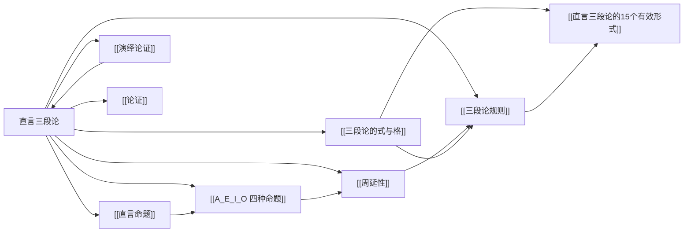

# 直言三段论

> [!abstract] 概述
> 直言三段论是由恰好三个[[直言命题]]组成的[[演绎论证]]，恰好包含三个词项，每个词项恰好出现两次，是==词项逻辑==的核心推理形式。

## 定义

> [!def] 直言三段论（Categorical Syllogism）
> 直言三段论是一种[[演绎论证]]，由恰好三个[[直言命题]]构成——两个前提和一个结论——且恰好包含三个词项，每个词项在该论证中恰好出现两次。

## 三个词项

直言三段论中的三个词项各有其特定角色：

| 词项 | 符号 | 定义 | 出现位置 |
|:-----|:-----|:-----|:---------|
| **大项**（Major Term） | P | 结论的==谓项== | 大前提 + 结论 |
| **小项**（Minor Term） | S | 结论的==主项== | 小前提 + 结论 |
| **中项**（Middle Term） | M | 只在==前提==中出现 | 大前提 + 小前提 |

> [!tip] 中项的作用
> 中项 M 是三段论的"桥梁"——它不出现在结论中，但通过在两个前提中分别与大项 P 和小项 S 建立联系，使得 S 与 P 之间的关系得以确立。如果中项未能有效连接 S 和 P，三段论就是无效的。

## 三个命题

| 命题 | 定义 | 包含的词项 |
|:-----|:-----|:-----------|
| **大前提**（Major Premise） | 包含大项 P 的前提 | P + M |
| **小前提**（Minor Premise） | 包含小项 S 的前提 | S + M |
| **结论**（Conclusion） | 包含小项 S 和大项 P 的命题 | S + P |

> [!warning] 命题的识别顺序
> 识别大前提和小前提的顺序是：==先找结论==，再根据结论确定大小项，最后根据大小项确定大小前提。不能仅凭出现顺序来判断。

## 标准形式

标准形式的直言三段论要求满足以下条件：

1. **大前提在前，小前提在后，结论在最后**
2. **每个命题都是标准直言命题**（A/E/I/O 形式）
3. **大前提在前，小前提在后，结论在最后**

标准形式的结构如下：

```
大前提：      M — P    （包含中项 M 和大项 P）
小前提：      S — M    （包含小项 S 和中项 M）
∴ 结论：      S — P    （包含小项 S 和大项 P）
```

> [!example] 标准形式示例
> ```
> 大前提：所有哲学家（M）是追求智慧的人（P）    —— A 命题
> 小前提：所有希腊人（S）是哲学家（M）            —— A 命题
> ∴ 结论：所有希腊人（S）是追求智慧的人（P）      —— A 命题
> ```
>
> 在此例中：
> - 大项 P = 追求智慧的人（结论谓项）
> - 小项 S = 希腊人（结论主项）
> - 中项 M = 哲学家（只在前提中出现）

## 化为标准形式的四步法

将自然语言中的三段论化为标准形式，需要按以下四步操作：

| 步骤 | 操作 | 说明 |
|:-----|:-----|:-----|
| **第一步** | 找出结论 | 确定哪个命题是结论（寻找"所以"、"因此"等指示词，或判断哪个命题是从其他命题推出的） |
| **第二步** | 确定大小项 | 结论的主项 = 小项 S；结论的谓项 = 大项 P |
| **第三步** | 确定大小前提 | 包含大项 P 的前提 = 大前提；包含小项 S 的前提 = 小前提 |
| **第四步** | 按标准顺序排列 | 大前提 → 小前提 → 结论，并将每个命题化为 A/E/I/O 标准形式 |

> [!example] 四步法演示
> 原始论证："所有勤奋的学生都能通过考试，因为所有能通过考试的人都做了充分准备，而所有勤奋的学生都做了充分准备。"
>
> - **第一步**（找结论）：结论是"所有勤奋的学生都能通过考试"（由"因为"前面的命题引出）
> - **第二步**（定大小项）：小项 S = 勤奋的学生，大项 P = 能通过考试的人
> - **第三步**（定大小前提）：
>   - "所有能通过考试的人都做了充分准备"含 P → 大前提
>   - "所有勤奋的学生都做了充分准备"含 S → 小前提
> - **第四步**（排列）：
>   ```
>   大前提：所有能通过考试的人（P）是做了充分准备的人（M）
>   小前提：所有勤奋的学生（S）是做了充分准备的人（M）
>   ∴ 结论：所有勤奋的学生（S）是能通过考试的人（P）
>   ```

## 核心性质

| 性质 | 陈述 |
|:-----|:-----|
| 词项数量 | 恰好三个词项（S、P、M），不能多也不能少 |
| 命题数量 | 恰好三个直言命题（两个前提、一个结论） |
| 词项出现次数 | 每个词项恰好出现两次 |
| 中项不出现于结论 | 中项 M 只在前提中出现，充当连接 S 和 P 的桥梁 |
| 形式决定有效性 | 三段论的有效性由其形式（式与格）决定，与内容无关 |

> [!warning] 四词项谬误（Four-Term Fallacy）
> 如果三段论中实际出现了四个词项（通常是因为同一语词在不同前提中含义不同），则三段论无效。例如：
> - "所有银行（金融机构）都有钱，所有河岸（river bank）都有水，∴ 所有银行都有水"
> - 这里的"bank"在两个前提中指称不同的类，实际构成了四个词项，论证无效。

## 与其他概念的关系



- **[[直言命题]]**：三段论的三个命题都是直言命题
- **[[A_E_I_O 四种命题]]**：三段论中每个命题的类型都属于 A/E/I/O 之一
- **[[周延性]]**：三段论的有效性规则直接依赖于各词项在不同命题中的周延情况
- **[[三段论的式与格]]**：由式（mood）和格（figure）共同确定三段论的形式
- **[[三段论规则]]**：检验三段论有效性的六条基本规则
- **[[演绎论证]]**：直言三段论是演绎论证的一种具体形式
- **[[论证]]**：直言三段论是论证的子类

## 补充

> [!info] 亚里士多德与三段论
> 直言三段论理论由==亚里士多德==在《工具论》（Organon）中首次系统论述，其中《前分析篇》（Prior Analytics）是三段论理论的核心文本。亚里士多德系统地分析了三段论的各种形式，区分了有效形式与无效形式，并建立了以三段论为核心的演绎推理体系。这一体系在西方逻辑史上占据统治地位长达两千余年，直到19世纪才被布尔和弗雷格的数理逻辑所补充和超越。
>
> 亚里士多德本人主要关注第一格的完善三段论，后世的逻辑学家（尤其是中世纪的经院逻辑学家）将其扩展到全部四个格，并系统整理了15个有效形式。

> [!quote] 三段论的经典例子
> 最著名的直言三段论示例来自亚里士多德本人：
> ```
> 大前提：所有人都是会死的。（M — P）
> 小前提：苏格拉底是人。（S — M）
> ∴ 结论：苏格拉底是会死的。（S — P）
> ```
> 这个例子展示了三段论的基本结构：中项"人"在两个前提中分别连接了"苏格拉底"和"会死的"，从而在结论中确立了"苏格拉底"与"会死的"之间的关系。

## 应用

1. **逻辑有效性检验**（第6章）：通过[[三段论的式与格]]和[[三段论规则]]检验三段论是否有效
2. **日常论证分析**：将日常语言中的论证重构为标准形式三段论，以评估其逻辑质量
3. **法律推理**：法律三段论（法规为大前提、案件事实为小前提、判决为结论）是直言三段论在法学中的典型应用
4. **数学证明**：某些数学证明可以分析为三段论推理链

## 日常语言中的三段论化归（第7章扩展）

> [!info] 词项归约
> 日常论证常因同义词或补类导致词项超过三个。归约方法：
> - ==同义词消除==：统一同一概念的不同表述（如"贪婪的"="贪婪的人"）
> - ==补类消除==：运用[[直接推论]]（换质/换位）消除补类词项
> - ==多步化归==：组合以上两种方法

> [!info] 直言命题标准化
> 日常语言命题需翻译为标准A/E/I/O形式。九种常见偏离：单称命题→A/E、形容词谓项→补充名词、非标准动词→改写为"是"、非标准语序→重排、非标准量词→替换、"只有"→主谓互换+"所有"、无明确量词→语境确定、非标准但可翻译→等价变换、==除外命题→合取式==（唯一不能化为单一直言命题的情况）。

> [!info] 协同翻译
> 含有参项（时间/地点/情形）的命题需引入统一参项作为中项，构造三个命题后检验有效性。

参见：[[省略式三段论]] [[连锁三段论]] [[直接推论]]

### 第10章：三段论的谓词逻辑精确化

第10章展示了直言三段论如何用谓词逻辑精确表示和证明：

- **符号化表示**：经典三段论可以完全用谓词逻辑符号表示，如：
  $$(x)(Hx \supset Mx), \quad (x)(Gx \supset Hx) \quad \therefore (x)(Gx \supset Mx)$$
- **严格证明**：使用量化规则（UI/UG/EI/EG）配合19条基本规则，可以对三段论的有效性给出==形式化的严格证明==
- **传统理论的超越**：谓词逻辑将三段论作为特例包含在内，同时能处理含有关系谓词、多个量词和单称命题的论证
- **存在含义的澄清**：谓词逻辑通过布尔解释精确揭示了哪些三段论推理依赖不当的存在假设

参见 [[量词]]、[[推论规则]]。

## 参见

- [[直言命题]] — 三段论的构成基块
- [[A_E_I_O 四种命题]] — 三段论中命题的类型分类
- [[周延性]] — 三段论有效性规则的核心概念
- [[三段论的式与格]] — 三段论形式的精确描述
- [[三段论规则]] — 检验三段论有效性的六条基本规则
- [[直言三段论的15个有效形式]] — 所有有效的三段论形式
- [[演绎论证]] — 直言三段论的上位概念
- [[论证]] — 论证的基本概念
