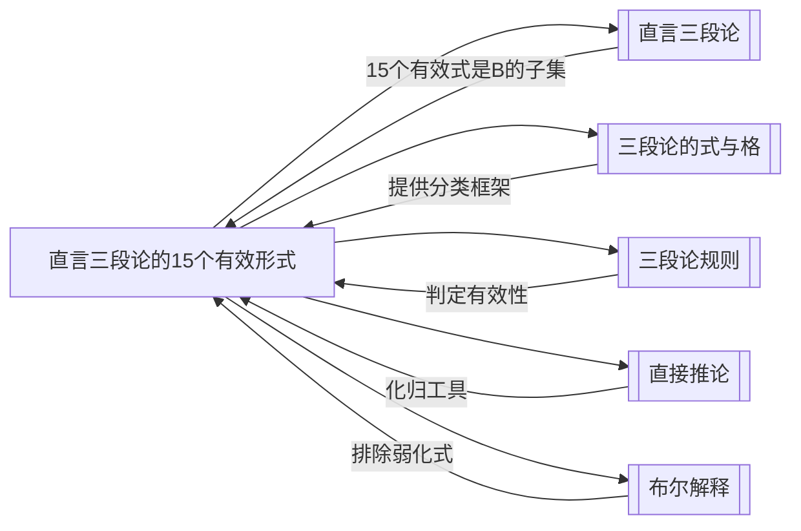

# 直言三段论的15个有效形式

> [!abstract] 概述
> 在布尔解释下，标准式直言三段论的256种可能形式中，仅有==15种==被判定为有效，按四个格分组，各有其传统拉丁名称。

## 定义

> [!def] 直言三段论的有效形式（Valid Moods of the Categorical Syllogism）
> 标准式直言三段论由大前提、小前提、结论的命题类型（A/E/I/O）决定其"式"，由中项在前提中的位置决定其"格"。4种命题类型 × 3个位置 = $4^3 = 64$ 种式，乘以4个格 = $64 \times 4 = 256$ 种可能形式。在==布尔解释==下，其中仅==15种==满足所有三段论规则，被判定为有效。

## 核心性质

| 性质 | 陈述 |
|:-----|:-----|
| 总可能形式数 | $4^3 \times 4 = 256$ 种（4种式 × 4个格） |
| 布尔解释下有效形式数 | ==15种== |
| 传统解释下额外有效形式 | 5种弱化式（如 AAI-1 Barbari），在布尔解释下因==存在谬误==而无效 |
| 唯一四格通用的式 | ==EIO==（在四个格中都有效） |
| 命名规则 | 拉丁名称的==元音字母==依次表示大前提、小前提、结论的命题类型 |
| 化归关系 | 第二、三、四格的有效式均可通过换位/换质==化归==为第一格的有效式 |

## 按格分组的完整列表

### 第一格（4个有效式）

第一格的特征：中项 $M$ 是大前提的主项、小前提的谓项（M-P / S-M）。

| 式 | 拉丁名称 | 大前提 | 小前提 | 结论 | 示例 |
|:---|:---------|:-------|:-------|:-----|:-----|
| **AAA-1** | ==Barbara== | A（所有M是P） | A（所有S是M） | A（所有S是P） | 经典的肯定式 |
| **EAE-1** | ==Celarent== | E（没有M是P） | A（所有S是M） | E（没有S是P） | 经典的否定式 |
| **AII-1** | ==Darii== | A（所有M是P） | I（有S是M） | I（有S是P） | 肯定特称式 |
| **EIO-1** | ==Ferio== | E（没有M是P） | I（有S是M） | O（有S不是P） | 否定特称式 |

> [!tip] 第一格的特殊地位
> 第一格被称为"==完美格=="（perfect figure），因为其有效式最直观地体现了三段论推理的本质。亚里士多德认为只有第一格的式是完善的，其他格的有效式都需要通过化归（reduction）来证明。

### 第二格（4个有效式）

第二格的特征：中项 $M$ 是两个前提的谓项（P-M / S-M）。第二格的所有有效式结论均为否定命题。

| 式 | 拉丁名称 | 大前提 | 小前提 | 结论 | 特点 |
|:---|:---------|:-------|:-------|:-----|:-----|
| **AEE-2** | ==Camestres== | A（所有P是M） | E（没有S是M） | E（没有S是P） | 全称否定式 |
| **EAE-2** | ==Cesare== | E（没有P是M） | A（所有S是M） | E（没有S是P） | 全称否定式（前提互换） |
| **AOO-2** | ==Baroko== | A（所有P是M） | O（有S不是M） | O（有S不是P） | 特称否定式 |
| **EIO-2** | ==Festino== | E（没有P是M） | I（有S是M） | O（有S不是P） | 特称否定式 |

> [!info] 第二格的用途
> 第二格常用于==区分==（distinction）：证明某个事物不属于某一类。因为结论总是否定的，所以第二格适合用来反驳一个肯定命题。

### 第三格（4个有效式）

第三格的特征：中项 $M$ 是两个前提的主项（M-P / M-S）。第三格的所有有效式结论均为特称命题。

| 式 | 拉丁名称 | 大前提 | 小前提 | 结论 | 特点 |
|:---|:---------|:-------|:-------|:-----|:-----|
| **AII-3** | ==Datisi== | A（所有M是P） | I（有M是S） | I（有S是P） | 肯定特称式 |
| **IAI-3** | ==Disamis== | I（有M是P） | A（所有M是S） | I（有S是P） | 肯定特称式（前提互换） |
| **EIO-3** | ==Ferison== | E（没有M是P） | I（有M是S） | O（有S不是P） | 否定特称式 |
| **OAO-3** | ==Bokardo== | O（有M不是P） | A（所有M是S） | O（有S不是P） | 否定特称式 |

> [!info] 第三格的用途
> 第三格常用于==反驳全称命题==：通过举出一个特称的反例来证明某个全称命题不成立。因为结论总是特称的，第三格适合用来证明"并非所有……"。

### 第四格（3个有效式）

第四格的特征：中项 $M$ 是大前提的谓项、小前提的主项（P-M / M-S）。

| 式 | 拉丁名称 | 大前提 | 小前提 | 结论 | 特点 |
|:---|:---------|:-------|:-------|:-----|:-----|
| **AEE-4** | ==Camenes== | A（所有P是M） | E（没有M是S） | E（没有S是P） | 全称否定式 |
| **IAI-4** | ==Dimaris== | I（有P是M） | A（所有M是S） | I（有S是P） | 肯定特称式 |
| **EIO-4** | ==Fresison== | E（没有P是M） | I（有M是S） | O（有S不是P） | 否定特称式 |

> [!info] 第四格的特殊性
> 第四格的有效式数量最少（仅3个），且亚里士多德本人并未单独讨论第四格。第四格由后来的逍遥学派学者（特别是德奥弗拉斯特和欧德摩斯）补充完善。第四格的结论中，小项S总是否定命题的谓项或特称命题的主项——这与其"非自然"的词项排列有关。

## EIO：唯一四格通用的有效式

> [!tip] EIO 的特殊性
> ==EIO== 是唯一在所有四个格中都有效的式：
> - **EIO-1**（Ferio）：没有M是P，有S是M → 有S不是P
> - **EIO-2**（Festino）：没有P是M，有S是M → 有S不是P
> - **EIO-3**（Ferison）：没有M是P，有M是S → 有S不是P
> - **EIO-4**（Fresison）：没有P是M，有M是S → 有S不是P
>
> 其通用性源于：E前提保证了一个交叉区域为空，I前提保证了另一个交叉区域不空，由此O结论必然成立——这一逻辑结构不依赖于中项在前提中的具体位置。

## 化归第一格

> [!info] 化归（Reduction）的含义
> 亚里士多德证明三段论有效性的核心方法是==化归==：将第二、三、四格的有效式通过==换位==（conversion）、==换质==（obversion）等[[直接推论]]手段，转化为第一格的某个有效式。如果能成功化归，则原式有效。

### 化归方法示例

| 原式 | 化归步骤 | 目标式 |
|:-----|:---------|:-------|
| EAE-2（Cesare） | 大前提"E没有P是M"换位为"E没有M是P"，即得EAE-1 | Celarent |
| AEE-2（Camestres） | 结论换位 + 小前提换位 + 使用Celarent | Celarent |
| AOO-2（Baroko） | 使用==间接证明==（归谬法），假设结论为假，推出矛盾 | Barbara |
| IAI-3（Disamis） | 大前提换位 + 结论换位 + 使用Darii | Darii |

> [!tip] 直接化归 vs 间接化归
> - **直接化归**（ostensive reduction）：通过换位、换质等直接推理步骤，将原式转化为第一格的某个有效式。大多数有效式都可以直接化归。
> - **间接化归**（reduction per impossibile）：当直接化归困难时（如 Baroko 和 Bokardo），使用==归谬法==——假设结论为假，结合已知前提推出矛盾，从而证明原三段论有效。

## 传统解释下的弱化式

> [!warning] 布尔解释 vs 传统解释
> 在亚里士多德的==传统解释==下，全称命题（A、E）被认为蕴含存在含义，因此某些"弱化式"（weakened moods）也被视为有效。所谓弱化式，是指结论从全称"弱化"为特称的形式，例如：
>
> | 弱化式 | 拉丁名称 | 说明 |
> |:-------|:---------|:-----|
> | AAI-1 | Barbari | AAA-1 的弱化（结论A→I） |
> | EAO-1 | Celaront | EAE-1 的弱化（结论E→O） |
> | AEO-2 | Camestrop | AEE-2 的弱化（结论E→O） |
> | EAO-2 | Cesaro | EAE-2 的弱化（结论E→O） |
> | AEO-4 | Calemos | AEE-4 的弱化（结论E→O） |
>
> 但在==布尔解释==下，全称命题==无存在含义==，因此从两个全称前提推出特称结论犯了==存在谬误==。这5个弱化式在布尔解释下==全部无效==。

## 与其他概念的关系

## 补充

> [!info] 拉丁名称的记忆口诀
> 中世纪逻辑学家为每个有效式赋予了拉丁名称，名称中的元音字母（a/e/i/o）依次编码了大前提、小前提和结论的命题类型。例如：
> - **Barb**a**r**a** = A-A-A（三个a）
> - **C**e**l**a**r**e**nt** = E-A-E（e-a-e）
> - **D**a**r**i**i** = A-I-I（a-i-i）
>
> 辅音字母则编码了化归方法（如"s"表示换位 simple conversion，"p"表示偶然换位 conversion per accidens，"m"表示前提互换 mutatio premisarum 等）。

> [!info] 为什么恰好是15个？
> 256种形式中只有15种有效，这一数字由[[三段论规则]]严格决定。每一条规则（如中项至少周延一次、结论中周延的项在前提中必须周延等）都会排除一批无效形式，最终恰好筛选出这15种。文恩图方法和规则方法的检验结果完全一致。

## 应用

- **快速判定三段论有效性**：已知一个三段论的式与格后，查对15个有效形式列表即可判断其是否有效。
- **构造有效论证**：在需要构造三段论论证时，从15个有效形式中选择合适的式与格。
- **识别无效论证**：如果一个三段论的形式不在15个有效形式之列，则可以确定它在布尔解释下无效。
- **逻辑教学**：15个有效形式是逻辑学课程中三段论部分的核心内容。

## 参见

- [[直言三段论]] —— 15个有效形式是直言三段论的核心子集
- [[三段论的式与格]] —— 式与格的定义和分类框架
- [[三段论规则]] —— 判定有效性的规则体系
- [[直接推论]] —— 化归第一格所使用的换位、换质等推理工具
- [[布尔解释]] —— 排除弱化式的理论基础
- [[存在谬误]] —— 弱化式在布尔解释下无效的原因
