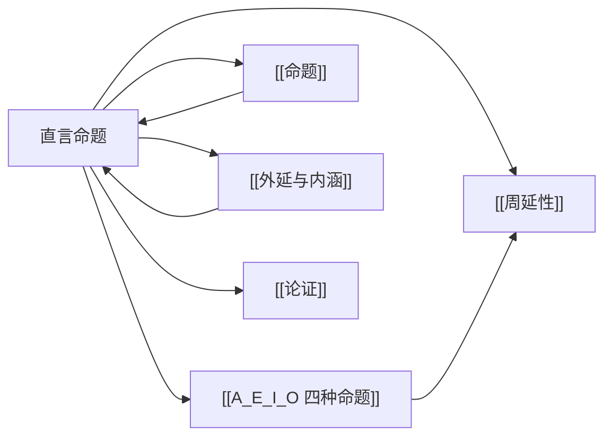

# 直言命题

> [!abstract] 概述
> 直言命题是关于类与类之间关系的命题，其标准形式为"量词 + 主项 + 联项 + 谓项"，是==词项逻辑==（term logic）的核心研究对象。

## 定义

> [!def] 直言命题（Categorical Proposition）
> 直言命题是断定某==一个类==（由主项 S 指称）的全部或部分被==包含于==或被==排斥于==另一个类（由谓项 P 指称）之中的命题。其标准形式由四个结构要素组成：**量词 + 主项 + 联项 + 谓项**。

## 四个结构要素

| 要素 | 功能 | 说明 | 示例 |
|:-----|:-----|:-----|:-----|
| **量词**（Quantifier） | 决定命题的==量== | "所有"、"没有"、"有" | "所有"学生…… |
| **主项**（Subject Term） | 被讨论的类 | 用 S 表示，是被断言的对象 | ……学生（S）…… |
| **联项**（Copula） | 决定命题的==质== | "是"或"不是" | ……是…… |
| **谓项**（Predicate Term） | 主项被断言包含于或不包含于的类 | 用 P 表示 | ……勤奋的人（P） |

> [!example] 标准形式示例
> - "所有学生是勤奋的人" → 量词（所有）+ 主项（学生）+ 联项（是）+ 谓项（勤奋的人）
> - "没有学生是勤奋的人" → 量词（没有）+ 主项（学生）+ 联项（是）+ 谓项（勤奋的人）
> - "有学生是勤奋的人" → 量词（有）+ 主项（学生）+ 联项（是）+ 谓项（勤奋的人）
> - "有学生不是勤奋的人" → 量词（有）+ 主项（学生）+ 联项（不是）+ 谓项（勤奋的人）

## 核心性质

| 性质 | 陈述 |
|:-----|:-----|
| 类关系本质 | 直言命题断言的是==类与类==之间的包含或排斥关系 |
| 标准形式唯一性 | 每个直言命题恰好属于四种标准形式之一（A、E、I、O） |
| 质与量的二分 | 联项决定"质"（肯定/否定），量词决定"量"（全称/特称） |
| 词项外延依赖 | 命题的真假取决于主项和谓项所指==类的外延==之间的关系 |

## 标准形式的四种类型

直言命题的标准形式仅有四种，由"质"（肯定/否定）和"量"（全称/特称）的 2 x 2 组合决定：

| 类型 | 名称 | 标准形式 | 质 | 量 |
|:-----|:-----|:---------|:---|:---|
| A | 全称肯定 | 所有 S 是 P | 肯定 | 全称 |
| E | 全称否定 | 没有 S 是 P | 否定 | 全称 |
| I | 特称肯定 | 有 S 是 P | 肯定 | 特称 |
| O | 特称否定 | 有 S 不是 P | 否定 | 特称 |

> [!info] 为什么只有四种？
> "质"有肯定和否定两种选择，"量"有全称和特称两种选择，因此 2 x 2 = 4 种组合穷尽了所有可能。任何非标准形式的直言命题都可以被改写为这四种标准形式之一。

## 与命题的关系

直言命题是[[命题]]的子类。并非所有命题都是直言命题——直言命题具有以下特征：

- **信息性功能**：直言命题属于[[语言的功能]]中的信息性用法，做出可以为真或为假的断定
- **类关系断定**：与复合命题（合取、析取、假言）不同，直言命题直接断定类与类之间的关系，而非命题与命题之间的关系
- **结构化形式**：直言命题具有固定的四要素结构（量词 + 主项 + 联项 + 谓项），这是其区别于其他命题类型的关键

## 与其他概念的关系

- **[[命题]]**：直言命题是命题的子类，具有信息性功能
- **[[A_E_I_O 四种命题]]**：直言命题的四种标准形式，由质和量的组合决定
- **[[周延性]]**：描述直言命题中各词项是否被断定了其类的全部对象
- **[[外延与内涵]]**：直言命题的真假判定依赖于词项所指类的外延关系
- **[[语言的功能]]**：直言命题体现了语言的信息性功能
- **[[论证]]**：直言命题是直言三段论（第6章）的构建基块

## 补充

> [!info] 亚里士多德与直言逻辑
> 直言命题理论起源于==亚里士多德==的《前分析篇》（Prior Analytics）。亚里士多德系统分析了类之间的包含与排斥关系，建立了以直言三段论为核心的词项逻辑体系，这一体系在西方逻辑史上统治了两千多年，直到19世纪布尔和弗雷格发展出现代数理逻辑。

> [!tip] 非标准形式的改写
> 自然语言中的许多命题并非标准形式，但可以通过改写转化为标准形式。例如：
> - "学生都是勤奋的" → "所有学生是勤奋的人"（补充谓项为名词性词项）
> - "只有会员才能入场" → "所有能入场的人是会员"（"只有A才B" = "所有B是A"）
> - "没有不爱国的公民" → "没有公民是不爱国的人"（移入否定词）

## 应用

1. **直言三段论**（第6章）：直言命题是三段论的基本构成单位，三段论的有效性判定依赖于直言命题的形式特征
2. **直接推论**（第5章）：基于传统对当方阵、换位、换质等规则，从直言命题直接推出其他命题
3. **日常推理分析**：将日常语言中的论断转化为标准直言命题，以检验其逻辑有效性

## 标准化翻译（第7章扩展）

> [!info] 九种非标准命题翻译方法
> 日常语言中的直言命题很少以标准A/E/I/O形式出现，需要系统化的翻译方法：
> 1. 单称命题→视主项为单元类，译为A/E
> 2. 形容词谓项→补充名词
> 3. 非标准动词→改写为"是"结构
> 4. 非标准语序→重排主谓顺序
> 5. 非标准量词→标准量词替换
> 6. ==排斥命题"只有"→主谓互换+"所有"==
> 7. 无明确量词→语境确定
> 8. 非标准但可翻译→逻辑等价变换
> 9. ==除外命题→合取式（两个命题）==

参见：[[直言三段论]] [[A_E_I_O 四种命题]] [[布尔解释]]

### 第10章：谓词逻辑符号化

第10章展示了直言命题如何用谓词逻辑精确符号化：

- **个体变元+谓词字母**：将主项和谓项转化为谓词字母（如 $Hx$ 表示"x是人"，$Mx$ 表示"x是有死的"）
- **量词对应**：全称命题用 $\forall$，特称命题用 $\exists$
- **联结词差异**：全称命题用蕴涵 $\supset$（条件性），特称命题用合取 $\cdot$（断言性）
- **深层结构揭示**：A命题和I命题虽然自然语言相似，但逻辑结构完全不同——这一差异正是 [[存在含义]] 问题的根源

参见 [[量词]]、[[存在含义]]。

## 参见

- [[A_E_I_O 四种命题]] — 四种标准直言命题的详细分析
- [[周延性]] — 词项在命题中是否被断定了全部外延
- [[传统对当方阵]] — A、E、I、O 之间的逻辑关系
- [[文恩图]] — 直言命题类关系的图形表示
- [[命题]] — 直言命题的上位概念
- [[外延与内涵]] — 词项外延是判定直言命题真假的基础
