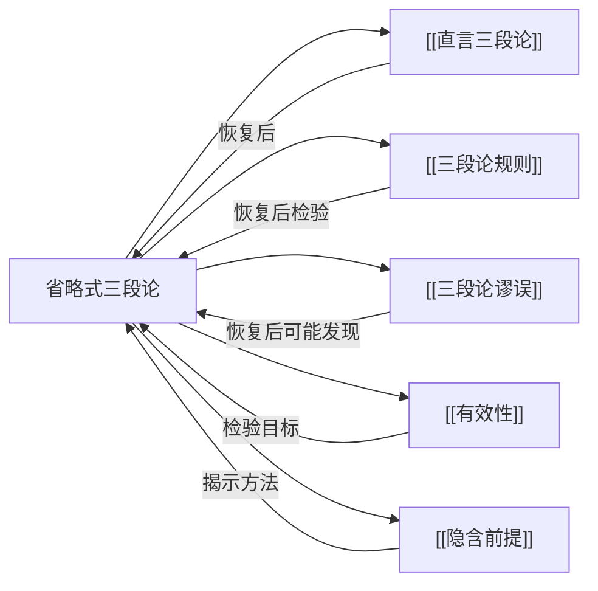

# 省略式三段论

> [!abstract] 概述
> 省略式三段论是省略了某个部分（大前提、小前提或结论）的不完整[[直言三段论]]，是日常语言论证中最常见的推理形式之一。

## 定义

> [!def] 省略式三段论（Enthymeme）
> 省略式三段论是一种==省略了三段论某个部分==的不完整论证。被省略的部分可以是==大前提==、==小前提==或==结论==。尽管在形式上不完整，但论证者预期听众或读者能够自行补充被省略的部分，从而使论证的逻辑结构得以完整呈现。

## 三种省略类型

| 省略类型 | 被省略部分 | 出现频率 | 说明 |
|:---------|:-----------|:---------|:-----|
| **省大前提** | 大前提 | ==最常见== | 大前提通常是普遍性原理或一般性命题，论证者认为其"显而易见"而省略 |
| **省小前提** | 小前提 | 较少见 | 小前提通常是具体事实，有时因上下文已明确而省略 |
| **省结论** | 结论 | 较少见 | 结论由听众自行推出，具有==修辞性==效果，使论证更具说服力 |

> [!example] 省大前提的例子
> - **原文**："苏格拉底是人，所以苏格拉底会死。"
> - **省略部分**：大前提"所有人都会死"
> - **完整三段论**：
>   ```
>   大前提：所有人都会死。（省略）
>   小前提：苏格拉底是人。
>   ∴ 结论：苏格拉底会死。
>   ```

> [!example] 省小前提的例子
> - **原文**："所有学生都要参加考试，所以小明要参加考试。"
> - **省略部分**：小前提"小明是学生"
> - **完整三段论**：
>   ```
>   大前提：所有学生都要参加考试。
>   小前提：小明是学生。（省略）
>   ∴ 结论：小明要参加考试。
>   ```

> [!example] 省结论的例子
> - **原文**："所有诚实的人都会承认错误，而你是诚实的人。"
> - **省略部分**：结论"你会承认错误"
> - **完整三段论**：
>   ```
>   大前提：所有诚实的人都会承认错误。
>   小前提：你是诚实的人。
>   ∴ 结论：你会承认错误。（省略）
>   ```
> - 省结论的论证具有==修辞性省略==的特点——让听众自己得出结论，比直接陈述结论更有说服力。

## 最强论证原则

> [!def] 最强论证原则（Principle of Charitable Interpretation）
> 在恢复省略式三段论的被省略部分时，应当在==合理范围内==选择使论证==尽可能有效==的补全方式。也就是说，如果被省略的部分有多种可能的补全方案，应当优先选择使整个三段论成为有效论证的那种方案。

最强论证原则体现了==善意解释==（charitable interpretation）的精神：在分析他人的论证时，应当尽可能将论证理解为合理的、有力的，而非故意选择使其显得荒谬的补全方式。

> [!warning] 最强论证原则的限度
> 最强论证原则并不意味着可以==任意添加==前提。补全方案必须满足以下条件：
> 1. **合理性**：补全的前提必须是在语境中==合理可接受的==
> 2. **最小性**：应当选择==最简单、最直接==的补全方式，而非过度复杂化
> 3. **忠实性**：补全方案不能==歪曲论证者的明显意图==
>
> 如果在合理范围内无法找到使论证有效的补全方式，则该论证就是无效的。

## 检验两步法

检验省略式三段论的有效性，需要按以下两步操作：

| 步骤 | 操作 | 说明 |
|:-----|:-----|:-----|
| **第一步** | 恢复省略部分 | 根据已有命题和最强论证原则，补全被省略的大前提、小前提或结论 |
| **第二步** | 检验有效性 | 将完整三段论化为标准形式，应用[[三段论规则]]或[[文恩图]]检验其有效性 |

> [!tip] 恢复省略部分的操作要点
> - **省大前提时**：将结论的谓项（大项 P）和小前提中出现但结论中未出现的词项（中项 M）连接起来
> - **省小前提时**：将结论的主项（小项 S）和大前提中出现但结论中未出现的词项（中项 M）连接起来
> - **省结论时**：根据两个前提的逻辑关系，推出小项 S 与大项 P 之间的关系

> [!example] 检验两步法演示
> **原始论证**："所有医生都受过专业训练，所以张华受过专业训练。"
>
> - **第一步（恢复省略部分）**：
>   - 结论："张华受过专业训练"→ 小项 S = 张华，大项 P = 受过专业训练的人
>   - 已有前提："所有医生都受过专业训练"含 P → 大前提
>   - 缺少含 S 的前提 → 省略的是小前提
>   - 根据最强论证原则补全：小前提"张华是医生"
> - **第二步（检验有效性）**：
>   ```
>   大前提：所有医生（M）都受过专业训练（P）。  —— A 命题
>   小前提：张华（S）是医生（M）。                —— A 命题
>   ∴ 结论：张华（S）受过专业训练（P）。          —— A 命题
>   ```
>   - 式：AAA-1（Barbara），==有效==。

## 核心性质

| 性质 | 陈述 |
|:-----|:-----|
| 不完整性 | 省略了三段论的某个部分（大前提、小前提或结论） |
| 日常性 | 是日常语言论证中最常见的推理形式，远多于完整三段论 |
| 依赖语境 | 被省略的部分通常由语境和共同背景知识决定 |
| 可恢复性 | 通过逻辑分析可以将省略部分恢复，使论证成为完整的[[直言三段论]] |
| 评估前提 | 必须先恢复省略部分，才能应用[[三段论规则]]检验有效性 |

## 与其他概念的关系



- **[[直言三段论]]**：省略式三段论是不完整的直言三段论，恢复后即成为标准直言三段论
- **[[三段论规则]]**：恢复省略部分后，应用三段论规则检验论证的有效性
- **[[三段论谬误]]**：恢复省略部分后可能发现论证犯有三段论谬误
- **[[有效性]]**：省略式三段论的有效性只有在恢复为完整三段论后才能判定
- **[[隐含前提]]**：省略式三段论中被省略的前提就是一种隐含前提，揭示方法相通

## 补充

> [!info] Aristotle 对 enthymeme 的系统讨论
> **来源：** Aristotle. *Rhetoric*, Book II, Chapter 22
>
> 亚里士多德在《修辞学》中==首次系统讨论==了省略式三段论（enthymeme）。他将 enthymeme 定义为"一种从==不完整前提==中得出的推理"，并将其视为修辞论证的核心形式。亚里士多德指出，在修辞论证中，省略那些被听众普遍接受的前提是有效的说服策略——省略使论证更加简洁有力，同时激发听众主动参与推理过程。
>
> 值得注意的是，亚里士多德对 enthymeme 的理解比现代逻辑学更宽泛。在现代逻辑学中，enthymeme 通常被严格定义为省略了某个部分的三段论；而在亚里士多德那里，enthymeme 还可以指基于==或然前提==（probable premises）而非必然前提的推理。现代教科书（包括 Copi）通常采用较窄的定义，即"省略式三段论"。

> [!quote] 省略式三段论的普遍性
> 在日常语言中，人们几乎从不以完整三段论的形式进行论证。省略那些被认为"显而易见"的部分，使交流更加高效。然而，从逻辑分析的角度看，省略的部分恰恰可能是论证中最值得审视的环节——因为被省略的前提有时并不可靠，甚至可能是虚假的。这正是分析省略式三段论的价值所在。

## 应用

1. **日常论证分析**：识别日常语言中的省略式三段论，恢复省略部分以评估论证的逻辑质量
2. **批判性思维**：揭示被省略的前提，检验其合理性与真实性，避免被"隐藏假设"所误导
3. **修辞分析**：理解论证者为何选择省略某一部分——是出于简洁性考虑，还是有意回避争议性前提
4. **法律论证**：法律推理中经常使用省略式三段论，恢复其完整结构有助于检验法律论证的有效性

## 参见

- [[直言三段论]] — 省略式三段论恢复后的完整形式
- [[三段论规则]] — 恢复后检验有效性的六条基本规则
- [[三段论谬误]] — 恢复后可能发现的形式谬误
- [[有效性]] — 省略式三段论有效性的判定目标
- [[隐含前提]] — 省略式三段论中被省略前提的揭示方法
- [[谬误]] — 论证错误的总体分类
