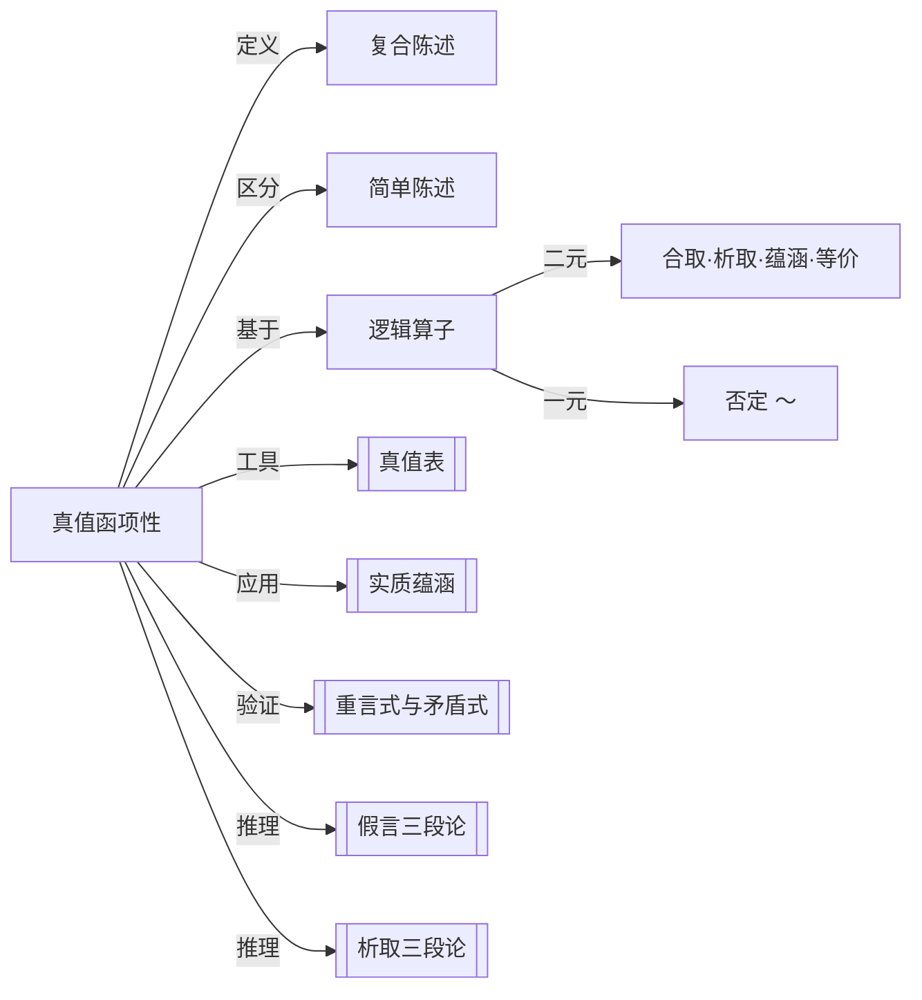

# 真值函项性

> [!abstract] 概述
> 复合陈述的真值由其组成部分的真值==唯一决定==——这是命题逻辑形式系统的基石。

## 定义

> [!def] 真值函项性（Truth-Functionality）
> 一个复合陈述是==真值函项的==（truth-functional），当且仅当==该复合陈述的真值由其组成部分的真值唯一决定==。换言之，一旦知道了各组成部分的真值，整个复合陈述的真值就被完全确定，无需考虑其他任何因素。

## 简单陈述与复合陈述

> [!info] 区分标准
> - **简单陈述**（simple statement）：不包含任何==逻辑算子==（logical operator）的陈述。其真值取决于事实，而非其他陈述的真值。
> - **复合陈述**（compound statement）：==至少包含一个逻辑算子==的陈述。其真值由所含逻辑算子及其组成部分的真值决定。

> [!example] 示例
> - 简单陈述："天下雨了。"——真值取决于是否真的下雨。
> - 复合陈述："天下雨了==并且==地面湿了。"——包含逻辑算子"并且"（合取），真值由两个组成部分的真值共同决定。

## 真值函项分支

> [!def] 真值函项分支（Truth-Functional Component）
> 一个复合陈述的==真值函项分支==是复合陈述的一个子陈述（sub-statement），==将该子陈述替换为任何具有相同真值的陈述，不会改变整个复合陈述的真值==。

真值函项分支是构成复合陈述的基本单元。每个真值函项分支本身要么是简单陈述，要么是更小的复合陈述。

> [!tip] 理解分支
> 在"($p \cdot q$) $\supset$ $r$"中，$p \cdot q$ 和 $r$ 都是真值函项分支。将 $p \cdot q$ 替换为任何具有相同真值的陈述，整个蕴涵式的真值不变——这正是真值函项性的体现。

## 五种逻辑算子

命题逻辑中使用五种基本逻辑算子，可分为两大类：

### 二元联结词（Binary Connectives）

联结两个陈述，形成新的复合陈述。

| 算子 | 名称 | 读法 | 符号示例 |
| --- | --- | --- | --- |
| $\cdot$ | 合取（Conjunction） | "并且" | $p \cdot q$ |
| $\lor$ | 析取（Disjunction） | "或者" | $p \lor q$ |
| $\supset$ | 实质蕴涵（Material Implication） | "如果……那么……" | $p \supset q$ |
| $\equiv$ | 实质等价（Material Equivalence） | "当且仅当" | $p \equiv q$ |

### 一元否定算子（Unary Negation）

作用于一个陈述，形成其否定。

| 算子 | 名称 | 读法 | 符号示例 |
| --- | --- | --- | --- |
| $\sim$ | 否定（Negation） | "非" / "并非" | $\sim p$ |

> [!info] 算子与真值函项性
> 每种逻辑算子都定义了一种特定的真值函数——即从组成部分的真值到整体真值的映射。这正是"真值函项性"名称的由来：复合陈述的真值是其组成部分真值的==函数==。

## 核心性质

| 性质 | 陈述 |
| --- | --- |
| 唯一决定性 | 复合陈述的真值==完全==由其组成部分的真值决定 |
| 与内容无关 | 真值函项性==不依赖==组成部分之间的因果、语义或内容关联 |
| 可表格化 | 每个真值函项算子都可以用[[真值表]]完整刻画 |
| 组合性 | 复合陈述可以嵌套，内层复合陈述作为外层陈述的真值函项分支 |

## 与其他概念的关系

## 补充

> [!info] Wittgenstein 的贡献
> 真值函项性的概念在逻辑哲学中具有深远意义。Ludwig Wittgenstein 在 *Tractatus Logico-Philosophicus* (1921) 中提出，所有有意义的命题都是基本命题的真值函项。这一论断深刻影响了逻辑实证主义和分析哲学的发展方向。

> [!warning] 非真值函项算子的存在
> 并非所有自然语言中的逻辑连接词都是真值函项的。例如：
> - "因为……所以……"——要求因果关联，不仅仅是真值关系
> - "虽然……但是……"——表达转折语气，超出真值范围
> - "……在……之后"——时间顺序不等于真值函数
>
> 命题逻辑的五种算子是==经过严格筛选==的真值函项算子。

## 应用

- **[[真值表]]构造**：真值函项性是构造真值表的理论基础——正因为真值由部分唯一决定，我们才能穷举所有可能的真值组合来验证逻辑关系。
- **[[重言式与矛盾式]]判定**：通过真值表检验一个命题形式是否在所有赋值下为真（重言式）或为假（矛盾式）。
- **论证有效性验证**：有效论证的前提与结论之间的真值函项关系确保了"前提全真则结论必真"。

## 参见

- [[实质蕴涵]]：五种逻辑算子中最具争议的蕴涵算子
- [[真值表]]：真值函项性的表格化工具
- [[重言式与矛盾式]]：基于真值函项性判定的特殊命题形式
- [[假言三段论]]：基于实质蕴涵的有效推理形式
- [[析取三段论]]：基于析取的有效推理形式
