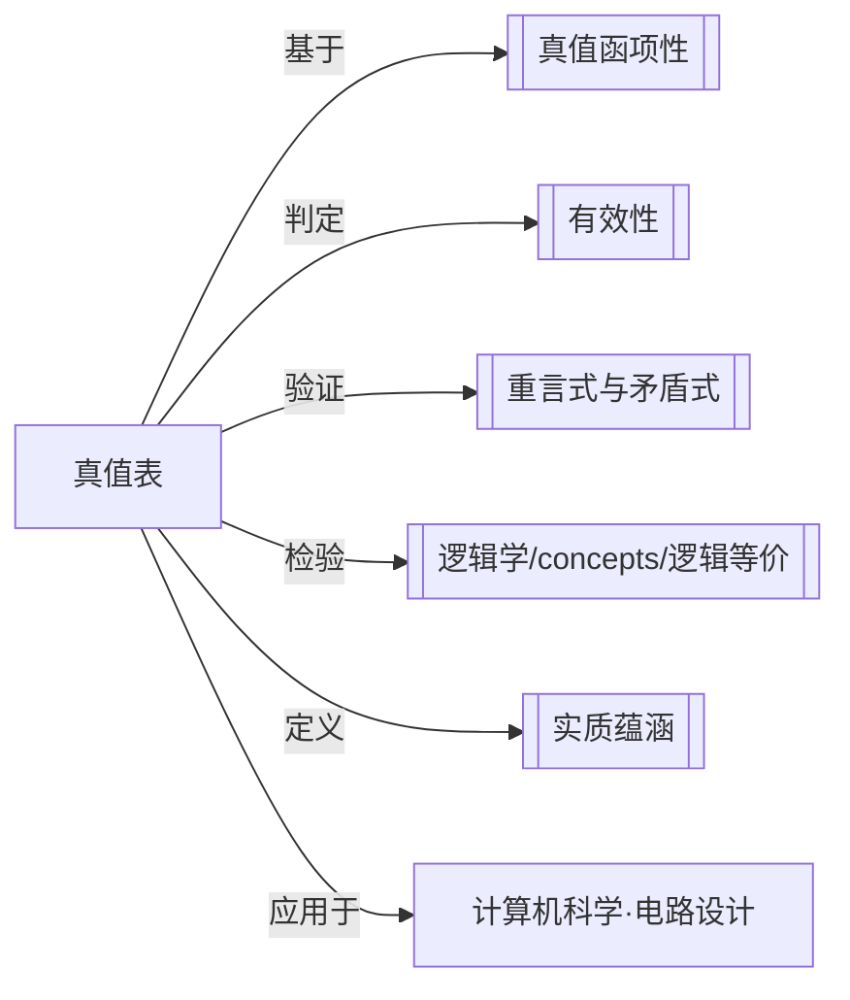

# 真值表

> [!abstract] 概述
> 真值表是列出复合陈述在其所有组成成分的一切可能真值组合下的真值的表格，是命题逻辑中判定论证有效性与陈述性质的核心工具。

## 定义

> [!def] 真值表（Truth Table）
> 一种系统性的表格工具，用于枚举一个==复合陈述==（compound statement）中所有==简单成分==（simple components）的全部可能真值组合，并据此计算复合陈述在每种组合下的真值。真值表是[[真值函项性]]的直接应用——复合陈述的真值完全由其组成部分的真值决定。

## 核心性质

| 性质 | 陈述 |
| --- | --- |
| 基本功能 | 枚举所有可能的真值指派，计算复合陈述在各指派下的真值 |
| 行数规则 | $n$ 个不同变元 $\to$ $2^n$ 行（每个变元有 T/F 两种取值） |
| 列构造顺序 | 从简到繁：先写各变元列 $\to$ 否定列 $\to$ 合取/析取列 $\to$ 蕴涵/等值列 |
| 引导列排列 | 按二进制递减排列（左列变化最慢，右列变化最快），确保不遗漏任何组合 |
| 判定有效性 | 若存在至少一行"前提全 T 且结论 F" $\to$ 论证==无效==；若不存在 $\to$ 论证==有效== |

## 引导列的构造方法

构造真值表的第一步是建立==引导列==（guide columns），即各个变元的取值列。

### 行数计算

对于包含 $n$ 个不同命题变元的复合陈述，真值表共有 $2^n$ 行：

- 1 个变元：$2^1 = 2$ 行
- 2 个变元：$2^2 = 4$ 行
- 3 个变元：$2^3 = 8$ 行
- $n$ 个变元：$2^n$ 行

### 排列规则

引导列按==二进制递减==排列，将 T 视为 1、F 视为 0：

| $p$ | $q$ | 对应二进制 |
| --- | --- | --- |
| T | T | 11 |
| T | F | 10 |
| F | T | 01 |
| F | F | 00 |

> [!tip] 记忆技巧
> 左侧变元变化最慢（连续多个 T 再连续多个 F），右侧变元变化最快（交替 T/F）。这保证了所有 $2^n$ 种组合恰好出现一次，既不遗漏也不重复。

## 从简到繁构造列

真值表的各列按照复杂度递增的顺序依次计算：

1. **变元列**（引导列）：直接列出各变元的 T/F 取值
2. **否定列**（$\sim p$）：对变元列取反
3. **合取列**（$p \cdot q$）：两列均为 T 时结果为 T，否则为 F
4. **析取列**（$p \lor q$）：至少一列为 T 时结果为 T，否则为 F
5. **蕴涵列**（$p \supset q$）：仅当 $p$=T 且 $q$=F 时结果为 F，否则为 T
6. **等值列**（$p \equiv q$）：两列相同时结果为 T，不同时为 F

> [!example] 两变元真值表示例
>
> | $p$ | $q$ | $\sim p$ | $p \cdot q$ | $p \lor q$ | $p \supset q$ | $p \equiv q$ |
> | --- | --- | --- | --- | --- | --- | --- |
> | T | T | F | T | T | T | T |
> | T | F | F | F | T | F | F |
> | F | T | T | F | T | T | F |
> | F | F | T | F | F | T | T |

## 用真值表判定论证有效性

### 判定规则

将论证转化为条件陈述 $(前提_1 \cdot 前提_2 \cdot \ldots) \supset 结论$，构造真值表：

- 若存在==至少一行==使得所有前提为 T 而结论为 F $\to$ 论证==无效==
- 若==不存在==这样的行 $\to$ 论证==有效==（此时条件陈述为[[重言式与矛盾式|重言式]]）

### 高效策略

> [!tip] 只需关注结论为 F 的行
> 在判定有效性时，==只需关注结论为 F 的那些行==，检查在这些行中是否所有前提同时为 T。如果结论为 F 的行中至少有一行前提全为 T，则论证无效；如果结论为 F 的所有行中至少有一个前提为 F，则论证有效。这可以大幅减少需要检查的行数。

### 示例：验证析取三段论

论证：$p \lor q, \sim p, \therefore q$

| $p$ | $q$ | $p \lor q$ | $\sim p$ | $q$（结论） | 前提全 T？ |
| --- | --- | --- | --- | --- | --- |
| T | T | T | F | T | 否（$\sim p$=F） |
| T | F | T | F | F | 否（$\sim p$=F） |
| F | T | T | T | T | —（结论为 T，无需检查） |
| F | F | F | T | F | 否（$p \lor q$=F） |

不存在"前提全 T 且结论 F"的行 $\to$ 论证==有效==。

## 与其他概念的关系

## 补充

> [!info] 真值表的历史与计算机科学
> 真值表方法的思想可追溯至 Frege（1879）和 Post（1921）的形式化工作。1938 年，==Claude Shannon== 在其硕士论文 *A Symbolic Analysis of Relay and Switching Circuits* 中，将真值表系统地应用于==继电器电路设计==，证明了布尔代数（命题逻辑的代数形式）可以描述和优化开关电路。这一工作奠定了数字电路设计的基础，也是计算机科学的里程碑之一。Shannon 的贡献表明，真值表不仅是逻辑学的理论工具，更是工程实践的核心方法。

## 应用

- **论证有效性判定**：通过构造条件陈述的真值表，机械地判定任何命题逻辑论证的有效性
- **陈述形式分类**：区分[[重言式与矛盾式|重言式]]、矛盾式和偶真式
- **逻辑等价检验**：两个陈述在真值表中所有行的真值完全相同 $\to$ 逻辑等价
- **数字电路设计**：Shannon (1938) 将真值表映射为开关电路的真值函数，用于电路简化和优化

### 第9章：简化真值表方法（STTT）

第9章（9.9节）引入了==简化真值表方法==（Simplified Truth Table Technique, STTT），作为完备真值表的补充验证工具。

- **核心思想**：不是穷举所有真值组合，而是==假设论证无效==（前提全T结论F），然后检查是否可以一致地赋值
- **强制赋值 vs 非强制赋值**：某些赋值由逻辑结构强制决定（如结论F→蕴涵前件T后件F），其他赋值需要尝试所有可能
- **判定标准**：如果所有前提都能为T→论证无效；如果某前提必须为F→论证有效
- **与完备真值表的关系**：STTT是完备真值表的"反向搜索"版本，通常更高效（参见[[形式证明-vs-真值表]]）

> [!tip] STTT的优势
> STTT特别适合==判定无效论证==——一旦找到一致赋值就可以立即停止，无需检查所有行。而形式证明方法无法直接证明无效性（只能尝试后放弃）。

## 参见

- [[真值函项性]]：复合陈述的真值由其成分的真值决定
- [[实质蕴涵]]：真值表中蕴涵式的定义
- [[重言式与矛盾式]]：通过真值表对陈述形式进行分类
- [[逻辑学/concepts/逻辑等价]]：两个陈述在真值表中具有相同的真值列
- [[有效性]]：论证的形式属性，可通过真值表判定
