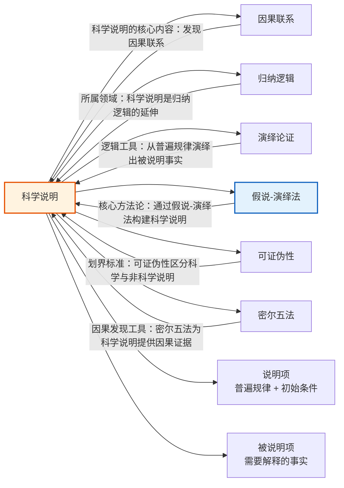

# 科学说明

> [!abstract] 概述
> ==科学说明==（scientific explanation）是对现象的==系统性解释==，其核心目标是从普遍真理中==逻辑地推导==出需要说明的事实。科学的终极目标是发现普遍真理——主要是==因果联系==——据此，我们所遭遇的事实可以得到说明。科学说明不同于日常的随意解释，它要求说明项与被说明项之间存在严格的逻辑关系，并且说明项本身必须能够接受经验的检验。科学说明是[[假说-演绎法]]的核心产物，也是区分科学与非科学的关键标志之一。

## 定义

> [!def] 科学说明（Scientific Explanation）
> ==科学说明==是指运用普遍规律（或高度确证的理论）和特定条件，通过逻辑推导来解释某一特定事实或现象的过程。一个完整的科学说明由两部分组成：
> - **说明项**（explanans）：用于说明的前提，包括普遍规律和初始条件
> - **被说明项**（explanandum）：需要被说明的事实或现象
>
> 其基本结构可以形式化为：
> $$L_1, L_2, \ldots, L_n \quad (\text{普遍规律})$$
> $$C_1, C_2, \ldots, C_m \quad (\text{初始条件})$$
> $$\therefore E \quad (\text{被说明现象})$$

### 说明与论证的区别

> [!def] 说明 vs 论证
> ==说明==（explanation）和==论证==（argument）虽然具有相同的逻辑结构（都是从前提到结论的推理），但两者的==信息流向==和==认知目的==截然不同：
>
> | 区分维度 | ==说明== | ==论证== |
> |:---------|:---------|:---------|
> | **时间方向** | ==回溯性==（retrospective）：从已知事实 $Q$ 回溯到原因 $P$ | ==前瞻性==（prospective）：从前提 $P$ 推导出结论 $Q$ |
> | **认知目标** | 解释"为什么"已经发生的事情会发生 | 证明某个结论为真或可能为真 |
> | **已知/未知** | 结论（被说明项）是已知的，前提（说明项）是需要寻找的 | 前提是已知的，结论是未知的 |
> | **典型形式** | "为什么 $Q$？因为 $P$。" | "因为 $P$，所以 $Q$。" |
>
> **关键洞察：** 一个论证的结论被接受是因为前提为真；一个说明的结论（被说明项）已经被接受为真，我们寻求的是能够说明它的前提。两者的逻辑结构相同，但==认知语境==不同。

### 科学说明的两个本质特征

> [!def] 科学说明的本质特征
> 科学说明区别于非科学说明的两个==本质特征==：
>
> 1. ==非教条态度==（non-dogmatic attitude）：所有科学命题都是==假说==（hypotheses），即暂时的、可修改的、可被更好理论替代的。科学从不宣称拥有绝对真理，而是始终对修正保持开放。这一特征将科学说明与教条式的、不容置疑的"终极解释"区分开来。
>
> 2. ==经验可证实==（empirical testability）：科学假说必须能够接受经验的检验——即必须能够演绎出至少一个可以直接通过观察或实验来验证的命题。如果一个所谓的"说明"无法被经验检验，它就不是科学说明。

### 间接检验

> [!def] 间接检验（Indirect Testing）
> ==间接检验==是从假说演绎出可直接检验的命题的过程。许多科学假说涉及不可直接观察的实体或过程（如原子、黑洞、基因），因此需要通过间接方式来检验：
>
> $$H \quad (\text{假说})$$
> $$H \rightarrow O \quad (\text{演绎推理})$$
> $$\therefore O \quad (\text{可观察预测})$$
>
> 如果预测 $O$ 被经验证实，假说 $H$ 得到==确证==（confirmation）；如果 $O$ 被经验否证，假说 $H$ 受到==反驳==（refutation）。
>
> **间接检验的结构：**
> 1. 提出假说 $H$
> 2. 从 $H$ 加上辅助前提 $A$ 演绎出可观察预测 $O$：$H \wedge A \vdash O$
> 3. 通过观察或实验检验 $O$
> 4. 根据 $O$ 的检验结果来评估 $H$ 的可信度

> [!warning] 间接检验的逻辑限度
> 间接检验遵循==假言推理==（modus ponens）和==否定后件推理==（modus tollens）的逻辑：
> - 确证：$O$ 为真 → $H$ 更可信（但并非证明 $H$ 为真，因为可能有其他假说也能推出 $O$）
> - 反驳：$O$ 为假 → $H \wedge A$ 中至少有一个为假（但无法确定是 $H$ 还是 $A$ 出了问题）
>
> 这意味着间接检验==不能==最终"证明"一个假说为真，只能提供或强或弱的归纳支持。这一逻辑限度是科学说明永远保持==非教条态度==的深层原因。

## 核心性质

| 性质 | 说明 |
|:-----|:-----|
| ==回溯性== | 科学说明从已知事实出发，回溯寻找其原因或普遍规律，信息流向是"从果到因" |
| ==非教条性== | 所有科学命题都是假说，暂时的、可修改的，科学始终对修正保持开放 |
| ==经验可证实性== | 科学假说必须能演绎出可被经验检验的命题，不可检验的"说明"不属于科学 |
| ==可证伪性== | 科学假说必须至少在原则上能被经验证据反驳，这是区分科学与非科学的关键标准 |
| ==间接性== | 大多数科学假说通过间接检验来评估——从假说演绎出可观察预测，再检验预测 |
| ==逻辑严密性== | 说明项与被说明项之间必须存在严格的逻辑推导关系，而非松散的联想 |

## 关系网络

- **[[因果联系]]**：科学说明的==核心内容==是发现因果联系——科学的终极目标是发现普遍真理（主要是因果联系），据此所遭遇的事实可以得到说明
- **[[归纳逻辑]]**：科学说明是[[归纳逻辑]]在第13章的延伸——科学假说的确证本质上是一种归纳推理，观察证据对假说的支持是或然的而非必然的
- **[[演绎论证]]**：科学说明的==逻辑结构==是演绎的——从普遍规律和初始条件演绎出被说明事实，但整个科学说明的构建过程是归纳的
- **[[假说-演绎法]]**：==假说-演绎法==是构建科学说明的核心方法论，通过从假说演绎出可检验的预测来确证或证伪假说
- **[[可证伪性]]**：==可证伪性==（falsifiability）是区分科学说明与非科学说明的关键标准——科学假说必须至少在原则上能被经验证据反驳
- **[[密尔五法]]**：密尔五法为科学说明提供==因果发现的工具==——通过系统化的观察和实验来识别因果联系，为科学说明提供经验基础

## 第13章：科学说明

### 科学说明的本质特征

第13章将科学说明定位为科学探究的==核心目标==。科学不仅仅是收集事实，更重要的是对事实提供==系统的、逻辑严密的说明==。科学说明的两个本质特征——非教条态度和经验可证实——共同定义了什么是真正的科学：

1. **非教条态度**意味着科学永远保持谦逊——今天被接受的"真理"明天可能被修正或替代。牛顿力学被爱因斯坦相对论修正，就是一个经典案例
2. **经验可证实**意味着科学说明必须接受"自然的裁决"——任何科学假说都必须能够产生可检验的预测，而不能躲在不可检验的"解释"背后

### 间接检验的结构

间接检验是科学说明的==核心操作机制==。当假说涉及不可直接观察的实体或过程时，科学家必须通过间接检验来评估假说的可信度：

$$H \wedge A \vdash O$$

其中：
- $H$ 是待检验的假说
- $A$ 是辅助前提（包括背景知识、初始条件等）
- $O$ 是可观察的预测

> [!tip] 间接检验的认识论意义
> 间接检验揭示了科学知识的一个深层特征：科学对不可观察领域的认识，是通过==可观察领域的证据==来间接建立的。原子、基因、黑洞等不可直接观察的实体，之所以能被科学地认识，正是因为关于它们的假说能够演绎出可观察的预测。这一机制使得科学能够远远超越直接经验的范围，建立起关于世界的深层认识。

### 非科学说明 vs 科学说明

第13章的一个重要主题是区分科学说明与非科学说明：

| 特征 | ==科学说明== | ==非科学说明== |
|:-----|:------------|:--------------|
| **基础** | 经验证据和逻辑推理 | 权威、传统、直觉或超自然力量 |
| **可检验性** | 必须能产生可检验的预测 | 通常不可检验或拒绝检验 |
| **可修正性** | 开放于修正和改进 | 通常宣称绝对真理，不容置疑 |
| **可证伪性** | 至少在原则上可被反驳 | 通常不可证伪 |
| **普遍性** | 追求普遍规律 | 可能只适用于特定情境 |
| **逻辑结构** | 严格的演绎推导 | 可能是松散的联想或类比 |

> [!example] 非科学说明的典型形式
> - **目的论说明**："因为这是上帝的旨意"——不可检验、不可证伪
> - **拟人化说明**："水'想要'往低处流"——将自然现象拟人化，不提供因果机制
> - **同义反复**："药物能治病是因为它有药效"——用同义词循环"说明"，没有提供新信息
> - **教条式说明**："这就是自然规律"——不提供因果机制，只是给现象贴标签

## 补充

> [!info] 亨普尔的演绎-律则模型
> **来源：** Hempel, C.G. (1965). *Aspects of Scientific Explanation*. New York: Free Press.
>
> ==卡尔·亨普尔==（Carl Gustav Hempel）在1965年的经典著作中提出了科学说明的==演绎-律则模型==（Deductive-Nomological Model, D-N Model），也称为"覆盖律模型"（Covering Law Model）。该模型要求：
>
> 1. 说明项必须是一个==逻辑上有效的论证==，被说明项是说明项的逻辑结论
> 2. 说明项必须包含至少一个==普遍规律==（general law）
> 3. 说明项必须具有==经验内容==，即必须能够被经验检验
> 4. 说明项中的普遍规律必须对被说明项的推导是==实质性的==（essential），即去掉该规律后推理不再有效
>
> **D-N 模型的形式结构：**
> $$L_1, L_2, \ldots, L_n \quad (\text{普遍规律})$$
> $$C_1, C_2, \ldots, C_m \quad (\text{初始条件})$$
> $$\therefore E \quad (\text{被说明现象})$$
>
> **D-N 模型的局限：**
> - 无法处理==概率性说明==（如量子力学中的统计规律）
> - 无法处理==功能性说明==（如生物学中"心脏的功能是泵血"）
> - ==说明的不对称性问题==：旗杆的影子长度可以从旗杆高度推出，但影子长度不能说明旗杆高度——两者逻辑结构相同，但只有一个构成真正的说明

> [!info] 最佳说明推理
> **来源：** Lipton, P. (2004). *Inference to the Best Explanation*. 2nd ed. Routledge.
>
> ==最佳说明推理==（Inference to the Best Explanation, IBE）是科学说明理论的重要发展。其核心思想是：当我们面对多个都能说明同一现象的假说时，应选择==最佳==的那个——即最能说明现象的那个假说。
>
> IBE 的推理结构：
> 1. 事实 $F$ 需要被说明
> 2. 假说 $H_1, H_2, \ldots, H_n$ 都能说明 $F$
> 3. $H_1$ 是其中最佳的说明（综合考虑简洁性、统一性、预测力等标准）
> 4. 因此，$H_1$ 大概为真
>
> IBE 在科学实践中无处不在——达尔文选择进化论、医生选择诊断结果、侦探选择嫌疑人，本质上都是最佳说明推理。

## 应用

科学说明在以下领域有广泛的应用：

- **物理学**：从牛顿力学到爱因斯坦相对论，物理学通过构建越来越精确的普遍规律来说明自然现象
- **生物学**：进化论通过自然选择机制说明物种的适应性和多样性
- **医学**：病原体理论说明疾病的原因，为预防和治疗提供基础
- **社会科学**：经济学理论说明市场行为，社会学理论说明社会现象
- **工程学**：材料力学说明结构失效的原因，为工程设计提供理论指导
- **日常生活**：天气预报说明天气变化，故障诊断说明设备故障的原因

### 第14章：科学假说的概率评价

第14章将概率理论应用于科学说明的评价：

- 科学假说的评价涉及==概率估算==：假说为真的概率是其确证程度的度量
- ==期望值==帮助比较竞争性假说的整体价值
- ==条件概率==用于在新证据出现时更新假说的可信度（贝叶斯更新）

参见 [[逻辑学/concepts/概率]]、[[逻辑学/concepts/期望值]]、[[逻辑学/concepts/条件概率]]。

## 参见

- [[因果联系]] — 科学说明的核心内容，发现因果联系是科学说明的终极目标
- [[归纳逻辑]] — 科学说明所属的逻辑学分支，科学假说的确证是归纳推理
- [[演绎论证]] — 科学说明的逻辑结构是演绎的，从普遍规律推导出被说明事实
- [[归纳论证]] — 科学假说的确证本质上是归纳论证，观察证据对假说的支持是或然的
- [[假说-演绎法]] — 构建科学说明的核心方法论
- [[可证伪性]] — 区分科学说明与非科学说明的关键标准
- [[密尔五法]] — 因果发现的系统方法，为科学说明提供经验基础
