# 科学革命

> [!abstract] 概述
> ==科学革命==（scientific revolution）是科学理论体系的==根本性变革==——当旧的科学范式（paradigm）在积累的"反常"（anomalies）面前无法继续维持时，新的范式取而代之，科学认知发生结构性跃迁。美国科学哲学家托马斯·库恩（Thomas Kuhn）在1962年的《科学革命的结构》中系统阐述了这一概念，深刻改变了人们对科学进步方式的理解：科学并非简单的线性累积过程，而是通过周期性的"范式转换"实现跳跃式发展。

## 定义

> [!def] 科学革命（Scientific Revolution）
> ==科学革命==是指科学发展过程中，当某一领域的主导理论（==范式==）因无法解释积累的经验反常而陷入危机，最终被一个新的、与之不相容的理论（新范式）所取代的根本性理论变革过程。

### 范式与范式转换

> [!def] 范式（Paradigm）与范式转换（Paradigm Shift）
> ==范式==是库恩科学哲学的核心概念，指在某一历史时期内，某一科学共同体所==共同接受==的基本理论框架、研究方法、概念体系和范例（exemplars）。范式规定了科学家"看什么"、"怎么看"以及"什么算作好的科学问题"。
>
> ==范式转换==（paradigm shift）是指一个范式被另一个与之==根本不相容==的新范式所取代的过程。范式转换不是渐进的修正，而是==世界观的根本变化==——科学家在新范式下看到的世界与旧范式下看到的世界是不同的。

> [!tip] 范式的多重含义
> 库恩后来在1969年的"后记"中澄清，"范式"至少包含两层含义：
> 1. **广义的"学科基质"**（disciplinary matrix）：包括符号概括、模型、价值观等共享的信念体系
> 2. **狭义的"范例"**（exemplars）：具体的、被广泛认可的问题解决案例，是科学家学习"如何做科学"的模板
>
> 范例层面尤为重要——科学家通过模仿范例来掌握范式，就像学徒通过模仿师傅的作品来掌握手艺。

### 常规科学 vs 革命科学

> [!def] 常规科学（Normal Science）与革命科学（Revolutionary Science）
> ==常规科学==是指在某一范式主导下，科学家按照范式所规定的方法和问题框架进行==解谜==（puzzle-solving）活动。常规科学的目标不是发现新理论，而是==完善和扩展==现有范式——就像拼图游戏，目标是把所有碎片放到正确的位置上。
>
> ==革命科学==是指当常规科学积累了大量无法被现有范式解释的反常现象，导致范式陷入==危机==（crisis）时，科学家开始探索替代性的理论框架，最终导致范式转换的科学活动阶段。

> [!info] 库恩的科学进步周期
> 库恩将科学发展描述为一个==循环周期==：
> $$\text{前科学} \to \text{范式确立} \to \text{常规科学} \to \text{反常积累} \to \text{危机} \to \text{科学革命} \to \text{新范式确立} \to \text{新常规科学} \to \cdots$$
>
> 每一次科学革命都开启一个新的常规科学时期，直到新的反常再次积累，触发下一轮革命。

### 拉卡托斯的研究纲领

> [!def] 研究纲领（Research Programme）
> ==研究纲领==是拉卡托斯对科学理论发展的替代性描述。一个研究纲领由以下要素构成：
>
> | 要素 | 说明 | 示例（牛顿纲领） |
> |:-----|:-----|:-----------------|
> | ==硬核==（Hard Core） | 纲领的核心假设，不可被直接修改 | 牛顿三大运动定律 + 万有引力定律 |
> | ==保护带==（Protective Belt） | 辅助假设、初始条件，可被调整以消化反例 | 天体模型中的行星数量、大气阻力假设等 |
> | ==反面启发法==（Negative Heuristic） | 禁止直接攻击硬核的规则 | "不要怀疑牛顿定律本身" |
> | ==正面启发法==（Positive Heuristic） | 指导纲领发展的研究路线 | 将牛顿力学扩展到流体、热学等领域 |
>
> 研究纲领分为两类：
> - ==进步的纲领==（progressive programme）：不断预测==新事实==，具有预见力
> - ==退化的纲领==（degenerating programme）：只能事后"解释"已知事实，不断调整保护带来应付反例，丧失预见力
>
> 拉卡托斯认为，科学革命不是库恩描述的"格式塔转换"，而是==一个研究纲领被另一个更进步的研究纲领所取代==的过程。

## 核心性质

| 性质 | 说明 |
|:-----|:-----|
| ==不可通约性（Incommensurability）== | 不同范式之间不存在==中立的==评判标准——它们使用不同的概念、不同的测量方法、甚至不同的"看问题的方式"。这就像用摄氏度和华氏度测量温度，数值不同但描述的是同一个物理量；但范式的差异比这更深——不同范式的拥护者可能==生活在不同的"世界"==中 |
| ==累积性 vs 非累积性== | 常规科学阶段是==累积性==的（知识在现有框架内稳步增长），但科学革命阶段是==非累积性==的（新范式并非旧范式的简单扩展，而是对旧范式的根本性重构） |
| ==科学进步的非线性特征== | 科学进步不是直线式的知识积累，而是通过周期性的==范式转换==实现跳跃式发展。旧范式中的许多概念、方法和发现在新范式中可能被重新解释或抛弃 |
| ==理论选择的社会学维度== | 范式转换不仅仅是逻辑和证据的问题——它还涉及==科学共同体的共识==、说服力、代际更替等因素。库恩认为，科学家"改宗"新范式更像是一种==信念转变==（conversion），而非纯粹理性的选择 |
| ==观察的理论负载==（Theory-ladenness of Observation） | 不存在完全独立于理论的"中立观察"。科学家在旧范式下"看到"的东西与在新范式下"看到"的东西可能完全不同——范式决定了什么"值得看"以及"看到了什么" |

> [!warning] 不可通约性不等于不可比较
> 库恩强调，不可通约性并不意味着不同范式之间==完全无法比较==或==完全无法沟通==。它只是说不存在一个==超越所有范式的中立标准==来裁决哪个范式"更正确"。科学家仍然可以通过比较两个范式的==解题能力==、==预测精度==、==简洁性==等来做出选择——但这些比较标准本身也是==范式内部==的。

## 关系网络

```mermaid
graph TB
    A["科学革命<br/>Scientific Revolution"] --> B["范式转换<br/>Paradigm Shift"]
    A --> C["常规科学 → 危机 → 革命"]
    A --> D["研究纲领的竞争与更替"]

    B --> B1["旧范式被新范式取代"]
    B --> B2["不可通约性<br/>不同范式使用不同概念框架"]
    B --> B3["世界观的根本变化"]

    C --> C1["常规科学：解谜活动"]
    C --> C2["反常积累"]
    C --> C3["危机：范式无法消化反常"]
    C --> C4["革命：新范式涌现"]

    D --> D1["进步的纲领 vs 退化的纲领"]
    D --> D2["硬核不可修改<br/>保护带可调整"]
    D --> D3["纲领更替是渐进的<br/>而非瞬间的格式塔转换"]

    A --> E["关联概念"]
    E --> E1["[[科学说明]]<br/>不同范式提供不同的科学说明"]
    E --> E2["[[假说-演绎法]]<br/>新范式通过新假说来解释旧范式无法解释的现象"]
    E --> E3["[[可证伪性]]<br/>波普尔 vs 库恩：证伪能否触发革命？"]
    E --> E4["[[归纳逻辑]]<br/>科学革命对归纳累积观的挑战"]

    A --> F["历史案例"]
    F --> F1["哥白尼革命<br/>地心说 → 日心说"]
    F --> F2["牛顿力学 → 爱因斯坦相对论"]
    F --> F3["拉瓦锡化学革命<br/>燃素说 → 氧化说"]
    F --> F4["达尔文进化论<br/>物种不变论 → 自然选择"]
```

## 章节扩展

### 第13章：科学理论的历史变革

第13章在讨论科学说明和假说检验时，涉及了科学革命的核心议题：

#### 爱因斯坦相对论取代牛顿力学

- 牛顿力学在两百多年间取得了巨大成功，被视为物理学的终极框架
- 19世纪末，若干实验结果（如迈克尔逊-莫雷实验对以太的否定）开始暴露牛顿框架的局限
- 1905年和1915年，爱因斯坦分别提出狭义相对论和广义相对论，从根本上重新定义了时间、空间和引力的概念
- 相对论并非简单地"修正"了牛顿力学的几个参数——它==改变了整个物理学的基本概念框架==：时间不再是绝对的，空间不再是平直的，引力不再是"力"而是时空弯曲的表现

> [!quote] 爱因斯坦对牛顿的评价
> 爱因斯坦本人强调，他的工作是对牛顿的==修正==而非抛弃。他在《自述》中写道，牛顿的伟大在于"在他那个时代，他的思想是最深邃、最具创造力的"。相对论并没有使牛顿力学"失效"——在低速、弱引力条件下，牛顿力学仍然是高度精确的近似。这体现了科学革命的一个重要特征：==旧理论通常在新理论中作为极限情形被保留==，而非被完全抛弃。

#### 镭原子衰变推翻物质守恒

- 19世纪化学的一个基本信条是==物质守恒定律==（Law of Conservation of Matter）：在化学反应中，物质既不能被创造也不能被消灭
- 20世纪初，居里夫妇发现镭的放射性衰变现象——镭原子在衰变过程中释放出氦原子核和电子，转变为其他元素
- 这一发现表明，某些化学元素可以==自发地转变为其他元素==，且在此过程中释放出能量——这直接挑战了物质守恒定律
- 镭的发现推动了物理学从经典框架向==现代核物理学==的转变，最终导致了质能等价关系 $E = mc^2$ 的确立

> [!info] 旧理论不会被轻易抛弃
> Copi 在第13章中强调，科学革命并不意味着旧理论被"彻底推翻"。事实上：
> - 牛顿力学在宏观低速条件下仍然是极好的近似——工程师今天仍在使用牛顿力学设计桥梁和飞机
> - 物质守恒定律在化学反应层面仍然成立——只是在核反应层面需要被质能守恒所取代
> - 科学革命通常表现为==理论适用范围的重新界定==，而非旧理论的简单否定
>
> 这一洞见与库恩的范式转换理论形成有趣的张力：库恩强调新旧范式之间的"不可通约性"，但科学史也表明，新旧范式之间往往存在==连续性==——新范式通常在旧范式的适用范围内==还原为==旧范式。

## 补充

> [!info] 库恩 vs 波普尔之争
> **来源：** Lakatos, I. & Musgrave, A. (1970). *Criticism and the Growth of Knowledge*.
>
> 20世纪60-70年代，库恩与波普尔之间爆发了科学哲学史上最著名的争论之一：
>
> | 争议焦点 | 波普尔的立场 | 库恩的立场 |
> |:---------|:------------|:-----------|
> | ==科学进步的本质== | 科学通过"猜想与反驳"不断逼近真理——这是一个==理性的、逻辑驱动的==过程 | 科学通过范式转换进步——这涉及==信念转变==和==世界观变化==，不完全是理性的 |
> | ==证伪的角色== | 证伪是科学方法的核心——遇到反例就应该==立即==放弃或修正理论 | 科学家在常规科学中会==忽略反例==，只有当反常积累到引发危机时才会考虑替代范式 |
> | ==科学vs非科学的划界== | 可证伪性是划界标准 | 不存在永恒的划界标准——什么算作"科学"取决于==当时的主导范式== |
> | ==科学史的作用== | 科学史主要是==理性重建==——提取科学进步的逻辑结构 | 科学史本身就是理解科学的关键——必须==如实地==描述科学实际是如何运作的 |
>
> 拉卡托斯试图调和两者的立场：他同意波普尔科学是理性的，但同意库恩单个反例不能证伪一个理论。拉卡托斯的"研究纲领方法论"可以被视为波普尔证伪主义与库恩范式论的==综合==。

> [!info] 拉卡托斯的精致证伪主义
> **来源：** Lakatos, I. (1970). "Falsification and the Methodology of Scientific Research Programmes."
>
> 拉卡托斯提出了"==精致证伪主义=="（sophisticated falsificationism），对波普尔的朴素证伪主义和库恩的范式论进行了综合：
>
> 1. **理论不是孤立检验的**：检验的是整个研究纲领（核心理论 + 辅助假设），而非单个理论
> 2. **证伪需要替代理论**：只有当一个==更进步的==替代纲领出现时，旧纲领才被"证伪"——"证伪"不是逻辑事件，而是==历史事件==
> 3. **科学进步的标准**：一个纲领是进步的，如果它（a）预测了==新事实==（启发力），且（b）其预测得到了==经验确认==（经验进步）
> 4. **纲领的退化是渐进的**：一个纲领不会因为单个反例就突然"崩溃"——它会经历一个==渐进的退化过程==，在此过程中，拥护者不断调整保护带来应付反例，直到一个更进步的替代纲领出现
>
> 拉卡托斯的名言概括了他的立场：=="没有反例，只有竞争的纲领。"==（"There are no counter-examples, only competing programmes."）

> [!warning] 科学革命与相对主义
> 库恩的不可通约性概念引发了一个深刻的哲学问题：如果不同范式之间没有中立的评判标准，那么科学革命是否只是==信念的非理性转换==？科学进步是否只是==范式更替==，而非真正地"更接近真理"？
>
> 库恩本人否认他是相对主义者，他坚持认为科学是进步的——但这种进步不是"越来越接近绝对真理"，而是==解题能力的增强==。然而，许多批评者（如 Popper、Lakatos、Sokal）认为，库恩的理论客观上为==科学相对主义==甚至==反科学思潮==提供了理论武器。这一争论至今仍在继续。

## 应用

科学革命概念在以下领域有重要影响：

- **科学史研究**：库恩的范式论深刻改变了科学史的研究方法——从"辉格史"（以当代科学为标准评判过去）转向"如实地"理解过去科学家的世界观
- **技术创新**：技术领域也存在"范式转换"——如从燃油车到电动车、从经典计算到量子计算，这些变革不仅仅是技术改进，而是整个技术框架的重构
- **社会科学**：库恩的范式概念被广泛借用到社会科学中（尽管库恩本人对此持保留态度），如经济学中的"凯恩斯革命"、心理学中的"认知革命"
- **批判性思维**：科学革命提醒我们，当前被广泛接受的理论也可能是暂时的——保持==开放的心态==和==批判的精神==是理性思考的核心

## 参见

- [[科学说明]] — 不同范式提供不同类型的科学说明
- [[假说-演绎法]] — 科学假说的检验方法，在科学革命中扮演关键角色
- [[可证伪性]] — 波普尔的科学划界标准，与库恩的范式论形成对比
- [[归纳逻辑]] — 科学革命对"科学知识通过归纳累积"这一传统观念的挑战
- [[休谟问题]] — 归纳推理的合理性问题，科学革命的哲学背景之一
