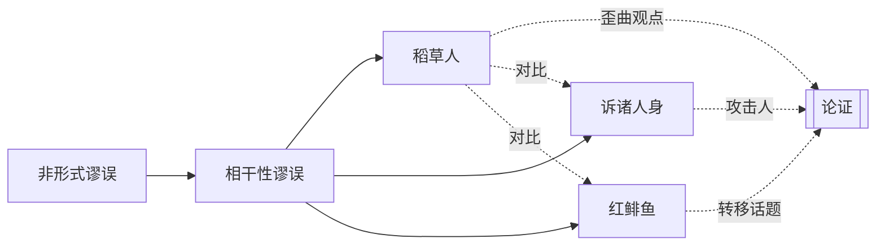

# 稻草人

> [!abstract] 概述
> 将对手的立场==歪曲为更极端、更不合理==的版本，然后攻击这个被歪曲的版本，而非对手的真实立场。

## 定义

> [!def] 稻草人（Straw Man）
> 一种非形式谬误，其特征是：在回应对手的论证时，不针对对手的==真实立场==进行反驳，而是先将其立场==误读或夸大==为一个更容易攻击的"稻草人"版本，然后对这个虚构版本展开攻击。被攻击的"稻草人"看似是对手的观点，实则已经面目全非。

"稻草人"一词的隐喻来自农田中用稻草扎成的人偶——它看起来像人，但==并非真人==，击败它毫无意义。

## 核心性质

| 性质 | 陈述 |
|------|------|
| 谬误类型 | 非形式谬误 / 相干性谬误 |
| 错误机制 | 攻击的是一个==不存在==的立场，而非对手的真实立场 |
| 逻辑根源 | 违反了"准确理解对手观点后再进行反驳"的原则 |
| 风险 | 读者可能发现夸张而==转向对手那边==，适得其反 |

## 歪曲的常见手法

| 手法 | 说明 | 示例 |
|------|------|------|
| ==极端化== | 将对手的温和立场夸大为极端版本 | 甲："我认为应该适当增加教育投入。" 乙歪曲为："你想把所有钱都花在教育上，让国防经费归零！" |
| ==过度简化== | 将对手的细致论证压缩为一句荒谬的断言 | 甲："基因对智力有一定影响，但环境和教育同样重要。" 乙歪曲为："你认为智力完全由基因决定。" |
| ==断章取义== | 截取对手论述的一部分，脱离上下文使其显得荒谬 | 只引用对手论证中的一个前提，忽略其限定条件和结论 |
| ==虚构立场== | 直接编造一个对手从未主张过的观点并加以攻击 | "你们这些环保主义者就是想让所有人都回到石器时代。" |

## 与其他概念的区别

### 与[[诉诸人身]]的区别

| 维度 | 诉诸人身 | 稻草人 |
|------|----------|--------|
| 攻击对象 | 攻击==提出论证的人== | 攻击被==歪曲的观点== |
| 歪曲方式 | 不涉及观点歪曲，直接攻击个人 | 先歪曲观点，再攻击歪曲后的版本 |
| 核心错误 | "谁在说"不等于"说得对不对" | "对手没说过"不等于"对手的观点被驳倒了" |

### 与红鲱鱼（Red Herring）的区别

| 维度 | 稻草人 | 红鲱鱼 |
|------|--------|--------|
| 策略 | ==歪曲==对手的现有观点 | ==引入==一个全新的、无关的话题 |
| 关系 | 与原话题有表面关联（因为是对原观点的歪曲） | 与原话题完全无关 |
| 效果 | 让听众以为对手的观点很荒谬 | 让听众的注意力从原话题上转移开 |

> [!tip] 快速识别
> - 如果对方攻击的是一个你==从未说过==的观点 → 稻草人
> - 如果对方突然把话题引向一个==完全不同的方向== → 红鲱鱼
> - 如果对方攻击的是==你这个人==而非你的观点 → 诉诸人身

## 当代普遍性

> [!info] 政治辩论与社交媒体中的稻草人
> 稻草人谬误在当代极为普遍，尤其在以下场景中：
> - **政治辩论**：政客经常将对手的政策立场歪曲为极端版本以获取选票。
> - **社交媒体**：在信息碎片化和情绪化的传播环境中，复杂观点极易被简化为"稻草人"版本并广泛传播。
> - **文化争论**：在性别、种族、环保等议题上，各方常常攻击的是对方阵营中最极端的声音（这些声音往往不代表主流立场），而非真正进行对话。
>
> 稻草人的风险在于：一旦读者发现了夸张和歪曲，反而可能==转向对手那边==，产生与攻击者意图完全相反的效果。

## 与其他概念的关系

## 补充

> [!info] 词源
> "Straw Man"（稻草人）的用法可追溯至17世纪的英语，原指用稻草扎成的假人用于训练或恐吓。在逻辑学中，它比喻一个被故意竖立起来以便轻松击倒的==虚假论证目标==。中文翻译"稻草人"保留了这一隐喻。

## 应用

- **批判性思维**：学会识别稻草人是抵御不良论证的基本能力。当你发现自己的观点被歪曲时，应明确指出"这不是我的立场"。
- **学术写作**：在文献综述中准确呈现他人的观点，避免无意识地构建稻草人，是学术诚信的基本要求。
- **公共讨论**：在参与公共议题讨论时，应先确保准确理解对方的真实立场（可用"你的意思是……？"来确认），再进行回应。

## 参见

- [[论证]] —— 理解论证结构是识别稻草人的基础
- [[谬误]] —— 稻草人是谬误的一种具体类型
- [[诉诸人身]] —— 另一种常见的相干性谬误，攻击的是人而非被歪曲的观点
- [[非形式谬误的四大类]] —— 稻草人属于相干性谬误这一大类
- [[稻草人-vs-红鲱鱼]] —— 稻草人与红鲱鱼的详细对比
