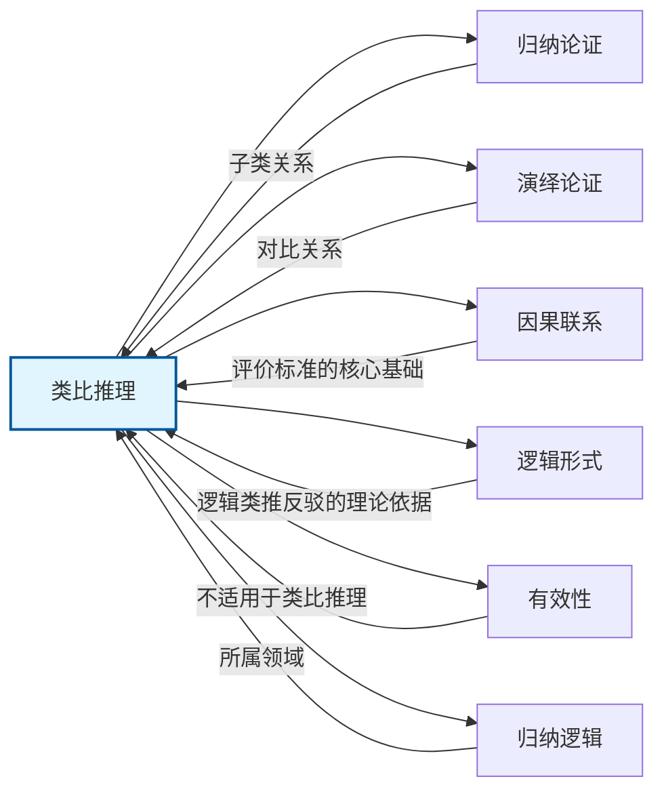

# 类比推理

> [!abstract] 概述
> ==类比推理==（analogical reasoning）是从已知相似性推出未知相似性的==归纳推理==形式。它是法律论证、科学推理和日常论证中最常用、最基本的推理方式之一。类比推理的核心思想是：如果若干实体在某些方面相似，并且其中一些实体还具有某个额外属性，那么另一个实体也可能具有该额外属性。由于结论超越了前提所含信息，类比推理只能用==概率==来刻画，不能用"有效/无效"来评价。

## 定义

> [!def] 类比推理 / 类比论证（Analogical Reasoning / Analogical Argument）
> 在两个或更多的==实体==（entities）之间进行==类比==，就是表明它们在一个或多个==方面==（respects）类似。当这种类比被用来==支持某个结论==时，就构成了==类比论证==。
>
> **标准形式：** 令 $a, b, c, d$ 表示实体，$P, Q, R$ 表示属性或"方面"，类比论证的标准形式为：
> $$\begin{aligned}
> &\text{前提1：} a, b, c, d \text{ 均具有属性 } P \text{ 和 } Q \\
> &\text{前提2：} a, b, c \text{ 均具有属性 } R \\
> &\text{结论：因而 } d \text{ 可能具有属性 } R
> \end{aligned}$$
>
> 更一般地，若前提中有 $n$ 个实例 $a_1, a_2, \ldots, a_n$ 和 $k$ 个共有属性 $P_1, P_2, \ldots, P_k$：
> $$a_1, a_2, \ldots, a_n \text{ 和 } c \text{ 都具有 } P_1, P_2, \ldots, P_k$$
> $$a_1, a_2, \ldots, a_n \text{ 都具有 } Q$$
> $$\therefore c \text{ 也可能具有 } Q$$

**核心特征：** 类比论证是==扩展性推理==（ampliative reasoning）——结论超越了前提所含信息。属性 $P_1, P_2, \ldots, P_k$ 是所有被比较实体的==共同点==，属性 $Q$ 是已知实体具有但目标实体是否具有尚待推断的属性。类比推理的本质是：==因为 $c$ 在其他方面与 $a_1, a_2, \ldots, a_n$ 相似，所以 $c$ 可能也在 $Q$ 这一方面与它们相似==。

## 核心性质

| 性质 | 说明 |
|:-----|:-----|
| ==归纳性== | 类比论证是[[归纳论证]]的子类，结论具有概率性而非确定性 |
| ==概率性== | 前提为真时，结论可能为真但不必然为真，用"强/弱"而非"有效/无效"评价 |
| ==依赖因果联系== | 论证强度取决于共有属性与结论属性之间是否存在==因果联系==（参见[[因果联系]]） |
| ==非确定性== | 类比论证永远不能演绎地证明其结论，结论始终保留被新证据推翻的可能 |
| ==可被附加信息影响== | 增加新前提可能强化或弱化原有论证（与[[演绎论证]]不同） |
| ==结论超出前提== | 类比推理从已知的相似性向未知的相似性扩展，结论包含前提中不包含的新信息 |

## 关系网络

- **[[归纳论证]]**：类比推理是归纳论证最常见的类型，用"强/弱"评价
- **[[演绎论证]]**：与类比推理构成推理的两大基本类型；演绎追求必然性，类比追求或然性
- **[[因果联系]]**：是评价类比论证强度的==核心标准==——共有属性与结论属性之间有因果联系时，论证最强
- **[[逻辑形式]]**：通过逻辑类推进行反驳时，论证形式是关键——同形式论证共享强度特征
- **[[有效性]]**：有效性是[[演绎论证]]的专属标准，==不适用于==类比推理
- **[[归纳逻辑]]**：类比推理是归纳逻辑的核心议题之一

## 第11章：类比论证

### 类比论证的结构

类比论证由三个基本要素构成：

| 要素 | 说明 | 在标准形式中的位置 |
|:-----|:-----|:-------------------|
| ==实体==（entities） | 被比较的对象 | $a, b, c, d$ |
| ==属性/方面==（respects） | 实体所具有的特征、性质或关系 | $P, Q, R$ |
| ==结论==（conclusion） | 从已知相似性推出的未知相似性 | $\therefore d$ 可能有 $R$ |

**注意：** 实体数量不必恰好是四个，属性数量不必恰好是三个。例如，教材中关于行星有人居住的论证涉及六个实体和八个方面的类比。

### 非论证性类比

并非所有类比都是论证。类比在语言中有多种用途：

| 类型 | 目的 | 是否包含推理 | 示例 |
|:-----|:-----|:------------|:-----|
| ==论证性类比== | 支持某个结论 | 是 | "教师应当参加资格考试，因为律师和医生都需要" |
| 描述性类比 | 创造鲜活画面 | 否 | "她的眼睛像星星" |
| 说明性类比 | 帮助理解陌生事物 | 否 | "原子结构类似太阳系" |
| 表达性类比 | 传达观点立场 | 否 | "谈论基督教而不谈论原罪，如同讨论园艺而不讨论种子" |

### 六大评价标准

评价类比论证的强度需要综合考虑六大标准（参见 11.3 节笔记）：

| # | 标准 | 作用方向 | 核心要点 |
|:-:|:-----|:---------|:---------|
| 1 | ==实体数量== | 增强（递减） | 前提中的实例越多，论证越强，但存在==边际递减效应== |
| 2 | ==实例多样性== | 增强 | 前提实例之间差异越大，论证越强（消解潜在差异） |
| 3 | ==相似方面数== | 增强 | 共有属性越多，结论实例具有目标属性的概率越大 |
| 4 | ==相关性== | ==最关键== | 共有属性与结论属性之间有==因果联系==时，论证最强 |
| 5 | ==差异性== | 削弱 | 前提实例与结论实例之间的差异==削弱==论证 |
| 6 | ==结论适度性== | 调节 | 结论越==适度==，论证越强；结论越大胆，前提负担越重 |

> [!warning] 核心洞见
> ==相关性==（尤其是因果联系）是六大标准中==最关键==的。一个高度相关的单一因素比大量不相关的因素更有说服力。教材明确指出："单个高相关因素对论证的贡献比一堆不相关的类似更大。"

### 逻辑类推反驳

==通过逻辑类推进行的反驳==（refutation by logical analogy）是检验论证形式有效性的有力工具（参见 11.4 节笔记）：

**核心策略：** 构造一个与目标论证具有==相同逻辑形式==但结论明显不可接受的类比论证。

| 情形 | 反驳标准 | 反驳效力 |
|:-----|:---------|:---------|
| ==演绎反驳== | 前提真 + 结论假 + 形式相同 | 决定性的（一击致命） |
| ==归纳反驳== | 结论荒谬/不可接受 + 形式类似 | 有力的但非决定性的 |

**反驳失败的条件：** 当反驳性类比与目标论证之间存在==重要的相关差异==，且这些差异==强化==了目标论证时，反驳会适得其反。

## 应用

### 法律论证（判例类比）

类比论证在法律推理中占据==核心地位==，尤其在普通法传统中。法律类比的推理模式为：

1. **识别先例**：找到一个在相关方面与当前案件相似的已决案件
2. **提取规则**：从先例中提取指导性规则或原则
3. **类比适用**：将该规则通过类比适用于当前案件
4. **区分反类比**（distinguishing）：如果当前案件与先例存在关键差异，则可以拒绝类比

> [!example] Scalia 对质权案（Crawford v. Washington, 2004）
> Scalia 大法官将对质权案与陪审团审判案进行类比：因证据可靠而摒弃对质权，如同因被告有罪而摒弃陪审团审判——两者都是因为某个"明显"的理由而绕过宪法保障的程序权利。这一类比有力地说明了程序权利的价值不取决于特定案件中该权利是否"必要"。

### 科学推理（模型类比）

在科学发现中，类比推理是提出假说和理论模型的重要工具：

- **原子结构模型**：Rutherford 将原子结构类比为太阳系——电子围绕原子核旋转，如同行星围绕太阳旋转
- **进化论**：Darwin 将自然选择类比为人工选择（育种），从而提出自然选择理论
- **基因组计划**：Eric Lander 将人类基因组计划比作门捷列夫的周期表——正如周期表使化学元素的数据变得连贯，基因组计划也将使上万基因得到系统理解

### 日常论证

类比推理是日常生活中最常用的推理形式之一：

- **消费决策**："我以前买的那款鞋很好穿，这款是同一品牌同一型号的，所以应该也很好穿"
- **职业判断**："律师、医生、会计师都需要资格考试，教师也是专业服务提供者，所以教师也应当参加资格考试"
- **政策讨论**："星球发烧了，就像宝宝发烧要去看医生"（Al Gore 关于全球变暖的类比）

## 补充

> [!info] 类比推理的学术理论
> **来源：** Stanford Encyclopedia of Philosophy. (2025). *Analogy and Analogical Reasoning*.
>
> 评价类比推理的学术理论主要包括：
> - **Hesse 的"材料标准"理论（1966）**：关注水平关系（源领域与目标领域中各属性之间的因果/结构关系）、垂直关系（属性与底层理论之间的解释关系）和关键反类比
> - **Gentner 的"结构映射理论"（1983）**：类比推理的本质是关系结构的映射——人们倾向于映射关系而非表面属性，论证强度取决于映射的系统性
>
> 这些理论的核心共识是：只有当源领域和目标领域之间的相似性反映了==共同的因果结构或规律==时，类比推理才是有力的。

> [!info] 类比推理在中国逻辑传统中的对应
> **来源：** 《墨经·小取》
>
> 中国古代==墨家逻辑==中有极为相似的推理技术——"推"（归谬式类比推论）："推也者，以其所不取之，同於其所取者，予之也。"这与西方的通过逻辑类推进行反驳高度一致，说明类比推理是一种==跨文化的普遍逻辑技术==。

### 第12章：类比推理vs密尔五法

第12章对比了两种不同的归纳推理路径：

- 类比推理基于==相似性==推出结论，密尔五法基于==差异性==排除候选原因
- 类比推理的评价依赖六大标准，密尔方法的评价依赖方法论的严谨性
- 两种方法互补：类比推理适用于初步探索，密尔方法适用于系统检验

参见 [[密尔五法]]。

### 第13章：类比在科学探究中的作用

第13章揭示了类比推理在科学假说构建中的重要性：

- 在构建初步假说（步骤B）时，==类比推理==帮助科学家从已知现象推测未知现象
- 分类活动本身依赖类比：将新发现的实体与已知类别进行类比
- 类比推理是科学发现的创造性工具，但需要通过假说-演绎法进行严格检验

参见 [[科学说明]]。

## 参见

- [[归纳论证]] — 类比推理所属的推理类型
- [[演绎论证]] — 与类比推理相对的推理类型
- [[因果联系]] — 评价类比论证强度的核心基础
- [[有效性]] — 演绎论证的专属标准，不适用于类比推理
- [[逻辑形式]] — 逻辑类推反驳的理论依据
- [[11.2 类比论证]] — 类比论证的详细结构与实例分析
- [[11.3 类比论证的评价]] — 六大评价标准的系统阐述
- [[11.4 通过逻辑类推进行的反驳]] — 逻辑类推反驳的技术与案例
