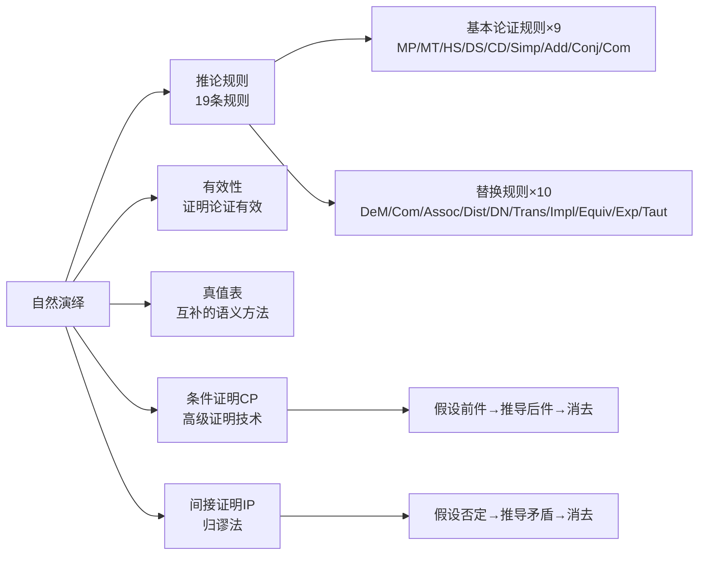

# 自然演绎

> [!abstract] 概述
> **自然演绎**（Natural Deduction）是一种通过逐步运用推论规则从前提出发演绎出结论的==形式证明方法==。与真值表的穷举性语义方法不同，自然演绎是构造性的语法方法——它模拟了人类实际推理的"一步一步"过程。自然演绎系统由Gentzen于1935年提出，其核心思想是：只要一个论证是有效的，就一定可以通过有限步有效推论从前提推出结论。第9章建立的19条规则（9条基本论证规则+10条替换规则）构成一个完备的自然演绎系统。

## 定义

> [!def] 自然演绎
> **自然演绎**是一种形式证明系统，其方法是从论证的前提出发，通过一系列==有效的演绎推论==（每一步都依据推论规则），逐步推导出论证的结论。如果能够构造出这样的推论序列，就证明了该论证的有效性。

## 核心性质

| 性质 | 描述 | 意义 |
|:-----|:-----|:-----|
| **完备性** | 任何有效的真值函项论证都可以用19条规则证明 | 不会"漏掉"任何有效论证 |
| **冗余性** | 某些规则可以从其他规则推导出来（如否定后件式可从MP+Impl.+DN推出） | 规则集不是最小的，但更方便使用 |
| **能行性** | 存在机械程序验证一个给定的推论序列是否构成有效证明 | 证明的正确性可以机械检查 |
| **构造性** | 证明是逐步构造的，每一步都有明确的理由 | 模拟人类实际推理过程 |

## 关系网络

## 跨章节应用

### 第7章：日常语言中的论证
在第7章中，假言三段论、析取三段论、二难推论等推理形式以自然语言的形式出现。第9章将这些直观的推理形式精确化为符号化的推论规则（HS、DS、CD），使其成为自然演绎系统的组成部分。

### 第8章：命题逻辑Ⅰ
第8章建立了命题逻辑的语义基础——真值函项性和真值表方法。真值表方法可以判定任何论证的有效性，但当变元增多时，真值表的行数呈指数增长（$2^n$）。第9章的自然演绎方法提供了一种替代方案，其证明长度通常远小于真值表的规模。

### 第9章：命题逻辑Ⅱ（核心章节）
第9章系统建立了自然演绎系统：
- **9.1-9.2**：引入形式证明概念和9条基本推论规则
- **9.3-9.5**：通过示例和策略讲解证明构造方法
- **9.6**：扩展10条替换规则，增强系统的表达能力
- **9.7**：论证19条规则的完备性、冗余性和能行性
- **9.8**：综合运用全部19条规则
- **9.11-9.12**：引入CP和IP作为高级证明技术

### 第10章：谓词逻辑（预期）
第10章将自然演绎方法扩展到谓词逻辑，引入全称实例化、存在泛化等新的推论规则，使自然演绎系统能够处理涉及量词的论证。

### 第10章：谓词逻辑扩展

第10章将自然演绎系统从命题逻辑扩展到谓词逻辑。核心变化：

- **规则扩展**：从19条基本规则扩展为==23条规则==（新增UI、UG、EI、EG四条量化规则）
- **量化处理**：引入全称量词 $\forall$ 和存在量词 $\exists$ 的实例化与泛化操作
- **有效性证明**：可以处理包含量词的论证形式，如三段论的精确符号化证明
- **与命题逻辑的衔接**：量化规则在消除量词后，仍然依赖19条基本规则完成推理

这一扩展使自然演绎系统能够处理几乎所有传统逻辑和现代逻辑中的演绎论证。参见 [[量词]]、[[推论规则]]。

## 参见

- [[推论规则]] — 19条推论规则的完整列表和使用要点
- [[有效性]] — 有效性的定义与判定方法
- [[真值表]] — 与自然演绎互补的语义判定方法
- [[条件证明]] — CP规则，自然演绎的高级技术
- [[间接证明]] — IP/RAA规则，归谬法
- [[逻辑等价]] — 替换规则的理论基础
- [[形式证明-vs-真值表]] — 两种方法的对比分析
