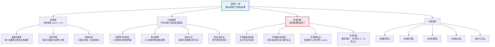

# 自然齐一性

> [!abstract] 概述
> ==自然齐一性==（Uniformity of Nature）原理是归纳推理的哲学基础，其核心主张是：==类似原因产生类似结果==。我们之所以能够从过去的经验中推断未来、从已观察的案例中归纳出普遍规律，正是因为我们预设了自然界在时间和空间上是齐一的——同样的原因在同样的条件下将始终产生同样的结果。然而，这一原理本身既不能被演绎地证明（未来可以不同于过去），也不能被归纳地证明（用归纳证明归纳将陷入循环论证）。大卫·休谟在1748年对这一原理的深刻质疑，构成了哲学史上最持久的难题之一——[[休谟问题]]。

## 定义

> [!def] 自然齐一性原理（Principle of the Uniformity of Nature）
> ==自然齐一性==原理是因果推理的基本预设：==类似原因产生类似结果==。我们承认某个特定事态是某个特定结果的原因，仅当我们同意该类型的任意其他事态（如果伴随的事态是充分类似的）将引起与先前结果同类型的另一个结果。
>
> **核心含义：**
> - 产生某个结果的一个原因，其每一次出现都是==普遍因果律==的一个实例
> - 因果律在==时间上和空间上是普遍有效==的——无论何时何地，同样的原因在同样的条件下产生同样的结果
> - 如果能够表明在另外的情形下，假定的原因发生之后假定的结果==并没有发生==，我们将放弃认为一个是另一个的原因的信念
> - 自然齐一性意味着因果律具有==可证伪性==——一个反例就足以推翻一条被大量实例支持的因果律

> [!def] 因果律作为全称命题（Causal Law as Universal Proposition）
> 因果律是断定如此这般的一个事态==恒常地==伴随着一个特定种类的现象，而无论该事态发生于何时何地的==全称命题==。用符号表示：
> $$(x)(Cx \supset Px)$$
>
> 其中 $Cx$ 表示"事态 $C$ 的一个实例"，$Px$ 表示"现象 $P$ 的一个实例"。因果律断言：对于所有 $x$，如果 $x$ 是事态 $C$ 的实例，那么 $x$ 也伴随着现象 $P$ 的实例。
>
> **关键特征：** 因果律不是对特定事件的偶然描述，而是对==普遍的、无例外的伴随关系==的断言。每一个关于因果联系的断定都==包含了普遍性的关键要素==——没有普遍性要素的因果断定只是孤立的事件描述，而非真正的因果推理。

> [!def] 因果律的普遍性要素（Universality Element of Causal Laws）
> 因为每个关于一特定事态是一特定现象原因的断定，都意味着存在某种因果律，每一个关于因果联系的断定==包含了普遍性的一个关键要素==。
>
> 这意味着：
> - 当我们说"这次扭打导致了琼斯先生的死亡"时，我们不仅仅是在描述一个偶然事件，而是在暗示存在一条普遍的因果律：在类似条件下，类似的扭打会导致类似的死亡
> - ==没有普遍性要素的因果断定是不完整的==——它只是一个孤立的事件描述，而非真正的因果推理
> - 因果律的普遍性要素正是自然齐一性原理的直接体现

## 核心性质

| 性质 | 说明 |
|:-----|:-----|
| ==经验性（非先验）== | 因果律不是纯粹逻辑的或纯粹演绎的，正如休谟所强调的，它==不能被任何先验的推理发现==。因果律只能==经验地或后验地==（即诉诸经验）发现。因果关系不在概念之中，而在经验之中 |
| ==可被怀疑（休谟问题）== | 自然齐一性原理本身无法被理性地证明——它既不是逻辑真理（未来可以不同于过去），也不能被经验证明（用经验证明它本身就是归纳推理，陷入==循环论证==）。休谟由此得出：我们对自然齐一性的信赖源于==心理习惯==而非理性推导 |
| ==归纳推理的前提假设== | 所有归纳推理——包括简单枚举归纳法、类比推理、密尔五法、假说-演绎法——都==预设了自然齐一性==。从过去的经验推断未来，需要预设"未来将类似于过去"；从已观察的案例推断未观察的案例，需要预设"未观察的案例将类似于已观察的案例" |
| ==不可被演绎或归纳证明== | 自然齐一性不能被演绎证明（因为"未来类似于过去"不是逻辑必然——其否定不蕴含矛盾），也不能被归纳证明（因为用过去的成功经验来证明"未来将类似于过去"本身就是归纳推理，而归纳推理的合理性正是我们要证明的——==循环论证==） |

> [!warning] 自然齐一性 vs 逻辑真理
> | 特征 | 逻辑真理（如 $2+2=4$） | 自然齐一性（如"类似原因产生类似结果"） |
> |:-----|:----------------------|:----------------------------------------|
> | **发现方式** | 先验推理 | 后验经验 |
> | **证明方法** | 演绎证明 | 无法被演绎或归纳证明 |
> | **否定后果** | 导致逻辑矛盾 | 不导致矛盾——未来完全可以不同于过去 |
> | **确定性** | 必然的（不可能为假） | 概然的（可能被反例推翻） |
> | **可修正性** | 不可修正 | 可被新经验修正 |
> | **认识论地位** | 理性的产物 | 习惯和心理联想的产物（休谟） |

## 关系网络

- **[[因果联系]]**：自然齐一性是因果联系的哲学基础——承认因果联系就意味着承认自然齐一性
- **[[休谟问题]]**：休谟对自然齐一性原理的质疑是归纳问题的核心——我们凭什么相信未来类似于过去？
- **[[归纳逻辑]]**：自然齐一性是所有归纳推理的预设前提，归纳逻辑的合理性依赖于这一原理
- **[[归纳论证]]**：每一个归纳论证都隐含地预设了自然齐一性——从已知推断未知需要"类似情况产生类似结果"
- **[[密尔五法]]**：密尔五法的运用预设了自然齐一性——我们之所以相信在受控实验中观察到的因果联系在未来仍然有效，正是因为预设了自然齐一性

## 第12章：因果律与自然齐一性

### 因果律与自然齐一性的关系

Copi 在第12章第2节中明确指出，因果律与自然齐一性之间存在内在的必然联系：

> "无论是在日常生活中，还是在科学中，'原因'一词的每一种用法都包含或预设了下述学说：原因和结果齐一地相连。"

这一论断揭示了以下要点：

1. **因果律 = 自然齐一性的具体化**：每一条具体的因果律（如"酸使石蕊试纸变红"）都是自然齐一性原理的一个实例——它断言这种因果关系在所有时间、所有地点都成立
2. **承认因果 = 承认齐一性**：当我们说"A 是 B 的原因"时，我们不仅仅是在描述一个特定事件，而是在承诺一条普遍的因果律——这意味着我们预设了自然齐一性
3. **齐一性的可证伪性**：如果假定的原因发生之后结果并没有发生，我们将放弃因果信念——这说明自然齐一性原理包含了可证伪性的要求

### 休谟问题对齐一性的挑战

休谟对自然齐一性的质疑构成了第12章的哲学背景，其论证结构如下：

| 论证步骤 | 内容 | 逻辑力量 |
|:---------|:-----|:---------|
| 1. 所有关于事实的推理都建立在因果关系之上 | 我们超出记忆和感官证据的唯一方式就是通过因果推理 | 前提 |
| 2. 因果关系的知识只能通过经验获得 | 我们不能先验地知道哪些事件是哪些事件的原因 | 前提 |
| 3. 经验本身依赖于自然齐一性原理 | 从过去的经验推断未来，需要预设"未来将类似于过去" | 前提 |
| 4. 自然齐一性不能被演绎证明 | "未来将类似于过去"不是逻辑真理——其否定不蕴含矛盾 | 关键步骤 |
| 5. 自然齐一性不能被归纳证明 | 用过去的成功经验来证明"未来将类似于过去"本身就是归纳推理——==循环论证== | 关键步骤 |
| 6. 结论：自然齐一性无法被理性证明 | 我们对自然齐一性的信赖源于==心理习惯==（custom），而非理性推导 | 结论 |

> [!quote] Copi 对休谟问题的表述
> "我们如何能够从经验到的普遍命题的特例，得到 $C$ 在所有情况下都伴随有 $P$？在说 $C$ 引起 $P$ 的时候就包含了这样的问题。"

### 密尔方法依赖齐一性假设

密尔五法的运用隐含地预设了自然齐一性原理：

| 密尔方法 | 齐一性假设的具体体现 |
|:---------|:---------------------|
| ==求同法== | 预设过去观察到的共同因素在未来仍然与现象相伴——即过去观察到的因果模式在未来仍然有效 |
| ==求异法== | 预设在受控实验中观察到的因果差异在类似条件下可以复现——实验结果具有普遍性 |
| ==共变法== | 预设过去观察到的共变模式在未来继续成立——定量关系具有时间上的稳定性 |
| ==剩余法== | 预设已建立的因果律在未来仍然有效——已知原因的效果可以可靠地从总效果中减去 |

> [!tip] 密尔五法的归纳性质与齐一性
> 密尔五法本质上是==归纳方法==而非演绎方法，其结论始终是或然的。这种或然性正是自然齐一性原理不可被完全证明的体现——无论我们运用密尔五法多么严格，得出的因果结论仍然可能被未来的反例推翻。密尔五法的力量在于提高因果结论的==概率==，而非提供==确定性==。

## 补充

> [!info] 从自然齐一性到概率理论：归纳逻辑的发展
> **来源：** Stanford Encyclopedia of Philosophy. (2024). *The Problem of Induction*.
>
> 自然齐一性原理面临的休谟挑战，客观上==极大地推动了归纳逻辑的发展==。从对齐一性的朴素信念到精确的概率理论，归纳逻辑经历了以下重要演进：
>
> **1. 朴素齐一性阶段（密尔之前）：**
> - 直接预设"未来将类似于过去"，不加反思地使用归纳推理
> - 密尔五法是这一阶段的最高成就——系统化地运用归纳方法，但对归纳的合理性基础缺乏深入反思
>
> **2. 概率化阶段（Keynes, Carnap）：**
> - 将归纳强度量化为概率值，建立归纳逻辑的公理系统
> - Keynes (1921) 在《论概率》中提出逻辑概率理论——概率度量前提对结论的逻辑支持度
> - Carnap (1950) 在《概率的逻辑基础》中试图证明归纳概率满足特定的逻辑约束
> - 这一阶段的核心贡献是：==承认归纳不能提供确定性，但试图为归纳强度提供精确的量化标准==
>
> **3. 贝叶斯主义阶段（de Finetti, Savage, Jeffrey）：**
> - 将概率解释为==主观确信度==（degree of belief），通过贝叶斯定理更新信念
> - 贝叶斯定理：$P(H \mid E) = \frac{P(E \mid H) \cdot P(H)}{P(E)}$
> - 核心论证：虽然归纳不能提供确定性，但==贝叶斯更新是理性信念修正的唯一一致性方法==（Dutch Book 论证）
> - 这一阶段不再直接诉诸自然齐一性，而是将归纳问题转化为==主观概率的理性更新==问题
>
> **4. 当代综合阶段：**
> - 将概率理论与因果推断结合（Pearl 的因果演算、Rubin 的潜在结果框架）
> - 不再要求为归纳提供绝对辩护，而是==接受归纳的可错性==，专注于提高归纳推理的可靠性
> - 自然齐一性原理从"需要证明的前提假设"转变为"工作假说"——我们使用它不是因为它是必然真理，而是因为==它在实践中有效==
>
> **演进的核心线索：** 从"自然齐一性是否可证明？"到"如何在不确定条件下进行最优推理？"——归纳逻辑的发展史，就是人类学会与不确定性共处的历史。

> [!info] 自然齐一性与科学革命
> **来源：** Kuhn, T. (1962). *The Structure of Scientific Revolutions*.
>
> 托马斯·库恩的科学革命理论为自然齐一性提供了一个有趣的视角：
>
> - 在==常规科学==时期，科学家们在一个范式内工作，自然齐一性原理被默认接受——他们相信已建立的因果律在未来仍然有效
> - 在==科学革命==时期，旧范式的因果律被推翻，新的因果律被建立——这相当于自然齐一性在特定领域"失效"了
> - 库恩的观点暗示：自然齐一性不是一条永恒不变的原理，而是==依赖于范式==的——不同范式预设了不同的"齐一性"
>
> 这一观点与休谟的怀疑论形成了有趣的呼应：休谟说我们无法证明自然齐一性，库恩说自然齐一性本身是可变的——两者都揭示了归纳推理的深层脆弱性。

## 参见

- [[因果联系]] — 自然齐一性是因果联系的哲学基础
- [[休谟问题]] — 休谟对自然齐一性原理的深刻质疑
- [[归纳逻辑]] — 自然齐一性是所有归纳推理的预设前提
- [[归纳论证]] — 每一个归纳论证都隐含地预设了自然齐一性
- [[密尔五法]] — 密尔五法的运用依赖于自然齐一性假设
- [[必要条件与充分条件]] — 条件关系分析是因果推理的逻辑工具
- [[12.2 因果律与自然齐一性]] — 因果律的定义与自然齐一性原理的详细讨论
- [[12.4 因果分析的方法]] — 密尔五法中齐一性假设的具体体现
