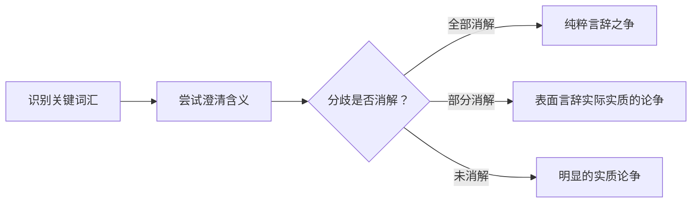
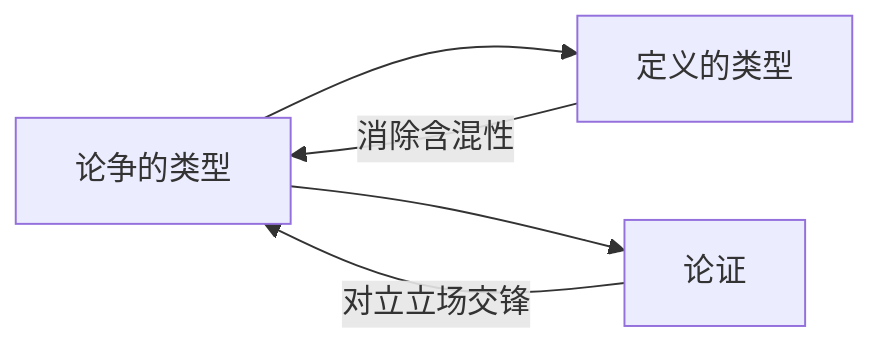

# 论争的类型

> [!abstract] 概述
> 论争（dispute）是分歧的表现形式，其本质取决于分歧的来源。==论争有三种类型==：明显的实质论争、纯粹言辞之争、以及表面言辞但实际实质的论争。区分三者的关键在于检验澄清词义后分歧是否消解。

## 定义

> [!def] 论争的三种类型（Three Types of Dispute）
> 1. **明显的实质论争**：分歧不依赖词语含义——双方对事实或态度有根本不同的判断。
> 2. **纯粹言辞之争**：不存在实质歧见，统一对某些词汇的理解就能解决。
> 3. **表面言辞但实际实质的论争**：包含对词项用法的误解，但言辞误解被澄清后仍然存在超出语词含义的歧见。

## 核心性质

| 类型 | 分歧来源 | 澄清词义后 | 示例 |
|:-----|:---------|:-----------|:-----|
| 明显的实质论争 | 事实或态度 | 分歧仍在 | A支持扬基队，B支持红袜队 |
| 纯粹言辞之争 | 词语含义 | 分歧消解 | 荒野中倒下的树是否发出"声音" |
| 表面言辞实际实质 | 词语含义 + 实质 | 部分消解，实质歧见仍存 | 露骨性影片是否为"色情作品" |

### 明显的实质论争

明显的实质论争中，双方对事实或价值有根本不同的判断，且==分歧不依赖于对任何词语的不同理解==。

> [!example] 事实上的实质论争
> C 认为迈阿密在里约热内卢南部，D 不这么认为。这涉及地理事实的判断，与词语含义无关。

> [!example] 态度上的实质论争
> A 支持扬基队，B 支持红袜队。这涉及偏好和忠诚，与"支持"或"球队"的含义无关。

### 纯粹言辞之争

纯粹言辞之争中，双方==不存在实质歧见==，表面冲突完全源于对某些关键词汇的不同理解。一旦统一词义，论争即告消解。

> [!example] 荒野中倒下的树是否发出"声音"
> - 如果"声音"指"空气震动"，则答案是肯定的
> - 如果"声音"指"人类听觉体验"，则答案是否定的
> 双方对物理事实完全一致，分歧仅在于"声音"一词的用法。

### 表面言辞但实际实质的论争

论争中确实包含对词项用法的误解，但==即使言辞层面被澄清，仍然存在超出语词含义的实质分歧==。

> [!example] 露骨性影片是否为"色情作品"
> J 认为露骨性内容本身就使其成为色情作品，K 认为具有美学价值的就是艺术。即使双方就"色情作品"的定义达成一致，他们对影片的评价（是否应当被允许、是否具有社会价值）可能仍然严重分歧。

## 论争诊断流程

面对任何论争，按以下步骤进行诊断：

> [!tip] 诊断要点
> 含混性的存在只是论争诊断的第一步。必须进一步检验：澄清词义后分歧是否完全消失？如果分歧仍然存在，那就是第三种论争。

## 与其他概念的关系

- **[[定义的类型]]**：定义是消除论争中含混性的主要工具
- **[[论证]]**：论争是论证的一种特殊形式，涉及对立立场的交锋

## 补充

> [!info] 维特根斯坦的"意义即使用"
> **来源：** Wittgenstein (1953), *Philosophical Investigations*
>
> 词语的意义不在于它所指称的某个固定对象，而在于它在语言游戏中的使用方式。许多论争之所以产生，正是因为同一个词在不同语境中被以不同方式"使用"。

> [!info] Walton 的论争类型学
> **来源：** Walton (2007), *Media Argumentation: Dialectic, Persuasion and Rhetoric*
>
> 在法律和政治辩论中，第三种论争（表面言辞但实际实质的论争）尤为常见。例如，关于"言论自由"的辩论往往涉及对"自由"一词的不同理解，但即使定义被统一，双方对自由言论的边界和限制仍然存在深刻的价值观分歧。

## 应用

1. **第4章（歧义谬误）**：未识别的言辞之争——许多歧义谬误本质上就是未能正确诊断论争类型

## 参见

- [[3.3 论争与含混性]] — 详细讨论
- [[定义的类型]] — 消除论争中含混性的主要工具
- [[论证]] — 论争与论证的关系
