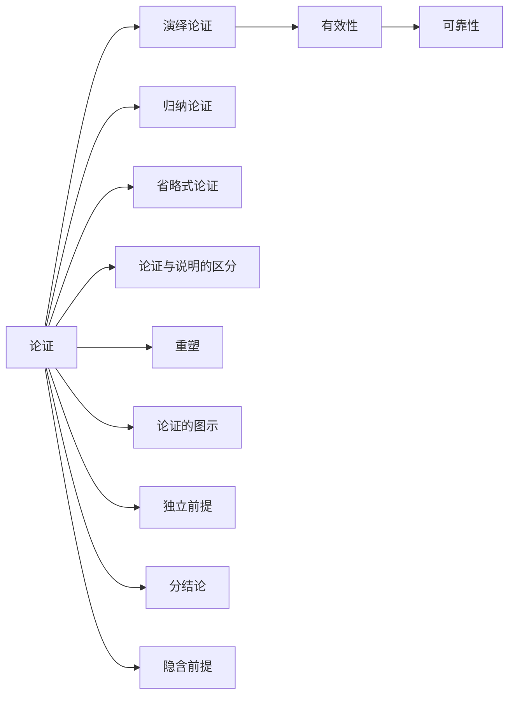

# 论证

> [!abstract] 概述
> 论证是逻辑学的核心研究对象——从一个或多个命题（前提）推出一个命题（结论）的推论。逻辑学的目标就是区分正确论证与不正确论证。

## 定义

> [!def] 论证（Argument）
> 论证是从一个或多个命题（前提）推出一个命题（结论）的推论。这样的一个命题簇就构成一个论证。

**结构：**
```
前提₁
前提₂
∴ 结论
```

- **前提**（premises）：被肯定为接受结论的根据的命题
- **结论**（conclusion）：以前提为根据所得出的命题
- **∴** 符号表示"所以"

## 核心性质

| 性质 | 说明 |
|:-----|:-----|
| 推论结构 | 论证必须有"前提→结论"的推论关系 |
| 顺序无关 | 前提和结论的出现顺序不影响论证质量 |
| 形式与内容 | 逻辑学关心论证的形式（有效性），不关心内容（真实性） |
| 省略式 | 日常论证常省略隐含前提，需先重构再评估 |

## 论证 vs 假言命题

| | 假言命题 | 论证 |
|:--|:---------|:-----|
| 结构 | "如果A，那么B" | "A。因此，B。" |
| 断定 | 只断定蕴涵关系 | 断定前提为真，推出结论 |
| 推论 | 无推论 | 有推论 |

> [!warning] 关键区分
> "如果A那么B"≠ 论证。论证==必须有推论==——结论被主张为从前提出发而得出。

## 论证的辨识工具

1. **指示词**：结论指示词（因此/所以/因而）、前提指示词（因为/由于/既然）
2. **语境**：无指示词时通过话语背景判断
3. **形式重塑**：反问句→暗示的陈述、祈使句→"你应当做X"
4. **省略式重构**：补全隐含前提后再评估

## 与其他概念的关系



## 应用

1. **第2章**：学习论证的图解分析方法
2. **第8-10章**：将论证形式化为符号系统进行精确评估
3. **日常批判性思维**：识别广告、政治演讲中的论证结构

### 第9章：笃证性论证概念

第9章（9.13节）引入了==笃证性论证==（Demonstrative Argument）作为论证评估的新维度。

- **笃证性论证**：前提==相容==且结论为==偶真陈述==（既非重言式也非矛盾式）的论证
- **三步评估法**：①检验有效性 → ②检验前提真假 → ③检验结论类型
- **论证分类**：
  - 有效 + 前提真 + 结论偶真 = 笃证性论证（最佳论证）
  - 有效 + 前提有假 = 有效但不可靠
  - 有效 + 前提不相容 = 有效但无意义（爆炸原理）
  - 无效 = 无论前提真假，论证都不成立

> [!info] 笃证性的意义
> 笃证性论证是日常论证评估中的最高标准。一个笃证性论证不仅推理正确（有效），而且前提真实、结论提供了新的信息（偶真而非重言）。这区别于重言结论的论证（如"如果天下雨则天下雨"——有效但结论无信息量）。

## 参见

- [[1.2 命题与论证]] — 命题和论证的详细讨论
- [[1.3 论证的辨识]] — 四种辨识工具
- [[命题]] — 论证的构建基块
- [[演绎论证]] — 断言必然性的论证类型
- [[有效性]] — 演绎论证的核心评估标准
- [[论证-vs-说明]] — 论证与说明的区分
- [[重塑]] — 论证分析的核心技法
- [[论证的图示]] — 论证结构的可视化方法
- [[独立前提]] — 前提的独立性判断
- [[分结论]] — 推理链中的枢纽命题
- [[隐含前提]] — 论证中未明说的必要前提
- [[重塑-vs-图示]] — 两种分析技法的对比
- [[论争的类型]] — 论争是论证的一种特殊形式
- [[情感语言与中性语言]] — 情感语言可能干扰论证的理性分析
- [[定义的类型]] — 论证中的关键术语需要精确定义
