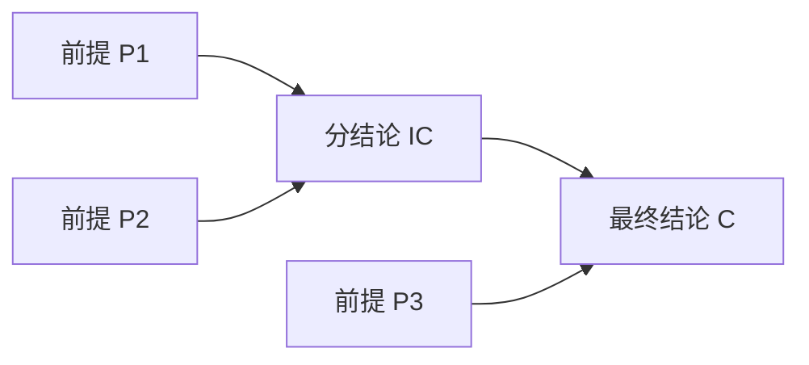
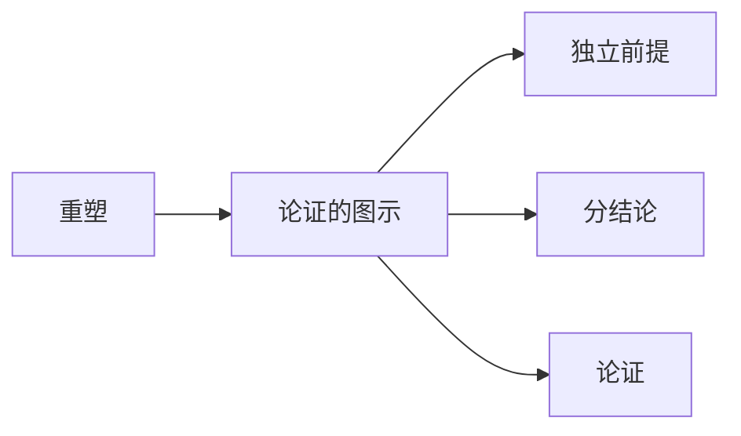

# 论证的图示

> [!abstract] 概述
> 论证的图示是一种用编号和箭头将论证中前提与结论的逻辑关联可视化的分析方法，它将抽象的推理结构转化为直观的图形表示。

## 定义

> [!def] 论证的图示（Argument Diagramming）
> 论证的图示是指给论证中每个命题赋予编号，用==箭头==展示前提与结论之间逻辑关联的可视化方法。图示法使论证的整体结构一目了然。

## 图示约定

| 约定 | 说明 |
|:-----|:-----|
| **结论在下方** | 最终结论始终置于图示的最底部 |
| **同等级前提同行** | 同一层级的前提排列在同一水平线上 |
| **箭头方向** | 箭头从前提指向结论，表示"支持"关系 |
| **编号标注** | 每个命题用数字编号，便于引用 |

## 核心区分：独立前提 vs 联合前提

图示法最重要的功能之一是区分两种不同的前提支持方式：

| 维度 | 独立前提 | 联合前提 |
|:-----|:-----|:-----|
| **定义** | 每个前提独立地为结论提供支持 | 多个前提必须共同作用才能支持结论 |
| **图示方式** | 多条箭头分别从各前提指向结论 | 用括号将前提归组，一条箭头指向结论 |
| **去掉一个的后果** | 其余前提的支持力不受影响 | 整个论证的支持力丧失或严重削弱 |

**独立前提图示示例：**
```
(1) ──────┐
          ├──→ (3)
(2) ──────┘
```
前提 (1) 和 (2) 各自独立支持结论 (3)。

**联合前提图示示例：**
```
(1) ──┐
     ├──→ (3)
(2) ──┘
```
前提 (1) 和 (2) 必须联合才能支持结论 (3)。

## 前提/结论的相对性

> [!warning] 前提与结论的相对性
> 在复杂论证中，一个命题可以==同时==是某个推理步骤的结论，又是另一个推理步骤的前提。这种"双重身份"的命题就是==分结论==（intermediate conclusion）。



## 与其他概念的关系



- **[[重塑]]**：图示以重塑为前提——先通过重塑获得清晰的命题列表，再用图示展示逻辑关联
- **[[独立前提]]**：图示法是区分独立前提与联合前提的主要工具
- **[[分结论]]**：图示法能直观展示分结论在推理链中的枢纽位置
- **[[论证]]**：图示是对论证结构进行可视化分析的方法

## 补充

> [!info] Beardsley 首创图示法
> **来源：** Beardsley, M. C. (1950). *Practical Logic*
>
> Beardsley 是第一个系统提出论证图示法的学者。他使用编号和箭头来展示论证结构，并区分了"收敛论证"（convergent argument，即独立前提）和"串联论证"（serial argument，即推理链）两种基本结构。

> [!info] Walton 对论证结构的分类
> **来源：** Walton, D. (2006). *Fundamentals of Critical Argumentation*
>
> Walton 在 Beardsley 的基础上进一步细化了论证结构的分类：
> - **收敛论证（convergent argument）**：多个独立前提分别支持同一结论
> - **串联论证（serial argument / linked argument）**：前提联合支持结论，或前提通过中间结论间接支持最终结论
> - **混合论证（hybrid argument）**：同时包含收敛和串联结构的复杂论证

## 参见

- [[2.2 论证的图示]] — 图示方法的详细讲解与练习
- [[重塑]] — 图示的前置步骤
- [[独立前提]] — 图示法区分的核心概念
- [[分结论]] — 图示法中具有双重身份的命题
- [[重塑-vs-图示]] — 重塑与图示的对比
