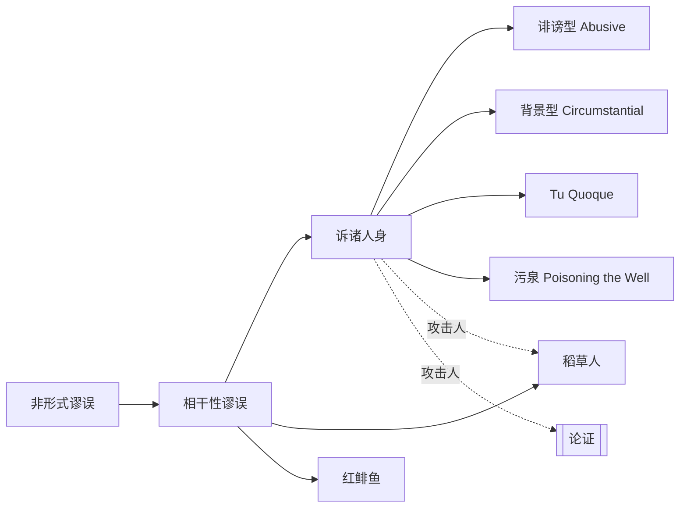

# 诉诸人身

> [!abstract] 概述
> 不攻击命题本身，转而攻击提出该命题的人，是一种典型的==相干性谬误==。

## 定义

> [!def] 诉诸人身（Ad Hominem）
> 一种非形式谬误，其特征是：在回应一个论证时，不针对论证的内容与逻辑进行反驳，而是将攻击矛头指向提出论证的==个人==——其品格、动机、背景或其他个人特征。论证的有效性取决于前提与结论之间的逻辑关系，而非提出者的个人属性，因此诉诸人身并不能在逻辑上削弱原论证。

## 两种主要形式

| 形式 | 英文 | 说明 | 示例 |
|------|------|------|------|
| ==诽谤型== | Abusive Ad Hominem | 直接攻击对手的==品格、智力、正直==等人身特质 | "你连大学都没上过，你的经济学观点不值得一听。" |
| ==背景型== | Circumstantial Ad Hominem | 以对手的==职业、国籍、政治联系、经济利益==等背景为攻击基础，暗示其论证只是出于私利 | "你当然支持减税，你是个富人。" |

## 特殊形式

### Tu Quoque（"你也是"）

> [!example] Tu Quoque
> 指控对手自身也犯有其所批评的行为，从而试图否定其批评的有效性。
>
> 甲："吸烟有害健康，应该戒烟。"
> 乙："你自己不也吸烟吗？有什么资格说别人！"
>
> 乙的回应就是一个 tu quoque：甲是否吸烟与"吸烟有害健康"这一命题的真假==毫无关系==。

### 污泉（Poisoning the Well）

> [!warning] 污泉
> 在对手开始论证==之前==，就提前 discredit 对手，使其后续的任何论证都不被听众采信。这是一种"先发制人"的诉诸人身策略。
>
> "不管他说什么，你们都别信——他可是拿了那家公司的赞助费。"
>
> 污泉之所以危险，在于它==预先设定==了对手不可信，从而绕过了对论证内容的实质性审查。

## 合理例外

> [!tip] 法律程序中的证人可信度
> 在法庭上质疑证人的==可信度==（credibility）是合理的法律策略。这与逻辑论证中的诉诸人身有本质区别：
> - 在法律程序中，证人的可信度是==证据评估的一部分==，法官和陪审团需要综合考虑证人的动机、品格、利益关系等因素来判断证言的可靠性。
> - 在逻辑论证中，论证的有效性仅取决于前提与结论之间的逻辑关系，与论证者个人无关。
>
> 因此，==法庭上质疑证人可信度 ≠ 逻辑上的诉诸人身谬误==。

## 核心性质

| 性质 | 陈述 |
|------|------|
| 谬误类型 | 非形式谬误 / 相干性谬误 |
| 错误机制 | 论证的有效性与提出者的个人属性无关；攻击人并不等于反驳论证 |
| 逻辑根源 | 违反了"回应论证而非回应论证者"的原则 |
| 普遍性 | 在政治辩论、网络讨论、日常争论中极为常见 |

## 与其他概念的关系

## 补充

> [!info] 词源与学术背景
> "Ad Hominem" 源自拉丁语，意为"针对人"。亚里士多德在《修辞学》中已讨论过类似现象。当代学者 Douglas Walton 在 *The Place of Emotion in Argument* (1992) 中对诉诸人身进行了深入分析，区分了合理的人格攻击（如法律语境中）与谬误性的人格攻击。Walton 强调，判断一个针对人的评论是否构成谬误，需要考察具体的==对话语境==（dialogical context）。

## 应用

- **政治辩论**：候选人之间的相互人身攻击是诉诸人身最常见的应用场景。
- **学术争论**：以学者的政治立场或资助来源来否定其研究成果，是背景型诉诸人身的表现。
- **日常讨论**：网络上的"查成分"行为——以对方的身份标签来否定其观点——也是一种诉诸人身。
- **批判性思维训练**：识别诉诸人身是批判性思维的基本功之一，有助于区分"谁在说"与"说了什么"。

## 参见

- [[论证]] —— 理解论证的结构是识别诉诸人身的前提
- [[谬误]] —— 诉诸人身是谬误的一种具体类型
- [[稻草人]] —— 另一种常见的相干性谬误，攻击的是被歪曲的观点而非人
- [[非形式谬误的四大类]] —— 诉诸人身属于相干性谬误这一大类
