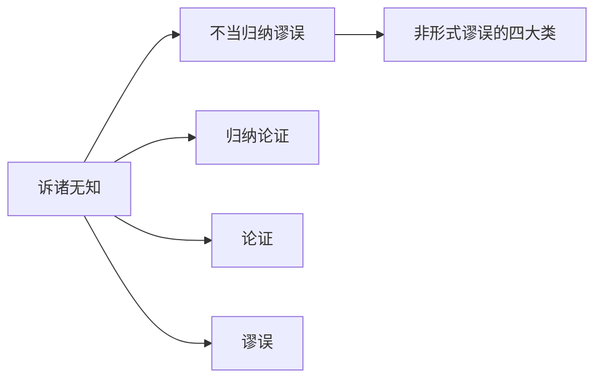

# 诉诸无知

> [!abstract] 概述
> 诉诸无知是将==缺乏证据等同于有反面证据==的谬误——因为某事未被证明为假就认为真，或未被证明为真就认为假。

## 定义

> [!def] 诉诸无知（Argumentum Ad Ignorantiam）
> 诉诸无知是将**缺乏证据**等同于**有证据证明反面**的论证错误。其核心形式有两种：
> - 因为某事**未被证明为假**，就认为它**为真**
> - 因为某事**未被证明为真**，就认为它**为假**

**错误机制：** 缺乏证据不等于有反面证据。某命题未被证明为真，可能只是因为==证据尚未被发现==、==证据已被摧毁==、==现有技术无法获取证据==等原因，而非因为该命题为假。

## 核心性质

| 性质 | 说明 |
|:-----|:-----|
| 所属类别 | 不当归纳谬误（D1）——前提与结论有一定关联但支持力太弱 |
| 错误本质 | 从"不知道"到"知道不是"的不当跳跃 |
| 举证责任 | ==主张某事存在的人有义务提供正面证据==，而非要求别人证明其不存在 |
| 常见领域 | 伪科学辩护、超自然主张、阴谋论 |

## 与其他概念的关系

- **[[非形式谬误的四大类|不当归纳谬误]]**：诉诸无知属于不当归纳谬误（D1），前提（"没有反面证据"）与结论有一定关联但支持力严重不足
- **[[归纳论证]]**：诉诸无知具有归纳论证的形式，但归纳跳跃过大
- **[[论证]]**：诉诸无知是论证评估中需要识别的典型谬误

## 补充

> [!info] 波普尔证伪主义与诉诸无知
> **来源：** Popper, K. (1959). *The Logic of Scientific Discovery*
>
> 波普尔的证伪主义与诉诸无知谬误有深刻的哲学联系。波普尔提出：==科学理论不能被"证实"（verified），只能被"证伪"（falsified）==。但波普尔强调：
>
> 1. **举证责任在主张者一方**：提出理论的人有义务使其理论经受严格检验，而非要求别人证明其理论为假
> 2. **"不能被证伪"不等于"已被证实"**：一个理论暂时未被证伪，只意味着它"目前经住了检验"，不意味着它是终极真理
> 3. **科学命题必须可证伪**：当某人声称"没有人能证明我的理论是错的"时，波普尔会回应——"那你的理论是否做出了可以被检验和证伪的预测？如果不能，它就不是科学理论，而是伪科学。"
>
> 因此，波普尔的证伪主义实际上为==识别诉诸无知提供了有力工具==：科学中的"未被证伪"是一种暂时的、有条件的接受状态，而非对理论为真的正面证明。

> [!info] 合理例外：刑事法庭上的无罪推定
> 刑事法庭上的"无罪推定"（presumption of innocence）看似是诉诸无知——"因为没能证明被告有罪，所以被告无罪"——但实际上是一个==合理的法律程序原则==，而非逻辑论证。这是因为：
> 1. 法律体系刻意将举证责任分配给控方，以保护被告的权利
> 2. "无罪"在法律语境中意味着"未被证明有罪"，而非"事实上的清白"
>
> ==无罪推定是法律制度设计，不是逻辑论证==，因此不构成诉诸无知谬误。

> [!warning] 关键区分：积极寻找证据后未发现 vs 根本没去找
> - **合理推断**：如果经过==充分、认真的调查==后仍未发现某事存在的证据，那么推断该事不存在是合理的（如：经过全面搜索后未发现某物种的存在证据，可以合理推断该物种可能已灭绝）
> - **谬误推断**：如果==根本没有进行过认真的调查==，就以"没有证据"为理由断言某事不存在，这是诉诸无知
>
> 区分的关键在于：==调查的充分性==。认真寻找后未发现，与根本没去找，是完全不同的情况。

## 应用

1. **识别伪科学论证**：伪科学家常用"没有人能证明我的理论是错的"来为其主张辩护，这是典型的诉诸无知
2. **科学讨论中的举证责任**：在科学辩论中，主张某事存在的一方有义务提供正面证据，不能将举证责任转嫁给质疑者
3. **日常批判性思维**：当有人以"没有证据证明X为假"来支持X时，追问"你是否有正面证据证明X为真？"

## 参见

- [[4.4 不当归纳谬误]] — 诉诸无知的详细章节笔记
- [[非形式谬误的四大类]] — 谬误分类体系总览
- [[归纳论证]] — 归纳论证的定义与评估标准
- [[论证]] — 论证的结构与评估
- [[谬误]] — 谬误的基本概念
