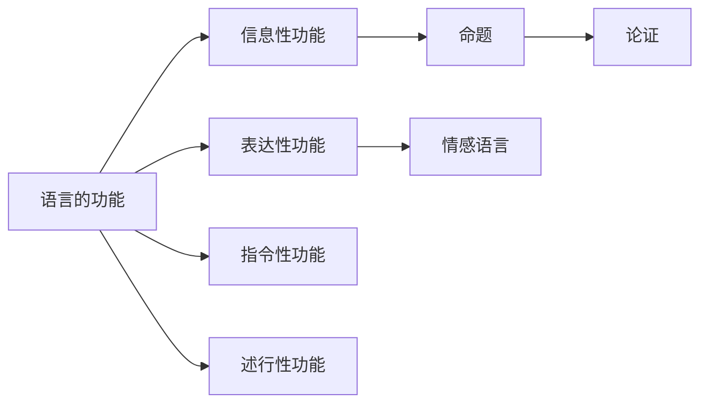

# 语言的功能

> [!abstract] 概述
> 语言在人类交流中承担多种功能，其中==信息性功能==（传达可判定真假的命题）是逻辑学的核心关注对象。语言的功能（实际用途）与语法形式（陈述句/感叹句/祈使句/疑问句）之间==没有严格对应关系==。

## 定义

> [!def] 语言的功能（Functions of Language）
> 语言的功能指语言在实际使用中所承担的用途，主要包括三大基本功能（信息性、表达性、指令性）和两种补充功能（礼节性、述行性）。

## 五种功能

### 三大基本功能

| 功能 | 目的 | 真假值 | 典型形式 | 示例 |
|:-----|:-----|:-------|:---------|:-----|
| 信息性 | 传达信息 | 或真或假 | 陈述句 | "水在100°C沸腾" |
| 表达性 | 表达情感或态度 | 无真假值 | 感叹句 | "太令人震惊了！" |
| 指令性 | 引起或阻止行动 | 无真假值 | 祈使句 | "请关门" |

### 两种补充功能

| 功能 | 目的 | 真假值 | 示例 |
|:-----|:-----|:-------|:-----|
| 礼节性 | 社交礼仪 | 无真假值 | "你好，很高兴见到你" |
| 述行性 | 说出即完成行为 | 无真假值 | "我道歉"、"我宣布开幕" |

> [!tip] 述行性功能的核心特征
> 述行性话语==不是在描述行为，而是在执行行为==。"我道歉"说出即完成道歉，"我承诺"说出即完成承诺。这一概念由 Austin (1962) 在 *How to Do Things with Words* 中系统提出。

## 功能 vs 形式

> [!warning] 关键区分
> 语言的==功能==（实际用途）与==语法形式==（陈述句/感叹句/祈使句/疑问句）之间==没有严格对应关系==。判断语言功能不能看语法形式，而要看语境和说话者的意图。

| 语法形式 | 可能承担的功能 | 示例 |
|:---------|:---------------|:-----|
| 疑问句 | 信息性（反问句断定命题） | "这本书难道不值得读吗？" |
| 陈述句 | 表达性（仅表达情感） | "今天天气真好啊" |
| 感叹句 | 指令性（暗示行动） | "都几点了！" |
| 陈述句 | 指令性（委婉建议） | "如果我是你，我不会这样做" |

## 信息性功能的二层区分

在信息模式下使用语言时，可以区分两个层次：

1. **句子所陈述的事实**：命题内容本身（如"外面在下雨"这一关于外部世界的命题）
2. **关于说话者的事实**：说话者的信念和态度（如说话者相信外面在下雨，并希望听者知道）

> [!info] 逻辑学家的关注点
> 逻辑学家主要关注==第一层==——命题本身的真假及其推理关系。第二层（说话者的信念和意图）在分析谬误时有辅助价值。

## 与其他概念的关系

- **[[命题]]**：信息性功能的核心产物，每个命题或真或假
- **[[论证]]**：由命题构成的推理结构，依赖语言的信息性功能
- **[[情感语言与中性语言]]**：表达性功能与信息性功能在语词层面的交织

## 理论背景

> [!info] Austin 的言语行为理论
> **来源：** Austin, J.L. (1962). *How to Do Things with Words*
>
> 奥斯汀提出"说话本身就是一种行为"，将话语分为述行话语（说出即完成行为）和记述话语（描述事实，可判定真假），后发展为三分模型：言内行为、言外行为、言后行为。

> [!info] Searle 的言外行为分类
> **来源：** Searle, J.R. (1976). "A Classification of Illocutionary Acts"
>
> 塞尔将言外行为分为五类：断言类（对应信息性功能）、指令类（对应指令性功能）、表达类（对应表达性功能）、承诺类和宣告类（对应述行性功能）。

## 应用

1. **第1章**：[[命题]] 依赖语言的信息性功能来传达可判定真假的陈述
2. **第4章**：谬误识别需区分语言功能——将表达性功能误作信息性功能是常见谬误来源
3. **第7章**：日常语言论证分析需从混合功能中提取信息性成分

## 参见

- [[3.1 语言的功能]] — 详细讨论与习题
- [[命题]] — 信息性功能的核心产物
- [[论证]] — 依赖信息性功能的推理结构
- [[情感语言与中性语言]] — 语词的情感维度分析
