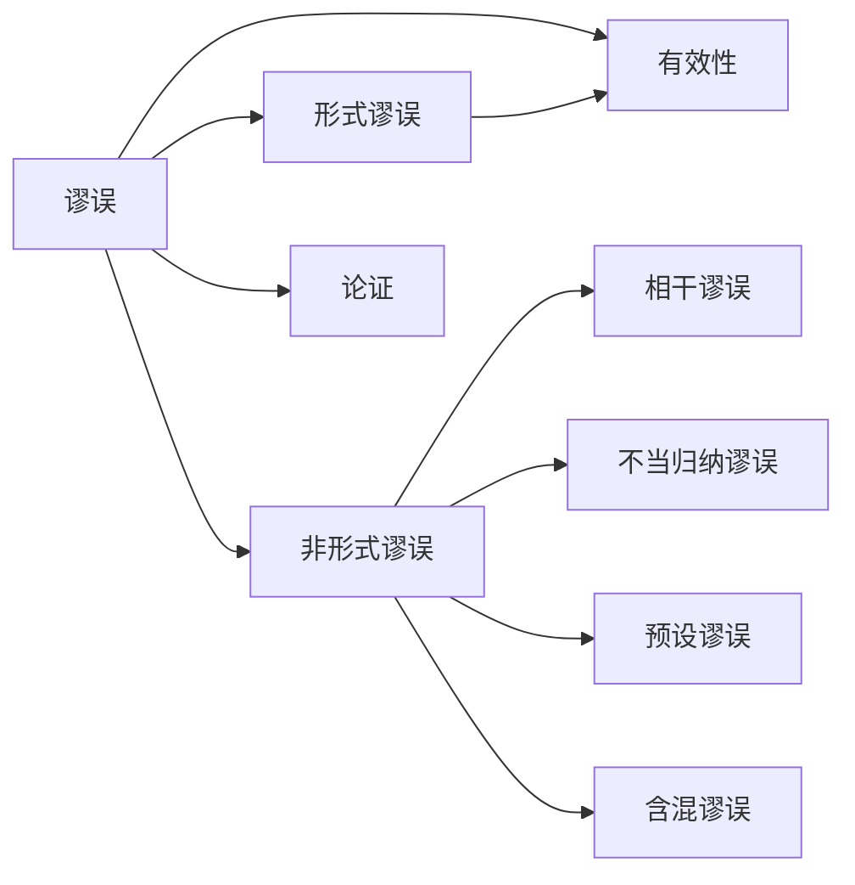

# 谬误

> [!abstract] 概述
> 谬误是逻辑学中的==推理错误==——它既可广义地指称任何推理中的失误，也可狭义地指称那些有固定模式、可识别和命名的典型错误类型。"谬误"一词具有"类型"与"个例"的双重指称。

## 定义

> [!def] 谬误（Fallacy）
> **广义**：任何推理中的错误，即前提对其结论的支持未能满足所声称的力度。
>
> **狭义**：一种有固定模式的、可识别和命名的典型推理错误。每一种谬误都是一类具有共同错误结构的论证的统称。

## 核心性质

| 性质 | 陈述 |
|:-----|:-----|
| 双重指称 | "谬误"既指==错误类型==（如"肯定后件"），也指==犯了该错误的论证个例==（如某个具体论证犯了肯定后件的谬误） |
| 模式性 | 狭义谬误具有可识别的错误模式，不同论证可能犯同一种谬误 |
| 误导性 | 谬误论证往往"看起来像"好论证，这正是其危险之处 |
| 评估依赖 | 判定谬误需要先明确论证类型（演绎/归纳）和评估标准 |

## 广义谬误 vs 狭义谬误

| 维度 | 广义谬误 | 狭义谬误 |
|:-----|:---------|:---------|
| 范围 | 所有推理错误 | 有固定模式的典型错误 |
| 识别 | 需逐案分析 | 可按模式快速识别 |
| 命名 | 不一定有专有名称 | 有专门名称（如"诉诸人身"） |
| 教学价值 | 基础概念 | ==重点研究对象== |

> [!tip] 类比理解
> 广义谬误如同"疾病"（一切健康问题），狭义谬误如同"流感"（有特定症状、可诊断、可命名的具体疾病）。说"这个论证犯了谬误"类似于说"这个病人有病"，说"这个论证犯了诉诸人身谬误"类似于说"这个病人得了流感"。

## 形式谬误 vs 非形式谬误

谬误的两大基本分类：

| 维度 | 形式谬误 | 非形式谬误 |
|:-----|:---------|:-----------|
| 错误来源 | ==推理形式==本身的错误 | 日常语言运用中的错误 |
| 适用范围 | 仅限于演绎论证 | 演绎与归纳论证均可 |
| 识别方式 | 检查论证的逻辑形式 | 需理解语言内容和语境 |
| 示例 | 肯定后件：若P则Q；Q；∴P | 诉诸人身：攻击人而非论证 |

> [!info] 形式谬误的系统研究
> 形式谬误将在==第8章==中系统研究。届时将借助形式逻辑的工具（如真值表、文恩图、演绎规则）精确识别和判定形式谬误。第4章聚焦于非形式谬误。

## 与其他概念的关系

- **[[论证]]**：谬误是论证中的缺陷，识别谬误是评估论证质量的关键环节
- **[[有效性]]**：形式谬误直接违反有效性——有效论证不可能前提真结论假，形式谬误论证则存在这种可能
- **[[演绎论证]]**：形式谬误专属于演绎论证领域
- **[[非形式谬误的四大类]]**：非形式谬误的完整分类体系

## 补充

> [!info] 学术渊源
> **来源：** Aristotle, *Sophistici Elenchi*（《辩谬篇》）
>
> 亚里士多德在《辩谬篇》中==最早系统地==研究了谬误，列出了13种谬误类型，分为"语言内的谬误"（依赖语言歧义）和"语言外的谬误"（不依赖语言歧义）。这一分类框架影响了此后两千多年的谬误研究。

> [!info] Hamblin 的批判性研究
> **来源：** Hamblin, C.L. (1970). *Fallacies*
>
> 哈姆布林在《谬误》一书中对传统谬误理论提出了深刻批判，指出标准谬误理论存在三个核心问题：（1）许多传统"谬误"实际上并非总是错误的论证模式；（2）传统分类缺乏统一的理论基础；（3）谬误的判定需要考虑论证的对话语境。这一批判推动了谬误研究的"语用转向"。

## 应用

1. **批判性思维**：识别日常论证（广告、政治演讲、媒体报道）中的谬误
2. **论证评估**：判定论证是否因谬误而失败
3. **自我纠错**：避免在自己的推理中犯谬误

## 参见

- [[非形式谬误的四大类]] — 非形式谬误的完整分类（19种）
- [[形式谬误-vs-非形式谬误]] — 两大类谬误的对比
- [[论证]] — 谬误是论证中的缺陷
- [[有效性]] — 形式谬误违反有效性
- [[演绎论证]] — 形式谬误专属于演绎论证
