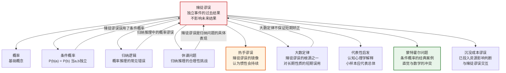

# 赌徒谬误

> [!abstract] 概述
> ==赌徒谬误==（Gambler's Fallacy）是一种概率推理错误，其核心特征是认为==独立事件的过去结果会影响未来结果==。具体表现为：当某个结果连续出现多次后，人们倾向于认为"该轮到"另一个结果出现了。例如，掷硬币连续5次正面后，认为下一次"一定是"反面。赌徒谬误的根源在于==混淆了独立事件与相关事件==，错误地将大数定律的长期性质套用于短期预测。它是概率思维中最常见、最具迷惑性的谬误之一，广泛出现在赌博、投资、体育预测和日常判断中。

## 定义

> [!def] 赌徒谬误（Gambler's Fallacy）
> ==赌徒谬误==（又称"蒙特卡洛谬误"，Monte Carlo Fallacy）是一种==非形式谬误==，指在独立重复试验中，错误地认为某个结果"该出现了"或"不会出现了"，因为它在过去已经（或没有）出现得"太多"。
>
> **典型推理模式：**
> - "硬币已经连续出了5次正面，下次==一定是==反面了。"
> - "这个号码已经10期没开了，==该轮到==它了。"
> - "他已经连续投进了5个三分球，下次==肯定==投不进了。"
>
> **错误本质：** 如果各次试验是==统计独立==的（即 $P(b \mid a) = P(b)$），那么过去的结果==不包含==关于未来结果的任何信息。每一次试验的概率都相同，不受之前结果的影响。

> [!def] 热手谬误（Hot Hand Fallacy）
> ==热手谬误==是赌徒谬误的"镜像"——认为某个结果连续出现后，会==继续==出现。
>
> - 赌徒谬误：连续正面 $\Rightarrow$ 下次一定是反面（==均值回归==的误用）
> - 热手谬误：连续正面 $\Rightarrow$ 下次还会是正面（==惯性==的误用）
>
> 两种谬误看似方向相反，但==根源相同==：都错误地认为独立事件的过去结果会影响未来结果。赌徒谬误认为过去的结果会产生"矫正力"，热手谬误认为过去的结果会产生"惯性力"，而事实上独立事件既没有矫正力也没有惯性力。

> [!tip] 赌徒谬误与热手谬误的统一理解
> 两种谬误的共同错误是==对独立性的误解==。对于真正独立的随机过程（如公平硬币的抛掷、轮盘的旋转），每一次结果都是全新的、不受历史影响的。无论之前发生了什么，下一次的概率分布完全相同。赌徒谬误和热手谬误只是同一错误在两个方向上的表现。

## 核心性质

| 性质 | 说明 |
|:-----|:-----|
| ==混淆独立事件与相关事件== | 赌徒谬误的根本错误是将==统计独立==的事件当作==概率相关==的事件。对于独立事件，$P(b \mid a) = P(b)$，过去结果不改变未来概率。赌徒谬误隐含假设 $P(\text{反面} \mid \text{连续5次正面}) > P(\text{反面})$，这对独立事件是错误的 |
| ==对大数定律的误解== | ==大数定律==（Law of Large Numbers）说的是：随着试验次数趋向无穷，频率趋近于概率。赌徒谬误错误地将这一==长期性质==理解为==短期矫正==——认为在少量试验中，频率也必须"平衡"回理论概率。大数定律不保证短期内的"矫正" |
| ==代表性启发== | 人们倾向于认为小样本应该"代表"总体特征（Tversky & Kahneman, 1971）。连续5次正面看起来"不够随机"，不符合对公平硬币的直觉，因此人们预测下一次会"矫正"回反面。这种直觉忽略了小样本中极端序列的==正常性== |
| ==设备偏差 vs 赌徒谬误== | 需要区分两种不同的情况：（1）如果设备是公平的，连续5次正面是正常波动，不预示未来结果（赌徒谬误）；（2）如果连续5次正面让我们==合理怀疑==设备不公平，那么预测继续正面可能是合理的（这是贝叶斯推理，不是谬误）。赌徒谬误在于==在假设公平的前提下仍然预测矫正== |
| ==与条件概率的关系== | 赌徒谬误本质上是对[[逻辑学/concepts/条件概率]]的误用。对于独立事件，$P(\text{结果}_n \mid \text{结果}_1, \ldots, \text{结果}_{n-1}) = P(\text{结果}_n)$，条件概率不依赖于条件。赌徒谬误错误地认为条件概率会偏离边缘概率 |
| ==情感驱动== | 赌徒谬误在赌博情境中尤为常见，因为赌徒已经投入了大量资源，心理上迫切需要相信"好运即将到来"。这涉及==沉没成本谬误==（sunk cost fallacy）和==损失厌恶==（loss aversion）的交互作用 |

> [!warning] 常见误区
> 1. **"均值回归"的误用**：均值回归是统计学中的一种现象（极端值倾向于向平均值回归），但它适用于==相关数据==（如身高、考试成绩），不适用于==独立事件==（如掷硬币）。赌徒谬误错误地将均值回归套用于独立事件
> 2. **"该轮到"的错觉**：概率不记录"历史欠账"。硬币没有记忆，不会因为"欠"反面而调整下一次的结果
> 3. **小样本中的极端序列是正常的**：在1000次抛掷中，出现连续5次正面的概率非常高（约96%）。连续5次正面并不罕见，也不需要"解释"

## 关系网络

- **[[逻辑学/concepts/概率]]**：赌徒谬误是对[[逻辑学/concepts/概率]]基本概念的误解，尤其是对==统计独立性==的误解。独立事件的定义 $P(b \mid a) = P(b)$ 直接否定了赌徒谬误的推理
- **[[逻辑学/concepts/条件概率]]**：赌徒谬误本质上是对[[逻辑学/concepts/条件概率]]的误用。对于独立事件，条件概率等于边缘概率，不依赖于条件。赌徒谬误错误地认为 $P(\text{反面} \mid \text{连续正面}) \neq P(\text{反面})$
- **[[归纳逻辑]]**：赌徒谬误是[[归纳逻辑]]中概率推理的典型错误。它展示了当人们缺乏对概率概念的精确理解时，归纳推理如何走向谬误
- **[[休谟问题]]**：赌徒谬误从另一个角度反映了[[休谟问题]]——我们倾向于从过去的观察中"归纳"出未来的模式，即使这种归纳在逻辑上是不成立的。赌徒谬误中的"均值回归"预期，本质上是一种不合理的归纳推理

## 章节扩展

### 第14章：概率推理中的赌徒谬误

第14章在讨论概率与归纳推理时，赌徒谬误作为==典型的概率推理错误==被重点分析。

#### 赌场中的赌徒谬误

> [!example] 蒙特卡洛赌场事件（1913年8月18日）
> 赌徒谬误得名于1913年在蒙特卡洛赌场发生的一个著名事件。在轮盘赌中，黑色连续出现了==26次==。赌徒们疯狂地将赌注押在红色上，坚信"红色该出现了"。然而黑色继续出现，直到第27次才转红。在这场史无前例的"黑色序列"中，赌场赚到了数百万法郎。
>
> **概率分析：**
> - 在一个公平的轮盘上（37个格子：18红、18黑、1绿），每次出现黑色的概率都是 $P(\text{黑}) = 18/37 \approx 0.486$
> - 连续26次黑色的概率：$(18/37)^{26} \approx 1.37 \times 10^{-9}$，极低但并非不可能
> - 关键在于：在第26次黑色之后，第27次出现红色的概率==仍然是== $18/37$，与之前的结果完全无关
> - 赌徒们犯的错误是：将 $P(\text{第27次红} \mid \text{前26次黑})$ 错误地估计为远大于 $P(\text{红})$
>
> 这一事件完美地展示了赌徒谬误的两个特征：（1）==独立事件无记忆==——轮盘没有记忆，不会因为"欠"红色而调整；（2）==极端序列虽然罕见但必然发生==——在足够多的试验中，任何有限长度的极端序列都几乎必然出现。

> [!quote] "所有正确的赌徒死去时都身无分文"
> 这一格言揭示了赌徒谬误的深层心理机制：赌徒之所以持续下注，往往是因为他们相信"好运即将到来"或"该轮到我了"。这种信念正是赌徒谬误的心理基础——将随机波动误解为"趋势"或"矫正"的信号。赌场之所以盈利，不是因为它操纵了概率，而是因为赌徒们系统性地误解了概率。

#### 赌徒谬误的形式化分析

> [!info] 赌徒谬误的数学表述
> 设 $X_1, X_2, \ldots, X_n$ 是独立同分布的伯努利随机变量（如掷硬币），$P(X_i = \text{正面}) = p$。
>
> **赌徒谬误的隐含假设：**
> $$P(X_{n+1} = \text{反面} \mid X_1 = \text{正面}, \ldots, X_n = \text{正面}) > P(X_{n+1} = \text{反面}) = 1 - p$$
>
> **正确结论（独立性）：**
> $$P(X_{n+1} = \text{反面} \mid X_1 = \text{正面}, \ldots, X_n = \text{正面}) = P(X_{n+1} = \text{反面}) = 1 - p$$
>
> 无论之前连续出现了多少次正面，下一次出现反面的概率==始终不变==。

## 补充

> [!info] 蒙特霍尔问题（Monty Hall Problem）
> **来源：** vos Savant, M. (1990). *Parade Magazine*.
>
> ==蒙特霍尔问题==是条件概率的经典案例，展示了直觉与数学结论之间的剧烈冲突，与赌徒谬误密切相关。
>
> **问题设定：**
> 你参加一个电视游戏节目。面前有三扇门，一扇后面是汽车，两扇后面是山羊。你选择了一扇门（比如1号门）。主持人蒙特霍尔（他知道每扇门后面是什么）打开了另一扇后面有山羊的门（比如3号门）。他问你："你要不要换到2号门？"
>
> **直觉答案（错误）：** 两扇门，一扇有车，概率各50%，换不换无所谓。
>
> **正确答案（条件概率）：** ==应该换==。换门后赢得汽车的概率是 $2/3$，不换的概率是 $1/3$。
>
> **条件概率分析：**
> $$P(\text{车在2号门} \mid \text{主持人开了3号门}) = \frac{2}{3}$$
>
> 关键在于：主持人==不是随机开门==的——他总是有目的地打开有山羊的门。这一非随机性引入了条件概率的信息更新。如果你最初选了山羊（概率 $2/3$），主持人被迫打开另一扇有山羊的门，换门后你一定赢得汽车。如果你最初选了汽车（概率 $1/3$），换门后你一定输。
>
> **与赌徒谬误的联系：** 蒙特霍尔问题中"50-50"的直觉错误与赌徒谬误有相似的心理根源——==忽视了条件信息==。赌徒谬误忽视了独立性（过去结果不提供信息），而蒙特霍尔问题中人们忽视了非独立性（主持人的行为提供了信息）。两者都展示了人类直觉在处理条件概率时的系统性偏差。

> [!info] 赌徒谬误的认知心理学解释
> **来源：** Tversky, A. & Kahneman, D. (1971). *Belief in the Law of Small Numbers*. Psychological Bulletin.
>
> 特沃斯基和卡尼曼提出了"==小数定律=="（Law of Small Numbers）的概念来解释赌徒谬误：
>
> 1. **代表性启发**（Representativeness Heuristic）：人们认为小样本应该"代表"总体的特征。连续5次正面看起来不像"随机"的，因此人们预期下一次会"矫正"回更"随机"的模式
>
> 2. **局部代表性假设**（Local Representativeness）：人们错误地认为==序列的每个局部==都应该体现总体概率。例如，在10次抛掷中，人们期望大约5次正面5次反面，并且交替出现。但事实上，10次抛掷中出现6次以上同面的概率约为75%
>
> 3. **对随机性的误解**：人们对"随机"的直觉模式过于规律化。真正的随机序列中，==聚集==（clusters）和==长游程==（long runs）的出现频率远高于人们的直觉预期
>
> 4. **控制错觉**（Illusion of Control）：赌徒倾向于认为自己可以通过"策略"（如在适当的时候加大赌注）来影响纯随机事件的结果。这种控制错觉强化了赌徒谬误——"我知道该出反面了，所以我加大赌注"
>
> 5. **确认偏误**（Confirmation Bias）：人们倾向于记住赌徒谬误"成功"的案例（某次"预测"对了），而忘记失败的案例，从而维持了对赌徒谬误的信念

> [!info] 赌徒谬误的实验证据
> **来源：** Croson, R. & Sundali, J. (2005). *The Gambler's Fallacy and the Hot Hand: Empirical Data from Casinos*. The Journal of Risk and Uncertainty.
>
> 对真实赌场数据的实证研究为赌徒谬误提供了有力证据：
>
> - 在轮盘赌中，赌徒在连续出现同一颜色后，==显著增加==对另一颜色的下注
> - 连续出现同一颜色的次数越多，赌徒押注"矫正"的倾向越强
> - 这种行为模式在==不同文化背景==的赌徒中都存在，说明赌徒谬误具有==跨文化普遍性==
> - 有趣的是，经验丰富的赌徒反而比新手更容易犯赌徒谬误——可能是因为他们更强烈地"相信"自己的直觉模式

## 应用

赌徒谬误在以下领域有重要的识别和防范价值：

- **赌博与博彩**：赌徒谬误是赌场盈利的心理基础之一。赌徒系统性地高估"矫正"的概率，导致持续下注。理解赌徒谬误是理性赌博的前提
- **投资与金融**：投资者可能认为"跌了这么久该涨了"或"涨了这么多该跌了"，而忽视了市场走势的独立性（至少在短期内）。==价值投资==与赌徒谬误的区别在于：前者基于基本面分析，后者基于对随机波动的错误解读
- **司法系统**：陪审员可能认为"已经连续3个有罪判决了，这个被告大概无罪"——这种"平衡"心理可能影响司法公正
- **体育预测**：球迷和评论员经常犯赌徒谬误或热手谬误——"他已经连续投丢了5个，下一个肯定进"或"他手感正热，继续投"
- **医疗决策**：医生可能认为"连续几个阴性结果后，该出阳性了"，影响筛查策略的制定
- **质量控制**：质检员可能认为"连续多个合格品后，该出次品了"，影响抽检策略

## 参见

- [[逻辑学/concepts/概率]] — 赌徒谬误所误解的基础概念，统计独立性的定义
- [[逻辑学/concepts/条件概率]] — 赌徒谬误本质上是对条件概率的误用，独立事件的条件概率等于边缘概率
- [[归纳逻辑]] — 赌徒谬误是归纳推理中概率推理的典型错误
- [[休谟问题]] — 赌徒谬误反映了从过去观察中归纳未来模式的深层困难
- [[谬误]] — 赌徒谬误在非形式谬误分类体系中的位置
- [[归纳论证]] — 赌徒谬误展示了不恰当的归纳推理如何导致错误结论
