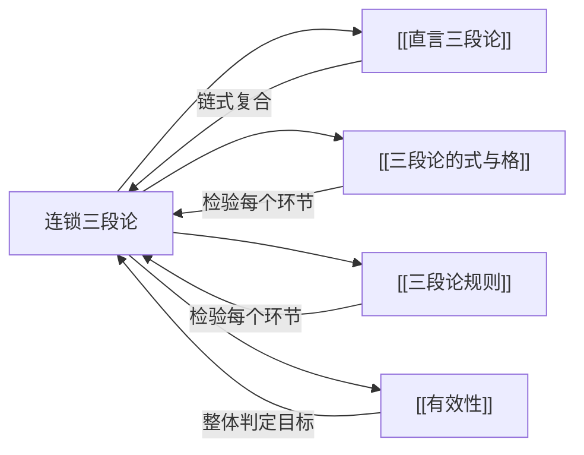

# 连锁三段论

> [!abstract] 概述
> 连锁三段论是由一系列[[直言三段论]]首尾相连构成的扩展论证，中间结论被省略，通过"链扣"机制将多个前提串联为一个整体推理。

## 定义

> [!def] 连锁三段论（Sorites）
> 连锁三段论是一种==扩展论证形式==，由一系列[[直言三段论]]首尾相连构成。在连锁三段论中，前一个三段论的结论恰好是后一个三段论的前提（即==中间结论==），但这些中间结论被==省略==不写，只保留最终结论。所有前提通过共享词项（"链扣"）串联在一起，形成一条从第一个前提到最后结论的推理链。

## 标准式要求

标准式连锁三段论必须满足以下条件：

| 条件 | 说明 |
|:-----|:-----|
| **每个词项恰好出现两次** | 与[[直言三段论]]的词项规则一致 |
| **相邻命题有共同词项** | 即"链扣"——相邻的两个命题必须共享一个词项，使推理能够传递 |
| **最终结论在末尾** | 连锁三段论以最终结论收尾，前面所有命题都是前提 |

> [!tip] "链扣"机制
> 连锁三段论的核心是==链扣==（chain link）：相邻的两个命题共享一个词项，就像链条的环节一样一环扣一环。正是通过链扣机制，多个前提的信息得以逐步传递，最终汇聚到结论中。
>
> 例如，在命题序列 $P_1, P_2, P_3, \ldots, P_n, C$ 中：
> - $P_1$ 与 $P_2$ 共享词项 $t_1$（第一个链扣）
> - $P_2$ 与 $P_3$ 共享词项 $t_2$（第二个链扣）
> - 以此类推，直到最后一个前提与结论共享词项

## 连锁三段论的结构

连锁三段论可以展开为多个标准[[直言三段论]]的链式复合。以一个包含三个前提的连锁三段论为例：

**省略中间结论的形式（连锁三段论）：**
```
前提1：所有 A 是 B
前提2：所有 B 是 C
前提3：所有 C 是 D
∴ 结论：所有 A 是 D
```

**展开为两个三段论：**

```
三段论1：
  大前提：所有 B 是 C
  小前提：所有 A 是 B
  ∴ 中间结论：所有 A 是 C    ← 被省略

三段论2：
  大前提：所有 C 是 D
  小前提：所有 A 是 C        ← 使用上一环节的中间结论
  ∴ 最终结论：所有 A 是 D
```

> [!example] 日常例子
> - **前提1**：所有哺乳动物都是动物。
> - **前提2**：所有猫都是哺乳动物。
> - **前提3**：所有家猫都是猫。
> - **∴ 结论**：所有家猫都是动物。
>
> **展开分析**：
> - 三段论1：所有哺乳动物都是动物 + 所有猫都是哺乳动物 → 所有猫都是动物（中间结论，省略）
> - 三段论2：所有猫都是动物 + 所有家猫都是猫 → 所有家猫都是动物（最终结论）

## 检验方法

检验连锁三段论的有效性，需要按以下三步操作：

| 步骤 | 操作 | 说明 |
|:-----|:-----|:-----|
| **第一步** | 揭示中间结论 | 将连锁三段论展开，补全所有被省略的中间结论 |
| **第二步** | 分别检验每个环节 | 对展开后的每一个三段论，独立应用[[三段论规则]]检验其有效性 |
| **第三步** | 整体判定 | 如果==所有环节==都是有效的，则整个连锁三段论有效；如果==任何一个环节==无效，则整体无效 |

> [!warning] 整体有效性的条件
> 连锁三段论的整体有效性要求==每一个环节==都有效。即使只有一个环节无效，整个推理链就会断裂，最终结论就无法从前提中有效推出。这与链条的物理特性一致——一环断裂，整条链条失效。

> [!example] 检验方法演示
> **连锁三段论**：
> - 前提1：所有哲学家都追求真理。
> - 前提2：所有追求真理的人都热爱智慧。
> - 前提3：所有热爱智慧的人都能理性思考。
> - ∴ 结论：所有哲学家都能理性思考。
>
> **第一步（揭示中间结论）**：
> - 中间结论1：所有哲学家都热爱智慧。（由前提1 + 前提2推出）
> - 中间结论2：所有哲学家都能理性思考。（由中间结论1 + 前提3推出）
>
> **第二步（分别检验）**：
> - 三段论1：所有追求真理的人都热爱智慧（M—P）+ 所有哲学家都追求真理（S—M）→ 所有哲学家都热爱智慧（S—P）
>   - 式：AAA-1（Barbara），==有效==
> - 三段论2：所有热爱智慧的人都能理性思考（M—P）+ 所有哲学家都热爱智慧（S—M）→ 所有哲学家都能理性思考（S—P）
>   - 式：AAA-1（Barbara），==有效==
>
> **第三步（整体判定）**：所有环节有效 → 整个连锁三段论==有效==。

## 核心性质

| 性质 | 陈述 |
|:-----|:-----|
| 构成方式 | 由多个标准[[直言三段论]]链式复合而成 |
| 中间结论省略 | 前一个三段论的结论作为后一个三段论的前提，但不显式写出 |
| 链扣机制 | 相邻命题通过共享词项（链扣）实现推理传递 |
| 词项规则 | 每个词项恰好出现两次（与标准直言三段论一致） |
| 整体有效性 | 所有环节有效 → 整体有效；任一环节无效 → 整体无效 |

## 与其他概念的关系



- **[[直言三段论]]**：连锁三段论是多个标准直言三段论的==链式复合==——每个环节都是一个独立的直言三段论
- **[[三段论的式与格]]**：展开后，每个环节的三段论都有其特定的式与格，可据此判定各环节的有效性
- **[[三段论规则]]**：检验每个环节有效性的核心工具——逐条检查六条规则
- **[[有效性]]**：连锁三段论的整体有效性取决于所有环节的有效性

## 补充

> [!info] Leibniz 的十前提连锁三段论
> **来源：** Leibniz. *Theodicy* (1710)
>
> 莱布尼茨在《神正论》中构造了一个著名的==十前提连锁三段论==，用以论证"这个世界是所有可能世界中最好的"。这个连锁三段论包含十个前提，通过层层递进的推理链，从上帝的善、智慧和全能等基本属性出发，最终推出关于世界之善的结论。
>
> 莱布尼茨的例子展示了连锁三段论在处理复杂论证时的强大能力——当推理步骤过多时，完整写出每一个中间结论会使论证变得冗长而难以把握，而连锁三段论通过省略中间结论，使论证结构更加紧凑清晰。

> [!quote] 连锁三段论的名称来源
> "Sorites"一词源自希腊语 $\sigma\omega\rho o\varsigma$（soros），意为"堆"或"堆叠"。这个名称形象地反映了连锁三段论的结构特征——多个三段论像堆叠的积木一样层层叠加，形成一个完整的推理链条。值得注意的是，"sorites"在哲学中还指"谷堆悖论"（sorites paradox），这是另一个不同的概念，不应混淆。

> [!tip] 连锁三段论 vs 省略式三段论
> 连锁三段论与[[省略式三段论]]都涉及"省略"，但省略的对象不同：
>
> | 维度 | 连锁三段论 | 省略式三段论 |
> |:-----|:-----------|:-------------|
> | 省略对象 | ==中间结论==（前一个三段论的结论） | ==大前提、小前提或结论== |
> | 论证规模 | 多个三段论的链式复合 | 单个三段论 |
> | 恢复方式 | 展开为多个三段论 | 补全一个三段论的缺失部分 |
> | 检验方法 | 分别检验每个环节 | 恢复后检验单个三段论 |

## 应用

1. **复杂论证分析**：将日常语言中的长推理链识别为连锁三段论，展开后逐环节检验其有效性
2. **科学推理**：科学理论中的推导链常常具有连锁三段论的结构——从基本公理出发，经过多个推理步骤，得出具体结论
3. **数学证明**：某些数学证明中的推导步骤可以分析为连锁三段论的各个环节
4. **哲学论证**：哲学中常见的"层层递进"式论证（如莱布尼茨的十前提连锁三段论）是连锁三段论的典型应用

## 参见

- [[直言三段论]] — 连锁三段论的构成单元
- [[三段论的式与格]] — 检验每个环节有效性的形式工具
- [[三段论规则]] — 检验每个环节有效性的六条基本规则
- [[有效性]] — 连锁三段论整体有效性的判定目标
- [[省略式三段论]] — 另一种涉及省略的三段论形式，但省略对象和结构不同
