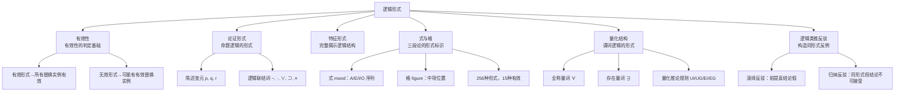

# 逻辑形式

> [!abstract] 概述
> ==逻辑形式==（logical form）是论证的结构模式——当我们忽略论证中命题的具体内容，只保留其逻辑骨架后所得到的抽象模式。==有效性是逻辑形式的属性==，而非具体内容的属性。这一原则是整个形式逻辑的基石：一个论证是否有效，完全由其逻辑形式决定，与其中涉及的具体命题真假无关。

## 定义

> [!def] 逻辑形式（Logical Form）
> ==逻辑形式==是通过用变元（如陈述变元 $p, q, r$ 或词项变元 $S, P, M$）替换论证中的具体内容成分后得到的抽象结构模式。替换时保留所有逻辑联结词（$\sim, \cdot, \vee, \supset, \equiv$）和逻辑常项（量词 $\forall, \exists$ 等）不变。

### 逻辑形式 vs 具体内容

任何论证都包含两个层面：

| 层面 | 说明 | 示例 |
|:-----|:-----|:-----|
| **具体内容** | 论证中涉及的特定命题、词项及其真假 | "所有猫都是动物"、"天下雨" |
| **逻辑形式** | 忽略具体内容后的抽象结构模式 | $p \supset q, p, \therefore q$；$\forall x(Mx \supset Px)$ |

> [!tip] 核心原则
> ==有效性取决于形式，而非内容==。两个具有相同逻辑形式的论证，其有效性状态相同——要么都有效，要么都无效。这是形式逻辑作为一门"形式科学"的根本依据。

### 替换实例（Substitution Instance）

> [!def] 替换实例
> 一个论证是某个论证形式的==替换实例==，当且仅当可以通过用具体陈述一致地替换该形式中的所有变元而得到该论证。"一致地"意味着==同一个变元的所有出现都必须被同一个陈述替换==。

**示例：** 论证形式 $p \supset q, \; p, \; \therefore q$ 的替换实例包括：
- "如果天下雨，地面就会湿。天下雨。∴ 地面会湿。"
- "如果 $2+2=4$，那么雪是白的。$2+2=4$。∴ 雪是白的。"

> [!important] 关键定理
> ==有效论证形式的所有替换实例都是有效论证==。但无效论证形式不一定只有无效的替换实例——无效形式也可以有有效的替换实例（此时有效性来自内容，而非形式）。

### 逻辑常项 vs 非逻辑常项

| 类型 | 定义 | 示例 |
|:-----|:-----|:-----|
| **逻辑常项** | 在逻辑形式中==保持不变==的成分，决定论证的逻辑结构 | $\sim$（否定）、$\cdot$（合取）、$\vee$（析取）、$\supset$（蕴涵）、$\equiv$（等价）、$\forall$（全称量词）、$\exists$（存在量词） |
| **非逻辑常项** | 在逻辑形式中被==变元替换==的成分，承载具体内容 | 具体命题（"天下雨"）、具体词项（"猫"、"动物"） |

> [!tip] 识别逻辑形式的关键
> 要提取一个论证的逻辑形式，关键在于==区分逻辑常项和非逻辑常项==：保留逻辑常项不变，用变元替换非逻辑常项。逻辑常项是"形式的骨架"，非逻辑常项是"内容的血肉"。

## 核心性质

| 性质 | 说明 |
|:-----|:-----|
| ==有效性取决于形式而非内容== | 一个论证是否有效，完全由其逻辑形式决定。同形式的所有论证共享相同的有效性状态 |
| ==同形式论证共享有效性判定== | 检验一个论证的有效性，等同于检验与其同形式的所有论证的有效性 |
| ==逻辑形式可以跨领域应用== | 同一逻辑形式可以出现在数学、法律、日常推理等完全不同的领域中，其有效性不受领域限制 |
| ==有效形式的所有替换实例都有效== | 这是判定论证有效性的核心依据——只要确认形式有效，所有具体实例都有效 |
| ==无效形式不一定只有无效实例== | 无效形式也可以有有效的替换实例，此时有效性来自内容而非形式 |

## 关系网络

## 章节扩展

### 第6章：三段论的形式性质（式与格）

在直言三段论中，逻辑形式通过==式==（mood）和==格==（figure）两个维度来刻画：

- **式**：由三个直言命题的 A/E/I/O 类型按顺序排列构成的字母序列（如 AAA、EAE、AII 等），共 $4 \times 4 \times 4 = 64$ 种
- **格**：由中项 $M$ 在大前提和小前提中的位置决定，共 4 种
- **形式总数**：$64 \times 4 = 256$ 种可能的三段论形式
- **有效形式**：在布尔解释下只有 ==15 种==有效形式

> [!example] 形式决定有效性的示例
> AAA-1（Barbara）是有效的：
> > 所有 $M$ 是 $P$。所有 $S$ 是 $M$。∴ 所有 $S$ 是 $P$。
>
> 代入具体词项："所有科学家都是人。所有物理学家都是科学家。∴ 所有物理学家都是人。"——有效。
>
> 代入另一组词项："所有猫都是动物。所有虎都是猫。∴ 所有虎都是动物。"——同样有效。
>
> ==同形式（AAA-1）的所有实例都有效==。参见 [[三段论的式与格]]、[[直言三段论的15个有效形式]]。

### 第8章：条件陈述的逻辑形式

第8章将逻辑形式的概念扩展到命题逻辑领域，引入了==论证形式==（argument form）和==特征形式==（specific form）的精确概念：

- **论证形式**：用陈述变元 $p, q, r$ 替换论证中的组成陈述后得到的模式
- **特征形式**：完整揭示论证逻辑结构的形式，是判定有效性的关键
- **常见有效论证形式**：
  - ==肯定前件式==（Modus Ponens）：$p \supset q, \; p, \; \therefore q$
  - ==否定后件式==（Modus Tollens）：$p \supset q, \; \sim q, \; \therefore \sim p$
  - ==假言三段论==（Hypothetical Syllogism）：$p \supset q, \; q \supset r, \; \therefore p \supset r$
  - ==选言三段论==（Disjunctive Syllogism）：$p \vee q, \; \sim p, \; \therefore q$
  - ==构造式二难推论==（Constructive Dilemma）：$(p \supset q) \cdot (r \supset s), \; p \vee r, \; \therefore q \vee s$

> [!info] 真值表判定
> 第8章还提供了用==真值表==机械地判定论证形式有效性的方法：一个论证形式是有效的，当且仅当不存在所有前提为真而结论为假的真值赋值。参见 [[真值表]]、[[重言式与矛盾式]]。

### 第10章：谓词逻辑的形式（量化结构）

第10章将逻辑形式进一步扩展到谓词逻辑，引入==量化结构==作为逻辑形式的新维度：

- **单称命题**：$Fa$（个体 $a$ 具有属性 $F$）
- **全称命题**：$\forall x(Fx \supset Gx)$（所有 $F$ 都是 $G$）
- **特称命题**：$\exists x(Fx \cdot Gx)$（有些 $F$ 是 $G$）
- **量化推论规则**：UI（全称实例化）、UG（全称泛化）、EI（存在实例化）、EG（存在泛化）

> [!tip] 谓词逻辑的形式丰富性
> 谓词逻辑的逻辑形式比命题逻辑远为丰富，因为它不仅能刻画命题之间的真值函项关系，还能刻画==个体、属性和量词==之间的结构关系。这使得谓词逻辑能够处理三段论等传统词项逻辑无法精确表达（或表达不够精确）的推理形式。参见 [[量词]]。

### 第11章：逻辑类推反驳

第11章将逻辑形式的概念应用于论证批判，发展出==通过逻辑类推进行的反驳==这一重要技术：

- **核心策略**：构造一个与目标论证具有==相同逻辑形式==，但结论明显不可接受的论证，从而揭示原论证的形式缺陷
- **演绎情况**：如果同形式论证的前提为真而结论为假，则原论证==必然无效==
- **归纳情况**：如果同形式论证导致荒谬结论，则原论证的结论==值得怀疑**

> [!example] 逻辑类推反驳示例
> **原论证：** 如果一个人是医生，那么他有职业。如果一个人是律师，那么他有职业。这个人既不是医生也不是律师。∴ 这个人没有职业。
>
> **反驳论证（同形式）：** 如果一只动物是猫，那么它是哺乳动物。如果一只动物是狗，那么它是哺乳动物。这匹马既不是猫也不是狗。∴ 这匹马不是哺乳动物。
>
> 反驳论证前提真但结论假（马是哺乳动物）→ 该形式无效 → 原论证无效。参见 [[类比推理]]。

## 补充

> [!info] 亚里士多德与形式有效性的起源
> **来源：** Aristotle. (c. 350 BCE). *Prior Analytics*, Book I.
>
> 亚里士多德在《前分析篇》中首次系统地阐述了形式有效性的思想。他通过将三段论的词项替换为字母（如 A、B、C）来抽象出三段论的形式结构，并系统地考察了所有可能的三段论形式，从中筛选出有效的形式。这一创举标志着逻辑学作为一门独立学科的诞生——逻辑学从此成为一门研究"形式"而非"内容"的科学。

> [!info] 逻辑常项的哲学争议
> **来源：** Stanford Encyclopedia of Philosophy. (2023). *Logical Constants*.
>
> 关于哪些表达式应当被算作"逻辑常项"，哲学界存在不同立场：
> - **弗雷格-塔斯基传统**：逻辑常项由其==真值表行为==（或模型论性质）决定——它们在所有模型中保持相同的语义功能
> - **推论主义传统**（Gentzen, Prior, Hacking）：逻辑常项由其==推论规则==决定——逻辑常项就是那些由基本推论规则引入和消去的表达式
> - **实用主义传统**：逻辑常项的选择取决于我们的==理论目标==——没有唯一正确的逻辑常项集合
>
> 这一争议直接影响"逻辑形式"这一概念的范围和边界。

## 应用

逻辑形式的概念在以下领域有重要应用：

- **数学证明**：数学定理的证明依赖逻辑形式的有效性，而非具体数学对象的内容
- **法律论证**：法官通过识别论证的逻辑形式来评估法律推理的有效性
- **计算机科学**：程序验证、类型系统、自动定理证明都基于逻辑形式的分析
- **日常批判性思维**：识别论证的逻辑形式有助于判断推理是否可靠，避免被表面内容误导

## 参见

- [[有效性]] — 有效性是逻辑形式的核心属性
- [[自然演绎]] — 通过推论规则构造形式证明的方法
- [[推论规则]] — 19条推论规则构成完备的自然演绎系统
- [[三段论的式与格]] — 三段论逻辑形式的具体刻画
- [[直言三段论的15个有效形式]] — 所有有效的三段论形式
- [[论证]] — 逻辑形式是评估论证质量的核心维度
- [[类比推理]] — 逻辑类推反驳的技术
- [[演绎论证-vs-归纳论证]] — 演绎与归纳中逻辑形式的不同角色
