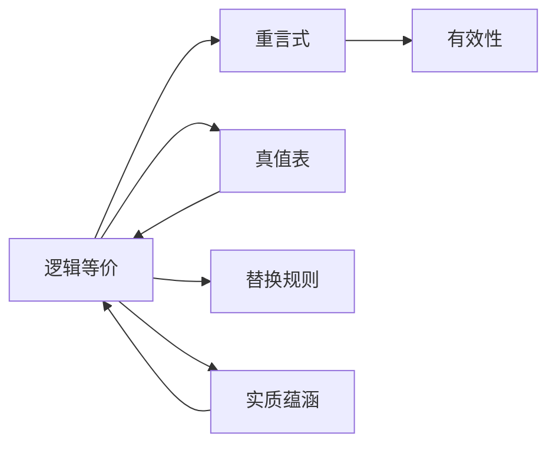

# 逻辑等价

> [!abstract] 概述
> 逻辑等价是两个陈述形式在==所有==真值组合下具有相同真值的严格关系，其等值式本身是一个[[重言式与矛盾式|重言式]]。

## 定义

> [!def] 逻辑等价（Logical Equivalence）
> 两个陈述形式 $P$ 和 $Q$ 是==逻辑等价==的（记作 $P \equiv Q$），当且仅当在==所有==可能的真值指派下，$P$ 和 $Q$ 具有相同的真值。等价地，$P \equiv Q$ 当且仅当 $P \leftrightarrow Q$（即 $P \equiv Q$）是一个[[重言式与矛盾式|重言式]]。

> [!tip] 逻辑等价 vs 实质等值
> - **逻辑等价**（Logical Equivalence）：两个陈述形式在==所有==真值组合下真值相同——这是一个==形式上的、必然的==关系。
> - **实质等值**（Material Equivalence, $\equiv$）：两个具体陈述在==当前==真值指派下真值相同——这只是一个==偶然的==事实关系。
>
> 逻辑等价比实质等值==更强==：逻辑等价的陈述一定实质等值，但实质等值的陈述未必逻辑等价。

## 核心等价关系

| 名称 | 等价式 | 说明 |
|:-----|:------|:-----|
| 双重否定律 | $p \equiv \sim\sim p$ | 否定的否定恢复原命题 |
| De Morgan 第一律 | $\sim(p \lor q) \equiv \sim p \cdot \sim q$ | 析取的否定 = 否定的合取 |
| De Morgan 第二律 | $\sim(p \cdot q) \equiv \sim p \lor \sim q$ | 合取的否定 = 否定的析取 |
| 实质蕴涵等价一 | $p \supset q \equiv \sim(p \cdot \sim q)$ | "若 p 则 q" = "并非 p 且非 q" |
| 实质蕴涵等价二 | $p \supset q \equiv \sim p \lor q$ | "若 p 则 q" = "非 p 或 q" |
| 双条件分解 | $p \equiv q \equiv (p \supset q) \cdot (q \supset p)$ | 等值 = 双向蕴涵的合取 |
| 逆否等价 | $p \supset q \equiv \sim q \supset \sim p$ | 一个蕴涵式与其逆否式逻辑等价 |

> [!example] De Morgan 定律的推广
> De Morgan 定律可推广到 $n$ 个陈述：
> - $\sim(p_1 \lor p_2 \lor \cdots \lor p_n) \equiv \sim p_1 \cdot \sim p_2 \cdot \ldots \cdot \sim p_n$
> - $\sim(p_1 \cdot p_2 \cdot \cdots \cdot p_n) \equiv \sim p_1 \lor \sim p_2 \lor \ldots \lor \sim p_n$
>
> 这意味着：对任意多个陈述的析取取否定，等价于对每个陈述分别取否定后再合取；反之亦然。

## 替换规则

> [!info] 替换规则（Rule of Replacement）
> 如果两个陈述形式是逻辑等价的，那么在一个论证或陈述中，可以用其中一个==替换==另一个，而==不改变==整个论证或陈述的真值。
>
> 这与[[有效性|有效论证形式]]中的代入规则不同：替换规则允许替换陈述的==任何部分==，而代入规则只能替换整个命题变元。

## 与其他概念的关系

- **[[重言式与矛盾式]]**：逻辑等价的判定标准——$P \equiv Q$ 当且仅当 $P \leftrightarrow Q$ 是重言式
- **[[真值表]]**：验证逻辑等价的主要工具——构造完备真值表，检查两列是否完全一致
- **[[实质蕴涵]]**：多个核心等价关系涉及蕴涵式的等价变换
- **[[有效性]]**：逻辑等价关系是论证有效性检验的基础工具

## 补充

> [!info] 历史背景
> - **De Morgan 定律** 由 Augustus De Morgan 于 1847 年在 *Formal Logic* 中首次系统阐述。
> - **实质蕴涵的等价变换** 在 Whitehead & Russell 的 *Principia Mathematica* (1910) 中被形式化。
> - **逆否等价** 可追溯至亚里士多德的《前分析篇》，是三段论理论的基石之一。

## 应用

- **简化复杂陈述**：利用等价关系将复杂的逻辑表达式化简为更易处理的形式
- **论证有效性检验**：将论证的前提和结论通过等价变换转化为标准形式，再用[[真值表]]检验
- **逻辑电路设计**：De Morgan 定律是布尔代数和数字电路设计的基本工具

### 第9章：替换规则的理论基础

第9章（9.6节）将逻辑等价关系从理论概念转化为实际的推论工具——==替换规则==（Rule of Replacement）。

- **替换规则的核心**：如果两个陈述是逻辑等价的，那么在任何论证中用一个替换另一个==不会改变论证的有效性==
- **10条替换规则**：每条替换规则都是一个逻辑等价式（重言双条件），包括De Morgan律、交换律、结合律、分配律、双重否定律、易位律、实质蕴涵律、实质等值律、输出律、重言律（参见[[推论规则]]）
- **关键区别**：替换规则可以应用于陈述的==子表达式==，而基本论证规则只能应用于==整行==

> [!tip] 替换规则 vs 基本论证规则
> 基本论证规则（如MP、MT）是单向推理——从前提推出结论。替换规则（如De M、DN）是双向的——等价陈述可以互相替换。替换规则的"部分替换"能力使其比基本规则更灵活（参见[[自然演绎]]）。

### 第10章：量词否定等价式

第10章引入了量词否定等价式，这是逻辑等价概念在谓词逻辑中的核心扩展：

$$\sim(x)\phi x \equiv (\exists x)\sim\phi x$$

$$\sim(\exists x)\phi x \equiv (x)\sim\phi x$$

> [!tip] 记忆方法
> 否定号"穿透"量词时，全称 $\forall$ 和存在 $\exists$ ==互换==，否定号留在量词后面：
> - 否定全称 → 存在否定
> - 否定存在 → 全称否定

这组等价式是谓词逻辑中公式变换的基础工具，配合德·摩根律、双重否定律和实质蕴涵定义，可以将任何公式转化为范型公式。参见 [[量词]]。

## 参见

- [[真值函项性]] — 逻辑等价的理论基础
- [[真值表]] — 验证逻辑等价的机械方法
- [[重言式与矛盾式]] — 逻辑等价的判定标准
- [[实质蕴涵]] — 多个等价关系的核心对象
- [[有效性]] — 等价关系在论证检验中的应用
