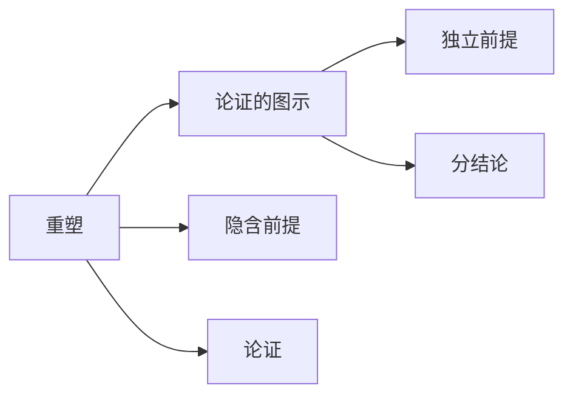

# 重塑

> [!abstract] 概述
> 重塑是用清楚的语言和逻辑顺序表明论证中命题的分析方法，是论证分析的第一步——在忠实原意的前提下，将自然语言中的论证"翻译"为结构化的逻辑表达。

## 定义

> [!def] 重塑（Paraphrasing / Reformulation）
> 重塑是指用==清楚的语言==和==逻辑顺序==将论证中各命题之间的关系明确表达出来的过程。重塑的目标是揭示论证的底层结构，使隐含的逻辑链条变得可见。

## 核心原则

重塑受两条相互竞争的原则约束，需要在两者之间取得平衡：

| 原则 | 含义 | 风险 |
|:-----|:-----|:-----|
| **忠实性（Faithfulness）** | 重塑后的论证必须忠实于原作者的意图，不能歪曲、添加或遗漏论证中的命题 | 过度忠实可能导致重塑后的表述仍然含糊不清 |
| **清晰性（Clarity）** | 重塑后的论证应当用明确的语言表达，使前提与结论的逻辑关系一目了然 | 过度清晰可能偏离原意，将作者未主张的内容强加于论证 |

> [!warning] 重塑的平衡
> 好的重塑是忠实性与清晰性的最佳平衡点：既不歪曲原意，又使论证结构清晰可辨。任何偏向一端的做法都会导致分析失真。

## 重塑 vs 改写

| 维度 | 重塑 | 改写 |
|:-----|:-----|:-----|
| **目标** | 揭示论证的逻辑结构 | 用不同语言表达相同内容 |
| **约束** | 必须忠实原意，不能改变论证的命题 | 可以自由调整措辞和表达方式 |
| **关注点** | 前提与结论之间的逻辑关系 | 语言的流畅性和可读性 |
| **产物** | 结构化的命题列表 | 语义等价的文本 |

## 与 Toulmin 论证模型的关系

重塑是 Toulmin 论证模型的==前置步骤==。Toulmin 模型将论证分解为数据（Data）、担保（Warrant）、支撑（Backing）、限定（Qualifier）、反驳（Rebuttal）和主张（Claim）六个要素，而要完成这一分解，首先必须通过重塑将自然语言论证中的命题清晰地识别出来。

## 与其他概念的关系

- **[[论证的图示]]**：重塑是图示的前提——先通过重塑获得清晰的命题列表，再用图示展示命题间的逻辑关联
- **[[隐含前提]]**：重塑过程中常会发现论证的逻辑缺口，从而揭示需要补充的隐含前提
- **[[论证]]**：重塑是对论证进行分析的第一步操作

## 补充

> [!info] van Eemeren & Grootendorst 的自由化重构规则
> **来源：** van Eemeren, F. H. & Grootendorst, R. (2004). *A Systematic Theory of Argumentation: The Pragma-Dialectical Approach*
>
> 语用辩证学派提出了"自由化重构"（liberal reconstruction）的规则体系，要求在重塑论证时遵循以下原则：
> 1. **忠实于作者意图**：重构必须基于可理解的文本证据
> 2. **最大化合理性**：在多种合理解读中，选择使论证最为合理的解读
> 3. **明确化隐含要素**：将隐含前提和未表达结论显性化
> 4. **逻辑一致性**：消除论证中的逻辑矛盾
>
> 这些规则为重塑操作提供了系统化的方法论指导。

## 参见

- [[2.1 论证的重塑]] — 重塑方法的详细讲解
- [[论证]] — 重塑的分析对象
- [[论证的图示]] — 重塑之后的下一步分析工具
- [[隐含前提]] — 重塑过程中揭示的缺失环节
- [[重塑-vs-图示]] — 重塑与图示的对比
