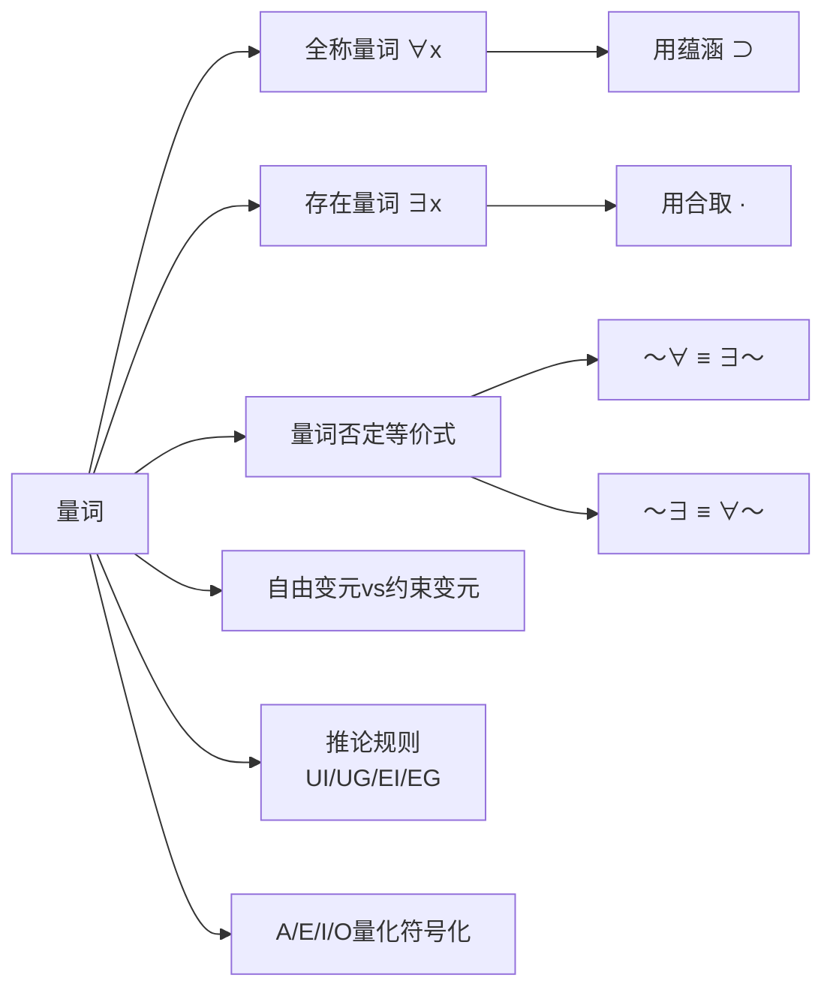

# 量词

> [!abstract] 概述
> **量词**（Quantifier）是谓词逻辑中用于表达"所有"和"有些"等数量概念的逻辑符号。第10章引入了两种基本量词：==全称量词== $\forall x$（"对所有x"）和==存在量词== $\exists x$（"存在某个x"）。量词是命题逻辑跨越到谓词逻辑的关键桥梁——它使得我们能够表达涉及个体集合的普遍性和存在性陈述，而这是命题逻辑无法做到的。

## 定义

> [!def] 全称量词
> **全称量词** $\forall x$ 表示"对于论域中的所有个体 $x$"。全称量化陈述 $\forall x \phi(x)$ 为真，当且仅当论域中==每一个==个体都满足 $\phi(x)$。

> [!def] 存在量词
> **存在量词** $\exists x$ 表示"论域中存在至少一个个体 $x$"。存在量化陈述 $\exists x \phi(x)$ 为真，当且仅当论域中==至少有一个==个体满足 $\phi(x)$。

## 核心性质

| 性质 | 全称量词 $\forall x$ | 存在量词 $\exists x$ |
|:-----|:--------------------|:--------------------|
| **含义** | 所有、每一个 | 至少有一个、有些 |
| **与联结词的关系** | 全称用蕴涵 $\supset$ | 存在用合取 $\cdot$ |
| **真值条件** | 所有实例为真 | 至少一个实例为真 |
| **否定等价式** | $\sim\forall x \phi \equiv \exists x \sim\phi$ | $\sim\exists x \phi \equiv \forall x \sim\phi$ |
| **空论域** | 空真（vacuously true） | 为假 |

## 量词否定等价式

> [!tip] 量词否定的"翻转规则"
> 否定量词时，==量词类型和否定位置同时翻转==：
> - $\sim\forall x Fx \equiv \exists x \sim Fx$（否定全称 = 存在否定）
> - $\sim\exists x Fx \equiv \forall x \sim Fx$（否定存在 = 全称否定）
>
> 直觉理解："不是所有人都..." = "存在一个人不..."；"不存在..." = "所有人都不..."

## 自由变元与约束变元

| 类型 | 定义 | 示例 |
|:-----|:-----|:-----|
| **约束变元** | 被量词绑定的变元 | $\forall x$ 中的 $x$ |
| **自由变元** | 未被任何量词绑定的变元 | $Fx \supset Gx$ 中的 $x$ |
| **量化辖域** | 量词的作用范围 | $\forall x (Fx \supset Gx)$ 中括号内是辖域 |

## 关系网络

## 跨章节应用

### 第5-6章：直言命题与三段论
A/E/I/O命题中的"所有""有些""没有"是量词的自然语言表达。第10章将它们精确化为 $\forall x(Sx \supset Px)$、$\exists x(Sx \cdot Px)$ 等量化公式。

### 第8章：命题逻辑
命题逻辑无法处理量词——它只能处理原子命题之间的真值函项关系，无法分析命题内部的结构。

### 第9章：命题逻辑Ⅱ
第9章建立了19条命题逻辑推论规则，为第10章的量化规则（UI/UG/EI/EG）提供了基础框架。

### 第10章：谓词逻辑（核心章节）
- 10.1节：阐述量化的需求
- 10.3节：系统引入全称量词和存在量词
- 10.4节：用量化符号化A/E/I/O命题
- 10.5节：引入4条量化推论规则（UI/UG/EI/EG）

## 参见

- [[自然演绎]] — 量词所属的形式证明系统
- [[推论规则]] — 4条量化规则（UI/UG/EI/EG）的完整列表
- [[有效性]] — 量化论证的有效性判定
- [[逻辑学/concepts/逻辑等价]] — 量词否定等价式
- [[直言命题]] — 量词在传统逻辑中的表达
- [[A_E_I_O 四种命题]] — 四种命题的量化符号化
- [[存在含义]] — 量词与存在含义的关系
- [[命题逻辑-vs-谓词逻辑]] — 命题逻辑与谓词逻辑的对比
