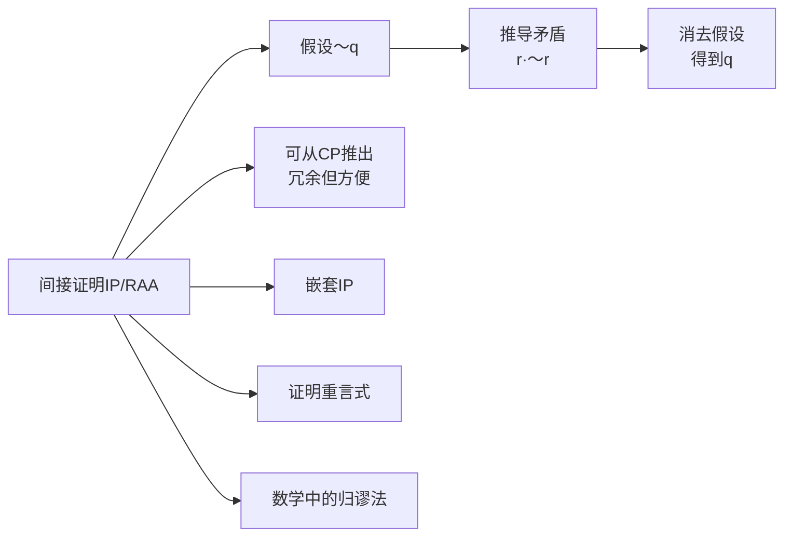

# 间接证明

> [!abstract] 概述
> **间接证明**（Indirect Proof, 简称IP），也称==归谬法==（Reductio ad Absurdum, RAA），是一种通过假设结论的否定并推导出矛盾来证明结论的证明技术。IP的规则是：如果从假设 $\sim q$（以及已有前提）推导出矛盾 $r \cdot \sim r$，那么就可以得到 $q$。IP可以从条件证明（CP）推导出来，因此IP在理论上是==冗余的==，但在实践中使用IP往往更方便。IP在数学证明中有广泛应用。

## 定义

> [!def] 间接证明（IP/RAA）
> **间接证明**的规则：如果从假设的陈述 $\sim q$（以及已有前提）以有穷步骤推断出一对矛盾陈述 $r \cdot \sim r$，那么就可以得到 $q$。IP通过"假设否定→推导矛盾→消去假设"三个步骤完成。

## 核心性质

| 性质 | 描述 |
|:-----|:-----|
| **矛盾目标** | 假设结论的否定，目标是推导出矛盾 $r \cdot \sim r$ |
| **冗余性** | IP可以从CP推导出来（通过假设 $\sim q$，推导矛盾后用DN得到 $q$） |
| **嵌套支持** | IP可以在另一个IP或CP内部嵌套使用 |
| **证明重言式** | 在无前提前提下用IP可以证明重言式 |
| **数学应用** | 归谬法是数学中最常用的证明方法之一 |

## IP与CP的关系

> [!tip] IP可以从CP推导
> IP的冗余性证明：要证明 $q$，用CP假设 $\sim q$，推导出矛盾 $r \cdot \sim r$（即 $F$），然后根据附加律从 $F$ 得到 $\sim q \lor r$，再用DN等价变换...最终通过CP消去假设得到 $\sim\sim q \supset q$，即 $q \supset q$（重言式），从而间接得到 $q$。因此IP不需要作为独立的基本规则。

## 关系网络

## 跨章节应用

### 第9章：命题逻辑Ⅱ（核心章节）
- **9.12节**：系统介绍IP规则，包括三种有效情形、IP与CP的对比、嵌套IP、IP的冗余性证明
- IP特别适用于结论为否定陈述或析取陈述的论证

### 数学证明
归谬法（IP）在数学证明中极为常见。经典例子包括：
- 欧几里得证明素数有无穷多个
- 证明 $\sqrt{2}$ 是无理数
- 证明存在无穷多个素数

## 参见

- [[自然演绎]] — IP所属的形式证明系统
- [[条件证明]] — CP规则，IP可从CP推导
- [[推论规则]] — 19条基本推论规则
- [[有效性]] — IP用于证明论证的有效性
- [[重言式与矛盾式]] — IP利用矛盾式来证明结论
- [[不相容性]] — 不相容命题集与IP的关系
- [[条件证明-vs-间接证明]] — CP与IP的对比分析
