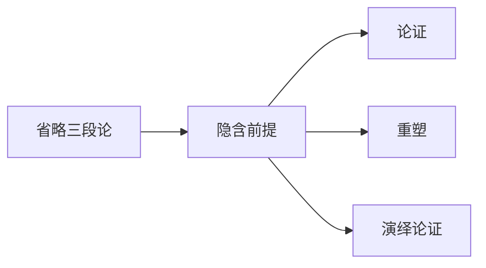

# 隐含前提

> [!abstract] 概述
> 隐含前提是论证中未明说但为论证成立所必需的前提——揭示隐含前提是论证分析的关键环节，它使论证的完整逻辑结构得以显现。

## 定义

> [!def] 隐含前提（Implicit Premise / Unstated Premise）
> 隐含前提是指论证中==未明确表述==但为论证==逻辑成立所必需==的前提。论证者默认读者能够自行补充这些前提，因此在表达时将其省略。

## 揭示方法

隐含前提的揭示通常通过以下步骤完成：

1. **重塑论证**：通过[[重塑]]将论证中明确表述的命题清晰地列出
2. **识别逻辑缺口**：检查已有前提是否足以推导出结论
3. **补充缺失环节**：找到能够弥合逻辑缺口的前提，即为隐含前提

### 揭示示例

**原始论证：**
> 苏格拉底是人，所以苏格拉底会死。

**明确前提：**
> (1) 苏格拉底是人。

**结论：**
> (2) 苏格拉底会死。

**逻辑缺口：** 从"苏格拉底是人"到"苏格拉底会死"之间缺少一个桥梁。

**隐含前提：**
> (隐) 所有人都会死。

**完整论证：**
> (1) 苏格拉底是人。
> (隐) 所有人都会死。
> ∴ (2) 苏格拉底会死。

## 与省略三段论的关系

> [!info] 省略三段论（Enthymeme）
> 隐含前提的概念与亚里士多德提出的==省略三段论==（enthymeme）密切相关。省略三段论是指省略了前提或结论的三段论。在日常论证中，省略三段论是最常见的论证形式之一。

亚里士多德在《修辞学》中首次系统讨论了省略三段论，指出修辞论证中常常省略那些被认为"显而易见"的前提，因为听众能够自行补充。

## 隐含前提的类型

| 类型 | 定义 | 示例 |
|:-----|:-----|:-----|
| **事实型隐含前提** | 陈述一个被默认为真的事实命题 | "所有人都会死"（关于世界的客观事实） |
| **规范型隐含前提** | 陈述一个被默认为正当的价值判断或行为准则 | "我们应当保护环境"（道德规范） |

> [!warning] 隐含前提的争议性
> 并非所有隐含前提都是无可争议的。有些隐含前提本身可能是有争议的，甚至可能是虚假的。揭示隐含前提的一个重要目的就是==将这些隐藏的假设暴露出来==，使其接受批判性审查。

## 与其他概念的关系

- **[[论证]]**：隐含前提是论证完整结构的组成部分，揭示隐含前提使论证变得完整
- **[[重塑]]**：重塑是揭示隐含前提的主要途径——在重塑过程中识别逻辑缺口
- **[[演绎论证]]**：隐含前提在演绎论证中尤为重要，因为演绎论证要求前提必须完整才能保证有效性

## 补充

> [!info] Aristotle 对省略三段论的论述
> **来源：** Aristotle. *Rhetoric*, Book I, Chapter 2
>
> 亚里士多德将省略三段论定义为"从不完整前提中得出的推理"。他指出，在修辞论证中，省略那些被听众普遍接受的前提是有效的说服策略，因为省略使论证更加简洁有力。然而，从逻辑分析的角度看，省略三段论必须被还原为完整的三段论才能评估其有效性。

> [!info] Walton 对隐含前提的对话分析
> **来源：** Walton, D. (2006). *Fundamentals of Critical Argumentation*
>
> Walton 从对话理论的视角分析隐含前提，提出：
> 1. 隐含前提的识别应当基于对话语境——论证者与受众之间的共同背景知识决定了哪些前提可以被省略
> 2. 隐含前提不应当被任意添加——只有那些使论证"在语境中合理"的前提才是正当的隐含前提
> 3. 揭示隐含前提的目的是促进批判性讨论，而非歪曲论证者的意图

## 参见

- [[2.1 论证的重塑]] — 揭示隐含前提的重塑方法
- [[论证]] — 隐含前提所属的论证结构
- [[重塑]] — 揭示隐含前提的主要途径
- [[演绎论证]] — 隐含前提对演绎有效性的影响
