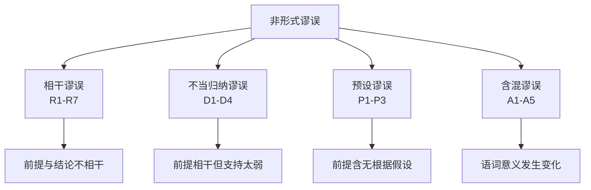
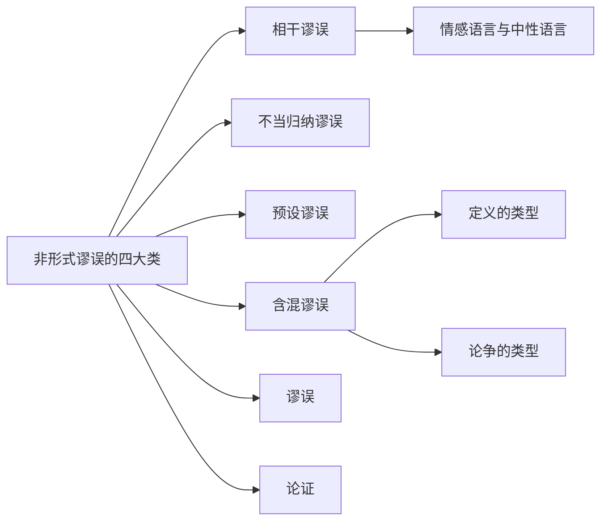

# 非形式谬误的四大类

> [!abstract] 概述
> 非形式谬误按错误性质分为四大类：==相干谬误==（前提与结论不相干）、==不当归纳谬误==（前提对结论的支持太弱）、==预设谬误==（前提含有无根据的隐藏假设）、==含混谬误==（语词或短语的意义在论证过程中发生了变化）。共计19种具体谬误。

## 定义

> [!def] 非形式谬误的四大类（Four Major Categories of Informal Fallacies）
> 非形式谬误按照其错误的根本性质，可分为以下四类：
>
> | 类别 | 编号 | 错误本质 | 核心问题 |
> |:-----|:-----|:---------|:---------|
> | 相干谬误 | R1–R7 | 前提与结论==不相干== | 前提即使为真，也与结论的成立无关 |
> | 不当归纳谬误 | D1–D4 | 前提对结论的支持==太弱== | 前提与结论相干，但支持力度远远不够 |
> | 预设谬误 | P1–P3 | 前提==含有无根据的假设== | 论证暗中预设了本身需要证明的命题 |
> | 含混谬误 | A1–A5 | 语词或短语的==意义发生了变化== | 同一语词在论证中被以不同含义使用 |

## 核心性质

| 性质 | 陈述 |
|:-----|:-----|
| 分类标准 | 按错误的==根本性质==分类，而非按论证的形式结构 |
| 灵活性 | 同一论证可能被合理地归入不同类别，分类并非绝对互斥 |
| 数量 | 共19种具体谬误，覆盖日常论证中最常见的推理错误 |
| 识别依赖 | 需要理解论证的==语言内容和语境==，无法仅凭形式判定 |

> [!warning] 分类的灵活性
> 非形式谬误的分类并非绝对互斥。同一个有缺陷的论证可能因为含有多种错误而被合理地归入不同类别。分类的目的是帮助==识别和命名==错误，而非划定僵化的界限。

## 19种非形式谬误完整列表

### 一、相干谬误（Relevance Fallacies, R1–R7）

前提与结论不相干——即使前提为真，也无法为结论提供任何支持。

| 编号 | 谬误名称 | 简述 |
|:-----|:---------|:-----|
| R1 | 诉诸人身（Ad Hominem） | 攻击论证者本人而非论证本身 |
| R2 | 诉诸人身（处境） | 以论证者的处境或利益为由否定其论证 |
| R3 | 诉诸强力（Ad Baculum） | 用威胁或武力代替推理 |
| R4 | 诉诸怜悯（Ad Misericordiam） | 用怜悯情感代替逻辑论证 |
| R5 | 诉诸无知（Ad Ignorantiam） | 因未被证明为假而断定为真，或反之 |
| R6 | 诉诸不当权威 | 引用非相关领域的"权威"来支持结论 |
| R7 | 不相干结论（Ignoratio Elenchi） | 论证得出的结论并非原本要证明的结论 |

### 二、不当归纳谬误（Inductive Fallacies, D1–D4）

前提与结论相干，但支持力度远远不够，归纳推理存在缺陷。

| 编号 | 谬误名称 | 简述 |
|:-----|:---------|:-----|
| D1 | 仓促概括（Hasty Generalization） | 从过少或不具代表性的样本推出普遍结论 |
| D2 | 错误类比（False Analogy） | 在缺乏实质相似性的对象之间进行类比推理 |
| D3 | 虚假原因（False Cause） | 错误地将某事件认定为另一事件的原因 |
| D4 | 滑坡谬误（Slippery Slope） | 不合理地声称一系列事件将不可避免地导致极端后果 |

### 三、预设谬误（Presumption Fallacies, P1–P3）

论证的前提中暗含了本身需要证明的、无根据的假设。

| 编号 | 谬误名称 | 简述 |
|:-----|:---------|:-----|
| P1 | 复杂问句（Complex Question） | 在问题中预设了未经证实的假设 |
| P2 | 虚假两难（False Dilemma） | 不合理地将选择限制为仅有的两个选项 |
| P3 | 乞题（Begging the Question / Petitio Principii） | 将结论本身或等价命题作为前提来论证结论 |

### 四、含混谬误（Ambiguity Fallacies, A1–A5）

语词或短语在论证过程中改变了含义，导致推理看似有效实则无效。

| 编号 | 谬误名称 | 简述 |
|:-----|:---------|:-----|
| A1 | 歧义（Equivocation） | 同一语词在论证中以不同含义被使用 |
| A2 | 合成（Composition） | 错误地将部分属性推广到整体 |
| A3 | 分解（Division） | 错误地将整体属性推广到部分 |
| A4 | 语义偷换（Accent） | 通过改变强调重点来改变语词或语句的含义 |
| A5 | 词形混淆（Figure of Speech） | 将比喻性语言当作字面陈述来处理 |

## 四大类的关系图

## 与其他概念的关系

- **[[谬误]]**：非形式谬误是谬误的两大基本分类之一
- **[[论证]]**：非形式谬误是论证中的常见缺陷
- **[[情感语言与中性语言]]**：情感操控是相干谬误（如诉诸怜悯）的常见手段
- **[[论争的类型]]**：含混谬误常与言辞之争密切相关——语词意义的模糊导致虚假的论争
- **[[定义的类型]]**：精确定义是消除含混谬误的主要工具

## 参见

- [[谬误]] — 谬误的基本概念
- [[形式谬误-vs-非形式谬误]] — 形式谬误与非形式谬误的对比
- [[相干谬误-vs-不当归纳谬误]] — 两大类非形式谬误的详细对比
- [[情感语言与中性语言]] — 情感语言与谬误的关系
- [[论争的类型]] — 含混性与论争的关系
- [[定义的类型]] — 定义在消除含混谬误中的作用
