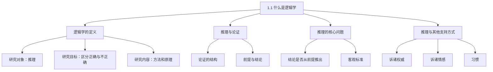

**相关笔记：** 无

> [!abstract] 概览
> 本节给出逻辑学的核心定义，阐明逻辑学的研究对象（推理）、研究目标（区分正确推理与不正确推理）和研究方法（客观标准）。核心知识点包括：
> - **逻辑学的定义**：研究用于区分正确推理与不正确推理的方法和原理的学问
> - **推理与论证**：推理是构建论证的过程，论证由前提和结论组成
> - **推理的核心问题**：结论是否从前提推出
> - **推理与其他支持方式**：诉诸权威、诉诸情感、习惯等不可替代推理

---

## 一、知识结构总览

---

## 二、核心思想与证明技巧

> [!tip] 核心思想
> 本节的核心思想是：==逻辑学不研究"什么是对的"，而是研究"如何判断一个推理过程是否正确"==。它提供的是一套客观标准，让我们能在可靠推理与谬误推理之间做出可信赖的区分。

### 关键理解

1. **逻辑学是关于"形式"而非"内容"的学问**
   - 适用场景：评估任何领域的论证（政治、科学、日常决策）
   - 典型应用：判断"因为A所以B"这个推理过程是否成立，而不关心A和B具体是什么

2. **"推出"强调的是逻辑关系，而非结论的真假**
   - 适用场景：区分"有效推理"和"可靠推理"
   - 典型应用：前提为假但推理正确的论证仍然是"有效的"（valid）

---

## 三、补充理解与易混淆点

### 补充理解

> [!info] 补充1：逻辑学的词源与学科定位
> **来源：** Bocheński, I.M. (1961). *A History of Formal Logic*. University of Notre Dame Press.
>
> "逻辑"（logic）一词源于希腊语 *logos*（逻各斯），原意为"词语"、"理性"或"论述"。Aristotle被公认为逻辑学的奠基人，他在《工具论》中首次系统研究了三段论和推理规则。在中世纪，逻辑学是"三艺"（trivium：语法、修辞、逻辑）之一，是所有学术训练的基础。19世纪以后，逻辑学经历了"数学转向"——Boole、Frege、Russell等人将逻辑学建立在严格的数学基础之上，使其从哲学的附属学科转变为独立的数学分支。

> [!info] 补充2：逻辑学与现代计算机科学
> **来源：** Turing, A. (1936). "On Computable Numbers", *Proceedings of the London Mathematical Society*, 42(1), 230-265.
>
> 逻辑学是现代计算机科学的理论基础之一。Alan Turing在1936年的论文中证明了"通用图灵机"的计算能力等价于可计算函数，而可计算函数的定义依赖于形式逻辑中的递归函数理论。现代计算机的硬件设计（布尔代数）、编程语言（类型系统、形式语义学）和人工智能（知识表示、自动推理）都建立在逻辑学的基础之上。逻辑学不仅是哲学家的工具，更是整个信息时代的理论基石。

### 易混淆点

> [!warning] 误区：逻辑学=关于真理的学问
> ❌ **错误理解：** 逻辑学研究的是"什么结论为真"——即如何发现真理。
> ✅ **正确理解：** 逻辑学研究的是"推理的有效性"——即前提与结论之间的逻辑关系。逻辑学**不关心**具体命题的真假，只关心**如果**前提为真，结论**是否必然**为真。
> **辨析：** 研究什么结论为真的是各门具体科学（如物理学、生物学）的任务，而逻辑学提供的是评估推理质量的**通用工具**。

> [!warning] 误区：逻辑学=修辞学
> ❌ **错误理解：** 逻辑学和修辞学一样，都是教人如何说服别人的技巧。
> ✅ **正确理解：** 逻辑学关注推理的**正确性**，修辞学关注论证的**说服力**。一个好的逻辑论证不一定有说服力（如果听众不理解前提），一个有说服力的论证也不一定合乎逻辑（如果它利用了谬误）。
> **辨析：** 逻辑学追求的是**客观有效性**，修辞学追求的是**主观说服效果**。两者可以互补，但本质不同。

---

## 四、习题精选

> [!todo] 习题概览
> | 题号 | 来源 | 核心考点 | 难度 |
> |:-----|:-----|:---------|:-----|
> | 1 | 自编 | 逻辑学定义的理解 | ⭐ |
> | 2 | 自编 | 推理与其他支持方式的区分 | ⭐⭐ |

### 题1：逻辑学的研究对象是什么？

> [!problem] 题目
> 根据本节的定义，逻辑学的研究对象是什么？它与研究"什么结论为真"的学科（如物理学）有何本质区别？

> [!faq]- 解答
> **[步骤1]** 逻辑学的研究对象是==推理==——具体而言，是研究用于区分正确推理与不正确推理的方法和原理。
>
> **[步骤2]** 物理学等经验科学研究"什么结论为真"（关注内容），而逻辑学研究"结论是否从前提推出"（关注形式）。逻辑学不关心前提和结论的具体内容，只关心它们之间的逻辑关系。
>
> **[步骤3]** 类比：物理学研究"这场比赛谁赢了"，逻辑学研究"裁判的判罚规则是否正确"。
>
> $\blacksquare$

> [!tip] 解题思路提示
> 关键词是"区分正确推理与不正确推理"——注意"推理"这个词，它指向的是过程而非结果。

### 题2：推理与其他支持方式

> [!problem] 题目
> 教材列举了哪些支持断言的方式？为什么说"推理"是其中唯一可完全信赖的基础？请举例说明诉诸权威和诉诸情感为什么不可靠。

> [!faq]- 解答
> **[步骤1]** 教材列举了四种支持断言的方式：==推理==、诉诸权威、诉诸情感、依据习惯。
>
> **[步骤2]** 推理是唯一可完全信赖的基础，因为逻辑学提供了客观标准来判断推理是否正确，这些标准不因人而异、可重复验证。
>
> **[步骤3]** 诉诸权威不可靠的反例："专家说这药能治百病"——专家可能犯错、利益相关、或知识过时。诉诸情感不可靠的反例："这个广告让我很感动，所以产品一定好"——情感反应与产品实际质量无逻辑关联。
>
> $\blacksquare$

---

## 五、视频学习指南

> [!info] 视频资源
> | 资源 | 链接 | 对应内容 | 备注 |
> |:-----|:-----|:---------|:-----|
> | 哈佛大学公开课：公正（Justice） | [链接](https://www.youtube.com/playlist?list=PL30C13C91CFFEFEA6) | 第1讲涉及推理与论证的引入 | 英文，可辅助理解"论证"概念 |

---

## 六、教材原文

> [!quote] 教材原文
> **来源：** 逻辑学导论 第15版，第1章第1节，第1页
>
> 逻辑学是研究用于区分正确推理与不正确推理的方法和原理的学问。
>
> 对任何问题进行推理的时候，我们都在构建论证以支持我们的结论。我们的论证包括那些我们认为可为我们的信念提供辩护的理由。然而并非所有理由都是好的。因此面对一个论证的时候，我们也许经常会问：它所得出的结论是从其假定的前提推出的吗？要回答这个问题，有着一些客观标准。研究逻辑学，也就是设法发现和应用这些标准。
>
> 要想做出完全可以信赖的判断，唯一坚实的基础就是正确的推理。运用逻辑学的方法和技术——本书的主题——我们能够在可靠推理与谬误推理之间做出可信赖的区分。

#学习/逻辑学/基本概念/逻辑学
