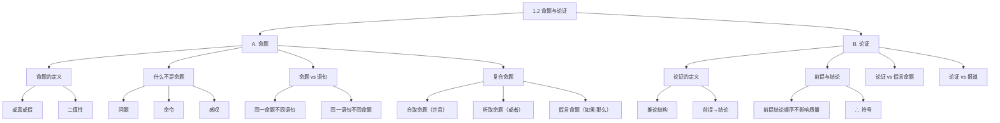

**相关笔记：** [[1.1 什么是逻辑学]] | [[1.3 论证的辨识]]

> [!abstract] 概览
> 本节系统阐述逻辑学的两个基础概念：命题（推理的构建基块）和论证（命题簇的推论结构）。核心知识点包括：
> - **命题的定义**：断定事情是或不是如此这般的陈述，或真或假
> - **命题 vs 语句**：命题是跨语言的内容，语句是语言层面的表达
> - **复合命题三种类型**：合取（并且）、析取（或者）、假言（如果-那么）
> - **论证的结构**：前提 → 结论，用 ∴ 表示"所以"
> - **论证 vs 假言命题**：论证有推论（断定前提和结论），假言命题只断定蕴涵关系

---

## 一、知识结构总览

---

## 二、核心思想与证明技巧

> [!tip] 核心思想
> 本节有两个核心精确区分，它们是后续所有逻辑分析的基础：
> 1. ==命题 vs 语句==：命题是语句所断定的**内容**（独立于语言），语句是语言层面的**表达**（依赖语言）
> 2. ==论证 vs 假言命题==：论证**断定**前提为真并从中推出结论；假言命题只断定"如果-那么"的**蕴涵关系**，不断定任何一个分支命题

### 关键理解

1. **命题的二值性是逻辑学的基石**
   - 适用场景：整个命题逻辑体系建立在"每个命题或真或假"的基础上
   - 典型应用：真值表、逻辑等价、推理规则的有效性判定

2. **复合命题的断定力度不同**
   - 适用场景：分析论证时，必须准确判断每个命题"断定了什么"
   - 典型应用：合取断定所有分支；析取和假言**不断定**任何分支

3. **"论证"在逻辑学中是技术术语**
   - 适用场景：避免将日常"争辩"含义与逻辑学"推论"含义混淆
   - 典型应用：识别论证时，寻找"前提→结论"的推论结构，而非寻找对立观点

---

## 三、补充理解与易混淆点

### 补充理解

> [!info] 补充1：命题概念的哲学根源——Frege 的"涵义与指称"
> **来源：** Frege, G. (1892). *Über Sinn und Bedeutung*（《论涵义与指称》）；SEP Stanford Encyclopedia of Philosophy, "Frege's Logic" 条目
>
> 命题概念的哲学基础可追溯到**弗雷格（Gottlob Frege）**1892年的经典论文。弗雷格区分了表达式的**涵义**（Sinn）和**指称**（Bedeutung）：语句的"指称"是其真值（真或假），而"涵义"则是它所表达的**思想**（Gedanke）——这正是后来逻辑学中"命题"概念的先驱。
>
> 弗雷格的核心洞见：两个语句可以指称相同的真值，但涵义不同。例如"晨星是金星"和"暮星是金星"都为真（指称相同），但它们传达了不同的信息（涵义不同）。这一区分直接支撑了"命题 ≠ 语句"的观点。

> [!info] 补充2：Quine 对命题概念的拒斥
> **来源：** Quine, W.V.O. *Word and Object* (1960), §40；Quine, "On What There Is" (1948), *Review of Metaphysics*
>
> **蒯因（W.V.O. Quine）** 是命题概念最著名的批评者。他的论证可以概括为如下三段论：
> 1. 没有同一性标准就没有实体（"No entity without identity"）
> 2. 命题没有同一性标准——我们无法给出判定"两个命题是否为同一个命题"的客观标准
> 3. 因此，命题不存在（作为抽象实体的命题是可疑的形而上学概念）
>
> 蒯因主张用"语句"（sentence）替代"命题"（proposition），这一立场影响了逻辑学术语的演变——许多现代逻辑学家将"命题逻辑"改称为"语句逻辑"（sentential logic）。Copi 在教材中承认这一争议，但选择保留"命题"概念，因为它在区分"同一内容的不同表达"时确实有用。

> [!info] 补充3：命题的跨语言性——一个认识论问题
> **来源：** 教材第3-4页；中国百科网"命题"条目
>
> 教材用四种语言表达"正在下雨"的例子说明命题独立于语言。但这一观点在哲学上并非没有争议：
> - **支持方**（如 Frege、Copi）：不同语言的语句可以表达"同一个思想"，这个"思想"就是命题
> - **反对方**（如 Quine）：所谓"同一个命题"只是模糊的直觉，缺乏精确的同一性标准。翻译本身就不是精确的——"It is raining"和"正在下雨"是否真的表达完全相同的内容，取决于语境和说话者
>
> 这一争论涉及语言哲学的核心问题：**意义是否可以脱离语言载体而独立存在？** 在逻辑学入门阶段，Copi 的立场（接受命题概念）是实用主义的选择——它便于教学和分析，即使哲学基础并非无懈可击。

### 易混淆点

> [!warning] 误区：假言命题 = 论证
> ❌ **错误理解：** "如果A那么B"就是一个论证，A是前提，B是结论
> ✅ **正确理解：** 假言命题只断定A**蕴涵**B，既没有肯定A为真，也没有肯定B为真。论证则**断定**前提为真，并**主张**结论从前提推出。
> **辨析：** 关键看有没有形成**推论**——有没有一个命题被**主张为真**（作为结论）。假言命题中没有；论证中有。

> [!warning] 误区：析取命题断定了至少一个分支为真
> ❌ **错误理解：** "A或者B"意味着至少A或B中有一个是真的
> ✅ **正确理解：** 析取命题断定的是"**A∨B**"这个整体为真，但**并没有分别断定**A为真或B为真。析取命题为真时，两个分支都可能为假（当析取本身为假时）——等等，这里需要精确：如果析取命题为真，则至少一个分支为真；但断定析取命题**不等于**断定任何一个特定分支。
> **辨析：** "断定一个析取命题"和"断定析取命题的某个分支"是两回事。

---

## 四、习题精选

> [!todo] 习题概览
> | 题号 | 来源 | 核心考点 | 难度 |
> |:-----|:-----|:---------|:-----|
> | 1 | 教材习题2 | 识别前提与结论 | ⭐ |
> | 2 | 教材习题14 | 复杂论证的结构分析 | ⭐⭐ |
> | 3 | 自编 | 假言命题 vs 论证的区分 | ⭐⭐ |

### 题1：识别前提与结论

> [!problem] 题目
> "阻止人们将一整本书复印并送给朋友的并不是正直守规，而是物流；买一本平装书籍给朋友，要来得更容易且便宜。"（教材习题2）
>
> 请识别这段话中的前提和结论。

> [!faq]- 解答
> **[步骤1]** 寻找推论指示词。这段话中"并不是...而是..."暗示了一种对比论证结构。
>
> **[步骤2]** 识别结论：核心主张是"阻止人们复印送书的原因是物流（而非道德）"。更精确地说，结论是：人们不复印送书的真正原因是**物流方面的考虑**（买平装书更容易且便宜）。
>
> **[步骤3]** 识别前提：前提是"买一本平装书籍给朋友，要来得更容易且便宜"——这提供了物流方面的理由。
>
> 结构：
> 前提：买一本平装书籍给朋友，要来得更容易且便宜。
> ∴ 结论：阻止人们将一整本书复印并送给朋友的不是正直守规，而是物流。
>
> $\blacksquare$

### 题2：复杂论证的结构分析

> [!problem] 题目
> "全知和全能是彼此不相容的。如果上帝是全知的，他一定已经知道他将如何运用其无限的力量来改变历史的进程。但是这也就意味着上帝无法改变他关于其对历史之干预的意志，这也就意味着上帝不是全能的。"（教材习题14，引自 Richard Dawkins）
>
> 请识别这段话中的所有前提和结论。

> [!faq]- 解答
> **[步骤1]** 首先识别最终结论：==全知和全能是彼此不相容的==。这是整段话的核心主张。
>
> **[步骤2]** 识别支持结论的前提链：
> - 前提1：如果上帝是全知的，他一定已经知道他将如何运用其力量来改变历史
> - 前提2：这意味着上帝无法改变他关于历史干预的意志
> - 前提3：这意味着上帝不是全能的
>
> **[步骤3]** 整理论证结构：
>
> 前提1：如果上帝是全知的，他一定已经知道他将如何运用其力量来改变历史。
> 前提2：（由前提1推出）上帝无法改变他关于历史干预的意志。
> 前提3：（由前提2推出）上帝不是全能的。
> ∴ 结论：全知和全能是彼此不相容的。
>
> 这是一个**链式论证**（前提2从前提1推出，前提3从前提2推出，结论从前提3推出）。
>
> $\blacksquare$

### 题3：假言命题 vs 论证

> [!problem] 题目
> 判断以下两个语段哪个是假言命题，哪个是论证，并说明理由。
>
> (a) 如果一个陪审团对政府的诉讼非常不满意，可以直接拒绝判罪。
> (b) 陪审团可以对政府的诉讼非常不满意，因此陪审团可以直接拒绝判罪。

> [!faq]- 解答
> **[步骤1]** 分析 (a)：使用了"如果...可以..."的假言结构。它只断定了"不满意"**蕴涵**"可以拒绝判罪"这个条件关系，既没有断定陪审团真的不满意，也没有断定陪审团真的拒绝了判罪。因此 (a) 是==假言命题==。
>
> **[步骤2]** 分析 (b)：使用了"因此"这个推论指示词。它**断定**了前提（"陪审团可以对政府的诉讼非常不满意"）为真，并从中**推出**结论（"陪审团可以直接拒绝判罪"）。因此 (b) 是==论证==。
>
> **[步骤3]** 核心区别：(a) 没有**推论**——没有结论被主张为真；(b) 有**推论**——"因此"标志着从前提到结论的推导。
>
> $\blacksquare$

> [!tip] 解题思路提示
> 识别论证的关键不是看内容，而是看**结构**——是否存在"前提→结论"的推论关系。寻找推论指示词（因此、所以、因而、因为、由于）是最快捷的方法。

---

## 五、视频学习指南

> [!info] 视频资源
> | 资源 | 链接 | 对应内容 | 备注 |
> |:-----|:-----|:---------|:-----|
> | 本节暂无推荐视频资源。 | — | — | 教材本身提供了丰富的实例，足以掌握本节内容 |

---

## 六、教材原文

> [!quote] 教材原文
> **来源：** 逻辑学导论 第15版，第1章第2节，第3-10页
>
> **命题的定义：**
> 命题是推理的构建基块。一个命题断定事情是如此这般或者不是如此这般。我们可以肯定或否定一个命题，但是，每个命题都或者断定了事情是或不是如此这般。因此，每一个命题都是或真或假的。
>
> **论证的定义：**
> 在任一论证中，我们都是在一个或者更多其他命题的基础之上断定一个命题，这样做就形成一个推论：一个命题被从一个或多个其他命题推出。这样的一个命题簇就构成一个论证。论证是逻辑学所关心的主要对象。
>
> **论证 vs 假言命题的关键区分：**
> 如果没有形成推论，就没有结论被主张为真。
>
> **逻辑学家的关注点：**
> 作为逻辑学家，我们把这种关于结论真假的兴趣放在一边，因为我们关心的是论证的形式，而不是它的内容。我们的任务是判定前提对结论的支持性究竟如何。

---

## 参见 Wiki

- [[命题]] — 命题的定义与分类
- [[论证]] — 论证的结构与辨识
- [[命题-vs-语句]] — 命题与语句的区别

#学习/逻辑学/基本概念/命题
#学习/逻辑学/基本概念/论证
