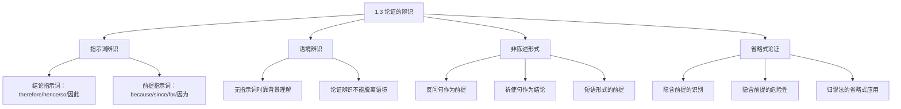

**相关笔记：** [[1.1 什么是逻辑学]] | [[1.2 命题与论证]] | [[1.4 论证与说明]]

> [!abstract] 概览
> 本节解决一个实际问题：如何在真实文本中辨识论证。核心知识点包括：
> - **结论指示词和前提指示词**：最直接的辨识工具（therefore/because 等）
> - **语境辨识**：无指示词时通过话语背景和意义判断
> - **非陈述形式**：反问句、祈使句、短语都可以是论证的组成部分
> - **省略式论证**：隐含前提/结论需要先重构再评估

---

## 一、知识结构总览

---

## 二、核心思想与证明技巧

> [!tip] 核心思想
> 论证的辨识不是机械的模式匹配，而是==对作者意图的理解==。同一个"Q 因为 P"的句式，既可以是论证（Q 的真实性需要 P 来支持），也可以是说明（Q 已知为真，P 解释了为什么 Q 为真）。区分的关键在于 Q 在语境中的作用。

### 关键技巧

1. **指示词是最快捷但不唯一的工具**
   - 适用场景：快速定位论证结构
   - 局限：很多论证不含指示词；有些指示词既可用于论证也可用于说明

2. **形式重塑——透过语法看实质**
   - 适用场景：遇到疑问句、祈使句、短语等非标准形式
   - 技巧：将反问句"重塑"为其暗示的陈述句，将祈使句"重塑"为"你应当做X"的陈述

3. **省略式重构——补全隐含前提**
   - 适用场景：论证看似不完整，缺少某个关键环节
   - 技巧：问"从前提推出结论还需要什么假设？"，将这个假设补上

---

## 三、补充理解与易混淆点

### 补充理解

> [!info] 补充1：省略式的哲学根源——亚里士多德的修辞学
> **来源：** Aristotle, *Rhetoric*, Book I, Chapter 2 (350 BCE)；SEP Stanford Encyclopedia of Philosophy, "Enthymeme" 条目
>
> "省略式"（enthymeme）一词源自亚里士多德的《修辞学》。亚里士多德将省略式定义为"从不必然前提出发的三段论"（syllogism from probabilities or signs）。在亚里士多德的体系中，省略式是==修辞论证==的核心工具——在公共演讲中，省略那些听众已经接受的前提，可以增强论证的说服力。
>
> 值得注意的是，亚里士多德对省略式的定义与后世有所不同。现代逻辑学将省略式定义为"省略了前提或结论的论证"，而亚里士多德强调的是省略式使用的是"或然性前提"而非"必然性前提"。Copi 的用法更接近现代定义。

> [!info] 补充2：反问句的逻辑地位——语用学视角
> **来源：** Wilson, D. & Sperber, D. (2012). *Meaning and Relevance*. Cambridge University Press；Clark, H.H. (1996). *Using Language*. Cambridge University Press
>
> 反问句（rhetorical question）在语用学中被视为一种"预设管理"策略。说话者通过提问的形式，引导听众自己得出答案，从而比直接陈述更有说服力。但在逻辑分析中，反问句的危险在于：==听众可能给出与说话者预期不同的答案==，此时反问句就不能可靠地充当前提。
>
> Copi 教材中八卦专栏的例子（"帕里斯·希尔顿有做演员的天赋吗？"）正是这种危险的体现——作者用疑问句暗示"没有天赋"，但可以否认做出了断言。这被称为"隐匿论证"（covert argument），在批判性思维中是需要警惕的修辞策略。

### 易混淆点

> [!warning] 误区：有指示词就一定是论证
> ❌ **错误理解：** 看到"因为""所以"就断定是论证
> ✅ **正确理解：** "因为""所以"既可用于论证也可用于说明。必须结合语境判断 Q 的作用——Q 是需要被确立的真，还是已知为真需要被解释的事实
> **辨析：** 《创世记》11:9 使用了"所以"，但它是说明（解释为什么那城叫巴别），不是论证

> [!warning] 误区：省略式论证是不完整的、有缺陷的论证
> ❌ **错误理解：** 省略前提说明论证有逻辑漏洞
> ✅ **正确理解：** 省略式是日常论证的正常形式，隐含前提通常是共享的背景知识。但==省略式确实有被滥用的风险==——论证者可能故意省略有争议的前提以避免被攻击
> **辨析：** 关键在于隐含前提是否合理。如果隐含前提是普遍接受的，省略式是高效的；如果隐含前提有争议，省略式就是欺骗性的

---

## 四、习题精选

> [!todo] 习题概览
> | 题号 | 来源 | 核心考点 | 难度 |
> |:-----|:-----|:---------|:-----|
> | 1 | 教材习题 | 省略式论证的隐含前提重构 | ⭐⭐ |
> | 2 | 自编 | 反问句的逻辑分析 | ⭐⭐ |

### 题1：重构省略式论证

> [!problem] 题目
> "克隆人是邪恶的，因此永远不应该被允许。"请重构这个省略式论证的隐含前提，并评估其合理性。

> [!faq]- 解答
> **[步骤1]** 识别明确前提和结论：
> - 明确前提：克隆人是邪恶的
> - 结论：克隆人永远不应该被允许
>
> **[步骤2]** 发现逻辑缺口：从"X 是邪恶的"到"X 不应该被允许"之间缺少一个桥梁。什么原则能连接这两个命题？
>
> **[步骤3]** 重构隐含前提：==本质上邪恶的东西永远不应该被允许==
>
> **[步骤4]** 评估隐含前提：这个前提是有争议的。并非所有"邪恶的"东西都应该被禁止——例如，某些文学作品中的"邪恶"角色是有艺术价值的。因此，这个省略式论证的力度取决于隐含前提的可信度。
>
> $\blacksquare$

### 题2：反问句的逻辑分析

> [!problem] 题目
> "一个允许成千上万无辜者死亡的制度，能被称为正义吗？"请分析这个反问句在论证中的作用，并指出它作为论证组成部分的风险。

> [!faq]- 解答
> **[步骤1]** 将反问句重塑为陈述句：暗示的答案是"不能被称为正义"，即"一个允许成千上万无辜者死亡的制度不能被称为正义"。
>
> **[步骤2]** 分析其在论证中的作用：这个反问句充当==前提==——它断定了一个命题（该制度不正义），用以支持某个结论（如"该制度应该被废除"）。
>
> **[步骤3]** 指出风险：反问句的风险在于——听众可能不同意暗示的答案。如果有人认为"正义有时需要牺牲少数人来保护多数人"，那么反问句就不能可靠地充当前提。此外，说话者可以用"我只是提了个问题"来回避对前提的辩护责任。
>
> $\blacksquare$

---

## 五、视频学习指南

> [!info] 视频资源
> | 资源 | 链接 | 对应内容 | 备注 |
> |:-----|:-----|:---------|:-----|
> | 本节暂无推荐视频资源。 | — | — | 教材实例丰富，建议通过练习题巩固 |

---

## 六、教材原文

> [!quote] 教材原文
> **来源：** 逻辑学导论 第15版，第1章第3节，第11-19页
>
> **省略式论证：**
> 很多论证有一个或多个前提没有被明确说出来，但假设读者能理解。论证者通常省略那些他们认为听者或读者会当然接受为真的前提。
>
> **论证辨识的核心原则：**
> 论证的辨识不能脱离语境。同一个语句在不同语境中可能表达完全不同的论证。
>
> **形式重塑的关键：**
> 无论语句的外在形式如何（疑问句、祈使句、短语），关键在于理解正在被断定的东西的实质。

---

## 参见 Wiki

- [[论证]] — 论证的辨识方法
- [[论证-vs-说明]] — 论证与说明的区分

#学习/逻辑学/基本概念/论证辨识
