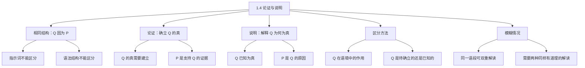

**相关笔记：** [[1.2 命题与论证]] | [[1.3 论证的辨识]] | [[1.5 演绎论证与归纳论证]]

> [!abstract] 概览
> 本节解决一个极易混淆的问题：如何区分论证和说明。两者都使用"Q 因为 P"的结构，但目的截然不同。核心知识点包括：
> - **论证的目的**：确立 Q 的真（Q 是未知的，需要 P 来支持）
> - **说明的目的**：解释为什么 Q 为真（Q 是已知的，P 给出原因）
> - **区分方法**：看 Q 在语境中是需要被确立的还是已知为真的
> - **被说明者与说明者**：说明中的两个组成部分，对应论证中的结论和前提

---

## 一、知识结构总览

---

## 二、核心思想与证明技巧

> [!tip] 核心思想
> 论证和说明都使用"Q 因为 P"的结构，但==目的完全相反==：论证的起点是"Q 是真的吗？"，用 P 来回答"是的，因为 P"；说明的起点是"Q 是真的，但为什么？"，用 P 来回答"因为 P 导致了 Q"。区分的关键永远是==Q 在语境中的认识论地位==——是需要被确立的，还是已经被接受的。

### 关键技巧

1. **"Q 的作用"测试法**
   - 适用场景：任何包含"因为""由于""所以"的语段
   - 操作：问"Q 在这个语境中是需要被证明的，还是已经被当作事实接受的？"
   - 判断：需要被证明 → 论证；已被接受 → 说明

2. **"被说明者 vs 说明者"分析法**
   - 适用场景：已判定为说明的语段
   - 操作：识别"被说明者"（explanandum，即 Q）和"说明者"（explanans，即 P）

---

## 三、补充理解与易混淆点

### 补充理解

> [!info] 补充1：论证与说明的哲学区分——Hempel 的演绎-律则模型
> **来源：** Hempel, C.G. (1965). *Aspects of Scientific Explanation*. Free Press；SEP Stanford Encyclopedia of Philosophy, "Scientific Explanation" 条目
>
> 科学哲学家亨佩尔（Carl Hempel）提出了著名的"演绎-律则模型"（Deductive-Nomological Model），试图精确刻画说明的结构。根据该模型，一个科学说明必须满足：
> 1. 说明者（P）是一个或多个普遍定律（law）和初始条件
> 2. 被说明者（Q）可以从 P 中==演绎地推出==
> 3. P 必须是真的（或至少被确认为真）
>
> 注意：亨佩尔模型中，说明者和被说明者之间的关系也是演绎的！这意味着==说明和论证在形式上可能完全相同==，区分只能依赖认识论目的（是要确立 Q 的真，还是解释 Q 为什么为真）。这印证了 Copi 的观点：论证与说明的区分不能靠形式，只能靠语境和意图。

> [!info] 补充2：因果说明 vs 论证——休谟的因果理论
> **来源：** Hume, D. (1748). *An Enquiry Concerning Human Understanding*, Section IV；Achinstein, P. (1983). *The Nature of Explanation*. Oxford University Press
>
> 说明通常涉及因果关系（P 是 Q 的原因），而论证涉及逻辑关系（P 支持 Q）。休谟指出，因果推理本质上是一种归纳推理——我们从"P 总是伴随 Q 出现"的经验中推断"P 导致 Q"。这意味着==因果说明本身就包含归纳论证的成分==：我们用归纳方法确立因果联系，然后用这个因果联系来说明现象。
>
> Copi 教材中类星体呈红色的例子就是典型的因果说明：氢微粒吸收蓝光（原因）→ 类星体呈红色（结果）。这个因果联系本身是通过归纳方法（天文观测）确立的。

### 易混淆点

> [!warning] 误区：有"所以"就是论证
> ❌ **错误理解：** "所以那城名叫巴别"——有"所以"，所以是论证
> ✅ **正确理解：** "所以"在这里完成了对名字的说明，而非推出一个新结论。巴别是那座塔的名字是读者已知的事实，不需要被"推出"
> **辨析：** 指示词在论证和说明中都可以使用，不能仅凭指示词判断

> [!warning] 误区：论证和说明可以同时存在于一个语段中
> ❌ **错误理解：** 一段话要么是论证要么是说明
> ✅ **正确理解：** 同一语段可能同时包含论证和说明。例如教材中水的独特性质的例子——既说明了水为什么不会完全冻结（说明），又暗示了水的这种性质对生命至关重要（可以理解为论证结论）
> **辨析：** 当意图难以确定时，应给予两种同样有道理的"解读"

---

## 四、习题精选

> [!todo] 习题概览
> | 题号 | 来源 | 核心考点 | 难度 |
> |:-----|:-----|:---------|:-----|
> | 1 | 教材习题1 | 论证 vs 说明的区分 | ⭐ |
> | 2 | 教材习题4 | 模糊语段的双重解读 | ⭐⭐ |

### 题1：论证还是说明？

> [!problem] 题目
> "由于我们祖先居住地与赤道距离的不同，人类有各种不同的肤色。这完全是由太阳导致的。肤色调节着我们身体对太阳光线的反应。深肤色进化出来是为了保护身体免受过度太阳光的伤害……这个过程在历史中重复往返，许多人的肤色从黑色变为浅色，从浅色变为黑色。这表明肤色不是一种永久不变的性质。"（教材习题1）
>
> 这段话是论证还是说明？

> [!faq]- 解答
> **[步骤1]** 识别核心命题 Q："人类有各种不同的肤色"和"肤色不是一种永久不变的性质"。
>
> **[步骤2]** 分析 Q 的认识论地位：人类有不同的肤色是一个==已知事实==，作者不是在证明人类确实有不同的肤色，而是在解释为什么有不同的肤色（因为与赤道的距离不同、太阳辐射的进化压力）。
>
> **[步骤3]** 判断：这段话==实质上是说明==。被说明的事实是人类有不同的肤色，说明者是与赤道距离不同导致的进化过程。
>
> **[步骤4]** 但也可以有另一种解读：最后一句"肤色不是永久不变的性质"可以理解为论证的结论，前面的所有内容都是前提。这说明同一语段可以有双重解读。
>
> $\blacksquare$

### 题2：模糊语段的双重解读

> [!problem] 题目
> "变化是真实的。既然变化仅在时间上是可能的，那么时间一定是某种真实的东西。"（康德，《纯粹理性批判》）
>
> 请给出这段话的论证解读和说明解读。

> [!faq]- 解答
> **[步骤1]** 论证解读：前提是"变化仅在时间上是可能的"和"变化是真实的"，结论是"时间一定是某种真实的东西"。这是一个演绎论证——如果变化是真实的，而变化需要时间，那么时间必须是真实的。
>
> **[步骤2]** 说明解读：如果"时间一定是某种真实的东西"被视为已知事实，那么"变化仅在时间上是可能的"就是对这个事实的说明——它解释了为什么时间是真实的（因为变化需要时间，而变化是真实的）。
>
> **[步骤3]** 两种解读都有道理，但论证解读更为自然，因为"既然...那么..."的句式强烈暗示了推论关系。
>
> $\blacksquare$

---

## 五、视频学习指南

> [!info] 视频资源
> | 资源 | 链接 | 对应内容 | 备注 |
> |:-----|:-----|:---------|:-----|
> | 本节暂无推荐视频资源。 | — | — | 建议通过教材习题1-19反复练习区分 |

---

## 六、教材原文

> [!quote] 教材原文
> **来源：** 逻辑学导论 第15版，第1章第4节，第20-27页
>
> **区分的核心标准：**
> 如果我们的目的是要确立某个命题 Q 的真，为此我们提出某个证据 P 来支持 Q，我们可以恰当地说"Q 因为 P"。也就是说我们为 Q 建立一个论证，P 是我们的前提。或者，假设 Q 是已知为真的。在这种情况下我们不必提出任何理由来支持它的真，但是我们可能希望对它为什么是真的给出一个说明。这样我们也可以说"Q 因为 P"，但在这种情况下，我们不是为 Q 建立一个论证，而是给出一个对 Q 的说明。
>
> **判断方法：**
> 如果一个作者写出"Q 因为 P"，我们怎么才能断定他是打算说明还是打算说服人呢？我们可以问：Q 在该语境中的作用是什么？如果 Q 是一个其真实性需要建立或确证的命题，那么"因为 P"可能给出了支持其为真的前提。若 Q 是一个已知其为真，或至少在这个语境中其真是没有疑问的命题，那么"因为 P"就可能是对为什么 Q 成为真命题的阐释。

---

## 参见 Wiki

- [[论证]] — 论证与说明的核心区别
- [[论证-vs-说明]] — 详细的对比分析

#学习/逻辑学/基本概念/说明
